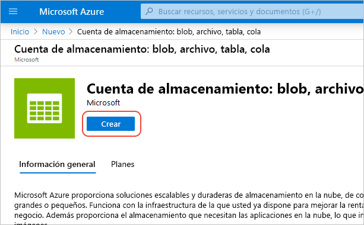
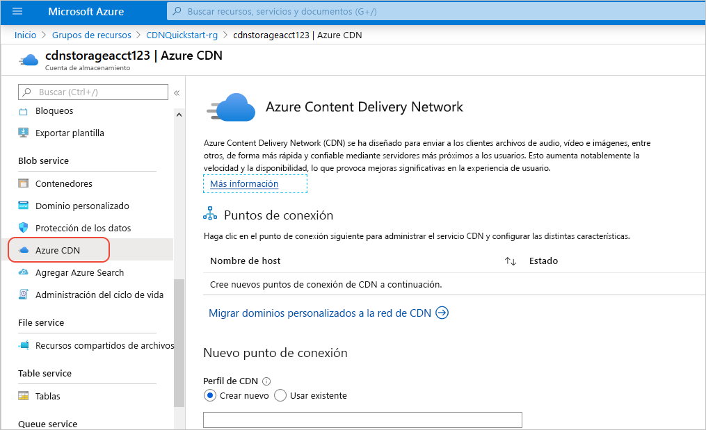
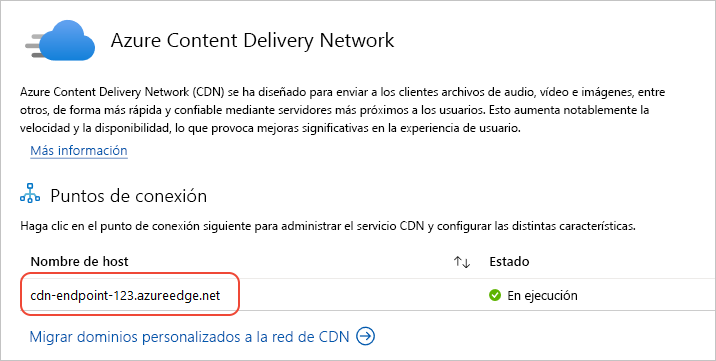

# Inicio rápido: Integración de una cuenta de Azure Storage en Azure CDN

En este inicio rápido, se habilita [Azure Content Delivery Network (CDN)](cdn-overview.md) para almacenar en caché el contenido de Azure Storage. Azure CDN ofrece a los desarrolladores una solución global para entregar contenido con alto ancho de banda. Es posible almacenar en caché blobs y contenido estático de instancias de proceso en nodos físicos en los Estados Unidos, Europa, Asia, Australia y Sudamérica.

## Prerrequisitos

- Una cuenta de Azure con una suscripción activa. [Cree una cuenta gratuita](https://azure.microsoft.com/free/?ref=microsoft.com&utm_source=microsoft.com&utm_medium=docs&utm_campaign=visualstudio).

## Inicio de sesión en Azure Portal

Inicie sesión en [Azure Portal](https://portal.azure.com) con su cuenta de Azure.

## Crear una cuenta de almacenamiento

Una cuenta de almacenamiento proporciona acceso a los servicios de Azure Storage. La cuenta de almacenamiento representa el máximo nivel del espacio de nombres para el acceso a todos los componentes del servicio Azure Storage: Azure Blob, Queue y Table storage. Para más información, consulte [Introducción a Microsoft Azure Storage](../storage/common/storage-introduction.md).

Para crear una cuenta de almacenamiento, debe ser administrador del servicio o coadministrador de la suscripción asociada.

1. En Azure Portal, seleccione **Crear un recurso** en la parte superior izquierda. Aparece el panel **Nuevos**.

1. Busque **Storage account** (Cuenta de almacenamiento) y seleccione **Storage account - blob, file, table, queue** (Cuenta de almacenamiento: blob, archivo, tabla, cola) en la lista desplegable. A continuación, seleccione **Crear**:
    
    

1. En el **panel Crear cuenta de almacenamiento**, escriba la siguiente información:

    | Configuración | Value | 
    | --- | --- |
    | Detalles del proyecto > Grupo de recursos | Seleccione **Crear nuevo** y use el nombre *CDNQuickstart-rg*. También puede usar un grupo de recursos existente si lo prefiere. |
    | Detalles de instancia > Nombre de cuenta de almacenamiento | Escriba un nombre para la cuenta que contenga entre 3 y 24 letras minúsculas y números únicamente. El nombre debe ser único en Azure y se convierte en el nombre de host en la dirección URL que se usa para direccionar los recursos de blob, cola o tabla de la suscripción. Para direccionar un recurso de contenedor en Blob Storage, use un identificador URI con el siguiente formato: http:// *&lt;storageaccountname&gt;* .blob.core.windows.net/ *&lt;container-name&gt;* .
    | Detalles de instancia > Ubicación | Seleccione una región de Azure cercana en la lista desplegable. |
    
    Deje los restantes detalles con su valor predeterminado y seleccione **Revisar y crear**.

1. La creación de la cuenta de almacenamiento podría tardar varios minutos en finalizar. Una vez finalizada la creación, seleccione **Ir al recurso** para abrir la página de la cuenta de almacenamiento para el siguiente paso.

## Habilitación de Azure CDN para la cuenta de almacenamiento

1. En la página de la cuenta de almacenamiento, seleccione **Blob service** > **Azure CDN** en el menú de la izquierda. Aparece la página **Azure CDN**.

    
    
1. En la sección **Nuevo punto de conexión**, escriba la siguiente información:

    | Configuración  | Value |
    | -------- | ----- |
    | **Perfil de CDN** | Seleccione **Crear nuevo** y escriba su nombre de perfil, por ejemplo, *cdn-profile-123*. Un perfil es una colección de puntos de conexión. |
    | **Plan de tarifa** | Seleccione una de las opciones **Estándar**, como **Microsoft estándar**. |
    | **Nombre del punto de conexión de CDN** | Escriba el nombre de host de su punto de conexión como, por ejemplo, *cdn-endpoint-123*. Este nombre debe ser globalmente único en Azure, ya que se usa para acceder a los recursos almacenados en la caché en la dirección URL _&lt;NombreDePuntoDeConexión&gt;_ .azureedge.net. |
    | **Nombre de host de origen** | De forma predeterminada, un nuevo punto de conexión de CDN usa el nombre de host de la cuenta de almacenamiento como servidor de origen. |

1. Seleccione **Crear**. Después de que se crea el punto de conexión, aparece en la lista de puntos de conexión.

    

> [!TIP]
> Si quiere especificar valores de configuración avanzados para el punto de conexión de CDN, como la [optimización de la descarga de archivos grandes](cdn-optimization-overview.md#large-file-download), puede usar la [extensión Azure CDN](cdn-create-new-endpoint.md) para crear un perfil y un punto de conexión de CDN.

## Habilitación de características adicionales de CDN

En el página **Azure CDN** de la cuenta de almacenamiento, seleccione el punto de conexión de CDN de la lista para abrir la página de configuración del punto de conexión de CDN.

Desde esta página, puede habilitar características adicionales de CDN para la entrega, como la [compresión](cdn-improve-performance.md), el [almacenamiento en memoria caché de la cadena de consulta](cdn-query-string.md) y el [filtrado geográfico](cdn-restrict-access-by-country.md). 
    
## Habilitar SAS

Si quiere conceder acceso limitado a contenedores de almacenamiento privado, puede usar la característica firma de acceso compartido (SAS) de la cuenta de Azure Storage. Una SAS es un identificador URI que concede derechos de acceso restringido a los recursos de Azure Storage sin exponer la clave de cuenta. Para obtener más información, vea [Uso de la red Azure CDN con SAS](cdn-sas-storage-support.md).

## Obtener acceso a su contenido de la red CDN

Para obtener acceso al contenido almacenado en la memoria caché de la red CDN, use la URL de la red CDN que se le ha proporcionado en el portal. La dirección de un blob en caché tiene el siguiente formato:

http://<*NombreDePuntoDeConexión*\>.azureedge.net/<*myPublicContainer*\>/<*BlobName*\>

> [!NOTE]
> Después de habilitar el acceso de Azure CDN a una cuenta de almacenamiento, todos los objetos disponibles de forma pública se pueden almacenar en caché en el POP de la red CDN. Si modifica un objeto que está almacenado actualmente en caché en la red CDN, el nuevo contenido no estará disponible a través de Azure CDN hasta que Azure CDN actualice su contenido al cumplir el período de vida del contenido almacenado en caché.

## Eliminación de contenido de Azure CDN

Si ya no desea almacenar en caché un objeto en Azure CDN, puede realizar uno de los siguientes pasos:

- Convierta el contenedor en privado en lugar de público. Para más información, consulte [Administración del acceso de lectura anónimo a contenedores y blobs](../storage/blobs/anonymous-read-access-configure.md).
- Deshabilite o elimine el punto de conexión de CDN mediante Azure Portal.
- Modifique su servicio hospedado para no seguir respondiendo a las solicitudes del objeto.

Un objeto que ya está almacenado en caché en Azure CDN permanece en caché hasta que cumple el período de vida del objeto o hasta que se [purgue](cdn-purge-endpoint.md) el punto de conexión. Al cumplir el período de vida, Azure CDN determina si el punto de conexión de CDN sigue siendo válido y si el objeto sigue siendo accesible de forma anónima. En caso negativo, el objeto dejará de estar almacenado en caché.

## Limpieza de recursos

En los pasos anteriores, ha creado un perfil y un punto de conexión de CDN en un grupo de recursos. Guarde estos recursos si desea continuar con los [Pasos siguientes](#next-steps) y aprender cómo agregar un dominio personalizado al punto de conexión. No obstante, si no cree que vaya a necesitar estos recursos en el futuro, puede eliminarlos mediante la eliminación del grupo de recursos y así evitar cargos adicionales:

1. En el menú izquierdo de Azure Portal, seleccione **Grupos de recursos** y después *CDNQuickstart-rg*\*.

2. En la página **Grupo de recursos**, seleccione **Eliminar grupo de recursos**, escriba *CDNQuickstart-rg* en el cuadro de texto y, después, seleccione **Eliminar**.

    Esta acción eliminará el grupo de recursos, el perfil y el punto de conexión que creó en esta guía de inicio rápido.

3. Para eliminar la cuenta de almacenamiento, selecciónela en el panel y, a continuación, seleccione **Eliminar** en el menú superior.

## Pasos siguientes

> [!div class="nextstepaction"]
> [Creación de un perfil y un punto de conexión de Azure CDN](cdn-create-new-endpoint.md)

> [!div class="nextstepaction"]
> [Tutorial: Uso de la red CDN para el contenido estático del servidor desde una aplicación web](cdn-add-to-web-app.md)