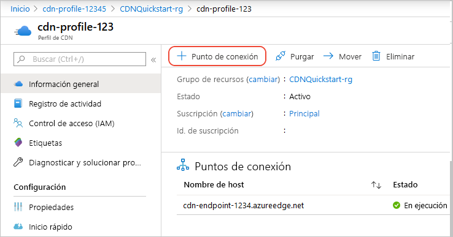
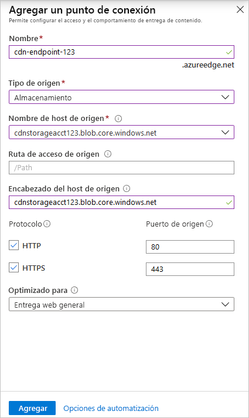
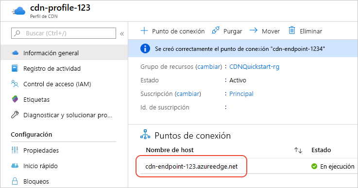

# Inicio rápido: Creación de un perfil y un punto de conexión de Azure CDN

En este inicio rápido se habilita Azure Content Delivery Network (CDN) mediante la creación de un perfil de CDN, que es una colección de uno o varios puntos de conexión de CDN. Una vez haya creado un perfil y un punto de conexión, puede iniciar la entrega de contenido a sus clientes.

## Prerrequisitos

- Una cuenta de Azure con una suscripción activa. [Cree una cuenta gratuita](https://azure.microsoft.com/free/?ref=microsoft.com&utm_source=microsoft.com&utm_medium=docs&utm_campaign=visualstudio).
- Una cuenta de Azure Storage denominada *cdnstorageacct123*, que se usa para el nombre de host de origen. Para completar este requisito, consulte [Integración de una cuenta de Azure Storage en Azure CDN](cdn-create-a-storage-account-with-cdn.md).

## Inicio de sesión en Azure Portal

Inicie sesión en [Azure Portal](https://portal.azure.com) con su cuenta de Azure.

[!INCLUDE [cdn-create-profile](../../includes/cdn-create-profile.md)]

## Crear un nuevo extremo de CDN

Después de crear un perfil de CDN, se usa para crear un punto de conexión.

1. En Azure Portal, seleccione en el panel el perfil de CDN que creó. Si no lo encuentra, puede abrir el grupo de recursos en que lo creó, o bien use la barra de búsqueda de la parte superior del portal, escriba el nombre del perfil y seleccione el perfil en los resultados.
   
1. En la página del perfil de CDN, seleccione **+ Punto de conexión**.
   
    
   
    Aparecerá el panel **Agregar un punto de conexión**.

3. Escriba los siguientes valores de configuración:

    | Configuración | Value |
    | ------- | ----- |
    | **Nombre** | Escriba *my-endpoint-123* como nombre de host del punto de conexión. Este nombre debe ser único globalmente en Azure; si ya está en uso, escriba otro. Este nombre se usa para acceder a los recursos almacenados en caché en el dominio _&lt;NombreDePuntoDeConexión&gt;_ .azureedge.net.|
    | **Tipo de origen** | Seleccione **Storage**. | 
    | **Nombre de host de origen** | Seleccione en la lista desplegable el nombre de host de la cuenta de Azure Storage que va a usar como, por ejemplo *cdnstorageacct123.blob.core.windows.net*. |
    | **Ruta de acceso de origen** | déjelo en blanco. |
    | **Encabezado del host de origen** | Deje el valor predeterminado (que es el nombre de host de la cuenta de almacenamiento). |  
    | **Protocolo** | Deje las opciones **HTTP** y **HTTPS** predeterminadas seleccionadas. |
    | **Puerto de origen** | Deje los valores de puerto predeterminados. | 
    | **Optimizado para** | Deje la selección predeterminada **Entrega web general**. |

    

3. Seleccione **Agregar** para crear el nuevo punto de conexión. Una vez creado el punto de conexión, aparece en la lista de puntos de conexión del perfil.
    
   
    
   El tiempo que tarda el punto de conexión en propagarse depende del plan de tarifa que se seleccionó al crear el perfil. **Akamai estándar** normalmente finaliza en un minuto, **Microsoft estándar** en 10 minutos y **Verizon estándar** y **Verizon premium** en un máximo de 90 minutos.

## Limpieza de recursos

En los pasos anteriores, ha creado un perfil y un punto de conexión de CDN en un grupo de recursos. Guarde estos recursos si desea continuar con los [Pasos siguientes](#next-steps) y aprender cómo agregar un dominio personalizado al punto de conexión. No obstante, si no cree que vaya a necesitar estos recursos en el futuro, puede eliminarlos mediante la eliminación del grupo de recursos y así evitar cargos adicionales:

1. En el menú izquierdo de Azure Portal, seleccione **Grupos de recursos** y después **CDNQuickstart-rg**.

2. En la página **Grupo de recursos**, seleccione **Eliminar grupo de recursos**, escriba *CDNQuickstart-rg* en el cuadro de texto y, después, seleccione **Eliminar**. Esta acción elimina el grupo de recursos, el perfil y el punto de conexión que ha creado en este inicio rápido.

## Pasos siguientes

> [!div class="nextstepaction"]
> [Tutorial: Uso de la red CDN para el contenido estático del servidor desde una aplicación web](cdn-add-to-web-app.md)

> [!div class="nextstepaction"]
> [Tutorial: Adición de un dominio personalizado a un punto de conexión de Azure CDN](cdn-map-content-to-custom-domain.md)
