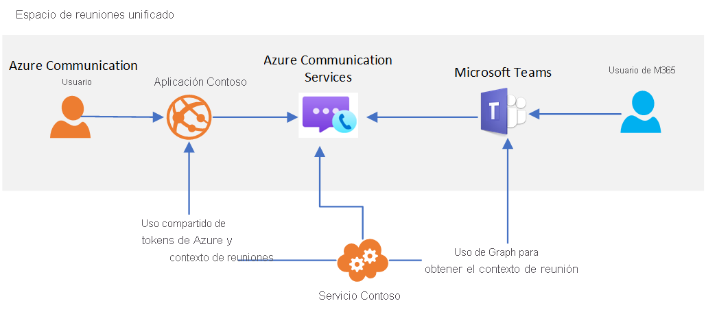

# Interoperabilidad de Teams

[!INCLUDE [Private Preview Notice](../../includes/private-preview-include.md)]

Azure Communication Services se puede usar para crear experiencias de reunión personalizadas con interacción con Microsoft Teams. Los usuarios de sus soluciones de Communication Services pueden interactuar con los participantes de Teams mediante la voz, el vídeo y el uso compartido de la pantalla.

Esta interoperabilidad permite crear aplicaciones de Azure personalizadas que conectan usuarios a reuniones de Teams. No es necesario que los usuarios de sus aplicaciones personalizadas tengan identidades de Azure Active Directory ni licencias de Teams para disfrutar de esta funcionalidad. Esto es idóneo para que los empleados (quizá ya familiarizados con Teams) y los usuarios externos (mediante una experiencia de aplicación personalizada) se reúnan con una experiencia fluida. Esto permite crear experiencias similares a las siguientes:

1. Los empleados usan Teams para programar una reunión.
2. La aplicación Communication Services personalizada usa las API de Microsoft Graph para acceder a los detalles de la reunión.
3. Los detalles de la reunión se comparten con usuarios externos mediante la aplicación personalizada.
4. Los usuarios externos usan su aplicación personalizada para unirse a la reunión de Teams (mediante la biblioteca cliente de llamada a Communication Services).

La arquitectura general de este caso de uso tiene el siguiente aspecto: 

Aunque determinadas características de reunión de Teams, como la mano levantada, el modo de reunión y las salas de escape, solo estarán disponibles para los usuarios de Teams, la aplicación personalizada tendrá acceso a las funcionalidades principales de audio, vídeo y uso compartido de la pantalla en las reuniones.

Cuando un usuario de Communication Services se une a la reunión de Teams, el nombre para mostrar proporcionado mediante la biblioteca cliente de llamada se mostrará a los usuarios de Teams. Por lo demás, en Teams, al usuario de Communication Services se le tratará como usuario anónimo. La aplicación personalizada debe considerar el uso de la autenticación del usuario y otras medidas de seguridad para proteger las reuniones de Teams. Piense en las implicaciones de seguridad de permitir que usuarios anónimos unan a las reuniones y use la [guía de seguridad de Teams](/microsoftteams/teams-security-guide#addressing-threats-to-teams-meetings) para configurar las funcionalidades disponibles para los usuarios anónimos.

Los usuarios de Communication Services pueden unirse a reuniones de Teams programadas siempre y cuando esté habilitado que lo hagan de manera anónima en la [configuración de la reunión](/microsoftteams/meeting-settings-in-teams).

## Pasos siguientes

> [!div class="nextstepaction"]
> [Incorporación de una aplicación de llamadas a una reunión de Teams](../../quickstarts/voice-video-calling/get-started-teams-interop.md)