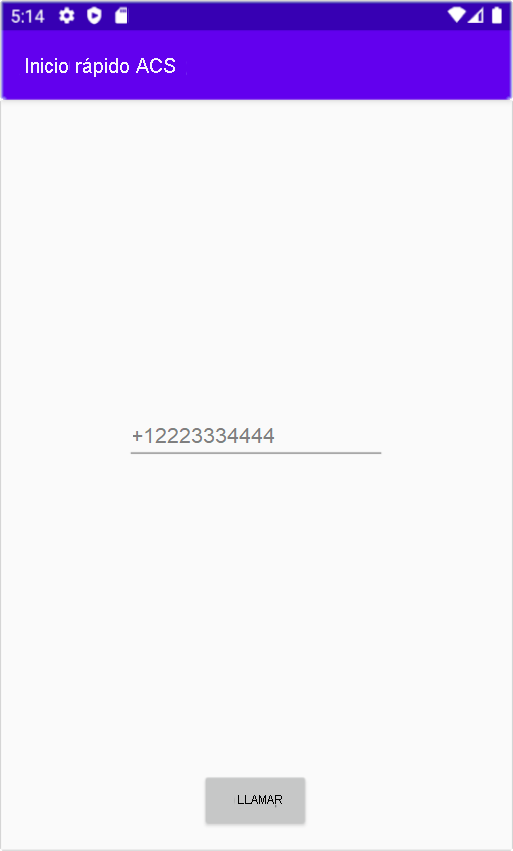

[!INCLUDE [Emergency Calling Notice](../../../includes/emergency-calling-notice-include.md)]
## <a name="prerequisites"></a>Prerrequisitos

- Una cuenta de Azure con una suscripción activa. [Cree una cuenta gratuita](https://azure.microsoft.com/free/?WT.mc_id=A261C142F). 
- Un recurso de Communication Services implementado. [Cree un recurso de Communication Services](../../create-communication-resource.md).
- Un número de teléfono adquirido en el recurso de Communication Services. [Obtención de un número de teléfono](../../telephony-sms/get-phone-number.md).
- `User Access Token` para habilitar el cliente de llamada. Para más información sobre [cómo obtener `User Access Token`](../../access-tokens.md)
- Complete el inicio rápido para [empezar a agregar llamadas a su aplicación](../getting-started-with-calling.md)

### <a name="prerequisite-check"></a>Comprobación de requisitos previos

- Para ver los números de teléfono asociados a su recurso de Communication Services, inicie sesión en [Azure Portal](https://portal.azure.com/), busque el recurso de Communication Services y abra la pestaña **números de teléfono** en el panel de navegación izquierdo.

## <a name="setting-up"></a>Instalación

### <a name="add-pstn-functionality-to-your-app"></a>Adición de funcionalidad RTC a la aplicación

Agregue el tipo `PhoneNumber` a la aplicación; para ello, modifique el archivo **MainActivity.Java**:


```java
import com.azure.android.communication.common.PhoneNumber;
```

<!--
> [!TBD]
> Namespace based on input from Komivi Agbakpem. But it does not correlates with other use namespaces in Calling Quickstart. E.g: "com.azure.communication.calling.CommunicationUser" or "com.azure.communication.common.client.CommunicationUserCredential". Double-chek this.
-->

## <a name="start-a-call-to-phone"></a>Inicio de una llamada telefónica

Especifique el número de teléfono que adquirió desde el recurso de Communication Services. Se utilizará para iniciar la llamada:

> [!WARNING]
> Tenga en cuenta que los números de teléfono se deben proporcionar en formato estándar internacional E.164. (por ejemplo: +12223334444)

Modifique el controlador de eventos `startCall()` de **MainActivity.Java**, de modo que controle las llamadas telefónicas:

```java
    private void startCall() {
        EditText calleePhoneView = findViewById(R.id.callee_id);
        String calleePhone = calleePhoneView.getText().toString();
        PhoneNumber callerPhone = new PhoneNumber("+12223334444");
        StartCallOptions options = new StartCallOptions();
        options.setAlternateCallerId(callerPhone);
        options.setVideoOptions(new VideoOptions(null));
        call = agent.call(
                getApplicationContext(),
                new PhoneNumber[] {new PhoneNumber(calleePhone)},
                options);
    }
```

## <a name="launch-the-app-and-call-the-echo-bot"></a>Inicio de la aplicación y llamada al bot de eco

Ahora se puede iniciar la aplicación con el botón "Ejecutar aplicación" de la barra de herramientas (Mayús + F10). Puede realizar una llamada a un teléfono si proporciona un número de teléfono en el campo de texto agregado y hace clic en el botón **Llamar**.
> [!WARNING]
> Tenga en cuenta que los números de teléfono se deben proporcionar en formato estándar internacional E.164. (por ejemplo: +12223334444)


