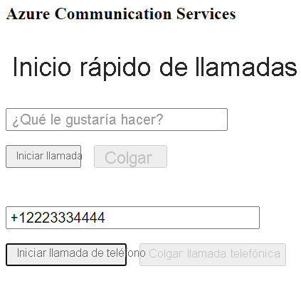

[!INCLUDE [Emergency Calling Notice](../../../includes/emergency-calling-notice-include.md)]
## <a name="prerequisites"></a>Prerrequisitos

- Una cuenta de Azure con una suscripción activa. [Cree una cuenta gratuita](https://azure.microsoft.com/free/?WT.mc_id=A261C142F). 
- Un recurso de Communication Services implementado. [Cree un recurso de Communication Services](../../create-communication-resource.md).
- Un número de teléfono adquirido en el recurso de Communication Services. [Obtención de un número de teléfono](../../telephony-sms/get-phone-number.md).
- `User Access Token` para habilitar el cliente de llamada. Para más información sobre [cómo obtener `User Access Token`](../../access-tokens.md)
- Complete el inicio rápido para [empezar a agregar llamadas a su aplicación](../getting-started-with-calling.md)

### <a name="prerequisite-check"></a>Comprobación de requisitos previos

- Para ver los números de teléfono asociados a su recurso de Communication Services, inicie sesión en [Azure Portal](https://portal.azure.com/), busque el recurso de Communication Services y abra la pestaña **números de teléfono** en el panel de navegación izquierdo.
- Puede crear y ejecutar la aplicación con la biblioteca de cliente de llamadas telefónicas de Azure Communication Services para JavaScript:

```console
npx webpack-dev-server --entry ./client.js --output bundle.js
```

## <a name="setting-up"></a>Instalación

### <a name="add-pstn-functionality-to-your-app"></a>Adición de funcionalidad RTC a la aplicación

Amplíe el diseño con controles de marcado telefónico.

Coloque este código al final de la sección `<body />` del archivo **index.html**, antes de las etiquetas `<script />`:

```html
<input 
  id="callee-phone-input"
  type="text"
  placeholder="Phone number you would like to dial"
  style="margin-bottom:1em; width: 230px;"
/>
<div>
  <button id="call-phone-button" type="button">
    Start Phone Call
  </button>
  &nbsp;
  <button id="hang-up-phone-button" type="button" disabled="true">
    Hang Up Phone Call
  </button>
</div>
```

Amplíe la lógica de la aplicación con la funcionalidad de telefonía.

Agregue este código al archivo **client.js**:

```javascript
const calleePhoneInput = document.getElementById("callee-phone-input");
const callPhoneButton = document.getElementById("call-phone-button");
const hangUpPhoneButton = document.getElementById("hang-up-phone-button");
```

## <a name="start-a-call-to-phone"></a>Inicio de una llamada telefónica

Especifique el número de teléfono que ha adquirido en el recurso de Communication Services y que se usará para iniciar la llamada:
> [!WARNING]
> Tenga en cuenta que los números de teléfono se deben proporcionar en formato estándar internacional E.164. (por ejemplo: +12223334444)

Agregue un controlador de eventos para iniciar una llamada al número de teléfono que ha proporcionado al hacer clic en `callPhoneButton`:


```javascript
callPhoneButton.addEventListener("click", () => {
  // start a call to phone
  const phoneToCall = calleePhoneInput.value;
  call = callAgent.call(
    [{phoneNumber: phoneToCall}], { alternateCallerId: {phoneNumber: '+18336528005'}
  });

  // toggle button states
  hangUpPhoneButton.disabled = false;
  callPhoneButton.disabled = true;
});
```

## <a name="end-a-call-to-phone"></a>Finalización de una llamada telefónica

Agregue un cliente de escucha de eventos para finalizar la llamada actual cuando se haga clic en el `hangUpPhoneButton`:

```javascript
hangUpPhoneButton.addEventListener("click", () => {
  // end the current call
  call.hangUp({
    forEveryone: true
  });

  // toggle button states
  hangUpPhoneButton.disabled = true;
  callPhoneButton.disabled = false;
});
```

La propiedad `forEveryone` finaliza la llamada para todos los participantes.

## <a name="run-the-code"></a>Ejecución del código

Utilice `webpack-dev-server` para compilar y ejecutar la aplicación. Ejecute el siguiente comando para agrupar el host de aplicación en un servidor web local:


```console
npx webpack-dev-server --entry ./client.js --output bundle.js
```

Abra el explorador web y vaya a `http://localhost:8080/`. Verá lo siguiente:




Puede realizar una llamada a un número de teléfono real si proporciona un número de teléfono en el campo de texto agregado y hace clic en el botón **Iniciar llamada de teléfono**.

> [!WARNING]
> Tenga en cuenta que los números de teléfono se deben proporcionar en formato estándar internacional E.164. (por ejemplo: +12223334444)
