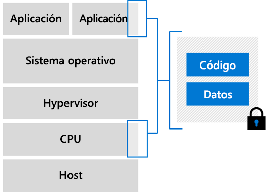

# Introducción a las máquinas virtuales de computación confidencial de Azure

Azure es el primer proveedor de nube que ofrece computación confidencial en un entorno virtualizado. Hemos desarrollado máquinas virtuales que funcionan como una capa de abstracción entre el hardware y la aplicación. Puede ejecutar cargas de trabajo a escala y con opciones de redundancia y disponibilidad.  

## Virtual Machines habilitado para Intel SGX

En las máquinas virtuales de computación confidencial de Azure, una parte del hardware de la CPU se reserva para una parte del código y los datos de la aplicación. Esta parte restringida es el enclave. 

La infraestructura de la computación confidencial de Azure se compone actualmente de una SKU de especialidad de máquinas virtuales (VM). Estas máquinas virtuales se ejecutan en procesadores Intel con la extensión Software Guard Extension (Intel SGX). [Intel SGX](https://intel.com/sgx) es el componente que hace posible la mayor protección que se proporciona con la computación confidencial. 

En la actualidad, Azure ofrece la [serie DCsv2](https://docs.microsoft.com/azure/virtual-machines/dcv2-series) basada en la tecnología Intel SGX para la creación de enclaves basados en hardware. Puede compilar aplicaciones seguras basadas en el enclave para que se ejecuten en la serie DCsv2 de máquinas virtuales con el fin de proteger los datos de la aplicación y el código en uso. 

[Lea más](virtual-machine-solutions.md) sobre la implementación de máquinas virtuales de computación confidencial de Azure con enclaves de confianza basados en hardware.

## Enclaves

Los enclaves son partes protegidas del procesador y la memoria de hardware. No existen ninguna forma de ver los datos o el código del interior del enclave, ni siquiera con un depurador. Si los intentos de código que no son de confianza modifican el contenido de la memoria del enclave, el entorno se deshabilita y se deniegan las operaciones.

Básicamente, puede considerar un enclave como una caja protegida. El código y los datos cifrados se colocan en la caja. Por fuera de la caja, no puede ver nada. Al enclave se le proporciona una clave para descifrar los datos, luego se procesan estos y se cifran de nuevo, antes de enviarse fuera del enclave.

Cada enclave tiene un tamaño establecido de caché de página cifrada (EPC) que determina la cantidad de memoria que puede contener. Las máquinas virtuales DCsv2 más grandes tienen más memoria EPC. Consulte en la página de [especificaciones de DCsv2](https://docs.microsoft.com/azure/virtual-machines/dcv2-series) la memoria EPC máxima por tamaño de máquina virtual.

### Desarrollo de aplicaciones para que se ejecuten dentro de enclaves
Al desarrollar aplicaciones, puede usar [herramientas de software](application-development.md) para blindar partes del código y de los datos que contiene el enclave. Estas herramientas garantizan que nadie que no pertenezca al entorno de confianza pueda ver o modificar el código y los datos. 

## Pasos siguientes
- [Lea los procedimientos recomendados](virtual-machine-solutions.md) para implementar soluciones en máquinas virtuales de computación confidencial de Azure.
- [Implementación de una máquina virtual de la serie DCsv2](quick-create-portal.md)
- [Desarrollo de una aplicación compatible con enclave](application-development.md) mediante el SDK de OE