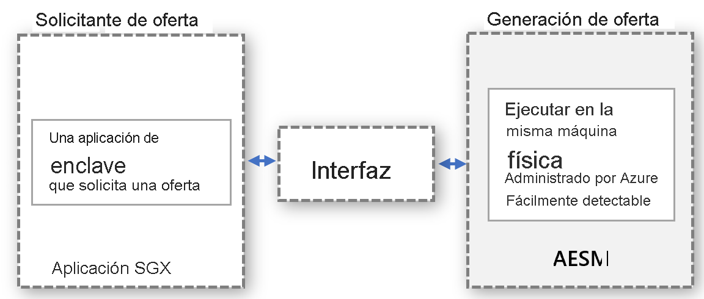

# <a name="platform-software-management-with-sgx-quote-helper-daemon-set"></a>Administración del software de la plataforma con el DaemonSet auxiliar de cita de SGX

Las [aplicaciones de enclave](confidential-computing-enclaves.md) que realizan la atestación remota requieren que se genere una cita. Esta cita proporciona una prueba criptográfica de la identidad y del estado de la aplicación, así como el entorno en el que se ejecuta el enclave. La generación de la cita requiere componentes de software de confianza que formen parte de los componentes de software de plataforma (PSW) de Intel.

## <a name="overview"></a>Información general
 
Intel admite dos modos de atestación para ejecutar la generación de citas:
- **En proceso**: hospeda los componentes de software de confianza que hay en el proceso de la aplicación de enclave.

- **Fuera del proceso**: hospeda los componentes de software de confianza que están fuera del proceso de la aplicación de enclave.
 
Las aplicaciones de SGX creadas con el SDK Open Enclave usan de manera predeterminada el modo de atestación en proceso. Las aplicaciones basadas en SGX permiten el modo fuera del proceso, por lo que requerirían un hospedaje adicional y exponer los componentes necesarios, como Architectural Enclave Service Manager (AESM), externos a la aplicación.

El uso de esta característica es **muy recomendable**, porque mejora el tiempo de actividad de las aplicaciones de enclave durante las actualizaciones de la plataforma Intel o de los controladores de DCAP.

## <a name="why-and-what-are-the-benefits-of-out-of-proc"></a>¿Cuáles son las ventajas del modo fuera del proceso?

-   No se requieren actualizaciones de los componentes de generación de citas de PSW para cada aplicación en contenedor: Con el modo fuera del proceso, los propietarios de los contenedores no necesitan administrar las actualizaciones de su contenedor. En su lugar, los propietarios de los contenedores confían en la interfaz proporcionada por el proveedor, que invoca el servicio centralizado fuera del contenedor. El proveedor se encargará de actualizar y administrar el contenedor.

-   No hace falta preocuparse por los errores de atestación debidos a componentes de PSW desactualizados: La generación de citas implica a los componentes de software de confianza, Quoting Enclave (QE) y Provisioning Certificate Enclave (PCE), que forman parte de la base de la computación de confianza (TCB). Estos componentes de software deben estar actualizados para mantener los requisitos de atestación. Como el proveedor administra las actualizaciones de estos componentes, los clientes nunca tendrán que tratar con errores de atestación debido a que en su contenedor haya componentes de software de confianza desactualizados.

-   Para hacer un mejor uso de la memoria EPC en el modo de atestación en proceso, cada aplicación de enclave necesita crear una instancia de la copia de QE y PCE para la atestación remota. Con el modo fuera del proceso, no es preciso que el contenedor hospede esos enclaves, por lo que no consume memoria de enclave de la cuota del contenedor.

-   Medidas de seguridad frente a la aplicación del kernel. Cuando el controlador de SGX se transmite al kernel de Linux, se requerirá que el enclave tenga privilegios más elevados. Este privilegio permite que el enclave invoque a PCE, lo que interrumpirá la aplicación de enclave que se ejecuta en el modo en proceso. De forma predeterminada, los enclaves no obtienen este permiso. La concesión de este privilegio a una aplicación de enclave requiere cambios en el proceso de instalación de la misma. Esto se puede controlar fácilmente en el modelo fuera del proceso, ya que el proveedor del servicio que controla las solicitudes fuera del proceso se asegurará de que el servicio se instale con este privilegio.

-   No es preciso comprobar la compatibilidad con versiones anteriores de PSW y DCAP. Antes de la actualización, el proveedor valida que las actualizaciones de los componentes de generación de citas de PSW sean compatibles con versiones anteriores. Esto sirve de ayuda para controlar los problemas de compatibilidad por adelantado y abordarlos antes de implementar las actualizaciones en las cargas de trabajo confidenciales.

## <a name="how-does-the-out-of-proc-attestation-mode-work-for-confidential-workloads-scenario"></a>¿Cómo funciona el modo de atestación fuera del proceso en un escenario de cargas de trabajo confidenciales?

El diseño general sigue un modelo en el que el solicitante de la cita y la generación de la cita se ejecutan por separado, pero en la misma máquina física. La generación de la cita se realizará de forma centralizada y atiende solicitudes de citas de todas las entidades. Es preciso que la interfaz se defina y pueda detectarse correctamente en cualquier entidad para que solicite citas.



El modelo abstracto anterior se aplica en un escenario de carga de trabajo confidencial aprovechando el servicio AESM ya disponible. AESM se encuentra en un contenedor y se implementa como un DaemonSet en el clúster de Kubernetes. Kubernetes garantiza que, en cada nodo de agente, se implementará una única instancia de un contenedor de servicios AESM, encapsulada en un pod. El nuevo DaemonSet de citas de SGX tendrá una dependencia del DaemonSet sgx-device-plugin, ya que el contenedor del servicio AESM solicitará memoria EPC a sgx-device-plugin para iniciar los enclaves QE y PCE.

Todos los contenedores deben participar para usar la generación de citas fuera del proceso. Para ello, es preciso establecer la variable de entorno **SGX_AESM_ADDR = 1** durante la creación. El contenedor también debe incluir el paquete libsgx-quote-ex, que es el responsable de dirigir la solicitud al socket de dominio Unix predeterminado.

Las aplicaciones pueden seguir usando la atestación en proceso como antes, pero los modos en proceso y fuera del proceso no se pueden usar simultáneamente dentro de una aplicación. La infraestructura del modo fuera del proceso está disponible de forma predeterminada y consume recursos.

## <a name="sample-implementation"></a>Ejemplo de implementación

El siguiente archivo de Docker es un ejemplo de una aplicación basada en Open Enclave. Establezca la variable de entorno SGX_AESM_ADDR = 1 en el archivo de Docker, o bien establézcala en el archivo de implementación. Para más información sobre el archivo de Docker y sobre el archivo YAML de la implementación, siga el ejemplo que se incluye a continuación. 

  > [!Note] 
  > Para que el modo fuera del proceso funcione correctamente, es necesario que el paquete **libsgx-quote-ex** de Intel se empaquete en el contenedor de la aplicación.
    
```yaml
# Refer to Intel_SGX_Installation_Guide_Linux for detail
FROM ubuntu:18.04 as sgx_base
RUN apt-get update && apt-get install -y \
    wget \
    gnupg

# Add the repository to sources, and add the key to the list of
# trusted keys used by the apt to authenticate packages
RUN echo "deb [arch=amd64] https://download.01.org/intel-sgx/sgx_repo/ubuntu bionic main" | tee /etc/apt/sources.list.d/intel-sgx.list \
    && wget -qO - https://download.01.org/intel-sgx/sgx_repo/ubuntu/intel-sgx-deb.key | apt-key add -
# Add Microsoft repo for az-dcap-client
RUN echo "deb [arch=amd64] https://packages.microsoft.com/ubuntu/18.04/prod bionic main" | tee /etc/apt/sources.list.d/msprod.list \
    && wget -qO - https://packages.microsoft.com/keys/microsoft.asc | apt-key add -

FROM sgx_base as sgx_sample
RUN apt-get update && apt-get install -y \
    clang-7 \
    libssl-dev \
    gdb \
    libprotobuf10 \
    libsgx-dcap-ql \
    libsgx-quote-ex \
    az-dcap-client \
    open-enclave
WORKDIR /opt/openenclave/share/openenclave/samples/remote_attestation
RUN . /opt/openenclave/share/openenclave/openenclaverc \
    && make build
# this sets the flag for out of proc attestation mode. alternatively you can set this flag on the deployment files
ENV SGX_AESM_ADDR=1 

CMD make run
```
Otra opción es establecer el modo de atestación fuera del proceso en el archivo YAML de la implementación, como se muestra a continuación.

```yaml
apiVersion: batch/v1
kind: Job
metadata:
  name: sgx-test
spec:
  template:
    spec:
      containers:
      - name: sgxtest
        image: <registry>/<repository>:<version>
        env:
        - name: SGX_AESM_ADDR
          value: 1
        resources:
          limits:
            kubernetes.azure.com/sgx_epc_mem_in_MiB: 10
        volumeMounts:
        - name: var-run-aesmd
          mountPath: /var/run/aesmd
      restartPolicy: "Never"
      volumes:
      - name: var-run-aesmd
        hostPath:
          path: /var/run/aesmd
```

## <a name="next-steps"></a>Pasos siguientes
[Aprovisionamiento de nodos confidenciales (serie DCsv2) en AKS](./confidential-nodes-aks-get-started.md)

[Inicio rápido con ejemplos de contenedores confidenciales](https://github.com/Azure-Samples/confidential-container-samples)

[Lista de SKU de DCsv2](../virtual-machines/dcv2-series.md)

<!-- LINKS - external -->
[Azure Attestation]: ../attestation/index.yml


<!-- LINKS - internal -->
[DC Virtual Machine]: /confidential-computing/virtual-machine-solutions