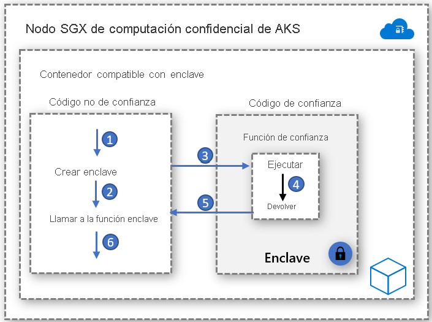

# Contenedores compatibles con enclave

Un enclave es una región protegida de la memoria que proporciona confidencialidad para la ejecución de los datos y el código. Es una instancia de un entorno de ejecución de confianza (TEE) protegida por hardware. Los nodos de computación confidencial de AKS usan la tecnología [Intel Software Guard Extensions (SGX)](https://software.intel.com/sgx) para crear entornos de enclave aislados en los nodos entre cada aplicación de contenedor.

Al igual que las máquinas virtuales con Intel SGX, las aplicaciones de contenedor desarrolladas para ejecutarse en enclaves tienen dos componentes:

- Un componente que no es de confianza (el host).
- Un componente de confianza (el enclave).

La arquitectura de las aplicaciones de contenedor compatible con enclave proporcionan el máximo control sobre la implementación, al tiempo que reduce la superficie que el código ocupa en el enclave. Minimizar el código que se ejecuta en el enclave ayuda a reducir las áreas de la superficie expuestas a ataques.   

## Habilitadores

### SDK de Open Enclave
El SDK de Open Enclave es una biblioteca de código abierto independiente del hardware para el desarrollo de aplicaciones en C y C++ que usan entornos de ejecución de confianza basados en hardware. La implementación actual es compatible con Intel SGX, así como con la versión preliminar de [OP-TEE OS en Arm TrustZone](https://optee.readthedocs.io/en/latest/general/about.html).

[Aquí](https://github.com/openenclave/openenclave/tree/master/docs/GettingStartedDocs) encontrará la introducción a las aplicaciones de contenedor basadas en Open Enclave

### SDK de Intel SGX
Intel mantiene el kit de desarrollo de software para crear aplicaciones de SGX para cargas de trabajo de contenedor Windows y Linux. Actualmente, los contenedores Windows no son compatibles con los nodos de computación confidencial de AKS.

[Aquí](https://software.intel.com/content/www/us/en/develop/topics/software-guard-extensions/sdk.html) encontrará una introducción a las aplicaciones basadas en Intel SGX

### Marco de trabajo del Consorcio de Computación Confidencial (CCF)
El marco de trabajo del Consorcio de Computación Confidencial (CCF) es un marco de código abierto para crear una nueva categoría de aplicaciones seguras, de alta disponibilidad y de alto rendimiento que se centran en los datos y el proceso con varias entidades. CCF puede habilitar redes confidenciales a gran escala que cumplan los principales requisitos empresariales (lo que proporciona un medio para acelerar la producción y la adopción empresarial de una cadena de bloques de bloques basada en consorcio y de la tecnología de proceso con varias entidades).

[Aquí](https://github.com/Microsoft/CCF) encontrará una introducción a la computación confidencial de Azure y a CCF

### Entorno de ejecución de ONNX de inferencia confidencial

El entorno de ejecución de ONNX basado en enclave de código abierto establece un canal seguro entre el cliente y el servicio de inferencia (lo que garantiza que ni la solicitud ni la respuesta puedan salir del enclave seguro). 

Esta solución le permite incorporar un modelo entrenado de Machine Learning existente y ejecutarlo de forma confidencial, al mismo tiempo que proporciona confianza entre el cliente y el servidor mediante la atestación y las comprobaciones. 

[Aquí](https://aka.ms/confidentialinference) encontrará una introducción la migración mediante lift-and-shift al entorno de ejecución de ONNX

### Edgeless RT

Edgeless RT es un proyecto de código abierto que se basa en el SDK de Open Enclave. Agrega compatibilidad para Go y características adicionales de C++. Empiece a trabajar con una aplicación sencilla de Go confidencial con su entorno de VS Code familiar [aquí](https://github.com/edgelesssys/edgelessrt). Para las aplicaciones de Edgeless en AKS, siga [estas](https://github.com/edgelesssys/edgelessrt/blob/master/docs/ERTAzureAKSDeployment.md) instrucciones.

## Implementaciones de ejemplo basadas en contenedores

[Ejemplos de Azure para contenedores compatibles con enclave en AKS](https://github.com/Azure-Samples/confidential-computing/tree/main/containersamples)

<!-- LINKS - external -->
[Azure Attestation](../attestation/overview.md)

<!-- LINKS - internal -->
[Máquina virtual de la serie DC](./virtual-machine-solutions.md)
[Contenedores confidenciales](./confidential-containers.md)