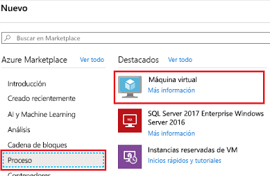
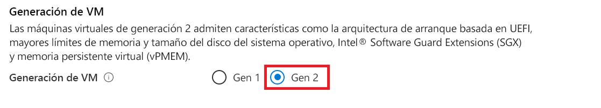
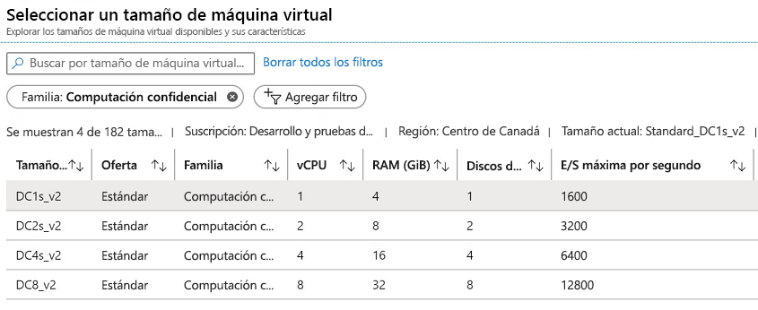
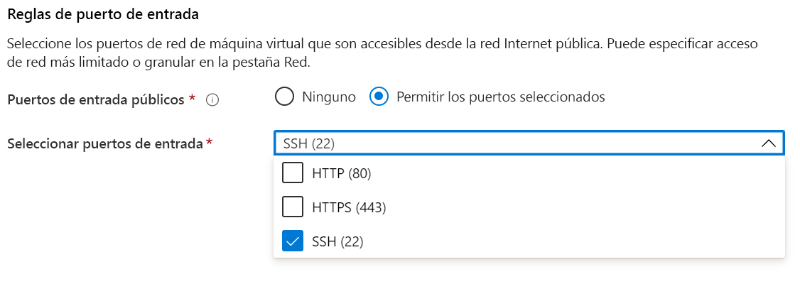

# <a name="quickstart-deploy-an-azure-confidential-computing-vm-in-the-azure-portal"></a>Inicio rápido: Implementación de una máquina virtual de computación confidencial de Azure en Azure Portal

Empiece a trabajar con la computación confidencial de Azure mediante Azure Portal para crear una máquina virtual con el respaldo de Intel SGX. A continuación, instalará el kit de desarrollo de software (SDK) de Open Enclave para configurar el entorno de desarrollo. 

Se recomienda este tutorial si está interesado en implementar una máquina virtual de computación confidencial con una configuración personalizada. En caso contrario, le recomendamos que siga los [pasos de implementación de la máquina virtual de computación confidencial del marketplace comercial de Microsoft](quick-create-marketplace.md).


## <a name="prerequisites"></a>Requisitos previos

Si no tiene una suscripción a Azure, [cree una cuenta](https://azure.microsoft.com/pricing/purchase-options/pay-as-you-go/) antes de empezar.

> [!NOTE]
> Las cuentas de evaluación gratuita no tienen acceso a las máquinas virtuales que se usan en este tutorial. Actualice a una suscripción de pago por uso.


## <a name="sign-in-to-azure"></a>Inicio de sesión en Azure

1. Inicie sesión en [Azure Portal](https://portal.azure.com/).

1. En la parte superior, seleccione **Crear un recurso**.

1. En el panel de **Marketplace**, seleccione **Compute** a la izquierda.

1. Busque y seleccione **Máquina virtual**.

    

1. En la página de aterrizaje de la máquina virtual, seleccione **Crear**.


## <a name="configure-a-confidential-computing-virtual-machine"></a>Configuración de una máquina virtual de computación confidencial

1. En la pestaña **Fundamentos**, seleccione la **suscripción** y el **grupo de recursos**.

1. En **Nombre de la máquina virtual**, escriba un nombre para la nueva máquina virtual.

1. Escriba o seleccione los valores siguientes:

   * **Región**: Seleccione la región de Azure adecuada para usted.

        > [!NOTE]
        > Las máquinas virtuales de computación confidencial solo se ejecutan en hardware especializado disponible en regiones específicas. Para ver las regiones más recientes disponibles para las máquinas virtuales de la serie DCsv2, consulte las [regiones disponibles](https://azure.microsoft.com/global-infrastructure/services/?products=virtual-machines).

1. Configure la imagen del sistema operativo que le gustaría usar para la máquina virtual.

    * **Elija una imagen**: en este tutorial, seleccione Ubuntu 18.04 LTS. También puede seleccionar Windows Server 2019, Windows Server 2016 y Ubuntu 16.04 LTS. Si decide hacerlo, se le proporcionará la información adecuada en este tutorial.
    
    * **Alterne la imagen de Gen 2**: las máquinas virtuales de computación confidencial solo se ejecutan en imágenes de la [Generación 2](../virtual-machines/linux/generation-2.md). Asegúrese de que la imagen que selecciona es una imagen de esta generación. Haga clic en la pestaña **Avanzado** que está encima de donde está configurando la máquina virtual. Desplácese hacia abajo hasta que encuentre la sección denominada "Generación de VM". Seleccione Gen 2 y, a continuación, vuelva a la pestaña **Básico**.
    

        


        

    * **Vuelva a la configuración básica**: Vuelva a la pestaña **Básico** con los controles de navegación de la parte superior.

1. Elija una máquina virtual con funcionalidades de computación confidencial en el selector de tamaño. Para ello, seleccione **cambiar tamaño**. En el selector de tamaño de la máquina virtual, haga clic en **Borrar todos los filtros**. Elija **Agregar filtro**, seleccione **Familia** como tipo de filtro y, a continuación, seleccione solo **Proceso confidencial**.

    

    > [!TIP]
    > Debería ver los tamaños **DC1s_v2**, **DC2s_v2**, **DC4s_V2** y **DC8_v2**. Estos son los únicos tamaños de máquina virtual que admiten actualmente la computación confidencial. [Más información](virtual-machine-solutions.md).

1. Rellene la información siguiente:

   * **Tipo de autenticación**: Seleccione **Clave pública SSH** si va a crear una máquina virtual Linux. 

        > [!NOTE]
        > Para la autenticación, puede una clave pública SSH o una contraseña. La opción de SSH es más segura. Para obtener instrucciones acerca de cómo generar una clave SSH, consulte [Creación y uso de un par de claves SSH pública y privada para máquinas virtuales Linux en Azure](../virtual-machines/linux/mac-create-ssh-keys.md).

    * **Nombre de usuario**: Escriba el nombre del administrador de la máquina virtual.

    * **Clave pública SSH**: Si es aplicable, escriba la clave pública RSA.
    
    * **Contraseña**: Si procede, escriba la contraseña para la autenticación.

    * **Puertos de entrada públicos**: Elija **Permitir los puertos seleccionados** y seleccione **SSH (22)** y **HTTP (80)** en la lista **Seleccionar puertos de entrada públicos**. Si va a implementar una máquina virtual Windows, seleccione **HTTP (80)** y **RDP (3389)** . En este inicio rápido, este paso es necesario para conectarse a la máquina virtual y completar la configuración del SDK de Open Enclave. 

     


1. Realice los cambios en la pestaña **Discos**.

   * Si ha elegido una máquina virtual **DC1s_v2**, **DC2s_v2**, **DC4s_V2**, elija un tipo de disco que sea **SSD estándar** o **SSD Premium**. 
   * Si ha elegido una máquina virtual **DC8_v2**, elija **SSD estándar** como tipo de disco.

1. Haga los cambios que quiera en la configuración en las pestañas siguientes o conserve la configuración predeterminada.

    * **Redes**
    * **Administración**
    * **Configuración de invitado**
    * **Etiquetas**

1. Seleccione **Revisar + crear**.

1. En el panel **Revisar + crear**, seleccione **Crear**.

> [!NOTE]
> Vaya a la sección siguiente y siga en este tutorial si ha implementado una máquina virtual Linux. Si ha implementado una máquina virtual Windows, [siga estos pasos para conectarse a ella](../virtual-machines/windows/connect-logon.md) y, a continuación, [instale el SDK de Open Enclave en Windows](https://github.com/openenclave/openenclave/blob/master/docs/GettingStartedDocs/install_oe_sdk-Windows.md).


## <a name="connect-to-the-linux-vm"></a>Conexión a la máquina virtual Linux

Si ya utiliza un shell de BASH, conéctese a la máquina virtual de Azure mediante el comando **ssh**. En el siguiente comando, reemplace el nombre de usuario y la dirección IP de la máquina virtual para conectarse a su máquina virtual Linux.

```bash
ssh azureadmin@40.55.55.555
```

Puede buscar la dirección IP pública de la máquina virtual en la sección Información general de la máquina virtual en Azure Portal.

:::image type="content" source="media/quick-create-portal/public-ip-virtual-machine.png" alt-text="Dirección IP en Azure Portal":::

Si utiliza Windows y no tiene un shell de BASH, instale un cliente de SSH, como PuTTY.

1. [Descargue e instale PuTTY](https://www.chiark.greenend.org.uk/~sgtatham/putty/download.html).

1. Ejecute PuTTY.

1. En la pantalla de configuración de PuTTY, escriba la dirección IP pública de la máquina virtual.

1. Seleccione **Abrir** y escriba el nombre de usuario y la contraseña en los cuadros.

Para más información acerca de cómo conectarse a máquinas virtuales Linux, consulte [Creación de máquinas virtuales Linux con Azure Portal](../virtual-machines/linux/quick-create-portal.md).

> [!NOTE]
> Si ve una alerta de seguridad de PuTTY que indique que la clave de host del servidor no se almacena en la caché del registro, elija entre las opciones siguientes. Si confía en este host, seleccione **Sí** para agregar la clave a la caché de PuTTY y siga conectándose. Si quiere conectarse solo una vez, sin agregar la clave a la caché, seleccione **No**. Si no confía en este host, seleccione **Cancelar** para abandonar la conexión.

## <a name="install-the-open-enclave-sdk-oe-sdk"></a>Instalación del SDK de Open enclave (SDK de OE) <a id="Install"></a>

Siga las instrucciones detalladas para instalar el [SDK de OE](https://github.com/openenclave/openenclave) en la máquina virtual de la serie DCsv2 con una imagen de Ubuntu 18.04 LTS Gen 2. 

Si la máquina virtual se ejecuta en Ubuntu 16.04 LTS Gen 2, deberá seguir las [instrucciones de instalación de Ubuntu 16.04](https://github.com/openenclave/openenclave/blob/master/docs/GettingStartedDocs/install_oe_sdk-Ubuntu_16.04.md).

#### <a name="1-configure-the-intel-and-microsoft-apt-repositories"></a>1. Configure los repositorios de Intel y Microsoft APT

```bash
echo 'deb [arch=amd64] https://download.01.org/intel-sgx/sgx_repo/ubuntu bionic main' | sudo tee /etc/apt/sources.list.d/intel-sgx.list
wget -qO - https://download.01.org/intel-sgx/sgx_repo/ubuntu/intel-sgx-deb.key | sudo apt-key add -

echo "deb http://apt.llvm.org/bionic/ llvm-toolchain-bionic-7 main" | sudo tee /etc/apt/sources.list.d/llvm-toolchain-bionic-7.list
wget -qO - https://apt.llvm.org/llvm-snapshot.gpg.key | sudo apt-key add -

echo "deb [arch=amd64] https://packages.microsoft.com/ubuntu/18.04/prod bionic main" | sudo tee /etc/apt/sources.list.d/msprod.list
wget -qO - https://packages.microsoft.com/keys/microsoft.asc | sudo apt-key add -
```

#### <a name="2-install-the-intel-sgx-dcap-driver"></a>2. Instale el controlador Intel SGX DCAP

```bash
sudo apt update
sudo apt -y install dkms
wget https://download.01.org/intel-sgx/sgx-dcap/1.4/linux/distro/ubuntuServer18.04/sgx_linux_x64_driver_1.21.bin -O sgx_linux_x64_driver.bin
chmod +x sgx_linux_x64_driver.bin
sudo ./sgx_linux_x64_driver.bin
```

> [!WARNING]
> Use el controlador Intel SGX DCAP más reciente del [sitio web de Intel SGX](https://01.org/intel-software-guard-extensions/downloads).

#### <a name="3-install-the-intel-and-open-enclave-packages-and-dependencies"></a>3. Instale los paquetes y dependencias de Intel y Open Enclave

```bash
sudo apt -y install clang-7 libssl-dev gdb libsgx-enclave-common libsgx-enclave-common-dev libprotobuf10 libsgx-dcap-ql libsgx-dcap-ql-dev az-dcap-client open-enclave
```

> [!NOTE] 
> En este paso también se instala el paquete [az-dcap-client](https://github.com/microsoft/azure-dcap-client), el cual es necesario para realizar la atestación remota en Azure.

#### <a name="4-verify-the-open-enclave-sdk-install"></a>4. **Compruebe la instalación del SDK de Open Enclave**

Consulte [Uso del SDK de Open Enclave](https://github.com/openenclave/openenclave/blob/master/docs/GettingStartedDocs/Linux_using_oe_sdk.md) en GitHub para comprobar y usar el SDK instalado.

## <a name="clean-up-resources"></a>Limpieza de recursos

Cuando ya no los necesite, puede eliminar el grupo de recursos, la máquina virtual y todos los recursos relacionados. 

Seleccione el grupo de recursos de la máquina virtual y haga clic en **Eliminar**. Confirme el nombre del grupo de recursos para terminar de eliminar los recursos.

## <a name="next-steps"></a>Pasos siguientes

En este inicio rápido, ha implementado una máquina virtual de computación confidencial y ha instalado el SDK de Open enclave. Para más información sobre las máquinas virtuales de computación confidencial en Azure, consulte [Soluciones en Virtual Machines](virtual-machine-solutions.md). 

Descubra cómo puede crear aplicaciones de computación confidencial. Para ello, continúe con los ejemplos del SDK de Open Enclave en GitHub. 

> [!div class="nextstepaction"]
> [Compilación de ejemplos del SDK de Open Enclave](https://github.com/openenclave/openenclave/blob/master/samples/README.md)
