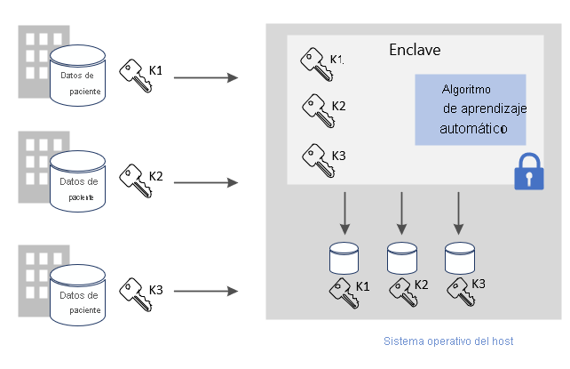
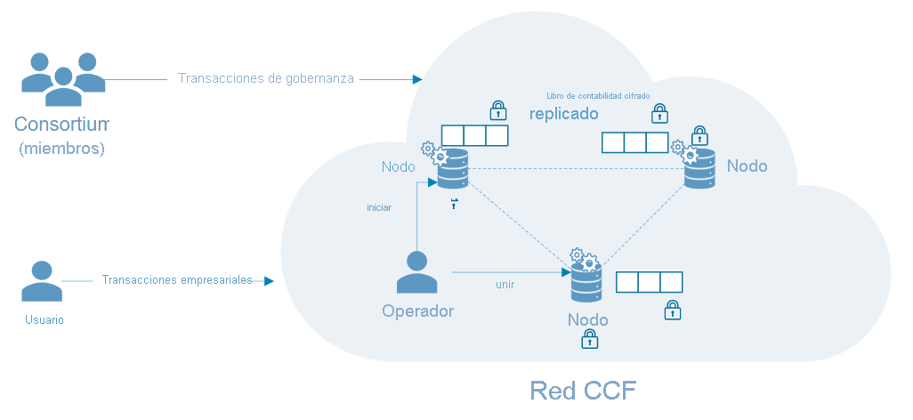

# Escenarios comunes de la computación confidencial de Azure

En este artículo se proporciona información general acerca de varios escenarios comunes de la computación confidencial de Azure. Las recomendaciones de este artículo sirven como punto de partida para desarrollar una aplicación mediante marcos y servicios de computación confidencial. 

Después de leer este artículo, podrá responder a las preguntas siguientes:

- ¿Cuáles son algunos de los escenarios de computación confidencial de Azure?
- ¿Cuáles son las ventajas de usar la computación confidencial de Azure para escenarios de varias entidades?
- ¿Cuáles son las ventajas de usar la computación confidencial de Azure en una red de cadena de bloques?

## Cálculo seguro de varias entidades
La computación confidencial de Azure permite procesar datos de varios orígenes sin exponer los datos de entrada a otras entidades. Este tipo de cálculo seguro permite muchos escenarios como: la lucha contra el blanqueo de dinero, la detección de fraudes y el análisis seguro de los datos de atención sanitaria.

Varios orígenes pueden cargar sus datos en un enclave de una máquina virtual. Una entidad indica al enclave que realice el cálculo con los datos o que los procese. Ninguna entidad (ni siquiera la que ejecuta el análisis) puede ver los datos de otra que se hayan cargado en el enclave. 

En la computación segura con varias entidades, los datos cifrados entran en el enclave, este los descifra mediante una clave, realiza el análisis pertinente, obtiene un resultado y devuelve un resultado cifrado que una entidad puede descifrar con la clave designada. 

**Protección de los datos en uso**: 
- Use una máquina virtual de la serie DCsv2 en Azure con la compatibilidad con Intel SGX habilitada. Estas máquinas virtuales se habilitan con entornos de ejecución de confianza (TEE) que protegen y aíslan ciertas partes de los datos y el código de la aplicación.
- Use un SDK compatible con enclave para crear un enclave dentro de la máquina virtual. Dentro del enclave, los datos no se expondrán a ninguno de ellos, ni siquiera al proveedor de máquinas virtuales. Los datos del enclave se cifrarán con la compatibilidad del hardware.
    - Por ejemplo, puede usar el SDK de [Open Enclave](https://github.com/openenclave/openenclave) para el procesamiento del lado servidor. 

**Protección de los datos en tránsito** 
- Use un TLS atestado como un canal protegido, con el fin de garantizar la seguridad de los datos en tránsito.
- El cliente garantiza que los datos solo se envían al mismo servidor, que está protegido por el enclave. 

**Protección de los datos en reposo**
- Use almacenes de datos protegidos y seguros para garantizar la seguridad de los datos mientras están en reposo 

### Lucha contra el blanqueo de dinero
En este ejemplo de cálculo seguro de varias entidades, varios bancos comparten los datos entre sí sin exponer los datos personales de sus clientes. Los bancos ejecutan análisis acordados en el conjunto de datos confidenciales combinados. El análisis del conjunto de datos agregado puede detectar si un usuario mueve dinero entre varios bancos sin que unos bancos accedan a los datos de los restantes.

Gracias a la computación confidencial, estas instituciones financieras pueden aumentar los índices de detección de fraudes, abordar escenarios de blanqueo de dinero, reducir falsos positivos y seguir aprendiendo de conjuntos de datos más grandes. 

### Desarrollo de fármacos en el sector sanitario
Los centros sanitarios asociados aportan conjuntos de datos sanitarios privados para entrenar un modelo de Machine Learning. Cada instalación solo puede ver su propio conjunto de datos. Ninguna otra instalación, ni siquiera el proveedor de nube, puede ver el modelo de datos o de entrenamiento. 

Todas las instalaciones se benefician del uso del modelo entrenado. Al crear el modelo con más datos, aumentó su precisión. Cada instalación que ha contribuido al entrenamiento del modelo puede utilizarlo y recibir resultados útiles. 

## Cadena de bloques

Una red de cadena de bloques es una red de nodos descentralizada. Estos nodos los ejecutan y mantienen operadores o validadores que desean garantizar la integridad y alcanzar el consenso sobre el estado de la red. Los nodos son réplicas de libros de contabilidad y se usan para realizar el seguimiento de las transacciones de una cadena de bloques. Cada nodo tiene una copia completa del historial de transacciones, lo que garantiza la integridad y disponibilidad en una red distribuida.

Las tecnologías de cadena de bloques basadas en la computación confidencial pueden usar la privacidad basada en hardware para habilitar la confidencialidad de los datos y los cálculos seguros. En algunos casos, todo el libro de contabilidad se cifra para proteger el acceso a los datos. A veces, la propia transacción se puede producir en un módulo de proceso dentro del enclave del nodo.

### Marco de trabajo del Consorcio de Computación Confidencial (CCF)
[CCF](https://www.microsoft.com/research/project/confidential-consortium-framework/) es un ejemplo de un marco de cadena de bloques distribuido que se basa en la computación confidencial de Azure. Con el impulso de Microsoft Research, este marco aprovecha la eficacia de los entornos de ejecución de confianza (TEE) para crear una red de enclaves remotos para la atestación. Los nodos se pueden ejecutar sobre máquinas virtuales de Azure ([de la serie DCsv2](confidential-computing-enclaves.md)) y aprovechar la infraestructura del enclave. Mediante los protocolos de atestación, los usuarios de la cadena de bloques pueden comprobar la integridad de un nodo de CCF y comprobar de manera eficaz toda la red. 

En el Consorcio de Computación Confidencial, el libro de contabilidad descentralizado se compone de cambios registrados en un almacén de clave-valor que se replica en todos los nodos de la red. Cada uno de estos nodos ejecuta un motor de transacciones que pueden desencadenar los usuarios de la cadena de bloques sobre TLS. Cuando se desencadena un punto de conexión, se muta el almacén de clave-valor. Antes de que el cambio cifrado se registre en el libro de contabilidad descentralizado, se debe acordar en un cierto número de nodos para alcanzar el consenso. 

## Pasos siguientes
[Implementación](quick-create-marketplace.md) de una máquina virtual de la serie DCsv2.

