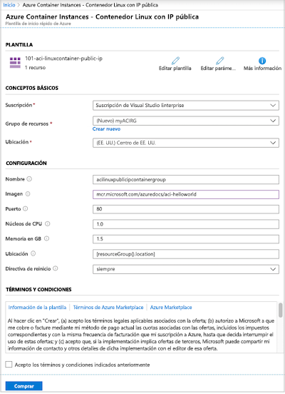
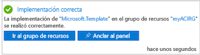
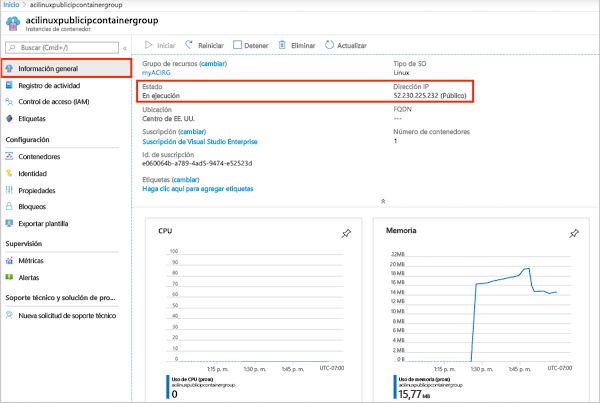
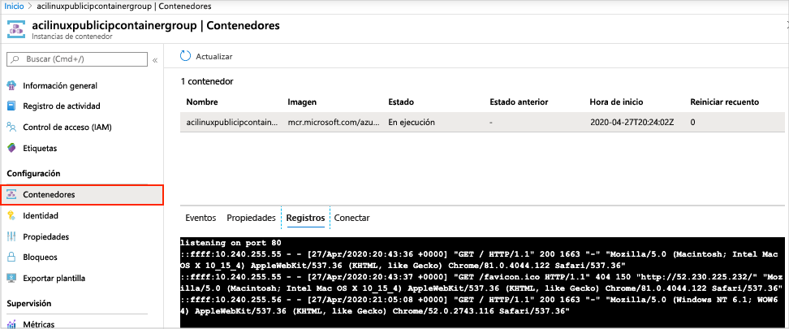

# Inicio rápido: Implementación de una instancia de contenedor en Azure mediante una plantilla de Resource Manager

Use Azure Container Instances para ejecutar contenedores de Docker sin servidor en Azure con sencillez y velocidad. Implemente una aplicación en una instancia de contenedor a petición cuando no necesite una plataforma de orquestación de contenedores completa, como Azure Kubernetes Service. En este inicio rápido, se usa una plantilla de Azure Resource Manager para implementar un contenedor de Docker aislado y hacer que su aplicación web esté disponible con una dirección IP pública.

[!INCLUDE [About Azure Resource Manager](../../includes/resource-manager-quickstart-introduction.md)]

Si no tiene una suscripción a Azure, cree una cuenta [gratuita](https://azure.microsoft.com/free/) antes de empezar.

## Prerrequisitos

Ninguno.

## Creación de instancia de contenedor

### Revisión de la plantilla

La plantilla usada en este inicio rápido forma parte de las [plantillas de inicio rápido de Azure](https://azure.microsoft.com/resources/templates/101-aci-linuxcontainer-public-ip/).

:::code language="json" source="~/quickstart-templates/101-aci-linuxcontainer-public-ip/azuredeploy.json" range="1-107" highlight="61-100":::

El siguiente recurso se define en la plantilla:

* **[Microsoft.ContainerInstance/containerGroups](/azure/templates/microsoft.containerinstance/containergroups)** : crea un grupo de contenedores de Azure. Esta plantilla define un grupo que consta de una instancia de contenedor única.

Encontrará más ejemplos de plantillas de Azure Container Instances en la [galería de plantillas de inicio rápido](https://azure.microsoft.com/resources/templates/?resourceType=Microsoft.Containerinstance&pageNumber=1&sort=Popular).

### Implementación de la plantilla

 1. Seleccione la imagen siguiente para iniciar sesión en Azure y abrir una plantilla. La plantilla crea un registro y una réplica en otra ubicación.

    

 2. Seleccione o escriba los siguientes valores.

    * **Suscripción**: seleccione una suscripción de Azure.
    * **Grupo de recursos**: seleccione **Crear nuevo**, escriba un nombre único para el grupo de recursos y, después, seleccione **Aceptar**.
    * **Ubicación**: seleccione una ubicación para el grupo de recursos. Ejemplo: **Centro de EE. UU.** .
    * **Nombre**: acepte el nombre que se genera para la instancia o escriba otro nombre.
    * **Imagen**: acepte el nombre de imagen predeterminado. Esta imagen de Linux de ejemplo empaqueta una pequeña aplicación web escrita en Node.js que sirve una página HTML estática. 

    Acepte los valores predeterminados en las restantes propiedades.

    Revise los términos y condiciones. Si está de acuerdo con ellos, seleccione **Acepto los términos y condiciones indicados anteriormente**.

    

 3. Cuando la instancia se haya creado correctamente, recibirá una notificación:

    

 Azure Portal se usa para implementar la plantilla. Además de Azure Portal, también puede usar Azure PowerShell, la CLI de Azure y API REST. Para obtener información sobre otros métodos de implementación, consulte [Implementación de plantillas](../azure-resource-manager/templates/deploy-cli.md).

## Revisión de los recursos implementados

Use Azure Portal o una herramienta como la [CLI de Azure](container-instances-quickstart.md) para examinar las propiedades de la instancia de contenedor.

1. En Azure Portal, busque Container Instances y seleccione la instancia de contenedor que creó.

1. En la página de **información general**, observe el valor del campo **Estado** de la instancia y el de **Dirección IP**.

    

2. Una vez que su estado sea *En ejecución*, vaya a la dirección IP en el explorador. 

    

### Visualización de registros de contenedores

Ver los registros de una instancia de contenedor resulta de utilidad al solucionar problemas con el contenedor o la aplicación en la que se ejecuta.

Para ver los registros del contenedor, en **Configuración**, seleccione **Contenedores** > **Registros**. Debería ver la solicitud GET HTTP que se genera cuando se ve la aplicación en el explorador.

## Limpieza de recursos

Cuando haya terminado con el contenedor, en la página de **información general** de la instancia de contenedor, seleccione **Eliminar**. Cuando se le solicite, confirme la eliminación.

## Pasos siguientes

En este inicio rápido, ha creado una instancia de contenedor de Azure a partir de una imagen de Microsoft pública. Si quiere compilar una imagen de contenedor e implementarla desde un registro de contenedor privado de Azure, vaya al tutorial de Azure Container Instances.

> [!div class="nextstepaction"]
> [Tutorial: Creación de una imagen de contenedor para su implementación en Azure Container Instances](./container-instances-tutorial-prepare-app.md)

Para obtener un tutorial paso a paso que le guíe en el proceso de creación de una plantilla, consulte:

> [!div class="nextstepaction"]
> [Tutorial: Creación e implementación de la primera plantilla de Azure Resource Manager](../azure-resource-manager/templates/template-tutorial-create-first-template.md)