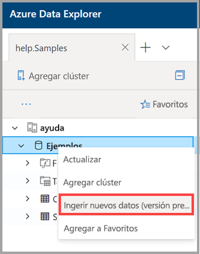

# ¿Qué es la ingesta con un clic? 

La ingesta con un clic le permite ingerir datos rápidamente y sugerir tablas y estructuras de asignación automáticamente, en función de un origen de datos en Azure Data Explorer. 

Mediante la interfaz de usuario web de Azure Data Explorer, puede ingerir datos del almacenamiento (archivo de blob), de un archivo local o de un contenedor (hasta 10 000 blobs). También puede definir una cuadrícula de eventos en un contenedor para la ingesta continua. Los datos se pueden ingerir en una tabla nueva o existente en JSON, CSV y [otros formatos](#file-formats). Una ingesta con un clic puede sugerir una estructura para una nueva tabla y una asignación de tabla, según el origen de datos, y proporcionar una plataforma intuitiva para ajustar la estructura de tabla de una tabla y una asignación de tabla existentes. Una ingesta con un clic ingerirá los datos en la tabla en solo unos minutos.

La ingesta con un clic es especialmente útil cuando se ingieren datos por primera vez, o cuando el esquema de los datos no resulta familiar.

## Prerrequisitos

* Si no tiene una suscripción a Azure, cree una [cuenta gratuita de Azure](https://azure.microsoft.com/free/) antes de empezar.
* Cree [un clúster y una base de datos de Azure Data Explorer](create-cluster-database-portal.md).
* Inicie sesión en la [interfaz de usuario web de Azure Data Explorer](https://dataexplorer.azure.com/) y [agregue una conexión al clúster](/azure/data-explorer/web-query-data#add-clusters).

## Formatos de archivo

La ingesta con un clic permite ingerir una nueva tabla a partir de los datos de origen en cualquiera de los siguientes formatos:
* JSON
* CSV
* TSV
* SCSV
* SOHSV
* TSVE
* PSV

## Asistente para ingesta con un clic

El Asistente para ingesta con un clic le guía por el proceso de ingesta con un clic. 

> [!Note]
> En esta sección se describe el asistente en general. Las opciones que seleccione dependen de si realiza la ingesta en una tabla nueva o existente. Para más información, consulte:
    > * Ingesta en [una nueva tabla](one-click-ingestion-new-table.md)
    > * Ingesta en una [tabla existente](one-click-ingestion-existing-table.md) 
    
1. Para acceder al asistente, haga clic con el botón derecho en la fila de la *base de datos* o de la *tabla* del menú izquierdo de la interfaz de usuario web de Azure Data Explorer y seleccione **Ingest new data (preview)** (Ingerir nuevos datos [versión preliminar]).

       

1. Este asistente le guía por las siguientes opciones:
       * Ingerir en una [tabla existente](one-click-ingestion-existing-table.md)
       * Ingerir en [una nueva tabla](one-click-ingestion-new-table.md)
       * Ingerir datos de:      * Blob Storage      * Un archivo local      * Un contenedor
       * Escriba el tamaño de ejemplo, de 1 a 10 000 filas (solo desde el contenedor).
       
1. Cuando haya seleccionado correctamente el origen de datos, se muestra una vista previa de los datos. 
    Si va a ingerir datos de un contenedor, puede filtrar los datos de forma que solo se ingieran los archivos con prefijos o extensiones de archivo concretos. Por ejemplo, puede que solo quiera ingerir archivos con nombres de archivo que empiecen con la palabra *Europa* o únicamente archivos con la extensión *.json*. 

1. Haga clic en **Edit schema** (Editar esquema). Si va a ingerir datos en una tabla específica, puede asignar las columnas de origen a las columnas de destino y decidir si quiere o no incluir nombres de columna.

1. Inicie el proceso de ingesta de datos.

> [!Note]
> Si el origen de datos es un contenedor, tenga en cuenta que la directiva de agregación (procesamiento por lotes) de ingesta de datos de Azure Data Explorer está diseñada para optimizar el proceso de ingesta. De forma predeterminada, la directiva está configurada en 5 minutos o 500 MB de datos, por lo que puede que experimente latencia. Consulte la [directiva de procesamiento por lotes](/azure/kusto/concepts/batchingpolicy) para ver las opciones de agregación. Al ingerir datos de otros orígenes, la ingesta tendrá efecto inmediato.

## Pasos siguientes

* Decida si va a usar la ingesta con un clic para ingerir datos en [una tabla existente](one-click-ingestion-existing-table.md) o en [una tabla nueva](one-click-ingestion-new-table.md).
* [Consulta de datos en la interfaz de usuario web de Azure Data Explorer](/azure/data-explorer/web-query-data)
* [Escritura de consultas para Azure Data Explorer mediante el lenguaje de consulta Kusto](/azure/data-explorer/write-queries)