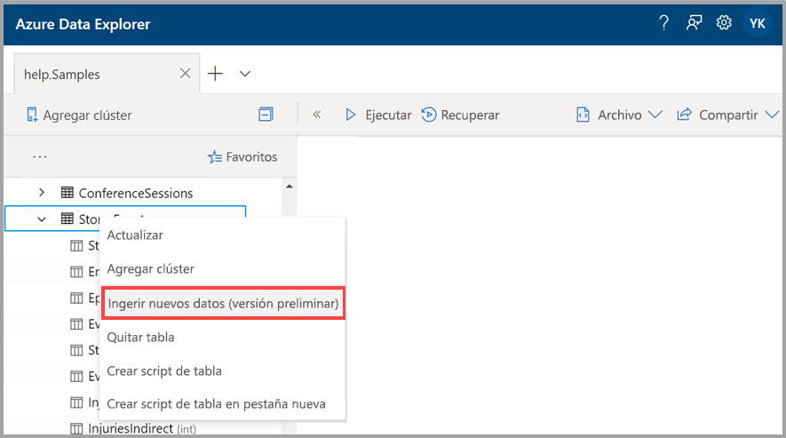
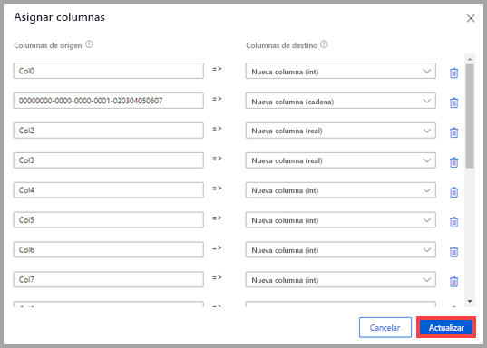
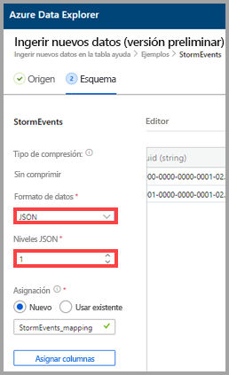
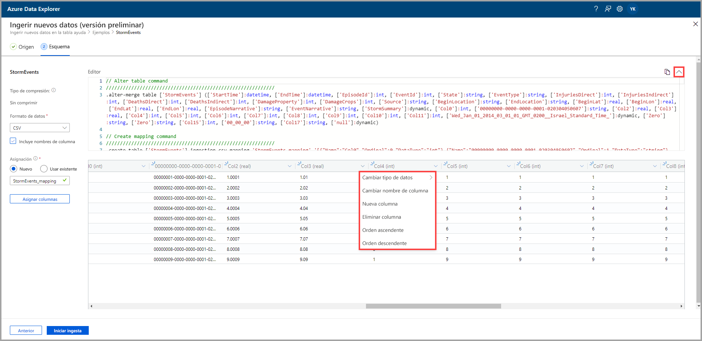
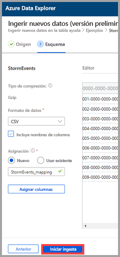

# Uso de la ingesta con un clic para ingerir datos en una tabla existente en Azure Data Explorer

La ingesta con un clic le permite ingerir rápidamente datos en formato JSON, CSV y otros en una tabla. Con la interfaz de usuario web de Azure Data Explorer, puede ingerir datos del almacenamiento, de un archivo local o de un contenedor. 

En este documento se describe el uso del asistente con un clic intuitivo para ingerir datos JSON de un archivo a una tabla existente. Luego, puede editar la tabla y ejecutar consultas mediante la interfaz de usuario web de Azure Data Explorer.

La ingesta con un clic es especialmente útil cuando se ingieren datos por primera vez, o cuando el esquema de los datos no resulta familiar. 

Para información general sobre la ingesta con un clic y una lista de requisitos previos, consulte [Ingesta con un clic](ingest-data-one-click.md).
Para información sobre la ingesta de datos en una nueva tabla en Azure Data Explorer, consulte [Ingesta con un solo clic en una nueva tabla](one-click-ingestion-new-table.md).

## Ingesta de nuevos datos

1. En el menú izquierdo de la interfaz de usuario web, haga clic con el botón derecho en una *base de datos* o una *tabla* y seleccione **Ingest new data (Preview)** (Ingerir nuevos datos [versión preliminar]).

       
 
1. En la ventana **Ingest new data (Preview)** (Ingerir nuevos datos [versión preliminar]), la pestaña **Source** (Origen) se selecciona automáticamente.

1. Si el campo **Table** (Tabla) no se rellena automáticamente, seleccione un nombre de tabla existente del menú de lista desplegable.
    > [!TIP]
    > Si selecciona **Ingest new data (Preview)** [Ingerir datos nuevos (versión preliminar)], en una fila de *tabla*, el nombre de la tabla seleccionada aparecerá en los **Detalles del proyecto**.

[!INCLUDE [data-explorer-one-click-ingestion-types](../../includes/data-explorer-one-click-ingestion-types.md)]
    
Seleccione **Editar esquema** para ver y editar la configuración de la columna de la tabla.

## Edición del esquema

1. Se abre el cuadro de diálogo **Map columns** (Asignar columnas) y puede asignar columnas de datos de origen a las columnas de la tabla de destino. 
    * En los campos **Source columns** (Columnas de origen), escriba los nombres de columna que se asignarán con los campos **Target columns** (Columnas de destino).
    * Para eliminar una asignación, seleccione el icono de papelera.

    

1. Seleccione **Actualizar**.
1. En la pestaña **Schema** (Esquema):
    1. Seleccione **Compression type** (Tipo de compresión) y, luego, **Uncompressed** (Sin comprimir) o **GZip**.

        [!INCLUDE [data-explorer-one-click-ingestion-edit-schema](../../includes/data-explorer-one-click-ingestion-edit-schema.md)]
        
    1. Si selecciona **JSON**, también debe seleccionar los **niveles JSON**, del 1 al 10. Los niveles afectan a la representación de datos de la columna de tabla.

    

    * Si selecciona un formato que no sea JSON, puede activar la casilla **Include column names** (Incluir nombres de columna) para omitir la fila de encabezado del archivo.
        
    

    > [!Note]
    > Los formatos tabulares pueden ingerir datos de columna en una sola columna de una tabla de Azure Data Explorer. 

    * Las nuevas asignaciones se establecen automáticamente, pero puede cambiarlas para usar una existente. 
    * Puede seleccionar **Map columns** (Asignar columnas) para abrir la ventana **Map columns** (Asignar columnas).

## Copiar y pegar consultas

1. Encima del panel del **Editor**, seleccione el botón **v** para abrir el editor. En el editor, puede ver y copiar los comandos automáticos generados a partir de sus entradas. 
1. En la tabla: 
    * Seleccione nuevos encabezados de columna para agregar valores para **New column** (Nueva columna), **Delete column** (Eliminar columna), **Sort ascending** (Orden ascendente) o **Sort descending** (Orden descendente). En las columnas existentes, solo está disponible la ordenación de datos.

    > [!Note]
    > * No se puede actualizar el nombre y el tipo de datos de las tablas existentes.
    > * Los comandos drop solo revierten los cambios realizados por su flujo de ingesta (nuevas extensiones y columnas). No se quitará ninguna otra cosa.

 

## Inicio de la ingesta

Seleccione **Start ingestion** (Iniciar ingesta) para crear una tabla y una asignación, y comenzar la ingesta de datos.

## Ingesta de datos finalizada

En la ventana **Data ingestion completed** (Ingesta de datos completada), los tres pasos se marcarán con marcas de verificación verdes si la ingesta de datos se completa correctamente.
 

[!INCLUDE [data-explorer-one-click-ingestion-query-data](../../includes/data-explorer-one-click-ingestion-query-data.md)]

## Pasos siguientes

* [Consulta de datos en la interfaz de usuario web de Azure Data Explorer](/azure/data-explorer/web-query-data)
* [Escritura de consultas para Azure Data Explorer mediante el lenguaje de consulta Kusto](/azure/data-explorer/write-queries)
