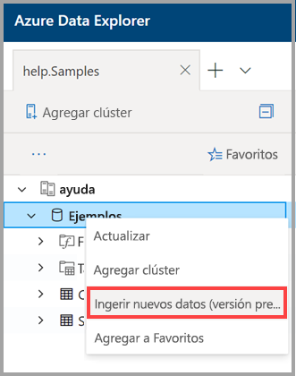
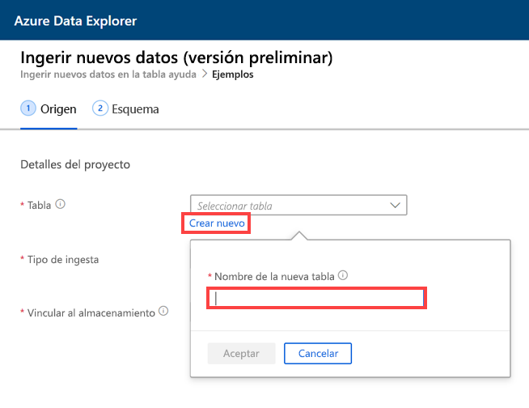
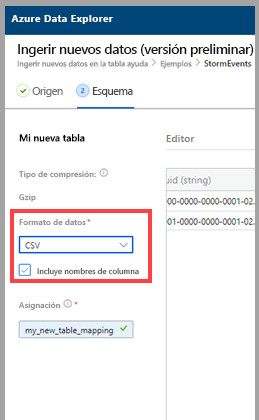
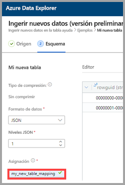
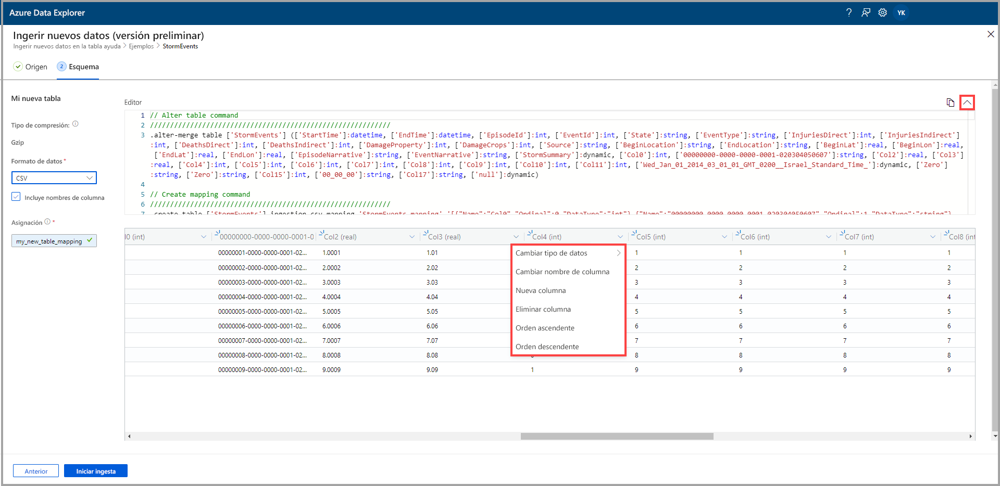
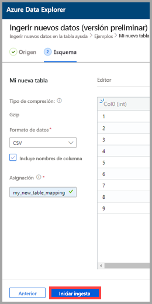
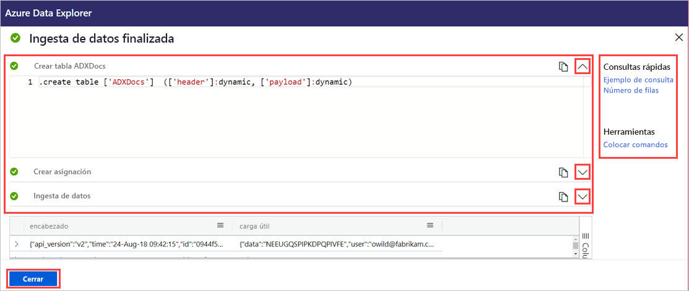

# Uso de la ingesta con un clic para ingerir datos en una nueva tabla de Azure Data Explorer

La ingesta con un clic le permite ingerir rápidamente datos en formato JSON, CSV y otros en una tabla. Con la interfaz de usuario web de Azure Data Explorer, puede ingerir datos del almacenamiento, de un archivo local o de un contenedor. 

En este documento se describe el uso del asistente con un clic intuitivo para ingerir datos CSV de un contenedor a una nueva tabla. Luego, puede editar la tabla y ejecutar consultas mediante la interfaz de usuario web de Azure Data Explorer. También puede establecer la ingesta continua para ingerir datos automáticamente en la tabla cuando se actualicen los datos de origen.

La ingesta con un clic es especialmente útil cuando se ingieren datos por primera vez, o cuando el esquema de los datos no resulta familiar. 

Para información general sobre la ingesta con un clic y una lista de requisitos previos, consulte [Ingesta con un clic](ingest-data-one-click.md).
Para información sobre la ingesta de datos en una tabla existente en Azure Data Explorer, consulte [Ingesta con un solo clic en una tabla ya existente](one-click-ingestion-existing-table.md).

## Ingesta de nuevos datos

1. En el menú izquierdo de la interfaz de usuario web, haga clic con el botón derecho en una *base de datos* y seleccione **Ingest new data (Preview)** (Ingerir nuevos datos [versión preliminar]).

       
 
1. En la ventana **Ingest new data (Preview)** (Ingerir nuevos datos [versión preliminar]), la pestaña **Source** (Origen) se selecciona automáticamente. 

1. Seleccione **Create new table** (Crear nueva tabla) y escriba un nombre para la nueva tabla. Puede usar caracteres alfanuméricos, guiones y caracteres de subrayado. No se admiten caracteres especiales.

 

[!INCLUDE [data-explorer-one-click-ingestion-types](../../includes/data-explorer-one-click-ingestion-types.md)]

Seleccione **Editar esquema** para ver y editar la configuración de la columna de la tabla. El sistema seleccionará uno de los blobs de forma aleatoria y el esquema se generará en función de ese blob. Al examinar el nombre del origen, el servicio identifica automáticamente si está o no comprimido.

## Edición del esquema

1. En la pestaña **Schema** (Esquema):

    1. Seleccione **Data format** (Formato de datos):

        [!INCLUDE [data-explorer-one-click-ingestion-edit-schema](../../includes/data-explorer-one-click-ingestion-edit-schema.md)]

    1. Si selecciona **JSON**, también debe seleccionar los **niveles JSON**, del 1 al 10. Los niveles afectan a la representación de datos de la columna de tabla. 

    

    * Si selecciona un formato que no sea JSON, puede activar la casilla **Include column names** (Incluir nombres de columna) para omitir la fila de encabezado del archivo.

        
        
1. En el campo **Mapping name** (Nombre de asignación), escriba un nombre de asignación. Puede usar caracteres alfanuméricos y caracteres de subrayado. No se admiten espacios, caracteres especiales ni guiones.
    
    

## Copiar y pegar consultas

1. Encima del panel del **Editor**, seleccione el botón **v** para abrir el editor. En el editor, puede ver y copiar las consultas automáticas generadas a partir de los valores que ha introducido. 
1. En la tabla: 
    * Haga doble clic en el nuevo nombre de columna para editarlo.
    * Seleccione nuevos encabezados de columna y realice una de las siguientes acciones:
    
|Acción         |Descripción                                  |
|-----------------|-------------------------------------------|
|Cambiar el tipo de datos |Cambiar el tipo de datos del seleccionado automáticamente por el servicio a uno de los otros [tipos de datos admitidos](#edit-the-schema)|
|Cambiar el nombre de columna    |Cambiar el orden de la columna |
|Nueva columna       |Adición de una columna nueva|
|Eliminar columna    |Eliminar la columna seleccionada|
|Orden ascendente   |Ordenar la tabla por la columna seleccionada en orden ascendente (solo columnas existentes)|
|Orden descendente  |Ordenar la tabla por la columna seleccionada en orden descendente (solo columnas existentes) |

> [!Note]
> En el caso de formatos tabulares, cada columna se puede ingerir en una columna en Azure Data Explorer.
> Puede crear columnas a partir de distintos niveles de JSON.

 

## Inicio de la ingesta

Seleccione **Start ingestion** (Iniciar ingesta) para crear una tabla y una asignación, y comenzar la ingesta de datos.

## Ingesta de datos finalizada

En la ventana **Data ingestion completed** (Ingesta de datos completada), los tres pasos se marcarán con marcas de verificación verdes si la ingesta de datos se completa correctamente.
 

[!INCLUDE [data-explorer-one-click-ingestion-query-data](../../includes/data-explorer-one-click-ingestion-query-data.md)]

**Ingesta continua**

La ingesta continua le permite crear una cuadrícula de eventos que realiza escuchas en el contenedor de origen. Todo nuevo blob que cumpla los criterios de los parámetros predefinidos (prefijo, sufijo, etc.) se ingerirá automáticamente en la tabla de destino.

> [!Note]
> La ingesta continua solo es importante cuando la ingesta se realiza desde un contenedor.

1. Seleccione **Continuous ingestion** (Ingesta continua) para abrir Azure Portal. La página de conexión de datos se abre con el conector de datos de Event Grid abierto y con los parámetros de origen y destino ya especificados (contenedor de origen, tablas y asignaciones).

1. Seleccione **Create** (Crear) para crear una conexión de datos que escuche los cambios que se realicen en ese contenedor. 

## Pasos siguientes

* [Consulta de datos en la interfaz de usuario web de Azure Data Explorer](/azure/data-explorer/web-query-data)
* [Escritura de consultas para Azure Data Explorer mediante el lenguaje de consulta Kusto](/azure/data-explorer/write-queries)
