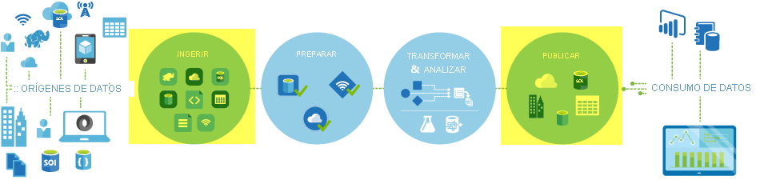
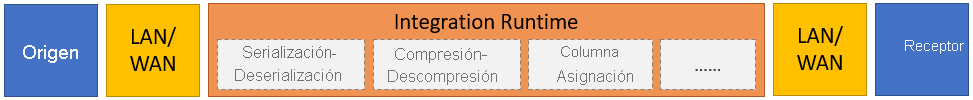
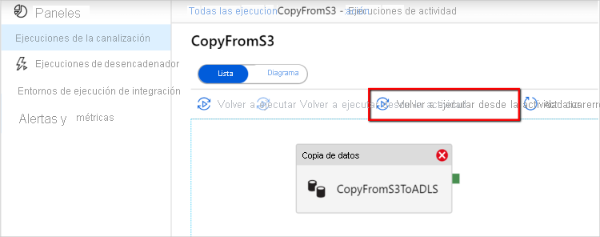

# <a name="copy-activity-in-azure-data-factory"></a>Actividad de copia en Azure Data Factory

> [!div class="op_single_selector" title1="Seleccione la versión de Data Factory que va a usar:"]
> * [Versión 1](v1/data-factory-data-movement-activities.md)
> * [Versión actual](copy-activity-overview.md)

[!INCLUDE[appliesto-adf-asa-md](includes/appliesto-adf-asa-md.md)]

En Azure Data Factory, puede usar la actividad de copia para copiar datos entre almacenes de datos locales y en la nube. Después de copiar los datos, puede usar otras actividades para luego transformarlos y analizarlos. La actividad de copia también puede usarse para publicar los resultados de transformación y análisis de inteligencia empresarial (BI) y el consumo de la aplicación.



La actividad de copia se ejecuta en un [entorno de ejecución de integración](concepts-integration-runtime.md). Puede usar diferentes tipos de entornos de ejecución de integración para diferentes escenarios de copia de datos:

* Al copiar datos entre dos almacenes de datos a los que se puede acceder públicamente mediante Internet desde cualquier dirección IP, puede usar el entorno de ejecución de integración de Azure para la actividad de copia. Este entorno de ejecución de integración es seguro, confiable, escalable y está [globalmente disponible](concepts-integration-runtime.md#integration-runtime-location).
* Cuando vaya a copiar datos con almacenes de datos como origen o destino ubicados en el entorno local o en una red con control de acceso (por ejemplo, una red virtual de Azure), debe configurar un entorno de ejecución de integración autohospedado.

Un entorno de ejecución de integración debe estar asociado con todos los almacenes de datos receptores y de origen. Para información sobre cómo la actividad de copia determina qué entorno de ejecución de integración se va a usar, consulte [Determinar qué entorno de ejecución de integración usar](concepts-integration-runtime.md#determining-which-ir-to-use).

Para copiar datos de un origen a un receptor, el servicio que ejecuta la actividad de copia realiza estos pasos:

1. Lee datos desde un almacén de datos de origen.
2. Realiza procesos de serialización y deserialización, compresión y descompresión, asignación de columnas, etc. Lleva a cabo estas operaciones según la configuración del conjunto de datos de entrada y salida, y la actividad de copia.
3. Escribe datos en el almacén de datos de receptor o destino.



## <a name="supported-data-stores-and-formats"></a>Almacenes de datos y formatos que se admiten

[!INCLUDE [data-factory-v2-supported-data-stores](../../includes/data-factory-v2-supported-data-stores.md)]

### <a name="supported-file-formats"></a>Formatos de archivos admitidos

[!INCLUDE [data-factory-v2-file-formats](../../includes/data-factory-v2-file-formats.md)] 

La actividad de copia se puede usar para copiar archivos tal cual entre dos almacenes de datos basados en archivos, en cuyo caso los datos se copian de manera eficaz sin serialización ni deserialización. Además, también puede analizar o generar archivos con un formato determinado; por ejemplo, puede realizar lo siguiente:

* Copiar datos de una base de datos de SQL Server local y escribirlos en Azure Data Lake Storage Gen2 en formato Parquet.
* Copiar archivos en formato de texto (CSV) desde el sistema de archivos local y escribirlos en Azure Blob Storage en formato Avro
* Copiar archivos comprimidos del sistema de archivos local, descomprimirlos sobre la marcha y escribirlos en Azure Data Lake Storage Gen2.
* Copiar datos en formato de texto comprimido Gzip (CSV) de Azure Blob Storage y escribirlos en Azure SQL Database
* Muchas más actividades que requieren serialización y deserialización o compresión y descompresión.

## <a name="supported-regions"></a>Regiones admitidas

El servicio que permite la actividad de copia está disponible globalmente en las regiones y zonas geográficas enumeradas en [Ubicaciones de Azure Integration Runtime](concepts-integration-runtime.md#integration-runtime-location). La topología disponible globalmente garantiza un movimiento de datos eficiente que, normalmente, evita saltos entre regiones. Consulte [Productos por región](https://azure.microsoft.com/regions/#services) para comprobar la disponibilidad de Data Factory y el movimiento de datos en una región específica.

## <a name="configuration"></a>Configuración

[!INCLUDE [data-factory-v2-connector-get-started](../../includes/data-factory-v2-connector-get-started.md)]

En general, para usar la actividad de copia en Azure Data Factory, debe:

1. **Crear servicios vinculados para el almacén de datos de origen y el almacén de datos receptor**. Puede encontrar la lista de conectores admitidos en la sección [Almacenes de datos y formatos que se admiten](#supported-data-stores-and-formats) de este artículo. Consulte la sección "Propiedades del servicio vinculado" del artículo sobre conectores para información sobre la configuración y las propiedades admitidas. 
2. **Crear conjuntos de datos para el origen y el receptor**. Consulte las secciones "Propiedades del conjunto de datos" de los artículos sobre los conectores de origen y receptor para información sobre la configuración y las propiedades admitidas.
3. **Crear una canalización con la actividad de copia.** Se proporciona un ejemplo en la sección siguiente.

### <a name="syntax"></a>Sintaxis

La plantilla siguiente de una actividad de copia contiene una lista completa de todas las propiedades admitidas. Especifique las que se adapten a su escenario.

```json
"activities":[
    {
        "name": "CopyActivityTemplate",
        "type": "Copy",
        "inputs": [
            {
                "referenceName": "<source dataset name>",
                "type": "DatasetReference"
            }
        ],
        "outputs": [
            {
                "referenceName": "<sink dataset name>",
                "type": "DatasetReference"
            }
        ],
        "typeProperties": {
            "source": {
                "type": "<source type>",
                <properties>
            },
            "sink": {
                "type": "<sink type>"
                <properties>
            },
            "translator":
            {
                "type": "TabularTranslator",
                "columnMappings": "<column mapping>"
            },
            "dataIntegrationUnits": <number>,
            "parallelCopies": <number>,
            "enableStaging": true/false,
            "stagingSettings": {
                <properties>
            },
            "enableSkipIncompatibleRow": true/false,
            "redirectIncompatibleRowSettings": {
                <properties>
            }
        }
    }
]
```

#### <a name="syntax-details"></a>Detalles de la sintaxis

| Propiedad | Descripción | ¿Necesario? |
|:--- |:--- |:--- |
| type | Para una actividad de copia, establezca esta propiedad en `Copy`. | Sí |
| inputs | Especifique el conjunto de datos que creó y que señala a los datos de origen. La actividad de copia admite solo una entrada. | Sí |
| outputs | Especifique el conjunto de datos que creó y que señala a los datos del receptor. La actividad de copia admite solo una salida. | Sí |
| typeProperties | Especifique las propiedades para configurar la actividad de copia. | Sí |
| source | Especifique el tipo de origen de copia y las propiedades correspondientes para la recuperación de datos.<br/>Para más información, consulte la sección "Propiedades de la actividad de copia" del artículo sobre conectores que aparece en [Almacenes de datos y formatos que se admiten](#supported-data-stores-and-formats). | Sí |
| sink | Especifique el tipo de receptor de copia y las propiedades correspondientes para escribir datos.<br/>Para más información, consulte la sección "Propiedades de la actividad de copia" del artículo sobre conectores que aparece en [Almacenes de datos y formatos que se admiten](#supported-data-stores-and-formats). | Sí |
| translator | Especifique asignaciones de columna explícitas de origen a receptor. Esta propiedad se aplica cuando el comportamiento de copia predeterminado no satisface sus necesidades.<br/>Para más información, consulte [Asignación de esquemas en la actividad de copia](copy-activity-schema-and-type-mapping.md). | No |
| dataIntegrationUnits | Especifique una medida que represente la cantidad de potencia que emplea el [entorno de ejecución de integración de Azure](concepts-integration-runtime.md) para la copia de datos. Estas unidades se conocían anteriormente como unidades de movimiento de datos de nube (DMU). <br/>Para más información, consulte [Unidades de integración de datos](copy-activity-performance-features.md#data-integration-units). | No |
| parallelCopies | Especifique el paralelismo que quiere que use la actividad de copia al leer datos del origen y escribirlos en el receptor.<br/>Para obtener más información, consulte [Copia paralela](copy-activity-performance-features.md#parallel-copy). | No |
| preservar | Especifique si desea conservar los metadatos o las ACL durante la copia de datos. <br/>Para obtener más información, vea [Conservación de metadatos](copy-activity-preserve-metadata.md). |No |
| enableStaging<br/>stagingSettings | Especifique si quiere almacenar provisionalmente los datos en una instancia de Blob Storage en lugar de copiarlos directamente del origen al receptor.<br/>Para información sobre escenarios útiles y detalles de configuración, consulte [Copia almacenada provisionalmente](copy-activity-performance-features.md#staged-copy). | No |
| enableSkipIncompatibleRow<br/>redirectIncompatibleRowSettings| Elija cómo controlar las filas incompatibles al copiar datos del origen al receptor.<br/>Para más información, consulte [Tolerancia a errores](copy-activity-fault-tolerance.md). | No |

## <a name="monitoring"></a>Supervisión

Puede supervisar la ejecución de la actividad de copia en Azure Data Factory visualmente o mediante programación. Para obtener más detalles, consulte [Supervisión de la actividad de copia](copy-activity-monitoring.md).

## <a name="incremental-copy"></a>Copia incremental

Data Factory permite la copia incremental de datos diferenciales de un almacén de datos de origen a un almacén de datos receptor. Para más información, consulte [Tutorial: Copia de datos de forma incremental](tutorial-incremental-copy-overview.md).

## <a name="performance-and-tuning"></a>Rendimiento y optimización

La experiencia de [supervisión de la actividad de copia](copy-activity-monitoring.md) muestra las estadísticas de rendimiento de copia de cada una de las ejecuciones de actividad. En el artículo [Guía de escalabilidad y rendimiento de la actividad de copia](copy-activity-performance.md) se describen los factores claves que afectan al rendimiento del movimiento de datos mediante la actividad de copia en Azure Data Factory. También se muestran los valores de rendimiento observados durante las pruebas y se describe cómo optimizar el rendimiento de la actividad de copia.

## <a name="resume-from-last-failed-run"></a>Reanudación desde el último error de ejecución

La actividad de copia admite la reanudación desde el último error de ejecución cuando copia un gran tamaño de archivos tal cual con un formato binario entre almacenes basados en archivos y elige conservar la jerarquía carpeta/archivo del origen al receptor, por ejemplo, para migrar datos de Amazon S3 a Azure Data Lake Storage Gen2. Se aplica a los conectores siguientes basados en archivos: [Amazon S3](connector-amazon-simple-storage-service.md), [Azure Blob](connector-azure-blob-storage.md), [Azure Data Lake Storage Gen1](connector-azure-data-lake-store.md), [Azure Data Lake Storage Gen2](connector-azure-data-lake-storage.md), [Azure File Storage](connector-azure-file-storage.md), [File System](connector-file-system.md), [FTP](connector-ftp.md), [Google Cloud Storage](connector-google-cloud-storage.md), [HDFS](connector-hdfs.md) y [SFTP](connector-sftp.md).

Puede aprovechar la reanudación de la actividad de copia de las dos maneras siguientes:

- **Reintento de nivel de actividad:** Puede establecer el número de reintentos en la actividad de copia. Durante la ejecución de la canalización, si se produce un error en la ejecución de la actividad de copia, el siguiente reintento automático se iniciará desde el punto de error de la última prueba.
- **Volver a ejecutar desde la actividad con errores:** Una vez finalizada la ejecución de la canalización, también puede desencadenar una nueva ejecución desde la actividad con errores en la vista de supervisión de la interfaz de usuario de ADF o mediante programación. Si la actividad con errores es una actividad de copia, la canalización no solo se volverá a ejecutar desde esta actividad, sino que también se reanudará desde el punto de error de la ejecución anterior.

    

Algunos puntos que se deben tener en cuenta:

- La reanudación se produce en el nivel de archivo. Si se produce un error en la actividad de copia al copiar un archivo, este archivo específico se volverá a copiar en la siguiente ejecución.
- Para que la reanudación funcione correctamente, no cambie la configuración de la actividad de copia entre las reactivaciones.
- Al copiar datos desde Amazon S3, Azure Blob, Azure Data Lake Storage Gen2 y Google Cloud Storage, la actividad de copia se puede reanudar a partir de un número arbitrario de archivos copiados. Por su parte, cuando los orígenes son el resto de conectores basados en archivos, la actividad de copia actualmente admite la reanudación desde un número limitado de archivos, normalmente en el intervalo de decenas de miles y varía en función de la longitud de las rutas de acceso de archivo. Los archivos que superen este número se volverán a copiar durante la nueva ejecución.

En el caso de otros escenarios de copia de archivos binarios, la ejecución de la actividad de copia comienza desde el principio.

## <a name="preserve-metadata-along-with-data"></a>Conservación de los metadatos junto con los datos

Al copiar datos desde el origen al receptor, en escenarios como la migración de Data Lake, también puede optar por conservar los metadatos y las ACL junto con los datos mediante la actividad de copia. Consulte [Conservación de metadatos](copy-activity-preserve-metadata.md) para obtener más información.

## <a name="schema-and-data-type-mapping"></a>Asignación de tipo de datos y esquema

Para información sobre cómo la actividad de copia asigna los datos de origen al receptor, consulte [Asignación de tipo de datos y esquema](copy-activity-schema-and-type-mapping.md).

## <a name="add-additional-columns-during-copy"></a>Adición de columnas adicionales durante la copia

Además de copiar datos desde el almacén de datos de origen al receptor, también puede configurar la adición de columnas de datos adicionales para copiar junto con el receptor. Por ejemplo:

- Cuando copie desde un origen basado en archivos, almacene la ruta de acceso relativa del archivo como columna adicional para tener registrado de qué archivo proceden los datos.
- Agregue una columna con la expresión de ADF para asociar variables del sistema ADF, como el nombre de la canalización o el identificador de la canalización, o bien almacene otros valores dinámicos de la salida de la actividad ascendente.
- Agregue una columna con un valor estático para satisfacer sus necesidades de consumo descendente.

Puede encontrar la siguiente configuración en la pestaña origen de la actividad de copia: 


>[!TIP]
>Esta característica funciona con el modelo de conjunto de datos más reciente. Si no ve esta opción desde la interfaz de usuario, intente crear un nuevo conjunto de datos.

Para configurarlo mediante programación, agregue la propiedad `additionalColumns` al origen de la actividad de copia:

| Propiedad | Descripción | Obligatorio |
| --- | --- | --- |
| additionalColumns | Agregue columnas de datos adicionales para copiarlas en el receptor.<br><br>Cada objeto de la matriz `additionalColumns` representa una columna adicional. `name` define el nombre de la columna y `value` indica el valor de los datos de esa columna.<br><br>Los valores permitidos de los datos son:<br>-  **`$$FILEPATH`** : una variable reservada indica almacenar la ruta de acceso relativa de los archivos de origen en la ruta de acceso de la carpeta especificada en el conjunto de datos. Se aplica en un origen basado en archivos.<br>- **Expresión**<br>- **Valor estático** | No |

**Ejemplo**:

```json
"activities":[
    {
        "name": "CopyWithAdditionalColumns",
        "type": "Copy",
        "inputs": [...],
        "outputs": [...],
        "typeProperties": {
            "source": {
                "type": "<source type>",
                "additionalColumns": [
                    {
                        "name": "filePath",
                        "value": "$$FILEPATH"
                    },
                    {
                        "name": "pipelineName",
                        "value": {
                            "value": "@pipeline().Pipeline",
                            "type": "Expression"
                        }
                    },
                    {
                        "name": "staticValue",
                        "value": "sampleValue"
                    }
                ],
                ...
            },
            "sink": {
                "type": "<sink type>"
            }
        }
    }
]
```

## <a name="fault-tolerance"></a>Tolerancia a errores

De forma predeterminada, la actividad de copia detiene la copia de datos y devuelve un error cuando las filas de datos de origen no son compatibles con las filas de datos del receptor. Para que la copia se realice correctamente, puede configurar la actividad de copia para omitir y registrar las filas incompatibles y copiar solo los datos compatibles. Para más información, consulte [Tolerancia a errores de la actividad de copia en Azure Data Factory](copy-activity-fault-tolerance.md).

## <a name="next-steps"></a>Pasos siguientes
Consulte las guías de inicio rápido, los tutoriales y los ejemplos siguientes:

- [Copia de datos de una ubicación a otra en la misma cuenta de Azure Blob Storage](quickstart-create-data-factory-dot-net.md)
- [Copia de datos de Azure Blob Storage a Azure SQL Database](tutorial-copy-data-dot-net.md)
- [Copia de datos de una base de datos de SQL Server local a Azure Blob Storage](tutorial-hybrid-copy-powershell.md)
