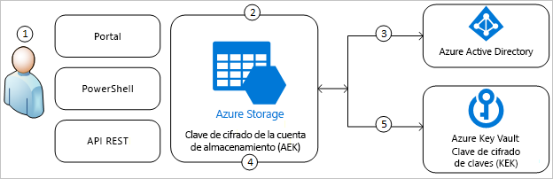
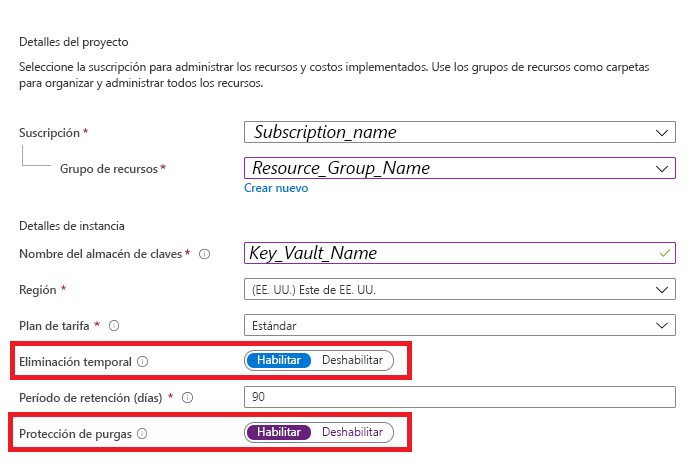
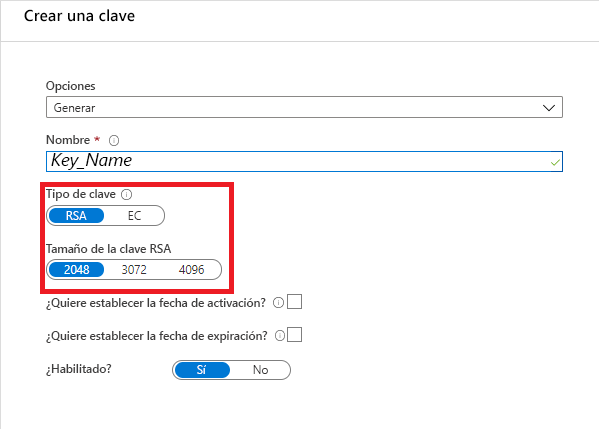
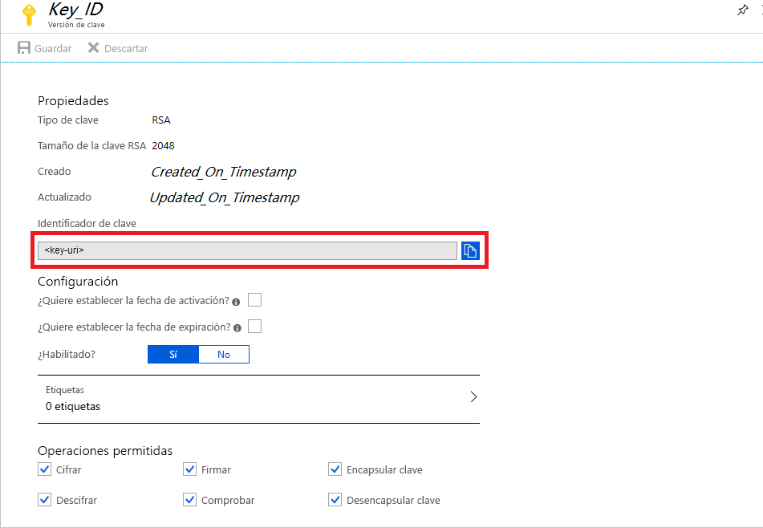
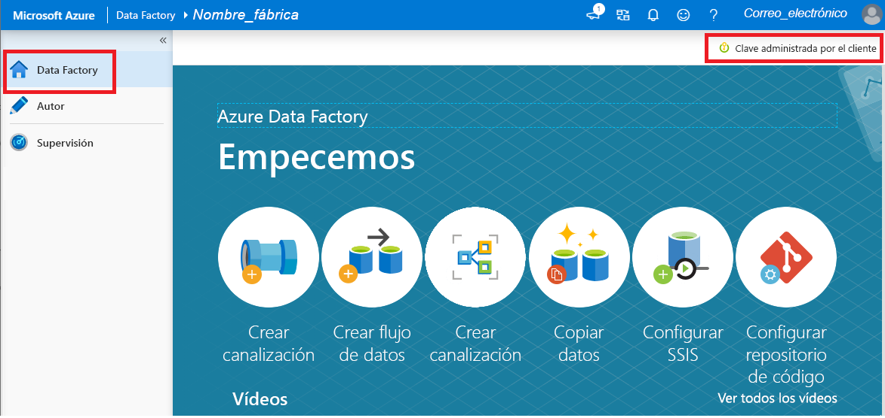

# Cifrado de Azure Data Factory con claves administradas por el cliente

[!INCLUDE[appliesto-adf-xxx-md](includes/appliesto-adf-xxx-md.md)]

Azure Data Factory cifra los datos en reposo, incluidas las definiciones de entidades y los datos almacenados en caché mientras las ejecuciones están en curso. De forma predeterminada, los datos se cifran con una clave administrada por Microsoft que se genera aleatoriamente y que se asigna de forma única a la factoría de datos. Para obtener garantías de seguridad adicionales, ahora puede habilitar Bring Your Own Key (BYOK) con la característica de claves administradas por el cliente de Azure Data Factory. Cuando se especifica una clave administrada por el cliente, Data Factory usa __tanto__ la clave del sistema de la factoría como la CMK para cifrar los datos del cliente. Si falta alguna de ellas, se deniega el acceso a los datos y a la factoría.

Azure Key Vault es necesario para almacenar las claves administradas por el cliente. Puede crear sus propias claves y almacenarlas en un almacén de claves, o puede usar las API de Azure Key Vault para generarlas. Key Vault y Azure Data Factory deben estar en el mismo inquilino de Azure Active Directory (Azure AD) y en la misma región, pero pueden estar en distintas suscripciones. Para obtener más información sobre Azure Key Vault, consulte [¿Qué es Azure Key Vault?](../key-vault/general/overview.md)

> [!NOTE]
> Una clave administrada por el cliente solo se puede configurar en una factoría de datos vacía. La factoría de datos no puede contener recursos, como servicios vinculados, canalizaciones y flujos de datos. Se recomienda habilitar la clave administrada por el cliente justo después de la creación de la factoría.

## Acerca de las claves administradas por el cliente

En el siguiente diagrama se muestra cómo Data Factory usa Azure Active Directory y Azure Key Vault para realizar solicitudes mediante la clave administrada por el cliente:

  

En la lista siguiente se explican los pasos numerados del diagrama:

1. Un administrador de Azure Key Vault concede permisos a las claves de cifrado para la identidad administrada que está asociada a la instancia de Data Factory.
1. Un administrador de Data Factory habilita la característica de claves administradas por el cliente en la factoría.
1. Data Factory usa la identidad administrada que está asociada a la factoría para autenticar el acceso a Azure Key Vault mediante Azure Active Directory.
1. Data Factory encapsula la clave de cifrado de la factoría con la clave de cliente de Azure Key Vault.
1. En operaciones de lectura y escritura, Data Factory envía solicitudes a Azure Key Vault para desencapsular la clave de cifrado de la cuenta con el fin de realizar operaciones de cifrado y descifrado.

## Requisitos previos: configuración de Azure Key Vault y generación de las claves

### Habilitación de Eliminación temporal y No purgar en Azure Key Vault

Para usar las claves administradas por el cliente con Data Factory, es necesario establecer dos propiedades en Key Vault: __Eliminación temporal__ y __No purgar__. Estas propiedades se pueden habilitar mediante PowerShell o la CLI de Azure en un almacén de claves nuevo o existente. Para aprender a habilitar estas propiedades en un almacén de claves existente, consulte las secciones _Habilitación de la eliminación temporal_ y _Habilitación de la protección de purgas_ en cualquiera de los siguientes artículos:

- [Uso de la eliminación temporal con PowerShell](../key-vault/general/soft-delete-powershell.md)
- [Uso de la eliminación temporal con la CLI](../key-vault/general/soft-delete-cli.md).

Si va a crear una instancia de Azure Key Vault a través de Azure Portal, las propiedades __Eliminación temporal__ y __No purgan__ se pueden habilitar de la siguiente manera:

  

### Concesión a Data Factory de acceso a Azure Key Vault

Asegúrese de que Azure Key Vault y Azure Data Factory se encuentran en el mismo inquilino de Azure Active Directory (Azure AD) y en la _misma región_. Desde el control de acceso de Azure Key Vault, conceda a Managed Service Identity (MSI) de la factoría de datos los permisos siguientes: _Obtener_, _Desencapsular clave_ y _Encapsular clave_. Estos permisos son necesarios para habilitar las claves administradas por el cliente en Data Factory.

  

### Generación o carga de la clave administrada por el cliente en Azure Key Vault

Puede crear sus propias claves y almacenarlas en un almacén de claves, o puede usar las API de Azure Key Vault para generarlas. Solo se admiten las claves RSA de 2048 bits con cifrado de Data Factory. Para más información, consulte el artículo [About keys, secrets, and certificates](../key-vault/general/about-keys-secrets-certificates.md) (Claves, secretos y certificados).

  

## Habilitar claves administradas del cliente

1. Asegúrese de que la instancia de Data Factory esté vacía. La factoría de datos no puede contener recursos, como servicios vinculados, canalizaciones y flujos de datos. Por ahora, la implementación de una clave administrada por el cliente en una factoría que no esté vacía producirá un error.

1. Para buscar el URI de la clave en Azure Portal, vaya a Azure Key Vault y seleccione la opción de configuración Claves. Seleccione la clave que quiera y luego haga clic en ella para ver sus versiones. Seleccione una de ellas para ver su configuración.

1. Copie el valor del campo Identificador de clave, que proporciona el URI.

    

1. Inicie el portal de Azure Data Factory y, mediante la barra de navegación de la izquierda, salte al Portal de administración de Data Factory.

1. Haga clic en el icono de __clave administrada por el cliente__.

    

1. Escriba el URI de la clave administrada por el cliente que copió anteriormente.

1. Haga clic en __Guardar__; el cifrado de claves administradas por el cliente se habilita para Data Factory.

## Actualización de la versión de la clave

Al crear una versión de una clave, actualice la factoría de datos para que use esta nueva versión. Siga los mismos pasos que se describen en la sección _Habilitar claves administradas del cliente_, como por ejemplo:

1. Busque el URI de la nueva versión de la clave en el portal de Azure Key Vault.

1. Vaya a la opción __Clave administrada por el cliente__.

1. Reemplace y pegue el URI de la nueva clave.

1. Haga clic en __Guardar__; Data Factory ahora se cifrará con la nueva versión de la clave.

## Uso de una clave distinta

Para cambiar la clave usada para el cifrado de Data Factory, debe actualizar manualmente la configuración en Data Factory. Siga los mismos pasos que se describen en la sección _Habilitar claves administradas del cliente_, como por ejemplo:

1. Busque el URI de la nueva clave en el portal de Azure Key Vault.

1. Vaya a la opción __Clave administrada por el cliente__.

1. Reemplace y pegue el URI de la nueva clave.

1. Haga clic en __Guardar__; Data Factory ahora se cifrará con la nueva clave.

## Deshabilitación de las claves administradas por el cliente

De manera intencionada, una vez habilitada la característica de claves administradas por el cliente, no se puede quitar el paso de seguridad adicional. Para cifrar la factoría y los datos, siempre se esperará una clave proporcionada por el cliente.

## Pasos siguientes

Consulte los [tutoriales](tutorial-copy-data-dot-net.md) para obtener información acerca del uso de Data Factory en otros escenarios.
