# Inicio rápido: Creación de una factoría de datos con la interfaz de usuario de Azure Data Factory

> [!div class="op_single_selector" title1="Seleccione la versión del servicio Data Factory que usa:"]
> * [Versión 1](v1/data-factory-copy-data-from-azure-blob-storage-to-sql-database.md)
> * [Versión actual](quickstart-create-data-factory-portal.md)

[!INCLUDE[appliesto-adf-xxx-md](includes/appliesto-adf-xxx-md.md)]

En esta guía de inicio rápido se describe cómo usar la interfaz de usuario de Azure Data Factory para crear y supervisar una factoría de datos. La canalización que ha creado en esta factoría de datos *copia* los datos de una carpeta a otra en Azure Blob Storage. Para *transformar* los datos con Azure Data Factory, consulte [Asignación de flujos de datos](concepts-data-flow-overview.md) y [Flujo de datos de limpieza y transformación (versión preliminar)](wrangling-data-flow-overview.md).

> [!NOTE]
> Si no está familiarizado con Azure Data Factory, consulte [Introduction to Azure Data Factory](introduction.md) antes de seguir los pasos de esta guía de inicio rápido. 

[!INCLUDE [data-factory-quickstart-prerequisites](../../includes/data-factory-quickstart-prerequisites.md)] 

### Vídeo 
Ver este vídeo le ayudará a conocer la interfaz de usuario de Data Factory: 
>[!VIDEO https://channel9.msdn.com/Shows/Azure-Friday/Visually-build-pipelines-for-Azure-Data-Factory-v2/Player]

## Crear una factoría de datos

1. Inicie el explorador web **Microsoft Edge** o **Google Chrome**. Actualmente, la interfaz de usuario de Data Factory solo se admite en los exploradores web Microsoft Edge y Google Chrome.
1. Vaya a [Azure Portal](https://portal.azure.com). 
1. En el menú de Azure Portal, seleccione **Crear un recurso**.
   
   
1. Seleccione **Analytics** y, a continuación, seleccione **Data Factory**. 
   
   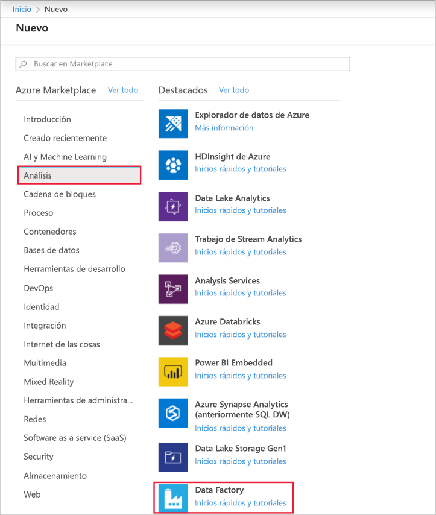
1. En la página **Nueva factoría de datos**, escriba **ADFTutorialDataFactory** en **Nombre**. 
 
   El nombre de la instancia de Azure Data Factory debe ser *único de forma global*. Si ve el siguiente error, cambie el nombre de la factoría de datos (por ejemplo, **&lt;suNombre&gt;ADFTutorialDataFactory**) e intente crearlo de nuevo. Para conocer las reglas de nomenclatura de los artefactos de Data Factory, consulte el artículo [Azure Data Factory: reglas de nomenclatura](naming-rules.md).
  
   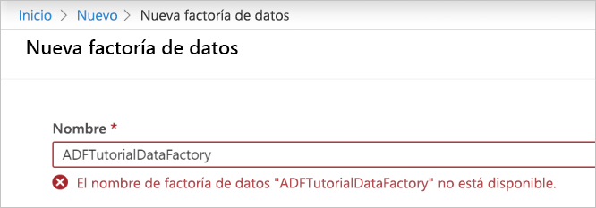
1. En **Suscripción**, seleccione la suscripción de Azure donde desea crear la factoría de datos. 
1. Para **Grupo de recursos**, realice uno de los siguientes pasos:
     
   - Seleccione en primer lugar **Usar existente** y después un grupo de recursos de la lista. 
   - Seleccione **Crear nuevo**y escriba el nombre de un grupo de recursos.   
         
   Para obtener más información sobre los grupos de recursos, consulte [Uso de grupos de recursos para administrar los recursos de Azure](../azure-resource-manager/management/overview.md).  
1. En **Versión**, seleccione **V2**.
1. En **Ubicación**, seleccione la ubicación de la factoría de datos.

   En la lista solo se muestran las ubicaciones que admite Data Factory y dónde se almacenarán los metadatos de Azure Data Factory. Los almacenes de datos asociados (como Azure Storage y Azure SQL Database) y los procesos (como Azure HDInsight) que usa Data Factory se pueden ejecutar en otras regiones.

1. Seleccione **Crear**. Una vez que finalice la creación, seleccione **Ir al recurso** para ir a la página de **Data Factory**. 

1. Seleccione el icono **Author & Monitor** (Creación y supervisión) para iniciar la aplicación de interfaz de usuario de Azure Data Factory en una pestaña independiente.
   
   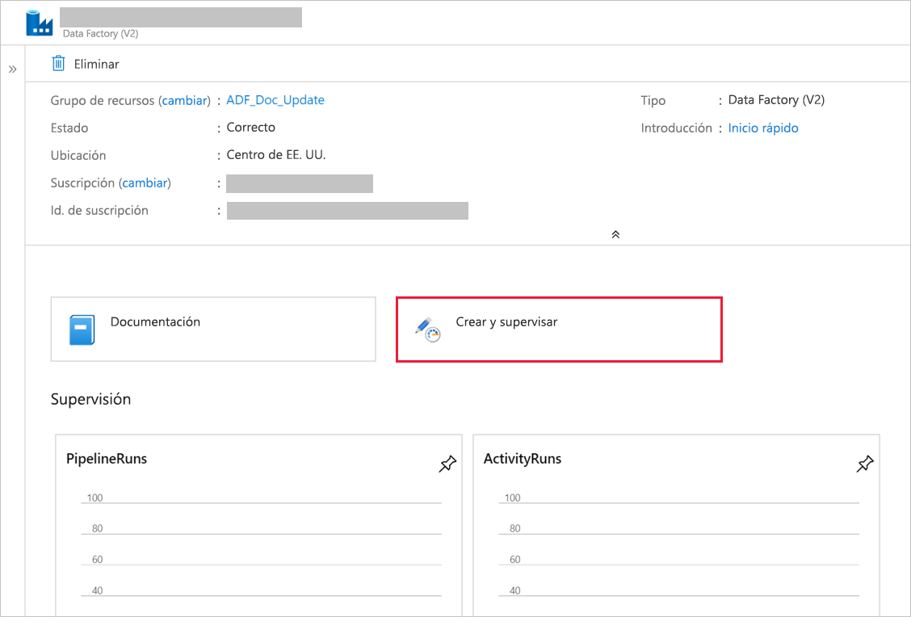
   
   > [!NOTE]
   > Si ve que el explorador web se bloquea en "Autorizando", desactive la casilla **Bloquear los datos de sitios y las cookies de terceros**. También puede mantenerla seleccionada, crear una excepción para **login.microsoftonline.com** y, a continuación, intentar abrir la aplicación de nuevo.
   
1. En la página de **introducción**, cambie a la pestaña **Creador** del panel izquierdo. 

    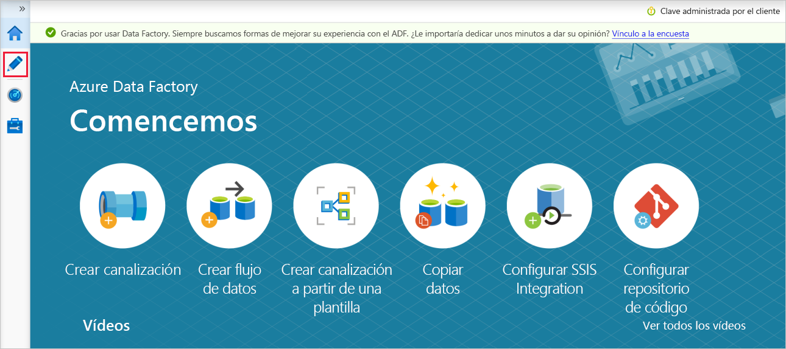

## Creación de un servicio vinculado
En este procedimiento, creará un servicio vinculado para vincular la cuenta de Azure Storage con la factoría de datos. El servicio vinculado tiene la información de conexión que usa el servicio Data Factory en el entorno de tiempo de ejecución para conectarse a él.

1. Seleccione **Conexiones** y después el botón **Nuevo** en la barra de herramientas (el botón **Conexiones** se encuentra en la parte inferior de la columna izquierda debajo de **Factory Resources**). 

1. En la página **New Linked Service** (Nuevo servicio vinculado), seleccione **Azure Blob Storage** y después **Continue** (Continuar). 

1. En la página Nuevo servicio vinculado (Azure Blob Storage), realice los siguientes pasos: 

   a. En **Name** (Nombre), escriba **AzureStorageLinkedService**.

   b. En **Nombre de la cuenta de almacenamiento**, seleccione el nombre de la cuenta de Azure Storage.

   c. Seleccione **Test connection** (Probar conexión) para confirmar que el servicio Data Factory puede conectarse a la cuenta de almacenamiento. 

   d. Seleccione **Crear** para guardar el servicio vinculado. 

      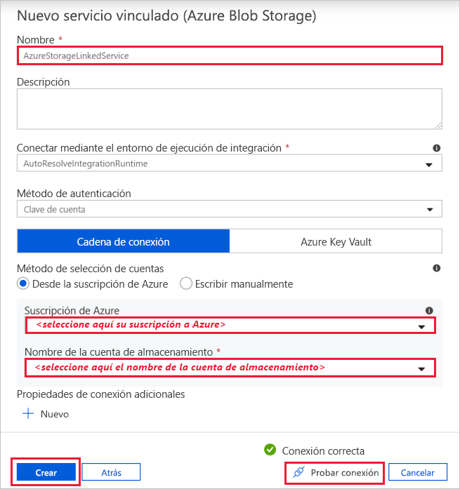

## Creación de conjuntos de datos
En este procedimiento, creará dos conjuntos de datos: **InputDataset** y **OutputDataset**. Estos conjuntos de datos son de tipo **AzureBlob**. Hacen referencia al servicio vinculado de Azure Storage que creó en la sección anterior. 

El conjunto de datos de entrada representa los datos de origen en la carpeta de entrada. En la definición del conjunto de datos de entrada, se especifica el contenedor de blobs (**adftutorial**), la carpeta (**input**) y el archivo (**emp.txt**) que contiene los datos de origen. 

El conjunto de datos de salida representa los datos que se copian en el destino. En la definición del conjunto de datos de salida, se especifica el contenedor de blobs (**adftutorial**), la carpeta (**output**) y el archivo en el que se copian los datos. Cada ejecución de una canalización tiene un identificador único asociado a ella. Puede tener acceso a este identificador mediante el uso de la variable del sistema **RunId**. El nombre del archivo de salida se evalúa dinámicamente según el identificador de ejecución de la canalización.   

En la configuración del servicio vinculado se especifica la cuenta de Azure Storage que contiene los datos de origen. En la configuración del conjunto de datos de origen se especifica dónde residen exactamente los datos de origen (contenedor de blobs, carpeta y archivo). En la configuración del conjunto de datos receptor se especifica dónde se copian los datos (contenedor de blobs, carpeta y archivo). 
 
1. Haga clic en el botón **+** (Más) y seleccione **Dataset** (Conjunto de datos).

   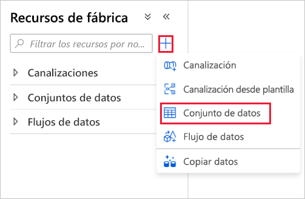
1. En la página **Nuevo conjunto de datos**, seleccione **Azure Blob Storage** y después **Continuar**. 

1. En la página **Seleccionar formato**, elija el tipo de formato de los datos y, después, seleccione **Continuar**. En este caso, seleccione **Binario** al copiar archivos tal cual sin analizar el contenido.

   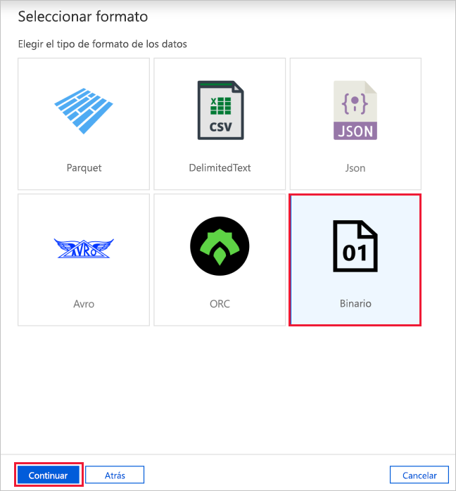
   
1. En la página **Establecer propiedades**, siga estos pasos:

    a. En **Nombre**, escriba **InputDataset**. 

    b. En **Linked service** (Servicio vinculado), seleccione **AzureStorageLinkedService**.

    c. En **File path** (Ruta del archivo), seleccione el botón **Browse** (Examinar).

    d. En la ventana **Elegir un archivo o carpeta**, vaya a la carpeta **input** del contenedor **adftutorial**, seleccione el archivo **emp.txt** y seleccione **Aceptar**.
    
    e. Seleccione **Aceptar**.   

    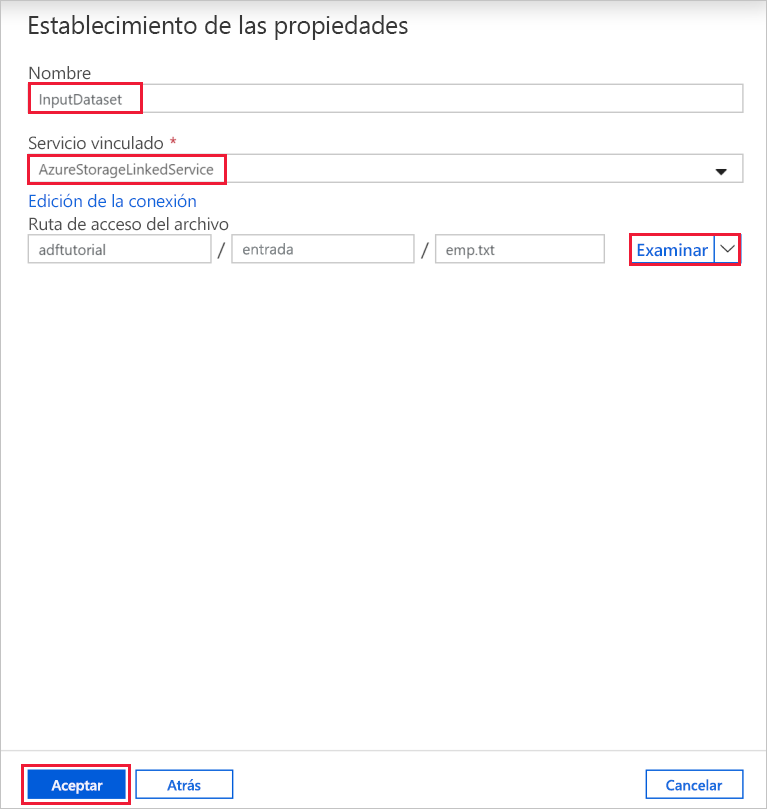
1. Repita los pasos para crear el conjunto de datos de salida:  

    a. Haga clic en el botón **+** (Más) y seleccione **Dataset** (Conjunto de datos).

    b. En la página **Nuevo conjunto de datos**, seleccione **Azure Blob Storage** y después **Continuar**.

    c. En la página **Seleccionar formato**, elija el tipo de formato de los datos y, después, seleccione **Continuar**.

    d. En la página **Establecer propiedades**, especifique **OutputDataset** para el nombre. Seleccione **AzureStorageLinkedService** como servicio vinculado.

    e. En **Ruta de acceso del archivo**, escriba **adftutorial/output**. Si la carpeta **output** no existe, la actividad de copia la crea en tiempo de ejecución.

    f. Seleccione **Aceptar**.   

    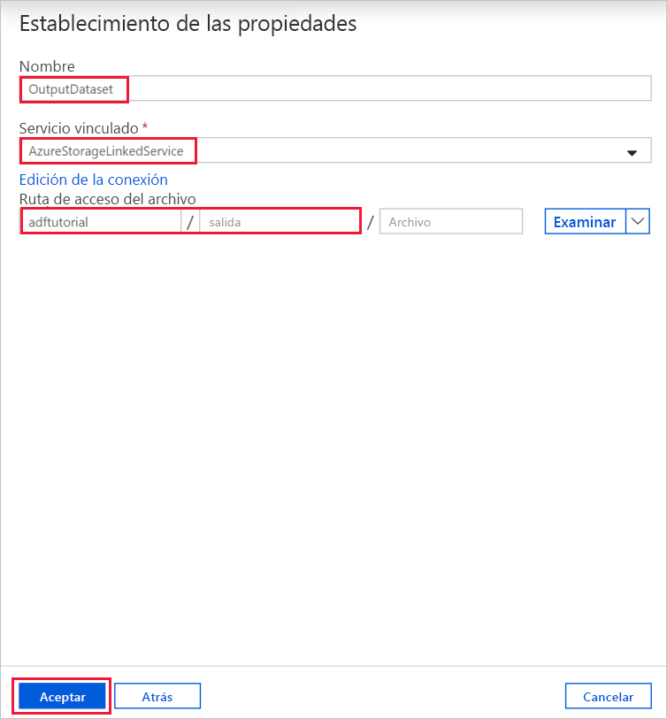

## Crear una canalización 
En este procedimiento, va a crear y comprobar una canalización con una actividad de copia que utiliza los conjuntos de datos de entrada y de salida. La actividad de copia realiza una copia de los datos desde el archivo especificado en la configuración del conjunto de datos de entrada hasta el archivo especificado en la configuración del conjunto de datos de salida. Si el conjunto de datos de entrada especifica solo una carpeta (no el nombre de archivo), la actividad de copia realiza una copia de todos los archivos de la carpeta de origen al destino. 

1. Haga clic en el botón **+** (Más) y seleccione **Pipeline** (Canalización). 

1. En el panel General, en **Propiedades**, especifique **CopyPipeline** en **Nombre**. A continuación, contraiga el panel; para ello, haga clic en el icono Propiedades en la esquina superior derecha.

1. En el cuadro de herramientas **Activities** (Actividades), expanda **Move & Transform** (Mover y transformar). Arrastre la actividad **Copiar datos** del cuadro de herramientas **Actividades** a la superficie del diseñador de canalizaciones. También puede buscar actividades en el cuadro de herramientas **Activities** (Actividades). Especifique **CopyFromBlobToBlob** en **Name** (Nombre).
   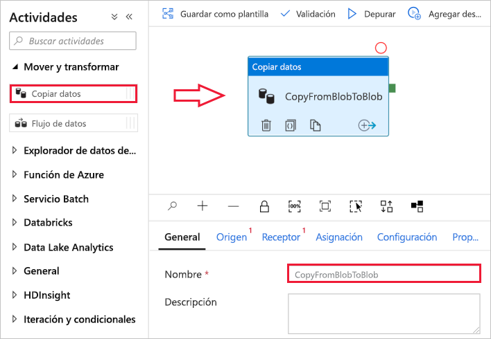

1. Cambie a la pestaña **Source** (Origen) en la configuración de la actividad de copia y seleccione **InputDataset** para **Source Dataset** (Conjunto de datos de origen).

1. Cambie a la pestaña **Sink** (Receptor) en la configuración de la actividad de copia y seleccione **OutputDataset** para **Sink Dataset** (Conjunto de datos receptor).

1. Haga clic en **Validar** en la barra de herramientas de la canalización situada en la parte superior del lienzo para validar la configuración de la canalización. Confirme que la canalización se ha validado correctamente. Para cerrar la salida de la validación, haga clic en el botón **>>** (fecha derecha). 
   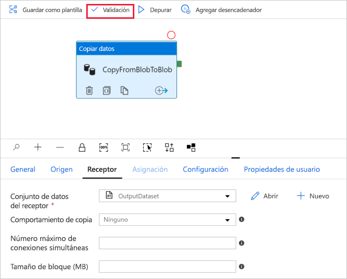

## Depuración de la canalización
En este paso va a depurar la canalización antes de implementarla en Data Factory. 

1. En la barra de herramientas de la canalización situada en la parte superior del lienzo, haga clic en **Depurar** para desencadenar una serie de pruebas. 
    
1. Confirme que ve el estado de ejecución de la canalización en la pestaña **Output** (Salida) de la configuración de la canalización situada en la parte inferior. 
 
    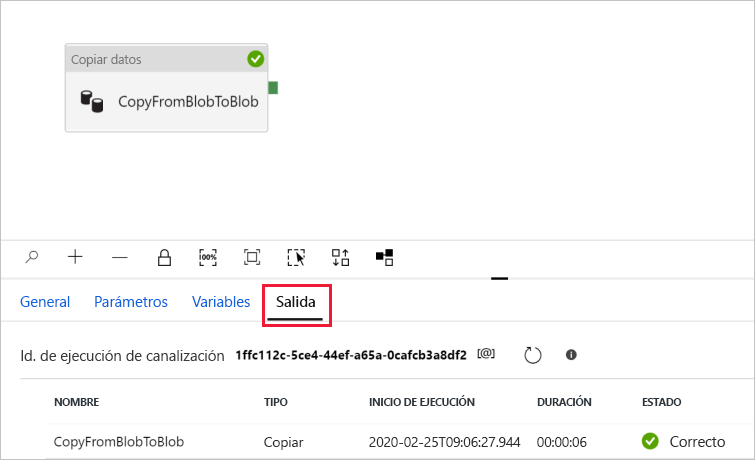

1. Confirme que ve un archivo de salida en la carpeta **output** del contenedor **adftutorial**. Si no existe la carpeta de salida, el servicio Data Factory la crea automáticamente. 

## Desencadenamiento manual de la canalización
En este procedimiento se implementan las entidades (servicios vinculados, conjuntos de datos, canalizaciones) en Azure Data Factory. A continuación, desencadenará manualmente una ejecución de la canalización. 

1. Antes de desencadenar una canalización, debe publicar las entidades en Data Factory. Seleccione **Publicar todo** en la parte superior para realizar la publicación. 
    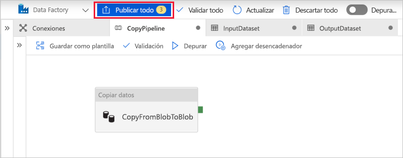

1. Para desencadenar la canalización de forma manual, seleccione **Agregar desencadenador** en la barra de herramientas de la canalización y seleccione **Trigger Now** (Desencadenar ahora). En la página **Ejecución de la canalización**, seleccione **Finalizar**.

## Supervisar la canalización

1. Cambie a la pestaña **Monitor** (Supervisar) de la izquierda. Use el botón **Refresh** (Actualizar) para actualizar la lista.

   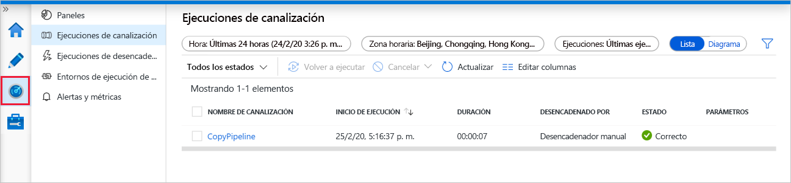
1. Seleccione el vínculo **CopyPipeline**; verá el estado de la ejecución de la actividad de copia en esta página. 

1. Para más información sobre la operación de copia, seleccione el vínculo **Detalles** (imagen de gafas). Para más información sobre las propiedades, consulte [Introducción a la actividad de copia](copy-activity-overview.md). 

   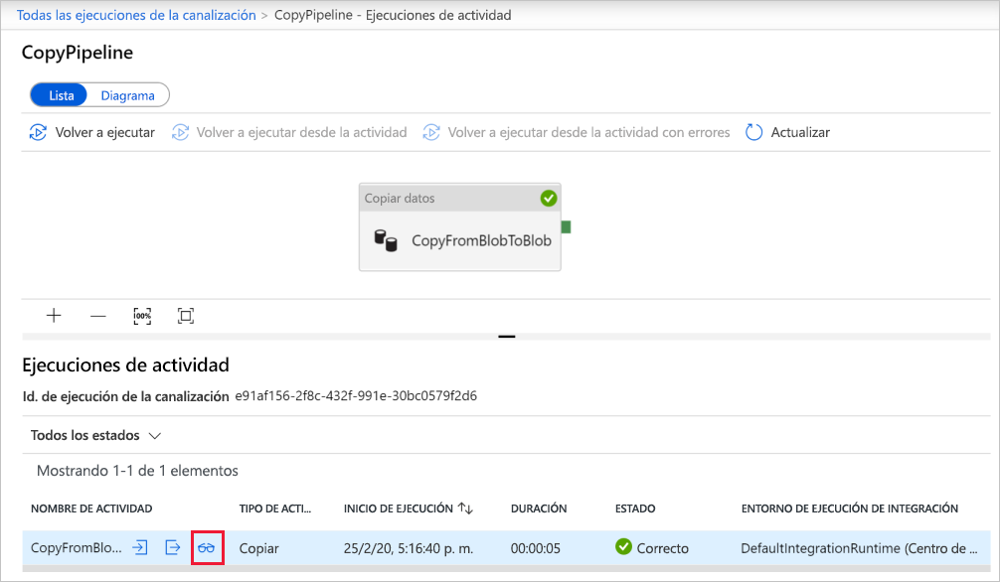
1. Confirme que ve un archivo nuevo en la carpeta **output** (salida). 
1. Puede volver a la vista **Ejecuciones de la canalización** desde la vista **Ejecuciones de actividad**. Para ello, seleccione el vínculo **Todas las ejecuciones de la canalización**. 

## Desencadenamiento de la canalización de forma programada
Este procedimiento es opcional en este tutorial. Puede crear un *programador de desencadenador* para programar la ejecución de la canalización periódicamente (cada hora, a diario, y así sucesivamente). En este procedimiento, va a crear un desencadenador que se ejecutará cada minuto hasta la fecha y hora de finalización que se especifique. 

1. Cambie a la pestaña **Creador**. 

1. Vaya a la canalización, seleccione **Agregar desencadenador** en la barra de herramientas de la canalización y, después, seleccione **Nuevo/Editar**. 

1. En la página **Add Triggers** (Agregar desencadenadores), seleccione **Choose trigger** (Elegir desencadenador) y, después, seleccione **New** (Nuevo). 

1. En la página **Nuevo desencadenador**, en **Final**, seleccione **El día**, especifique la hora de finalización unos minutos después de la hora actual y, luego, seleccione **Aceptar**. 

   Hay un costo asociado a cada ejecución de la canalización. Por lo tanto, especifique la hora de finalización tan solo unos minutos después de la hora de inicio. Asegúrese de que sea el mismo día. No obstante, asegúrese de que hay tiempo suficiente para que la canalización se ejecute entre la hora de publicación y la hora de finalización. El desencadenador entra en vigor después de publicar la solución en Data Factory, no cuando se guarda el desencadenador en la interfaz de usuario. 

1. En la página **Nuevo desencadenador**, active la casilla **Activado** y, luego, seleccione **Aceptar**. 

   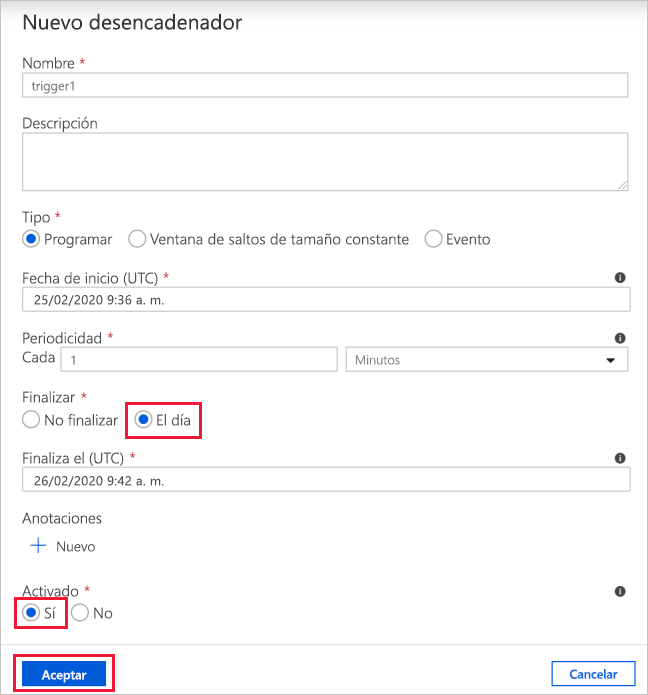
1. Revise el mensaje de advertencia y, luego, seleccione **Aceptar**.

1. Seleccione **Publicar todo** para publicar los cambios en Data Factory. 

1. Cambie a la pestaña **Monitor** (Supervisar) de la izquierda. Seleccione **Refresh** (Actualizar) para actualizar la lista. Verá que la canalización se ejecuta una vez cada minuto desde la hora de publicación hasta la hora de finalización. 

   Observe los valores de la columna **DESENCADENADO POR**. La ejecución manual del desencadenador se realizó en el paso (**Trigger Now**) [Desencadenar ahora] que llevó a cabo antes. 

1. Cambie a la vista **Trigger Runs** (Ejecuciones de desencadenador). 

1. Confirme que se crea un archivo de salida para cada ejecución de la canalización hasta la fecha y hora de finalización especificadas en la carpeta **output** (salida). 

## Pasos siguientes
La canalización de este ejemplo copia los datos de una ubicación a otra en una instancia de Azure Blob Storage. Para más información sobre el uso de Data Factory en otros escenarios, consulte los siguientes [tutoriales](tutorial-copy-data-portal.md). 
