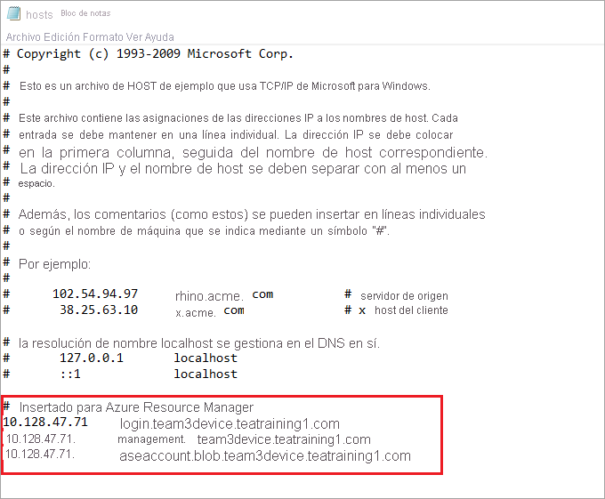

# <a name="deploy-vms-on-your-azure-stack-edge-pro-gpu-device-using-azure-cli-and-python"></a>Implementación de máquinas virtuales en un dispositivo Azure Stack Edge Pro con GPU con la CLI de Azure y Python

<!--[!INCLUDE [applies-to-skus](../../includes/azure-stack-edge-applies-to-all-sku.md)]-->

[!INCLUDE [azure-stack-edge-gateway-deploy-virtual-machine-overview](../../includes/azure-stack-edge-gateway-deploy-virtual-machine-overview.md)]

En este tutorial se describe cómo crear y administrar una máquina virtual en el dispositivo Azure Stack Edge Pro con la interfaz de la línea de comandos (CLI) de Azure y Python.

## <a name="vm-deployment-workflow"></a>Flujo de trabajo de implementación de una máquina virtual

El flujo de trabajo de implementación se muestra en el diagrama siguiente.


El resumen general del flujo de trabajo de implementación es el siguiente:

1. Conexión a Azure Resource Manager
2. Crear un grupo de recursos
3. Crear una cuenta de almacenamiento
4. Adición del identificador URI del blob al archivo de hosts
5. Instalación de certificados
6. Carga de un disco duro virtual
7. Creación de discos administrados a partir del VHD
8. Creación de una imagen de máquina virtual a partir de la imagen del disco administrado
9. Creación de la máquina virtual con recursos creados anteriormente
10. Creación de una red virtual
11. Creación de una NIC virtual con el identificador de subred de la red virtual

Para obtener una explicación detallada del diagrama del flujo de trabajo, vea [Implementación de máquinas virtuales en el dispositivo Azure Stack Edge Pro mediante Azure PowerShell](azure-stack-edge-j-series-deploy-virtual-machine-powershell.md). Para obtener información sobre cómo conectarse a Azure Resource Manager, consulte [Conexión a Azure Resource Manager con Azure PowerShell](azure-stack-edge-j-series-connect-resource-manager.md).

## <a name="prerequisites"></a>Requisitos previos

Antes de empezar a crear y administrar una máquina virtual en el dispositivo Azure Stack Edge Pro con la CLI de Azure y Python, debe asegurarse de que ha completado los requisitos previos que se indican en los pasos siguientes:

1. Ha completado la configuración de red en el dispositivo Azure Stack Edge Pro como se describe en [Paso 1: configuración de un dispositivo Azure Stack Edge Pro](azure-stack-edge-j-series-connect-resource-manager.md#step-1-configure-azure-stack-edge-pro-device).

2. Ha habilitado una interfaz de red para proceso. Esta dirección IP de la interfaz de red se utiliza para crear un conmutador virtual para la implementación de la máquina virtual. Los pasos siguientes le guiarán en el proceso:

    1. Vaya a **Proceso**. Seleccione la interfaz de red que va a usar para crear un conmutador virtual.

        > [!IMPORTANT] 
        > Solo puede configurar un puerto para Proceso.

    2. Habilite Proceso en la interfaz de red. Azure Stack Edge Pro crea y administra el conmutador virtual correspondiente a esa interfaz de red.

    <!--If you decide to use another network interface for compute, make sure that you:

    - Delete all the VMs that you have deployed using Azure Resource Manager.

    - Delete all virtual network interfaces and the virtual network associated with this network interface.

    - You can now enable another network interface for compute.-->

3. Ha creado e instalado todos los certificados en el dispositivo Azure Stack Edge Pro y en el almacén de confianza del cliente. Siga el procedimiento descrito en [Paso 2: Creación e instalación de certificados](azure-stack-edge-j-series-connect-resource-manager.md#step-2-create-and-install-certificates).

4. Ha creado un certificado *.cer* codificado en Base 64 para el dispositivo Azure Stack Edge Pro. Esto ya se ha cargado como una cadena de firma en el dispositivo y se ha instalado en el almacén raíz de confianza del cliente. Este certificado también se necesita con el formato *pem* para que Python funcione en este cliente.

    Convierta este certificado al formato pem con el comando `certutil`. Debe ejecutar este comando en el directorio que contiene el certificado.

    ```powershell
    certutil.exe <SourceCertificateName.cer> <DestinationCertificateName.pem>
    ```
    A continuación se muestra un ejemplo del uso del comando:

    ```powershell
    PS C:\Certificates> certutil.exe -encode aze-root.cer aze-root.pem
    Input Length = 2150
    Output Length = 3014
    CertUtil: -encode command completed successfully.
    PS C:\Certificates>
    ```    
    También agregará este archivo pem al almacén de Python más adelante.

5. Ha asignado la dirección IP del dispositivo en la página **Red** de la interfaz de usuario web local del dispositivo. Debe agregar esta dirección IP a:

    - El archivo de host del cliente o
    - La configuración del servidor DNS.
    
    > [!IMPORTANT]
    > Se recomienda modificar la configuración del servidor DNS para la resolución de nombres del punto de conexión.

    1. Inicie **Bloc de notas** como administrador (se requieren privilegios de administrador para guardar el archivo) y, a continuación, abra el archivo **hosts** ubicado en `C:\Windows\System32\Drivers\etc`.
    
        
    
    2. Agregue las entradas siguientes al archivo **hosts** reemplazando los valores por los adecuados para el dispositivo:
    
        ```
        <Device IP> login.<appliance name>.<DNS domain>
        <Device IP> management.<appliance name>.<DNS domain>
        <Device IP> <storage name>.blob.<appliance name>.<DNS domain>
        ```
    3. Use la siguiente imagen como referencia. Guarde el archivo **hosts**.

        

6. [Descargue el script de Python](https://aka.ms/ase-vm-python) que se usa en este procedimiento.

## <a name="step-1-set-up-azure-clipython-on-the-client"></a>Paso 1: Configuración de la CLI de Azure y Python en el cliente

### <a name="verify-profile-and-install-azure-cli"></a>Comprobación del perfil e instalación de la CLI de Azure

<!--1. Verify the API profile of the client and identify which version of the modules and libraries to include on your client. In this example, the client system will be running Azure Stack 1904 or later. For more information, see [Azure Resource Manager API profiles](https://docs.microsoft.com/azure-stack/user/azure-stack-version-profiles?view=azs-1908#azure-resource-manager-api-profiles).-->

1. Instale la CLI de Azure en el cliente. En este ejemplo, se ha instalado la CLI de Azure versión 2.0.80. Para comprobar la versión de la CLI de Azure, ejecute el comando `az --version`.

    La siguiente es una salida de ejemplo del comando anterior:

    ```powershell
    PS C:\windows\system32> az --version
    azure-cli                         2.0.80
    
    command-modules-nspkg              2.0.3
    core                              2.0.80
    nspkg                              3.0.4
    telemetry                          1.0.4
    Extensions:
    azure-cli-iot-ext                  0.7.1
    
    Python location 'C:\Program Files (x86)\Microsoft SDKs\Azure\CLI2\python.exe'
    Extensions directory 'C:\.azure\cliextensions'
    
    Python (Windows) 3.6.6 (v3.6.6:4cf1f54eb7, Jun 27 2018, 02:47:15) [MSC v.1900 32 bit (Intel)]
    
    Legal docs and information: aka.ms/AzureCliLegal
    
    Your CLI is up-to-date.
    
    Please let us know how we are doing: https://aka.ms/clihats
    PS C:\windows\system32>
    ```

    Si no tiene la CLI de Azure, descárguela y siga los pasos descritos en [Instalación de la CLI de Azure en Windows](https://docs.microsoft.com/cli/azure/install-azure-cli-windows?view=azure-cli-latest). Puede ejecutar la CLI de Azure mediante el símbolo del sistema de Windows o mediante Windows PowerShell.

2. Tome nota de la ubicación de Python de la CLI. La necesitará para determinar la ubicación del almacén de certificados raíz de confianza para la CLI de Azure.

3. Para ejecutar el script de ejemplo que se usa en este artículo, necesitará las siguientes versiones de la biblioteca de Python:

    ```powershell
    azure-common==1.1.23
    azure-mgmt-resource==2.1.0
    azure-mgmt-network==2.7.0
    azure-mgmt-compute==5.0.0
    azure-mgmt-storage==1.5.0
    azure-storage-blob==1.2.0rc1
    haikunator
    msrestazure==0.6.2
    ```
    Para instalar las versiones, ejecute el siguiente comando:

    ```powershell
    .\python.exe -m pip install haikunator
    ```

    La siguiente salida de ejemplo muestra la instalación de Haikunator:

    ```powershell
    PS C:\Program Files (x86)\Microsoft SDKs\Azure\CLI2> .\python.exe -m pip install haikunator

    Collecting haikunator
      Downloading https://files.pythonhosted.org/packages/43/fa/130968f1a1bb1461c287b9ff35c630460801783243acda2cbf3a4c5964a5/haikunator-2.1.0-py2.py3-none-any.whl
    
    Installing collected packages: haikunator
    Successfully installed haikunator-2.1.0
    You are using pip version 10.0.1, however version 20.0.1 is available.
    You should consider upgrading using the 'python -m pip install --upgrade pip' command.
    
    PS C:\Program Files (x86)\Microsoft SDKs\Azure\CLI2> 
    ```

    La siguiente salida de ejemplo muestra la instalación de pip de `msrestazure`: 
    
    ```powershell
    PS C:\Program Files (x86)\Microsoft SDKs\Azure\CLI2> .\python.exe -m pip install msrestazure==0.6.2
    Requirement already satisfied: msrestazure==0.6.2 in c:\program files (x86)\microsoft sdks\azure\cli2\lib\site-packages (0.6.2)
    Requirement already satisfied: msrest<2.0.0,>=0.6.0 in c:\program files (x86)\microsoft sdks\azure\cli2\lib\site-packages (from msrestazure==0.6.2) (0.6.10)
    === CUT ===========================  CUT ==================================
    Requirement already satisfied: cffi!=1.11.3,>=1.8 in c:\program files (x86)\microsoft sdks\azure\cli2\lib\site-packages (from cryptography>=1.1.0->adal<2.0.0,>=0.6.0->msrestazure==0.6.2) (1.13.2)
    Requirement already satisfied: pycparser in c:\program files (x86)\microsoft sdks\azure\cli2\lib\site-packages (from cffi!=1.11.3,>=1.8->cryptography>=1.1.0->adal<2.0.0,>=0.6.0->msrestazure==0.6.2) (2.18)
    You are using pip version 10.0.1, however version 20.0.1 is available.
    You should consider upgrading using the 'python -m pip install --upgrade pip' command.
    PS C:\Program Files (x86)\Microsoft SDKs\Azure\CLI2>
    ```

### <a name="trust-the-azure-stack-edge-pro-ca-root-certificate"></a>Confianza en el certificado raíz de la entidad de certificación de Azure Stack Edge Pro

1. Busque la ubicación del certificado en la máquina. La ubicación puede variar en función de dónde haya instalado `az cli`. Ejecute Windows PowerShell como administrador. Cambie a la ruta de acceso donde `az cli` ha instalado Python: `C:\Program Files (x86)\Microsoft SDKs\Azure\CLI2\python.exe`.

    Para obtener la ubicación del certificado, escriba el siguiente comando:

    ```powershell
    .\python -c "import certifi; print(certifi.where())"
    ```
    
    El cmdlet devuelve la ubicación del certificado, como se muestra a continuación:  
        
    ```powershell
    PS C:\Program Files (x86)\Microsoft SDKs\Azure\CLI2> .\python -c "import certifi; print(certifi.where())"
    C:\Program Files (x86)\Microsoft SDKs\Azure\CLI2\lib\site-packages\certifi\cacert.pem
    PS C:\Program Files (x86)\Microsoft SDKs\Azure\CLI2>
    ```
      
    Tome nota de esta ubicación, ya que la utilizará más adelante: `C:\Program Files (x86)\Microsoft SDKs\Azure\CLI2\lib\site-packages\certifi\cacert.pem`

2. Para confiar en el certificado raíz de la entidad de certificación de Azure Stack Edge Pro, anéxelo al certificado existente de Python. Debe proporcionar la ruta de acceso a la ubicación en la que guardó anteriormente el certificado PEM.

    ```powershell
    $pemFile = "<Path to the pem format certificate>"
    ```
    Una ruta de acceso de ejemplo sería "C:\VM-scripts\rootteam3device.pem".
    
    A continuación, escriba la siguiente serie de comandos en Windows PowerShell:

    ```powershell
    $root = New-Object System.Security.Cryptography.X509Certificates.X509Certificate2
        $root.Import($pemFile)
        
    Write-Host "Extracting required information from the cert file"
    $md5Hash    = (Get-FileHash -Path $pemFile -Algorithm MD5).Hash.ToLower()
    $sha1Hash   = (Get-FileHash -Path $pemFile -Algorithm SHA1).Hash.ToLower()
    $sha256Hash = (Get-FileHash -Path $pemFile -Algorithm SHA256).Hash.ToLower()

    $issuerEntry  = [string]::Format("# Issuer: {0}", $root.Issuer)
    $subjectEntry = [string]::Format("# Subject: {0}", $root.Subject)
    $labelEntry   = [string]::Format("# Label: {0}", $root.Subject.Split('=')[-1])
    $serialEntry  = [string]::Format("# Serial: {0}", $root.GetSerialNumberString().ToLower())
    $md5Entry = [string]::Format("# MD5 Fingerprint: {0}", $md5Hash)
    $sha1Entry= [string]::Format("# SHA1 Fingerprint: {0}", $sha1Hash)
    $sha256Entry  = [string]::Format("# SHA256 Fingerprint: {0}", $sha256Hash)
    $certText = (Get-Content -Path $pemFile -Raw).ToString().Replace("`r`n","`n")
    
    $rootCertEntry = "`n" + $issuerEntry + "`n" + $subjectEntry + "`n" + $labelEntry + "`n" + `
    $serialEntry + "`n" + $md5Entry + "`n" + $sha1Entry + "`n" + $sha256Entry + "`n" + $certText
    
    Write-Host "Adding the certificate content to Python Cert store"
    Add-Content "${env:ProgramFiles(x86)}\Microsoft SDKs\Azure\CLI2\Lib\site-packages\certifi\cacert.pem" $rootCertEntry
    
    Write-Host "Python Cert store was updated to allow the Azure Stack Edge Pro CA root certificate"
    ```
    
### <a name="connect-to-azure-stack-edge-pro"></a>Conexión a Azure Stack Edge Pro

1. Registre el entorno de Azure Stack Edge Pro. Para ello, ejecute el comando `az cloud register`.

    En algunos escenarios, la conectividad directa a internet saliente se enruta mediante un servidor proxy o firewall, que exige la intercepción de SSL. En estos casos, el comando az cloud register puede producir un error del tipo \"Unable to get endpoints from the cloud\" (No se pueden obtener los puntos de conexión de la nube). Para solucionar este error, establezca las siguientes variables de entorno en Windows PowerShell:

    ```powershell
    $ENV:AZURE_CLI_DISABLE_CONNECTION_VERIFICATION = 1 
    $ENV:ADAL_PYTHON_SSL_NO_VERIFY = 1
    ```

2. Establezca las variables de entorno para el script para el punto de conexión de Azure Resource Manager, la ubicación donde se crean los recursos y la ruta de acceso donde se encuentra el VHD de origen. La ubicación de los recursos es fija en todos los dispositivos Azure Stack Edge Pro y se establece en `dbelocal`. También debe especificar los prefijos de dirección y la dirección IP privada. Todas las variables de entorno siguientes son valores que se basan en sus propios valores, con la excepción de `AZURE_RESOURCE_LOCATION`, que deben estar codificada como `"dbelocal"`.

    ```powershell
    $ENV:ARM_ENDPOINT = "https://management.team3device.teatraining1.com"
    $ENV:AZURE_RESOURCE_LOCATION = "dbelocal"
    $ENV:VHD_FILE_PATH = "C:\Downloads\Ubuntu1604\Ubuntu13.vhd"
    $ENV:ADDRESS_PREFIXES = "5.5.0.0/16"
    $ENV:PRIVATE_IP_ADDRESS = "5.5.174.126"
    ```

3. Registre su entorno. Utilice los siguientes parámetros cuando ejecute az cloud register:

    | Value | Descripción | Ejemplo |
    | --- | --- | --- |
    | Nombre del entorno | Nombre del entorno al que se intenta conectar. | Proporcione un nombre, por ejemplo, `aze-environ`. |
    | Punto de conexión de Resource Manager | La dirección URL es `https://Management.<appliancename><dnsdomain>`. <br> Para obtener esta dirección URL, vaya a la página **Dispositivos** en la interfaz de usuario web local del dispositivo. |Por ejemplo, `https://management.team3device.teatraining1.com`.  |
    
    ```powershell
    az cloud register -n <environmentname> --endpoint-resource-manager "https://management.<appliance name>.<DNS domain>"
    ```
    A continuación se muestra un ejemplo de uso del comando anterior:
    
    ```powershell
    PS C:\Program Files (x86)\Microsoft SDKs\Azure\CLI2> az cloud register -n az-new-env --endpoint-resource-manager "https://management.team3device.teatraining1.com"
    ```
    
    
4. Establezca el entorno activo mediante los comandos siguientes:

    ```powershell
    az cloud set -n <EnvironmentName>
    ```
    A continuación se muestra un ejemplo de uso del comando anterior:

    ```powershell
    PS C:\Program Files (x86)\Microsoft SDKs\Azure\CLI2> az cloud set -n az-new-env
    Switched active cloud to 'az-new-env'.
    Use 'az login' to log in to this cloud.
    Use 'az account set' to set the active subscription.
    PS C:\Program Files (x86)\Microsoft SDKs\Azure\CLI2>
    ```

4. Inicie sesión en el entorno de Azure Stack Edge Pro con el comando `az login`. Puede iniciar sesión en el entorno de Azure Stack Edge Pro como un usuario o como una [entidad de servicio](https://docs.microsoft.com/azure/active-directory/develop/app-objects-and-service-principals).

   Siga estos pasos para iniciar sesión como un *usuario*:

   puede especificar el nombre de usuario y la contraseña directamente en el comando `az login` o autenticarse utilizando un explorador. Debe hacer esto último si la cuenta tiene habilitada la autenticación multifactor.

   A continuación se muestra un ejemplo de uso del comando `az login`:
    
    ```powershell
    PS C:\Certificates> az login -u EdgeARMuser
    ```
   Después de usar el comando de inicio de sesión, se le solicitará una contraseña. Proporcione la contraseña de Azure Resource Manager.

   A continuación se muestra una salida de ejemplo de un inicio de sesión correcto después de proporcionar la contraseña:  
   
   ```powershell
   PS C:\Program Files (x86)\Microsoft SDKs\Azure\CLI2> az login -u EdgeARMuser
   Password:
   [
        {
            "cloudName": "az-new-env",
            "id": "A4257FDE-B946-4E01-ADE7-674760B8D1A3",
            "isDefault": true,
            "name": "Default Provider Subscription",
            "state": "Enabled",
            "tenantId": "c0257de7-538f-415c-993a-1b87a031879d",
            "user": {
                "name": "EdgeArmUser@localhost",
                "type": "user"
            }
        }
   ]
   PS C:\Program Files (x86)\Microsoft SDKs\Azure\CLI2>
   ```
   Tome nota de los valores `id` y `tenantId`, ya que se corresponden con el identificador de suscripción y el identificador de inquilino de Azure Resource Manager, respectivamente, y se utilizarán en un paso posterior.
       
   Es necesario establecer las siguientes variables de entorno para trabajar como una *entidad de servicio*:

   ```
   $ENV:ARM_TENANT_ID = "c0257de7-538f-415c-993a-1b87a031879d"
   $ENV:ARM_CLIENT_ID = "cbd868c5-7207-431f-8d16-1cb144b50971"
   $ENV:ARM_CLIENT_SECRET - "<Your Azure Resource Manager password>"
   $ENV:ARM_SUBSCRIPTION_ID = "A4257FDE-B946-4E01-ADE7-674760B8D1A3"
   ```

   El identificador de cliente de Azure Resource Manager se codifica de forma rígida. El identificador de suscripción y el identificador de inquilino de Azure Resource Manager están presentes en la salida del comando `az login` que se ejecutó anteriormente. El secreto del cliente de Azure Resource Manager es la contraseña de Azure Resource Manager que estableció.

   Para más información, consulte [Contraseña de Azure Resource Manager](azure-stack-edge-j-series-set-azure-resource-manager-password.md).

5. Cambie el perfil a la versión 2019-03-01-hybrid. Para cambiar la versión del perfil, ejecute el siguiente comando:

    ```powershell
    az cloud update --profile 2019-03-01-hybrid
    ```

    A continuación se muestra un ejemplo de uso del comando `az cloud update`:

    ```powershell
    PS C:\Program Files (x86)\Microsoft SDKs\Azure\CLI2> az cloud update --profile 2019-03-01-hybrid
    PS C:\Program Files (x86)\Microsoft SDKs\Azure\CLI2>
    ```

## <a name="step-2-create-a-vm"></a>Paso 2: Crear una VM

Se le proporciona un script de Python para crear una máquina virtual. En función de si ha iniciado sesión como usuario o como entidad de servicio, el script toma la entrada en consecuencia y crea una máquina virtual.

1. Ejecute el script de Python desde el mismo directorio en el que está instalado Python.

    `.\python.exe example_dbe_arguments_name_https.py cli`

2. Cuando se ejecuta el script, la carga del disco duro virtual tarda de 20 a 30 minutos. Para ver el progreso de la operación de carga, puede usar el Explorador de Azure Storage o AzCopy.

    Este es un ejemplo de salida de una ejecución correcta del script. El script crea todos los recursos dentro de un grupo de recursos, utiliza esos recursos para crear una máquina virtual y, por último, elimina el grupo de recursos, incluidos todos los recursos que creó.

    
    ```powershell
    PS C:\Program Files (x86)\Microsoft SDKs\Azure\CLI2> .\python.exe example_dbe_arguments_name_https.py cli
    
    Create Resource Group
    Create a storage account
    Uploading to Azure Stack Storage as blob:
            ubuntu13.vhd
    
    Listing blobs...
            ubuntu13.vhd
    
    VM image resource id:
                /subscriptions/a4257fde-b946-4e01-ade7-674760b8d1a3/resourceGroups/azure-sample-group-virtual-machines118/providers/Microsoft.Compute/images/UbuntuImage
    
    Create Vnet
    Create Subnet
    Create NIC
    Creating Linux Virtual Machine
    Tag Virtual Machine
    Create (empty) managed Data Disk
    Get Virtual Machine by Name
    Attach Data Disk
    Detach Data Disk
    Deallocating the VM (to prepare for a disk resize)
    Update OS disk size
    Start VM
    Restart VM
    Stop VM
    
    List VMs in subscription
            VM: VmName118
    
    List VMs in resource group
            VM: VmName118
    
    Delete VM
    All example operations completed successfully!
    
    Delete Resource Group
    Deleted: azure-sample-group-virtual-machines118
    PS C:\Program Files (x86)\Microsoft SDKs\Azure\CLI2>
    ``` 


## <a name="next-steps"></a>Pasos siguientes

[Comandos comunes de la CLI de Azure para máquinas virtuales Linux](../virtual-machines/linux/cli-manage.md)