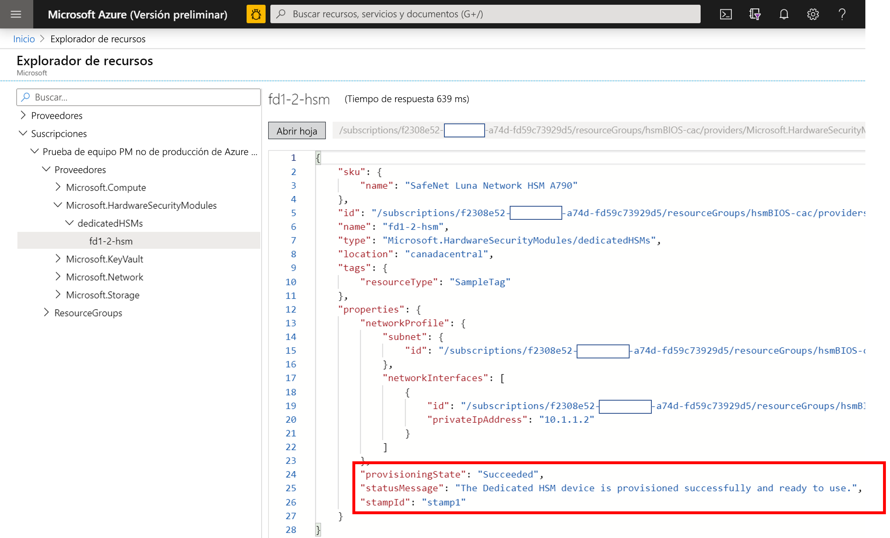
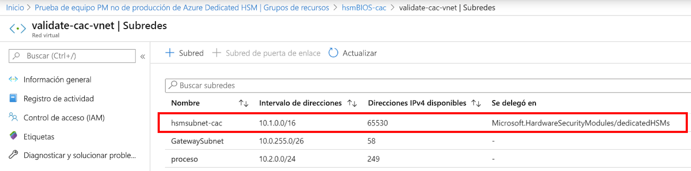
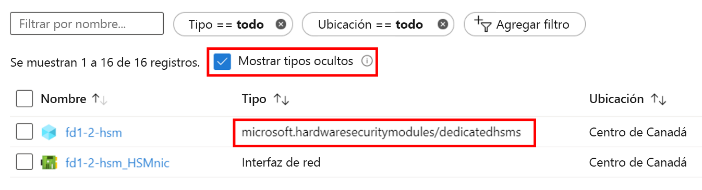

# <a name="troubleshooting"></a>Solución de problemas

El servicio Azure Dedicated HSM tiene dos aspectos distintos. En primer lugar, el registro y la implementación en Azure de los dispositivos HSM con sus componentes de red subyacentes. En segundo lugar, la configuración de los dispositivos HSM como preparación para su uso o integración con una carga de trabajo o aplicación determinados. Aunque los dispositivos HSM Thales Luna Network son los mismos en Azure que los que podría comprar directamente a Thales, el hecho de que se trate de un recurso de Azure aporta algunas consideraciones únicas. Aquí se documentan estas consideraciones, los procedimientos recomendados y la información de solución de problemas resultantes para garantizar la alta visibilidad y el acceso a la información crítica. Una vez que el servicio está en uso, la información definitiva está disponible mediante solicitudes de soporte técnico a Microsoft o a Thales directamente. 

> [!NOTE]
> Tenga en cuenta que, antes de realizar cualquier configuración en un dispositivo HSM recién implementado, se debe actualizar con cualquier revisión pertinente. Una revisión necesaria específica es la [KB0019789](https://supportportal.gemalto.com/csm?id=kb_article_view&sys_kb_id=19a81c8bdb9a1fc8d298728dae96197d&sysparm_article=KB0019789) del portal de soporte técnico de Thales, que soluciona un problema de bloqueo de reinicio.

## <a name="hsm-registration"></a>Registro del HSM

Dedicated HSM no está disponible libremente para su uso, ya que ofrece recursos de hardware en la nube y, por lo tanto, es un recurso valioso que necesita protección. Por lo tanto, se usa un proceso de lista de permitidos por correo electrónico con la dirección HSMrequest@microsoft.com. 

### <a name="getting-access-to-dedicated-hsm"></a>Obtención de acceso a Dedicated HSM

Si cree que Dedicated HSM se ajusta sus requisitos de almacenamiento de claves, envíe un correo electrónico a HSMrequest@microsoft.com para solicitar acceso. Detalle la aplicación, las regiones en las que desea HSM y el volumen de HSM que precisa. Si trabaja con un representante de Microsoft, como un ejecutivo de cuentas o un arquitecto de soluciones en la nube, por ejemplo, puede incluirlos en cualquier solicitud.

## <a name="hsm-provisioning"></a>Aprovisionamiento de HSM

El aprovisionamiento de un dispositivo HSM en Azure se puede realizar mediante la CLI o PowerShell. Al registrarse en el servicio, se le proporcionará una plantilla de ARM de ejemplo y se le ofrecerá asistencia para la personalización inicial. 

### <a name="hsm-deployment-failure-information"></a>Información de errores de implementación de HSM

Dedicated HSM admite la CLI y PowerShell para su implementación, por lo que la información de errores basada en el portal está limitada y no es detallada. Encontrará más información mediante el Explorador de recursos. La página principal del portal tiene un icono para el mismo y tiene disponible información más detallada sobre el error. Esta información será de gran utilidad si se pega al crear una solicitud de soporte técnico relacionada con los problemas de implementación.



### <a name="hsm-subnet-delegation"></a>Delegación de subred de HSM
La razón principal por la que se producen errores en la implementación es olvidar establecer la delegación adecuada para la subred definida por el cliente en la que se aprovisionarán los HSM. La configuración de la delegación es parte de los requisitos previos de la red virtual y de la subred para la implementación y se pueden encontrar más detalles en los tutoriales.



### <a name="hsm-deployment-race-condition"></a>Condición de carrera de la implementación de HSM

La plantilla de ARM estándar proporcionada para la implementación tiene recursos relacionados con HSM y la puerta de enlace de ExpressRoute. Los recursos de red son una dependencia para la implementación correcta de HSM y el tiempo puede ser crucial.  En ocasiones, hemos detectado errores de implementación relacionados con problemas de dependencias y volver a ejecutar la implementación a menudo resuelve el problema. Si no es así, eliminar los recursos y volver a implementarlos suele solucionar el problema. Después de intentar esto, si sigue detectando el problema, genere una solicitud de soporte técnico en Azure Portal; para ello, seleccione el tipo de problema "Problemas al configurar la instalación en Azure".

### <a name="hsm-deployment-using-terraform"></a>Implementación de HSM con Terraform

Algunos clientes han usado Terraform como un entorno de automatización en lugar de plantillas de ARM como las que se proporcionan al registrarse para este servicio. Los HSM no se pueden implementar de esta manera, pero es posible para los recursos de redes dependientes. Terraform tiene un módulo para llamar a una plantilla de ARM mínima que solo tiene la implementación de HSM.  En esta situación, se debe tener cuidado para asegurarse de que los recursos de redes, como la puerta de enlace de ExpressRoute necesaria, se implementan completamente antes de implementar los HSM. El siguiente comando de la CLI se puede usar para probar una implementación completada e integrarla según sea necesario. Reemplace los marcadores de corchetes angulares por su nombre específico. Debería buscar un resultado de "provisioningState is Succeeded" (estado de aprovisionamiento correcto).

```azurecli
az resource show --ids /subscriptions/<subid>/resourceGroups/<myresourcegroup>/providers/Microsoft.Network/virtualNetworkGateways/<myergateway>
```

### <a name="deployment-failure-based-on-quota"></a>Error de implementación basado en las cuotas
Se puede producir un error en las implementaciones si se superan los 2 HSM por sello y los 4 HSM por región. Para evitar esta situación, asegúrese de que ha eliminado los recursos de implementaciones con errores anteriores antes de volver a implementar. Consulte el elemento "Cómo puedo ver los HSM" que aparece a continuación para comprobar los recursos. Si cree que necesita superar esta cuota, que se encuentra principalmente como medida de seguridad, envíe un correo electrónico a HSMrequest@microsoft.com con los detalles.

### <a name="deployment-failure-based-on-capacity"></a>Error de implementación basado en la capacidad
Cuando un sello o una región se están llenando, es decir, se aprovisionan casi todos los HSM gratuitos, se pueden producir errores de implementación. Cada sello tiene 11 HSM disponibles para los clientes, lo que significa 22 por región. También hay 3 repuestos y 1 dispositivo de prueba en cada sello. Si cree que es posible que haya alcanzado un límite, envíe un correo electrónico a HSMrequest@microsoft.com para obtener información sobre el nivel de ocupación de los sellos específicos.

###  <a name="how-do-i-see-hsms-when-provisioned"></a>¿Cómo puedo ver los HSM cuando se aprovisionan?
Debido a que Dedicated HSM es un servicio con lista de permitidos, se considera un "Tipo oculto" en Azure Portal. Para ver los recursos de HSM, debe activar la casilla "Mostrar tipos ocultos" como se muestra a continuación. El recurso de la NIC siempre sigue al HSM y es un buen lugar para averiguar la dirección IP del HSM antes de usar SSH para conectarse.



## <a name="networking-resources"></a>Recursos de redes

La implementación de Dedicated HSM tiene una dependencia en los recursos de redes y, en consecuencia, algunas limitaciones que se deben tener en cuenta.

### <a name="provisioning-expressroute"></a>Aprovisionamiento de ExpressRoute

Dedicated HSM usa la puerta de enlace de ExpressRoute como "túnel" para la comunicación entre el espacio de direcciones IP privado del cliente y el HSM físico en un centro de datos de Azure.  Teniendo en cuenta que hay una restricción de una puerta de enlace por red virtual, los clientes que requieren conexión a sus recursos locales mediante ExpressRoute tendrán que usar otra red virtual para esa conexión.  

### <a name="hsm-private-ip-address"></a>Dirección IP privada del HSM

Las plantillas de ejemplo proporcionadas para Dedicated HSM suponen que la dirección IP del HSM se tomará automáticamente de un intervalo de subred determinado. Puede especificar una dirección IP explícita para el HSM mediante el atributo "NetworkInterfaces" de la plantilla de ARM. 


## <a name="hsm-initialization"></a>Inicialización del HSM

La inicialización prepara un HSM nuevo para su uso o un HSM existente para su reutilización. La inicialización del HSM se debe completar antes de poder generar o almacenar objetos, permitir a los clientes conectarse o realizar operaciones criptográficas.

### <a name="lost-credentials"></a>Credenciales perdidas

La pérdida de la contraseña del administrador del shell provocará la pérdida del material de clave del HSM. Se debe realizar una solicitud de soporte técnico para restablecer el HSM.
Al inicializar el HSM, almacene las credenciales de forma segura. Las credenciales del shell y del HSM se deben proteger de acuerdo con las directivas de la empresa.

### <a name="failed-logins"></a>Inicios de sesión erróneos

Proporcionar credenciales incorrectas a los HSM puede tener consecuencias destructivas. Los siguientes son los comportamientos predeterminados para los roles de HSM.

| Role | Umbral (número de intentos) | Resultado de demasiados intentos de inicio de sesión incorrectos | Recuperación |
|--|--|--|--|
| SO del HSM | 3 |  El HSM se inicializa con ceros (todas las identidades de los objetos de HSM y todas las particiones desaparecen).  |  El HSM se debe reinicializar. El contenido se puede restaurar desde las copias de seguridad. | 
| SO de partición | 10 |  La partición se inicializa con ceros. |  La partición se debe reinicializar. El contenido se puede restaurar desde la copia de seguridad. |  
| Auditoría | 10 | Bloqueo | Se desbloquea automáticamente transcurridos 10 minutos. |  
| Responsable de cifrado | 10 (se puede reducir) | Si la directiva de HSM 15: habilitar el restablecimiento del PIN de la partición está establecido en 1 (habilitado), los roles CO y CU están bloqueados.<br>Si la directiva de HSM 15: habilitar el restablecimiento del PIN de la partición está establecido en 0 (deshabilitado), los roles CO y CU se bloquean de forma permanente y ya no se puede acceder al contenido de la partición. Esta es la configuración predeterminada. | El rol CO debe estar desbloqueado y las credenciales restablecidas por el SO de la partición, mediante `role resetpw -name co`.<br>La partición se debe reinicializar y el material de clave se debe restaurar desde un dispositivo de copia de seguridad. |  

## <a name="hsm-configuration"></a>Configuración del HSM 

Los elementos siguientes son situaciones en las que los errores de configuración son comunes o tienen un impacto destacado:

### <a name="hsm-documentation-and-software"></a>Documentación y software del HSM
El software y la documentación de los dispositivos HSM Thales SafeNet Luna 7 no están disponibles en Microsoft y se deben descargar directamente desde Thales. Es necesario el registro con el identificador de cliente de Thales recibido durante el proceso de registro. Los dispositivos, tal como los proporciona Microsoft, tienen la versión de software 7.2 y la versión de firmware 7.0.3. A comienzos de 2020, Thales hizo pública su documentación, que se encuentra [aquí](https://thalesdocs.com/gphsm/luna/7.2/docs/network/Content/Home_network.htm).  

### <a name="hsm-networking-configuration"></a>Configuración de redes de HSM

Tenga cuidado al configurar las redes en el HSM.  El HSM tiene una conexión mediante la puerta de enlace de ExpressRoute desde el espacio de direcciones IP privadas del cliente directamente al HSM.  Este canal de comunicación es solo para la comunicación con el cliente y Microsoft no tiene acceso. Si el HSM está configurado de forma que esta ruta de acceso de red se vea afectada, se elimina toda la comunicación con el HSM.  En esta situación, la única opción es generar una solicitud de soporte técnico de Microsoft mediante Azure Portal para solicitar que se restablezca el dispositivo. Este procedimiento de restablecimiento vuelve a establecer el HSM en su estado inicial y se pierde toda la configuración y el material de claves.  La configuración se debe volver a crear y, cuando el dispositivo se una al grupo de alta disponibilidad, se replicará el material de claves.  

### <a name="hsm-device-reboot"></a>Reinicio del dispositivo HSM

Algunos cambios de configuración requieren que el HSM se apague y encienda o se reinicie. Las pruebas del HSM en Azure realizadas por Microsoft determinaron que, en algunas ocasiones, el reinicio podría dejar de responder. La implicación es que se debe crear una solicitud de soporte técnico en Azure Portal solicitando un reinicio completo, que podría tardar hasta 48 horas teniendo en cuenta que se trata de un proceso manual en un centro de datos de Azure.  Para evitar esta situación, asegúrese de que ha implementado la revisión de reinicio disponible directamente desde Thales. Consulte la [KB0019789](https://supportportal.gemalto.com/csm?sys_kb_id=d66911e2db4ffbc0d298728dae9619b0&id=kb_article_view&sysparm_rank=1&sysparm_tsqueryId=d568c35bdb9a4850d6b31f3b4b96199e&sysparm_article=KB0019789) en el apartado de descargas de Thales Luna Network HSM 7.2 para obtener una revisión recomendada para un problema de bloqueo de reinicio (Nota: Debe haberse registrado en el portal de soporte técnico de Thales para descargarlo).

### <a name="ntls-certificates-out-of-sync"></a>Certificados de NTLS fuera de sincronización
Un cliente puede perder conectividad con un HSM cuando expira un certificado o se sobrescribe mediante actualizaciones de configuración. La configuración del cliente de intercambio de certificados se debe volver a aplicar en cada HSM.
Ejemplo del registro de NTLS con un certificado no válido:

> NTLS[8508]: info : 0 : Incoming connection request... : 192.168.50.2/59415 NTLS[8508]: Error message from SSLAccept is : error:14094418:SSL routines:ssl3_read_bytes:tlsv1 alert unknown ca NTLS[8508]: Error during SSL accept ( RC_SSL_ERROR ) NTLS[8508]: info : 0xc0000711 : Fail to establish a secure channel with client : 192.168.50.2/59415 : RC_SSL_FAILED_HANDSHAKE NTLS[8508]: info : 0 : NTLS Client "Unknown host name" Connection instance removed : 192.168.50.2/59415

### <a name="failed-tcp-communication"></a>Comunicación TCP errónea

La comunicación desde la instalación del cliente de Luna al HSM requiere el puerto TCP 1792 como mínimo. Tenga en cuenta esto a medida que se cambian las configuraciones de red en el entorno.

### <a name="failed-ha-group-member-doesnt-recover"></a>Un miembro del grupo de alta disponibilidad no se recupera

Si un miembro del grupo de alta disponibilidad con errores no se recupera, se debe recuperar manualmente desde el cliente de Luna con el comando hagroup recover.
Es necesario configurar un número de reintentos para un grupo de alta disponibilidad para habilitar la recuperación automática. De forma predeterminada, un grupo de alta disponibilidad no intentará recuperar un miembro de alta disponibilidad en el grupo cuando se recupera.

### <a name="ha-group-doesnt-sync"></a>El grupo de alta disponibilidad no se sincroniza

En el caso de que las particiones de miembros no tengan el mismo dominio de clonación, el comando de sincronización de alta disponibilidad mostrará lo siguiente: Advertencia: se puede producir un error en la sincronización.  Los miembros de la ranura 0 y la ranura 1 tienen una configuración en conflicto para la clonación de la clave privada.
Se debe agregar una nueva partición con el dominio de clonación correcto al grupo de alta disponibilidad, seguido de la eliminación de la partición configurada incorrectamente.

## <a name="hsm-deprovisioning"></a>Desaprovisionamiento del HSM 

Solo cuando se haya terminado completamente con un HSM, este se puede desaprovisionar y, a continuación, Microsoft lo restablecerá y lo devolverá a un grupo gratuito. 

### <a name="how-to-delete-an-hsm-resource"></a>Cómo eliminar un recurso de HSM

No se puede eliminar el recurso de Azure para un HSM a menos que el HSM se haya inicializado "con ceros".  Por lo tanto, se debe haber eliminado todo el material de claves antes de intentar eliminarlo como un recurso. La manera más rápida de inicializar con ceros es escribir una contraseña del administrador de HSM equivocada 3 veces (Nota: Se refiere al administrador de HSM y no al administrador de nivel de dispositivo). El shell de Luna tiene un comando `hsm -factoryreset` que inicializa con ceros, pero solo se puede ejecutar mediante la consola en el puerto serie y los clientes no tienen acceso a este.

## <a name="next-steps"></a>Pasos siguientes

En este artículo se proporciona información detallada sobre las áreas del ciclo de vida de la implementación de HSM que pueden tener problemas o requerir una solución de problemas o una consideración cuidadosa. Esperamos que este artículo le ayude a evitar retrasos y frustraciones innecesarias y, si tiene adiciones o cambios pertinentes, genere una solicitud de soporte técnico con Microsoft y háganoslo saber. 
