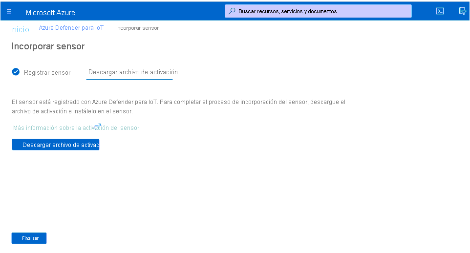
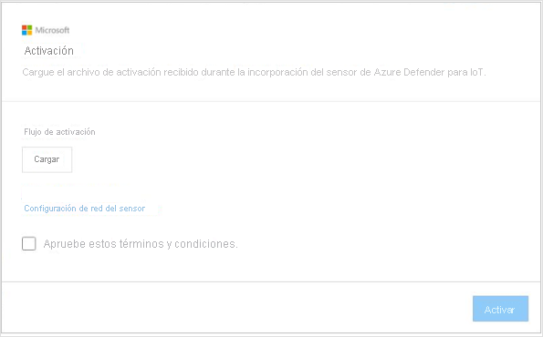

# Inicio rápido: Implementación e incorporación de un sensor

En este artículo se proporciona información general sobre el proceso de implementación de sensores. Los sensores deben incorporarse al portal de Azure Defender para IoT.

Este proceso requiere la adquisición de un sensor preconfigurado o de un dispositivo de sensor certificado y la instalación del software del sensor por su cuenta.

Si está trabajando con un dispositivo de sensor certificado, antes de comenzar, se recomienda revisar la [guía de especificaciones de hardware de Azure Defender para IoT](https://aka.ms/AzureDefenderforIoTBareMetalAppliance).

> [!NOTE]
> No es necesario incorporar la consola de administración local de Azure Defender para IoT.

La incorporación de sensores le permite:

|||
|------ | ----------- |
| **Definir un nombre de sensor** | Asigne un nombre al sensor que va a incorporar y asócielo a un centro de IoT o a una suscripción.  Para más información, consulte **Incorporación de sensores** .|
|**Elegir una suscripción y el número de dispositivos confirmados**|Seleccione una suscripción y el número de dispositivos que cubre la suscripción. Escriba el número en incrementos de 1000.|
| **Definir un modo de administración de sensores** | Defina dónde se muestran el recurso, la alerta y otra información detectada por el sensor. Esto se determina en función del **modo de administración del sensor** que se defina.  **Modo administrado de forma local** : la información detectada por el sensor se muestra en la consola del sensor. La información de detección también se comparte con la consola de administración local si el sensor está conectado a ella.  **Modo administrado en la nube** : la información detectada por el sensor se muestra en la consola del sensor. Además, se proporciona información de alertas mediante un centro de IoT, que puede compartirse con otros servicios de Azure, por ejemplo, Azure Sentinel. Para más información, consulte **Incorporación de sensores** . |
| **Adquirir un archivo de activación de sensor** | Con los sensores **administrados de forma local** , se usa un archivo de activación para administrar los períodos de activación del sensor autorizados.  Con los sensores **administrados en la nube** , se usa un archivo de activación como conexión entre el sensor y un centro de IoT. Para más información, consulte **Incorporación de sensores** . |
| **Cargar un archivo de activación en el sensor** | Los archivos de activación deben cargarse en los sensores de la empresa. La supervisión de la red y el acceso a las características de la consola del sensor no estarán disponibles hasta que se cargue el archivo de activación. Para más información, consulte **Carga de archivos de activación del sensor** . |
| **Actualizar los parámetros de red del sensor antes de la activación** | Actualice los parámetros definidos durante la instalación del sensor. Para más información, consulte **Error: No se encontró el origen de referencia** .|

**Para implementar un sensor:**

1. Vaya a Azure Defender para IoT desde Azure Portal.

2. Seleccione **Comenzar** .

3. En la sección **Discover your network** (Detectar la red), seleccione **Configurar** .

   

4. Seleccione una opción para adquirir un sensor.

   

  - **Comprar un sensor preconfigurado** : Microsoft y Arrow se han asociado para proporcionar sensores preconfigurados. Para comprar un sensor preconfigurado, póngase en contacto con Arrow en: <hardware.sales@arrow.com>. El sensor se entregará en sus instalaciones. Se instala la versión más reciente.

  - **Traiga su propio dispositivo (instalación ISO)** : la solución se ejecuta en dispositivos certificados. Al comprar su dispositivo certificado, use la [guía de especificaciones de hardware de Azure Defender para IoT](https://aka.ms/AzureDefenderforIoTBareMetalAppliance) como referencia.

    - Seleccione una versión en el menú **Select version** (Seleccionar versión).

    - Seleccione **Descargar** y guarde el archivo. Para información sobre la descarga de la imagen ISO y la instalación del software de sensor, consulte la **guía de instalación de Azure Defender para IoT** .

5. Una vez que ha instalado el software en el sensor o que ha recibido un sensor preconfigurado, lleve a cabo las tareas de configuración de la red. Para más información, consulte la [guía de configuración de la red](https://aka.ms/AzureDefenderForIoTNetworkSetup).

## Incorporación de sensores

Los sensores deben incorporarse al portal de Azure Defender para IoT. La incorporación se realiza en dos fases:

1. Registre el sensor en el portal de Azure Defender para IoT.

2. Descargue un archivo de activación para el sensor. El archivo se cargará más adelante en el sensor.

**Para acceder a la página de incorporación:**

1. Vaya a la página **Comenzar** de Microsoft Azure Defender para IoT.

2. Seleccione **2) Incorporar** en Azure Defender para IoT.

   

3. Se abre la página **Onboard sensor** (Incorporar sensor). En esta página se proporcionan opciones para registrar el sensor y descargar el archivo de activación.

   

**Para registrar el sensor:**

1. Elija un nombre de sensor. En el caso de los sensores administrados en la nube, el nombre que se aplica aquí es el nombre que aparece en la consola del sensor: este nombre no se puede cambiar desde la consola. En el caso de los sensores administrados de forma local, el nombre que se aplica aquí se almacenará en Azure, pero se puede actualizar en la consola del sensor. Se recomienda incluir la dirección IP del sensor que instaló como parte del nombre o usar un nombre que sea fácil de identificar. De esta forma, se garantiza un seguimiento más sencillo y una nomenclatura coherente entre el nombre de registro en el portal de Azure Defender para IoT y la dirección IP del sensor implementado que se muestra en la consola del sensor.

2. Seleccione una suscripción en la lista desplegable de suscripciones.
3. En el campo **Committed devices** (Dispositivos confirmados), escriba el número de dispositivos que cubre la suscripción. Debe volver a escribir este número para cada sensor que incorpore que esté asociado a la misma suscripción.  Por ejemplo, si la suscripción "A" está asociada a 6000 dispositivos, escriba 6000 para cada sensor asociado a la suscripción "A".   
4. Elija un modo de administración de sensor mediante el botón de alternancia **Cloud connect** (Conexión en la nube). Si el botón de alternancia está activado, el sensor está **administrado en la nube** . Si el botón de alternancia está desactivado, el sensor está **administrado de forma local** .

| Modo de administración del sensor | Descripción                                                |
| ---------------------- | ---------------------------------------------------------  |
| **Administrado en la nube**          | la información detectada por el sensor se muestra en la consola del sensor. Además, se proporciona información de alertas mediante un centro de IoT, que puede compartirse con otros servicios de Azure, por ejemplo, Azure Sentinel.  Elija un centro de IoT para asociarlo a este sensor.  Tendrá que cargar un archivo de activación de administración en la nube en los sensores administrados en la nube.  Consulte **Carga de archivos de activación del sensor** para más información. |
| **Administrado de forma local**        | La información detectada por los sensores administrados de forma local se muestra en la consola del sensor. Si trabaja en una red aislada y quiere una vista unificada de toda la información detectada por varios sensores administrados de forma local, trabaje con la consola de administración local.  Los sensores *administrados de forma local* están asociados a una suscripción de Azure y contienen instrucciones sobre el período de expiración de la activación del sensor.  Elija una suscripción para asociarla a este sensor.  Tendrá que cargar un archivo de activación de administración local en cada sensor. Consulte **Carga de archivos de activación del sensor** para más información. |

5. Seleccione **Registrar** .

6. En la página Download activation file (Descargar archivo de activación), seleccione **Download activation** (Descargar activación).

   

7. Guarde el archivo. El formato del nombre de archivo es: `<hub_name>_<sensor_name>`. El nombre del sensor hace referencia al nombre que definió anteriormente.

8. Seleccione **Finalizar** .

9. Para completar el proceso de incorporación del sensor, cargue el archivo en el sensor desde la consola de Azure Defender para IoT.
 
## Carga de archivos de activación del sensor

En este artículo se describe cómo cargar un archivo de activación en el sensor. Debe haber recibido el archivo al incorporar el sensor.

**Archivos de activación de administración local**

Los sensores administrados de forma local están asociados a una suscripción de Azure.  El archivo de activación de los sensores administrados de forma local contiene una fecha de expiración. Un mes antes de esta fecha, aparece un mensaje de advertencia en la parte superior de la consola del sensor. La advertencia permanecerá hasta que se haya actualizado el archivo de activación.

Después de que expire el archivo de activación, podrá seguir trabajando con las características de Azure Defender para IoT.

**Archivos de activación de administración en la nube**

Los sensores que están administrados en la nube están asociados a una instancia de Azure IoT Hub. Estos sensores no están limitados por los períodos de tiempo del archivo de activación. El archivo de activación de los sensores administrados en la nube se usa para garantizar la conexión al centro de IoT.

Para más información sobre los centros de IoT, consulte [Acerca de IoT Hub](../iot-hub/about-iot-hub.md).

**Para cargar el archivo de activación:**

1. Compruebe que tiene los siguientes elementos:

   - La dirección IP del sensor (definida durante la instalación)

   - Las credenciales de inicio de sesión de usuario necesarias para el sensor

2. Acceda a la consola de Azure Defender para IoT desde el explorador con la dirección IP de este sensor.

3. Inicie sesión en la consola del sensor de Azure Defender para IoT.

   

4. Después de un inicio de sesión correcto, se abre la pantalla de activación. Seleccione Cargar y elija el archivo de activación que ha guardado.

   

5. Apruebe los términos y condiciones.

6. Seleccione **Activar** . Los parámetros de configuración de red del sensor se definieron durante la instalación del software o cuando se adquirió un sensor configurado previamente. Se definieron los siguientes parámetros:
   - Dirección IP
   - DNS  
   - Puerta de enlace predeterminada
   - Máscara de subred
   - Nombre de host
 
   Puede que quiere actualizar esta información antes de activar el sensor en los siguientes casos:
   - Debe cambiar los parámetros preconfigurados definidos.  
   - Quiere volver a configurar los parámetros de red después de la instalación; también puede definir la configuración del proxy antes de activar el sensor.

7. Seleccione el vínculo **Sensor Network Configuration** (Configuración de red del sensor) en el cuadro de diálogo Activación.  

   

8. Se muestran los parámetros definidos durante la instalación. También hay una opción disponible para definir el proxy. Actualice los valores según sea necesario y seleccione **Guardar** .
 
 
## Pasos siguientes

En este artículo, aprendió a implementar y a incorporar sensores. Para más información sobre cómo comenzar, consulte el artículo siguiente:

- [Introducción](getting-started.md)