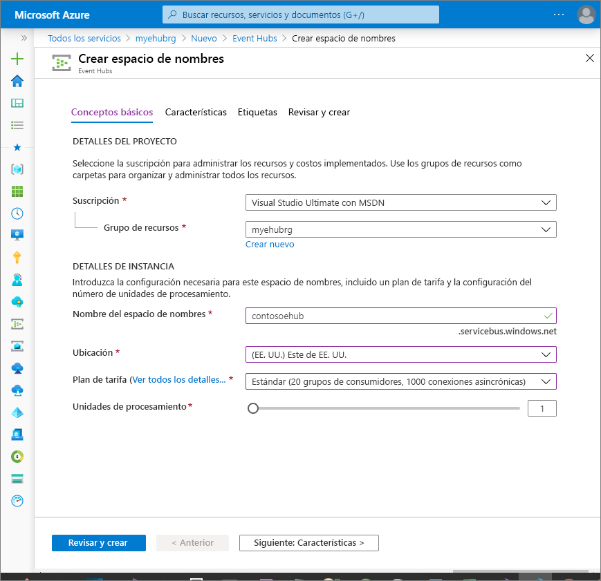
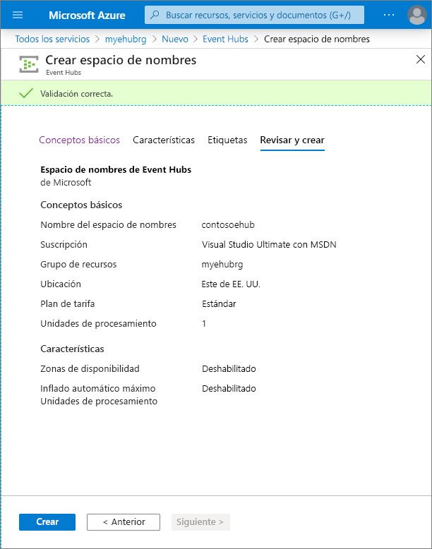

# Inicio rápido: Creación de un centro de eventos mediante Azure Portal
Azure Event Hubs es una plataforma de streaming de macrodatos y servicio de ingesta de eventos de gran escalabilidad capaz de recibir y procesar millones de eventos por segundo. Event Hubs puede procesar y almacenar eventos, datos o telemetría generados por dispositivos y software distribuido. Los datos enviados a un centro de eventos se pueden transformar y almacenar con cualquier proveedor de análisis en tiempo real o adaptadores de procesamiento por lotes y almacenamiento. Para más información sobre Event Hubs, consulte [Introducción a Event Hubs](event-hubs-about.md) y [Características de Event Hubs](event-hubs-features.md).

En esta guía de inicio rápido se crea un centro de eventos mediante [Azure Portal](https://portal.azure.com).

## Prerrequisitos

Para completar esta guía de inicio rápido, asegúrese de que tiene:

- Suscripción de Azure. Si no tiene una, [cree una cuenta gratuita](https://azure.microsoft.com/free/) antes de empezar.
- [Visual Studio 2019](https://www.visualstudio.com/vs) o cualquier versión posterior.
- [SDK de .NET Standard](https://www.microsoft.com/net/download/windows), versión 2.0 o posterior.

## Crear un grupo de recursos

Un grupo de recursos es una recopilación lógica de recursos de Azure. Todos los recursos se implementan y administran en un grupo de recursos. Para crear un grupo de recursos:

1. Inicie sesión en [Azure Portal](https://portal.azure.com).
2. En el panel de la izquierda, seleccione **Grupos de recursos**. A continuación, haga clic en **Agregar**.

   

2. En **Suscripción** seleccione el nombre de la suscripción de Azure en la que desea crear el grupo de recursos.
3. Escriba un **nombre único para el grupo de recursos**. El sistema comprueba de forma inmediata para ver si el nombre está disponible en la suscripción de Azure seleccionada actualmente.
4. Seleccione una **región** para el grupo de recursos.
5. Seleccione **Revisar + crear**.

   
6. En la página **Revisar + crear**, seleccione **Crear**. 

## Creación de un espacio de nombres de Event Hubs

Un espacio de nombres de Event Hubs proporciona un contenedor con un único ámbito, al que hace referencia su nombre de dominio completo, en el que puede crear uno o varios centros de eventos. Para crear un espacio de nombres en el grupo de recursos mediante el portal, haga lo siguiente:

1. En Azure Portal, haga clic en **Crear un recurso** en la parte superior izquierda de la pantalla.
2. Seleccione **Todos los servicios** en el menú de la izquierda y seleccione el **asterisco (`*`)** junto a **Event Hubs** en la categoría **Análisis**. Confirme que **Event Hubs** se agrega a **FAVORITOS** en el menú de navegación de la izquierda. 
    
   
3. Seleccione **Event Hubs** en **FAVORITOS** en el menú de navegación de la izquierda y seleccione **Agregar** en la barra de herramientas.

   
4. En la página **Crear espacio de nombres**, realice los pasos siguientes:
    1. Seleccione la **suscripción** en la que desea crear el espacio de nombres.
    2. Seleccione el **grupo de recursos** que ha creado en el paso anterior. 
    3. Escriba el **nombre** del espacio de nombres. El sistema realiza la comprobación automáticamente para ver si el nombre está disponible.
    4. Seleccione una **ubicación** para el espacio de nombres.    
    5. Elija el **plan de tarifa** (Básico o Estándar).  
    6. Deje la configuración de las **unidades de procesamiento** tal como está. Para obtener información acerca de las unidades de procesamiento, consulte [Escalabilidad de Event Hubs](event-hubs-scalability.md#throughput-units)  
    5. En la parte inferior de la página, seleccione **Revisar y crear**.

       
   6. En la página **Revisar y crear**, examine la configuración y seleccione **Crear**. Espere a que la implementación se complete. 

       
   7. En la página **Implementación**, seleccione **Ir al recurso** para ir a la página de su espacio de nombres. 

      
   8. Confirme que la página **Espacio de nombres de Event Hubs** que ve es similar al ejemplo siguiente: 

              

       > [!NOTE]
       > Azure Event Hubs proporciona un punto de conexión de Kafka. Este punto de conexión permite que el espacio de nombres de Event Hubs entienda el protocolo de mensajes y las API de [Apache Kafka](https://kafka.apache.org/intro). Con esta funcionalidad, puede comunicarse con las instancias de Event Hubs como lo haría con temas de Kafka sin cambiar los clientes de protocolo ni ejecutar sus propios clústeres. Admite [Apache Kafka versión 1.0.](https://kafka.apache.org/10/documentation.html) y versiones posteriores. Para más información, consulte [Uso de Azure Event Hubs desde aplicaciones de Apache Kafka](event-hubs-for-kafka-ecosystem-overview.md).
    
## Creación de un centro de eventos

Para crear un centro de eventos en el espacio de nombres, haga lo siguiente:

1. En la página Espacio de nombres de Event Hubs, seleccione **Event Hubs** en el menú de la izquierda.
1. En la parte superior de la ventana, haga clic en **+ Centro de eventos**.
   
    
1. Escriba el nombre del centro de eventos y, a continuación, haga clic en **Crear**.
   
    
4. Puede comprobar el estado de la creación del centro de eventos en las alertas. Una vez creado el centro de eventos, puede verlo en la lista de centros de eventos como se muestra en la siguiente imagen:

    

## Pasos siguientes

En este artículo, ha creado un grupo de recursos, un espacio de nombres de Event Hubs y un centro de eventos. Para encontrar instrucciones paso a paso sobre cómo enviar eventos a un centro de eventos o recibirlos de este, consulte los tutoriales sobre **envío y recepción de eventos**: 

- [.NET Core](get-started-dotnet-standard-send-v2.md)
- [Java](get-started-java-send-v2.md)
- [Python](get-started-python-send-v2.md)
- [JavaScript](get-started-node-send-v2.md)
- [Go](event-hubs-go-get-started-send.md)
- [C (solo enviar)](event-hubs-c-getstarted-send.md)
- [Apache Storm (solo recibir)](event-hubs-storm-getstarted-receive.md)

[Azure portal]: https://portal.azure.com/
[3]: ./media/event-hubs-quickstart-portal/sender1.png
[4]: ./media/event-hubs-quickstart-portal/receiver1.png
