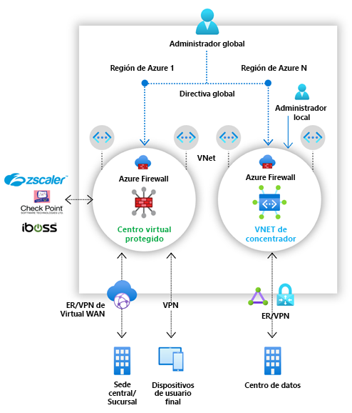

# ¿Qué es Azure Firewall Manager?

Azure Firewall Manager es un servicio de administración de seguridad que proporciona una directiva de seguridad central y administración de rutas para perímetros de seguridad basados en la nube. 

Firewall Manager puede proporcionar administración de seguridad para dos tipos de arquitectura de red:

- **Centro virtual protegido**

   Un [centro de Azure Virtual WAN](../virtual-wan/virtual-wan-about.md#resources) es un recurso administrado por Microsoft que permite crear fácilmente arquitecturas de tipo hub-and-spoke (centro y radio). Cuando las directivas de seguridad y enrutamiento están asociadas a ese concentrador, se denomina *[centro virtual protegido](secured-virtual-hub.md)* . 
- **Red virtual de centro**

   Se trata de una red virtual estándar de Azure que crea y administra uno mismo. Cuando las directivas de seguridad están asociadas con este tipo de centro, se conoce como *red virtual de centro*. En este momento, solo se admite la directiva de Azure Firewall. Puede emparejar las redes virtuales de radio que contienen los servidores y servicios de carga de trabajo. También puede administrar los firewalls de redes virtuales independientes que no estén emparejadas con ningún radio.

Para ver una comparación detallada entre los tipos de arquitectura de *centro virtual protegido* y *red virtual de centro de conectividad*, consulte [¿Cuáles son las opciones de arquitectura de Azure Firewall Manager?](vhubs-and-vnets.md)

## Características de Azure Firewall Manager

Azure Firewall Manager ofrece las siguientes características:

### Implementación y configuración centralizadas de Azure Firewall

Puede implementar y configurar de forma centralizada varias instancias de Azure Firewall que abarquen diferentes regiones y suscripciones de Azure. 

### Directivas jerárquicas (globales y locales)

Puede usar Azure Firewall Manager para administrar de forma centralizada las directivas de Azure Firewall en varios centros de conectividad virtuales protegidos. Los equipos de TI centrales pueden crear directivas de firewall globales para aplicar la directiva de firewall a los equipos de toda la organización. Las directivas de firewall creadas localmente permiten un modelo de autoservicio de DevOps, lo que aumenta la agilidad.

### Integración con seguridad como servicio de terceros para la seguridad avanzada

Además de Azure Firewall, puede integrar los proveedores de seguridad como servicio (SECaaS) de terceros para proporcionar mayor protección de red para las conexiones de Internet de la red virtual y las ramas.

Esta característica solo está disponible en implementaciones de centros virtuales protegidos.

- Filtrado de tráfico de la red virtual a Internet (V2I)

   - Filtre el tráfico saliente de la red virtual con el proveedor de seguridad de terceros que prefiera.
   - Aproveche la protección de Internet avanzada con reconocimiento del usuario para sus cargas de trabajo en la nube que se ejecutan en Azure.

- Filtrado de tráfico de la rama a Internet (B2I)

   Aproveche la conectividad de Azure y la distribución global para agregar fácilmente el filtrado de terceros para escenarios de rama a Internet.

Para más información acerca de los proveedores de seguridad asociados, consulte [¿Qué son los proveedores de seguridad asociados de Azure Firewall Manager?](trusted-security-partners.md)

### Administración de rutas centralizada

Enrute fácilmente el tráfico al centro de conectividad seguro para filtrar y registrar sin necesidad de configurar manualmente rutas definidas por el usuario (UDR) en redes virtuales de radios. 

Esta característica solo está disponible en implementaciones de centros virtuales protegidos.

Puede usar proveedores de terceros para el filtrado de tráfico de rama a Internet (B2I), en paralelo con Azure Firewall para rama a red virtual (B2V), red virtual a red virtual (V2V) y red virtual a Internet (V2I). También puede usar proveedores de terceros para el filtrado del tráfico V2I, siempre que Azure Firewall no sea necesario para B2V o V2V. 

## Disponibilidad en regiones

Las directivas de Azure Firewall se pueden usar en diferentes regiones. Por ejemplo, puede crear una directiva en Oeste de EE. UU. y usarla en Este de EE. UU. 

## Problemas conocidos

Azure Firewall Manager presenta los siguientes problemas conocidos:

|Incidencia  |Descripción  |Mitigación  |
|---------|---------|---------|
|División del tráfico|Actualmente no se admite la división del tráfico de PaaS público de Azure ni de Microsoft 365. Como tal, la selección de un proveedor de terceros para V2I o B2I también envía todo el tráfico de PaaS público de Azure y de Microsoft 365 a través del servicio de asociados.|La división del tráfico en el centro de conectividad se está investigando.
|Un centro virtual protegido por región|No se puede tener más de un centro virtual protegido por región.|Cree varias WAN virtuales en una región.|
|Las directivas base deben estar en la misma región que la directiva local|Cree todas las directivas locales en la misma región que la directiva de base. Puede seguir aplicando una directiva que se creó en una región de un centro seguro desde otra región.|Investigando|
|Filtrado del tráfico entre centros en implementaciones de centros virtuales protegidos|Aún no se admite el filtrado de la comunicación entre centros virtuales protegidos. Sin embargo, la comunicación entre centros sigue funcionando si el filtrado del tráfico privado a través de Azure Firewall no está habilitado.|Investigando|
|Radios en una región distinta a la del centro virtual|Los radios en una región distinta de la del centro virtual no se admiten.|Investigando  Cree un centro por región y redes virtuales del mismo nivel en la misma región que el centro.|
|Tráfico de rama a rama con el filtrado de tráfico privado habilitado|El tráfico de rama a rama no se admite cuando está habilitado el filtrado de tráfico privado. |Investigando.  No proteja el tráfico privado si la conectividad de rama a rama es esencial.|
|Todos los centros virtuales protegidos que comparten la misma WAN virtual deben estar en el mismo grupo de recursos.|Este comportamiento ya se alinea con los centros WAN virtuales en la actualidad.|Cree varias WAN virtuales para permitir que se creen centros virtuales protegidos en grupos de recursos diferentes.|
|Error en la incorporación en masa de direcciones IP|El firewall del centro de conectividad seguro pasa al estado con errores si se agregan varias direcciones IP públicas.|Agregue incrementos menores de direcciones IP públicas. Por ejemplo, agréguelas de 10 en 10.|
|Las reglas de aplicación generan un error en un centro seguro con DNS personalizado (versión preliminar) configurado.|DNS personalizado (versión preliminar) no funciona en las implementaciones de concentrador seguro y en las implementaciones de red virtual de concentrador donde está habilitada la tunelización forzada.|Se está investigando la solución.|
|La versión Estándar de DDoS Protection no es compatible con los centros virtuales protegidos|La versión Estándar de DDoS Protection no se integra con las vWAN.|Investigando|
|Los registros de actividad no son totalmente compatibles|La directiva de firewall no admite actualmente registros de actividad.|Investigando|
|Configuración de intervalos de direcciones IP privadas de SNAT|Los [valores de intervalo IP privado](../firewall/snat-private-range.md) se omiten si está configurada una directiva de Azure Firewall. Se usa el comportamiento predeterminado de Azure Firewall, de modo que no se aplica SNAT en las reglas de red cuando la dirección IP de destino es un intervalo de direcciones IP privadas, de acuerdo con la normativa [RFC 1918 de IANA](https://tools.ietf.org/html/rfc1918).|Investigando

## Pasos siguientes

- Vea [Información general sobre la implementación de Azure Firewall Manager](deployment-overview.md).
- Información sobre [centros de conectividad virtuales protegidos](secured-virtual-hub.md).
