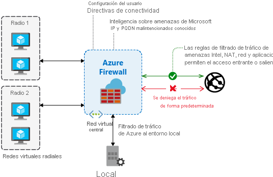

# ¿Qué es Azure Firewall?

Azure Firewall es un servicio de seguridad de red administrado y basado en la nube que protege los recursos de Azure Virtual Network. Se trata de un firewall como servicio con estado completo que incorpora alta disponibilidad y escalabilidad a la nube sin restricciones.

Puede crear, aplicar y registrar directivas de aplicaciones y de conectividad de red a nivel central en suscripciones y redes virtuales. Azure Firewall usa una dirección IP pública estática para los recursos de red virtual, que permite que los firewall externos identifiquen el tráfico procedente de la red virtual.  El servicio está totalmente integrado con Azure Monitor para los registros y análisis.

## Características

Para obtener información sobre las características de Azure Firewall, consulte [Características de Azure Firewall](features.md).

## Problemas conocidos

Azure Firewall presenta los siguientes problemas conocidos:

|Incidencia  |Descripción  |Mitigación  |
|---------|---------|---------|
Las reglas de filtrado de red para protocolos que no son TCP/UDP (por ejemplo, ICMP) no funcionan con el tráfico enlazado a Internet|Las reglas de filtrado de red de protocolos que no son TCP/UDP no funcionan con la traducción SNAT a la dirección IP pública. Los protocolos que no son TCP/UDP no se admiten entre subredes de radio y redes virtuales.|Azure Firewall usa Standard Load Balancer, [que actualmente no admite SNAT para los protocolos IP](https://docs.microsoft.com/azure/load-balancer/load-balancer-overview). Se están examinando opciones para admitir este escenario en una versión futura.|
|Falta de compatibilidad entre PowerShell y CLI con ICMP|Azure PowerShell y la CLI no admiten ICMP como protocolo válido en las reglas de red.|Aun así se puede usar ICMP como protocolo a través del portal y la API REST. Estamos trabajando para agregar pronto ICMP a PowerShell y la CLI.|
|Las etiquetas FQDN requieren que se establezca una combinación protocolo: puerto|Las reglas de aplicaciones con las etiquetas FQDN requieren la definición de puerto: protocolo.|Puede usar **https** como valor de puerto: protocolo. Estamos trabajando para que este campo sea opcional cuando se usen etiquetas FQDN.|
|No se admite la posibilidad de mover un firewall a otro grupo de recursos o suscripción.|No se admite la posibilidad de mover un firewall a otro grupo de recursos o suscripción.|La compatibilidad con esta funcionalidad está en nuestro mapa de ruta. Para mover un firewall a otro un grupo de recursos o suscripción, debe eliminar la instancia actual y volver a crearla en el nuevo grupo de recursos o suscripción.|
|Las alertas de inteligencia sobre amenazas pueden estar enmascaradas|Reglas de red con destino 80/443 para las alertas de inteligencia sobre amenazas de las máscaras de filtrado de salida cuando la configuración está establecida en el modo de solo alerta.|Cree filtrado de salida para 80/443 mediante reglas de aplicaciones. También puede cambiar el modo de inteligencia sobre amenazas a **Alertar y denegar**.|
|DNAT de Azure Firewall no funciona para destinos de IP privadas|La compatibilidad con DNAT de Azure Firewall se limita a la entrada/salida de Internet. DNAT no funciona actualmente con destinos de IP privada. Por ejemplo, radio a radio.|Se trata de una limitación actual.|
|No se puede eliminar la primera configuración de IP pública|Cada IP pública de Azure Firewall se asigna a una *configuración de IP*.  La primera configuración de IP se asigna durante la implementación del firewall y, normalmente, también contiene una referencia a la subred del firewall (a menos que se configure explícitamente de forma diferente mediante una implementación de plantilla). No se puede eliminar esta configuración de IP porque podría anular la asignación del firewall. Aún podrá cambiar o eliminar la dirección IP pública asociada con esta configuración de IP si el firewall tiene al menos otra dirección IP pública disponible para su uso.|es así por diseño.|
|Availability Zones solo se puede configurar durante la implementación.|Availability Zones solo se puede configurar durante la implementación. No se puede configurar una vez implementado un firewall.|es así por diseño.|
|SNAT en conexiones entrantes|Además de DNAT, en las conexiones mediante la dirección IP pública del firewall (entrante) se aplica SNAT en una de las direcciones IP privadas del firewall. Este requisito hoy en día (también para aplicaciones virtuales de red activa/activa) es para garantizar el enrutamiento simétrico.|Para conservar el código fuente original para HTTP/S, considere el uso de encabezados [XFF](https://en.wikipedia.org/wiki/X-Forwarded-For). Por ejemplo, use un servicio como [Azure Front Door](../frontdoor/front-door-http-headers-protocol.md#front-door-to-backend) o [Azure Application Gateway](../application-gateway/rewrite-http-headers.md) delante del firewall. También puede agregar WAF como parte de Azure Front Door Service y la cadena al firewall.
|El filtrado por nombre de dominio completo de SQL se admite solo en modo de proxy (puerto 1433)|Para Azure SQL Database, Azure SQL Data Warehouse e Instancia administrada de SQL Database:  Durante la versión preliminar, el filtrado por nombre de dominio completo de SQL se admite solo en modo de proxy (puerto 1433).  Para IaaS de Azure SQL:  Si va a usar puertos que no son los estándar, puede especificar esos puertos en las reglas de la aplicación.|Para SQL en modo de redirección (el valor predeterminado si se conecta desde dentro de Azure), puede filtrar en su lugar el acceso mediante la etiqueta de servicio de SQL como parte de las reglas de red de Azure Firewall.
|No se permite tráfico de salida en el puerto TCP 25.| Las conexiones SMTP salientes que usan el puerto TCP 25 se bloquearon. El puerto 25 se usa principalmente para la entrega de correo electrónico sin autenticación. Éste es el comportamiento predeterminado de la plataforma para las máquinas virtuales. Para más información, consulte [Solución de problemas de conectividad SMTP saliente en Azure](../virtual-network/troubleshoot-outbound-smtp-connectivity.md). Sin embargo, a diferencia de las máquinas virtuales, actualmente no es posible habilitar esta funcionalidad en Azure Firewall. Nota: Para permitir SMTP autenticado (puerto 587) o SMTP a través de un puerto distinto de 25, asegúrese de configurar una regla de red y no una regla de aplicación, ya que la inspección de SMTP no se admite en este momento.|Siga el método recomendado para enviar correo electrónico, como se documenta en el artículo de solución de problemas de SMTP. O bien, excluya la máquina virtual que necesita acceso SMTP saliente desde la ruta predeterminada hasta el firewall. En su lugar, configure el acceso saliente directamente a Internet.
|No se admite el FTP activo|El FTP activo está deshabilitado en Azure Firewall para protegerse frente a ataques de devolución FTP mediante el comando PORT de FTP.|En su lugar, puede usar el FTP pasivo. Todavía debe abrir explícitamente los puertos TCP 20 y 21 en el firewall.
|La métrica de uso de puertos SNAT muestra un 0 %|La métrica de uso de puertos SNAT de Azure Firewall puede mostrar un uso del 0 % incluso cuando se usan puertos SNAT. En este caso, el uso de la métrica como parte de la métrica de estado de mantenimiento del firewall proporciona un resultado incorrecto.|Este problema se ha corregido y su implementación en producción está prevista para mayo de 2020. En algunos casos, la reimplementación del firewall resuelve el problema, pero no es coherente. Como solución intermedia, use solo el estado de mantenimiento del firewall para buscar *estado=degradado*, no para *estado=incorrecto*. El agotamiento de puertos se muestra como *degradado*. *Incorrecto* se reserva para un uso futuro cuando haya más métricas que afecten al estado de mantenimiento del firewall.
|DNAT no es compatible con la tunelización forzada habilitada|Los firewalls implementados con la tunelización forzada habilitada no admiten el acceso entrante desde Internet debido al enrutamiento asimétrico.|Esto es así por diseño. La ruta de acceso de retorno de las conexiones entrantes pasa por el firewall local, que no ha visto la conexión establecida.
|FTP pasivo saliente no funciona en el caso de los firewalls con varias direcciones IP públicas.|FTP pasivo establece distintas conexiones para los canales de control y datos. Cuando un firewall con varias direcciones IP públicas envía datos de salida, selecciona de manera aleatoria una de sus direcciones IP públicas como dirección IP de origen. FTP produce un error cuando los canales de control y datos usan direcciones IP de origen diferentes.|Está previsto una configuración de SNAT explícita. Mientras tanto, considere la posibilidad de usar una única dirección IP en esta situación.|
|Falta una dimensión de protocolo en la métrica NetworkRuleHit|La métrica ApplicationRuleHit permite el filtrado basado en el protocolo, pero esta funcionalidad falta en la métrica NetworkRuleHit correspondiente.|Se está investigando una solución.|
|No se admiten las reglas NAT con puertos entre el 64000 y el 65535|Azure Firewall permite cualquier puerto en el rango 1-65535 en reglas de red y de aplicación; sin embargo, las reglas NAT solo admiten los puertos del rango 1-63999.|Se trata de una limitación actual.
|Las actualizaciones de configuración pueden tardar cinco minutos por término medio.|Una actualización de la configuración de Azure Firewall puede tardar entre tres y cinco minutos por término medio, y no se admiten actualizaciones en paralelo.|Se está investigando una solución.|
|Azure Firewall usa encabezados TLS SNI para filtrar el tráfico HTTPS y MSSQL|Si el software de explorador o servidor no admite la extensión de indicación de nombre de servidor (SNI), no podrá conectarse mediante Azure Firewall.|Si el software de explorador o servidor no admite SNI, es posible que pueda controlar la conexión mediante una regla de red en lugar de una regla de aplicación. Consulte [Indicación de nombre de servidor](https://wikipedia.org/wiki/Server_Name_Indication) para conocer el software que admite SNI.

## Pasos siguientes

- [Tutorial: Implementación y configuración de Azure Firewall mediante Azure Portal](tutorial-firewall-deploy-portal.md)
- [Implementación de Azure Firewall mediante una plantilla](deploy-template.md)
- [Creación de un entorno de prueba de Azure Firewall](scripts/sample-create-firewall-test.md)
