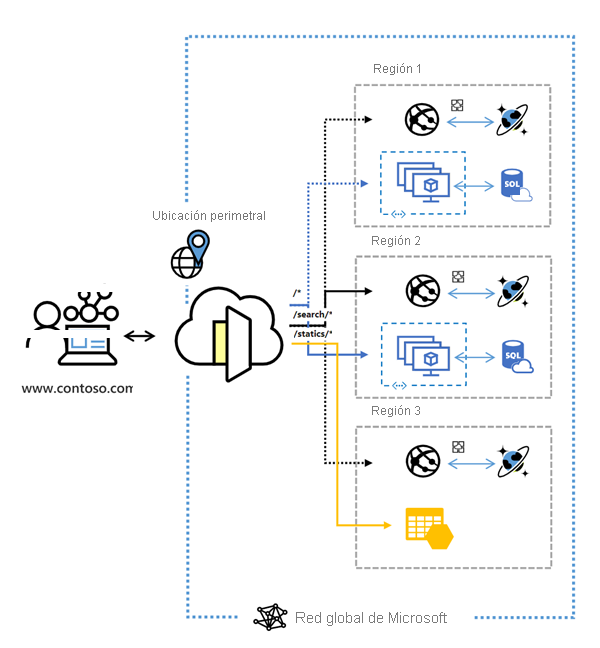

# ¿Qué es Azure Front Door?

Azure Front Door es un punto de entrada global y escalable que usa la red perimetral global de Microsoft para crear aplicaciones web rápidas, seguras y muy escalables. Con Front Door, las aplicaciones empresariales y de consumidor globales se pueden transformar en aplicaciones modernas personalizadas, sólidas y de alto rendimiento con contenido que llegue a un público global mediante Azure.

  

Front Door funciona en la capa 7 (capa HTTP/HTTPS) y usa el protocolo de difusión por proximidad con división TCP y la red global de Microsoft para mejorar la conectividad global. Según el método de enrutamiento, puede asegurarse de que Front Door enrute las solicitudes de cliente al back-end de aplicación más rápido y disponible. Un back-end de aplicación es cualquier servicio accesible desde Internet hospedado dentro o fuera de Azure. Front Door proporciona una serie de [métodos de enrutamiento del tráfico](front-door-routing-methods.md) y [opciones de seguimiento de estado del back-end](front-door-health-probes.md) para satisfacer las distintas necesidades de las aplicaciones y los escenarios de conmutación automática por error. Al igual que [Traffic Manager](../traffic-manager/traffic-manager-overview.md), Front Door es resistente a errores, incluidos los que afectan a una región completa de Azure.

>[!NOTE]
> Azure ofrece un conjunto de soluciones de equilibrio de carga completamente administradas para sus escenarios. 
> * Si busca un enrutamiento global basado en DNS y **no** tiene requisitos de finalización con el protocolo de seguridad de la capa de transporte (TLS) ("descarga SSL"), de procesamiento de niveles de aplicación o por solicitud HTTP/HTTPS, revise [Traffic Manager](../traffic-manager/traffic-manager-overview.md). 
> * Si quiere equilibrar la carga entre los servidores de una región en el nivel de aplicación, revise [Application Gateway](../application-gateway/application-gateway-introduction.md)
> * Para realizar el equilibrio de carga de capa de red, revise [Load Balancer](../load-balancer/load-balancer-overview.md). 
> 
> Sus escenarios pueden beneficiarse de extremo a extremo de la combinación de estas soluciones según sea necesario.
> Si desea ver una comparación de las distintas opciones de equilibrio de carga de Azure, consulte [Información general sobre las opciones de equilibrio de carga en Azure](https://docs.microsoft.com/azure/architecture/guide/technology-choices/load-balancing-overview).

## ¿Por qué usar Azure Front Door?

Con Front Door puede compilar, operar y escalar horizontalmente sus aplicaciones web dinámicas y el contenido estático. Front Door permite definir, administrar y supervisar el enrutamiento global para el tráfico web mediante la optimización para obtener un rendimiento de usuario final de nivel superior y confiabilidad a través de una conmutación por error global rápida.

Características clave incluidas en Front Door:

* Rendimiento acelerado de la aplicación mediante el uso del **[protocolo Anycast](front-door-routing-architecture.md#anycast)** basado en la **[división TCP](front-door-routing-architecture.md#splittcp)** .

* Supervisión del **[sondeo de estado](front-door-health-probes.md)** inteligente para los recursos de back-end.

*  Enrutamiento **[basado en ruta de acceso URL](front-door-route-matching.md)** para las solicitudes.

* Habilita el hospedaje de varios sitios web para una infraestructura de aplicaciones eficaz. 

* **[Afinidad de sesión](front-door-routing-methods.md#affinity)** basada en cookies.

* **[Descarga de SSL](front-door-custom-domain-https.md)** y administración de certificados.

* Definición de su **[propio dominio personalizado](front-door-custom-domain.md)** . 

* Seguridad de las aplicaciones con el **[firewall de aplicaciones web (WAF)](../web-application-firewall/overview.md)** integrado.

* Redireccionamiento del tráfico HTTP a HTTPS con el **[redireccionamiento de direcciones URL](front-door-url-redirect.md)** .

* Ruta de acceso de reenvío personalizada con la **[reescritura de direcciones URL](front-door-url-rewrite.md)** .

* Compatibilidad nativa con conectividad IPv6 de un extremo a otro y el **[protocolo HTTP/2](front-door-http2.md)** .

## Precios

Para obtener información sobre los precios, vea [Precios de Front Door](https://azure.microsoft.com/pricing/details/frontdoor/). Consulte [SLA para Azure Front Door](https://azure.microsoft.com/en-us/support/legal/sla/frontdoor/v1_0/).

## Novedades

Suscríbase a la fuente RSS y vea las actualizaciones más recientes de las características de Azure Front Door en la página [Actualizaciones de Azure](https://azure.microsoft.com/updates/?category=networking&query=Azure%20Front%20Door).

## Pasos siguientes

- Aprenda a [crear una instancia de Front Door](quickstart-create-front-door.md).
- Más información acerca de cómo [funciona Front Door](front-door-routing-architecture.md).
