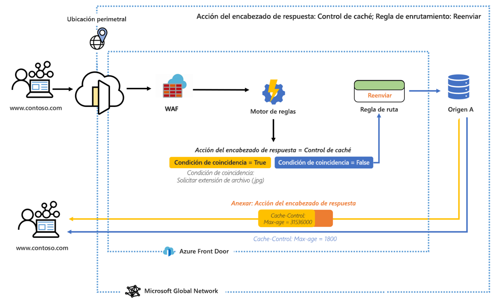
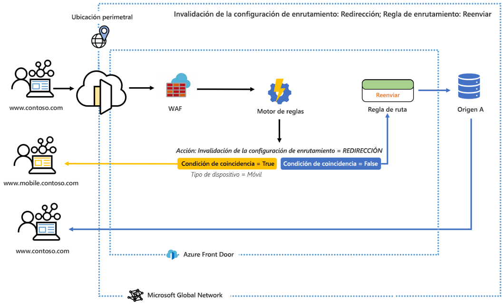

# ¿Qué es el motor de reglas de Azure Front Door? 

El motor de reglas permite personalizar el modo en que se administran las solicitudes HTTP en el perímetro y proporciona un comportamiento más controlado para la aplicación web. El motor de reglas de Azure Front Door consta de varias características clave, entre las que se incluyen:

* Aplica HTTP para garantizar que todos los usuarios finales interactúen con el contenido a través de una conexión segura.
* Implemente encabezados de seguridad para evitar vulnerabilidades basadas en explorador como HTTP Strict-Transport-Security (HSTS), X-XSS-Protection, Content-Security-Policy y X-Frame-Options, además de encabezados Access-Control-Allow-Origin para escenarios de uso compartido de recursos entre orígenes (CORS). Los atributos basados en seguridad también se pueden definir con cookies.
* Enrute las solicitudes a las versiones de escritorio o para dispositivos móviles de la aplicación en función de los patrones del contenido de los encabezados de solicitud, las cookies o las cadenas de consulta.
* Use las funcionalidades de redireccionamiento para devolver los redireccionamientos 301, 302, 307 y 308 al cliente para dirigirse a nuevos nombres de host, rutas de acceso y protocolos.
- Modifique de forma dinámica la configuración de almacenamiento en caché de la ruta en función de las solicitudes entrantes.
- Vuelva a escribir la ruta de acceso de la dirección URL de la solicitud y reenvíe la solicitud al back-end adecuado del grupo de back-end configurado.

## Architecture 

El motor de reglas administra las solicitudes en el perímetro. Cuando una solicitud alcance el punto de conexión de Front Door, primero se ejecuta WAF y, después, la configuración del motor de reglas asociada a su front-end o dominio. Cuando se ejecuta una configuración del motor de reglas, significa que la regla de enrutamiento principal ya es una coincidencia. Para que todas las acciones de cada regla se ejecuten, deben cumplirse todas las condiciones de coincidencia dentro de una regla. Si una solicitud no coincide con ninguna de las condiciones de la configuración del motor de reglas, se ejecuta la regla de enrutamiento predeterminada. 

Por ejemplo, en el diagrama siguiente, un motor de reglas se configura para anexar un encabezado de respuesta. El encabezado cambia la duración máxima del control de caché si se cumple la condición de coincidencia. 

En otro ejemplo, vemos que el motor de reglas está configurado para enviar a un usuario a una versión móvil del sitio web si la condición de coincidencia "tipo de dispositivo" es true. 

En ambos ejemplos, si no se cumple ninguna de las condiciones de coincidencia, se ejecuta la regla de ruta especificada. 

## Terminología 

Con el motor de reglas de Azure Front Door, puede crear una combinación de configuraciones para dicho motor, cada una de las cuales se compone de un conjunto de reglas. A continuación se describen ciertos términos útiles que se utilizarán al configurar el motor de reglas. 

- *Configuración del motor de reglas*: Conjunto de reglas que se aplican a una única regla de enrutamiento. Cada configuración se limita a 25 reglas. Puede crear hasta 10 configuraciones. 
- *Regla del motor de reglas*: Una regla compuesta de un máximo de 10 condiciones de coincidencia y 5 acciones.
- *Condición de coincidencia*: Se pueden usar varias condiciones de coincidencia para analizar las solicitudes entrantes. Una regla puede contener hasta 10 condiciones de coincidencia. Las condiciones de coincidencia se evalúan con un operador **AND**. [Aquí](front-door-rules-engine-match-conditions.md) encontrará una lista completa de las condiciones de coincidencia. 
- *Acción*: Las acciones indican lo que ocurre en las solicitudes entrantes: en la actualidad hay disponibles acciones de encabezado de solicitud o respuesta, reenvío, redireccionamientos y reescrituras. Una regla puede contener hasta cinco acciones; sin embargo, solo puede una invalidación de la configuración de enrutamiento.  [Aquí](front-door-rules-engine-actions.md) encontrará una lista completa de las acciones.

## Pasos siguientes

- Aprenda a configurar su primera [configuración del motor de reglas](front-door-tutorial-rules-engine.md). 
- Aprenda a [crear una instancia de Front Door](quickstart-create-front-door.md).
- Más información acerca de cómo [funciona Front Door](front-door-routing-architecture.md).
