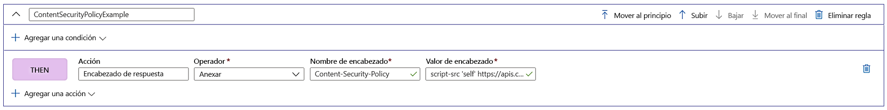

# Agregar encabezados de seguridad con el motor de reglas

Implemente encabezados de seguridad para evitar vulnerabilidades basadas en el explorador como HTTP Strict-Transport-Security (HSTS), X-XSS-Protection, Content-Security-Policy o X-Frame-Options. Los atributos basados en seguridad también se pueden definir con cookies.

En el ejemplo siguiente se muestra cómo agregar un encabezado Content-Security-Policy a todas las solicitudes entrantes que coinciden con la ruta de acceso definida en la ruta a la que está asociada la configuración del motor de reglas. En este caso, solo se permiten la ejecución de scripts de nuestro sitio de confianza, **https://apiphany.portal.azure-api.net** , en nuestra aplicación.

## Adición de un encabezado Content-Security-Policy en Azure Portal

1. Antes de crear esta regla específica, obtenga información acerca de cómo [crear una instancia de Front Door](quickstart-create-front-door.md) o cómo [crear un motor de reglas](front-door-tutorial-rules-engine.md) si es la primera vez que usa AFD o la característica Motor de reglas.

2. Haga clic en **Agregar** para agregar una regla nueva. Proporcione un nombre para la regla y haga clic en **Agregar una acción** > **Encabezado de respuesta**.

3. Establezca Operador en **Anexar** para agregar este encabezado como respuesta a todas las solicitudes entrantes para esta ruta.

4. Agregue el nombre del encabezado: **Content-Security-Policy** y defina los valores que debe aceptar este encabezado. En este escenario, hemos elegido *"script-src 'self' https://apiphany.portal.azure-api.net".*

5. Una vez que haya agregado todas las reglas deseadas a su configuración, no olvide ir a su ruta preferida y asociar la configuración del motor de reglas a la regla de ruta. Este paso es necesario para habilitar la regla para que funcione. 

> [!NOTE]
> En este escenario, no hemos agregado [condiciones de coincidencia](front-door-rules-engine-match-conditions.md) a la regla. Esta regla se aplicará a todas las solicitudes entrantes que coincidan con la ruta de acceso definida en la regla de ruta. Si desea que solo se aplique a un subconjunto de esas solicitudes, asegúrese de agregar las condiciones de coincidencia específicas a esta regla.

## Pasos siguientes

- Obtenga más información sobre el [motor de reglas de Azure Front Door](front-door-rules-engine.md). 
- Aprenda a [crear una instancia de Front Door](quickstart-create-front-door.md).
- Más información acerca de cómo [funciona Front Door](front-door-routing-architecture.md).
- Obtenga más información sobre las [condiciones de coincidencia](front-door-rules-engine-match-conditions.md) del motor de reglas.
- Consulte más información en la [referencia de la CLI](https://docs.microsoft.com/cli/azure/ext/front-door/network/front-door/rules-engine?view=azure-cli-latest) del motor de reglas de Azure Front Door. 
- Consulte más información en la [referencia de la CLI](https://docs.microsoft.com/powershell/module/az.frontdoor/?view=azps-3.8.0) del motor de reglas de Azure Front Door. 
