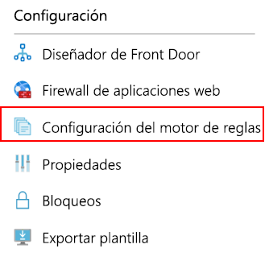
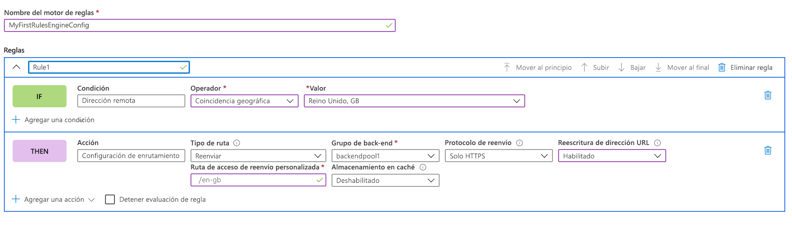
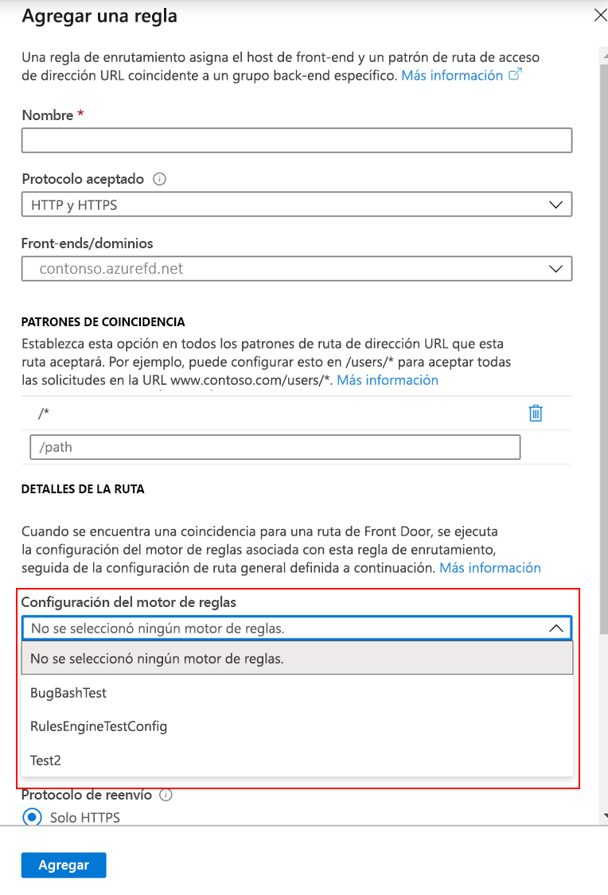

# <a name="tutorial-configure-your-rules-engine"></a>Tutorial: Configuración del motor de reglas

En este tutorial se indica cómo crear una configuración del motor de reglas y la primera regla en Azure Portal y la CLI. 

En este tutorial, aprenderá a:
> [!div class="checklist"]
> - Configurar el motor de reglas mediante el portal.
> - Configurar el motor de reglas mediante la CLI de Azure.

## <a name="prerequisites"></a>Prerrequisitos

* Para poder completar los pasos de este tutorial, primero debe crear una instancia de Front Door. Para más información, consulte [Inicio rápido: Cree una instancia de Front Door](quickstart-create-front-door.md).

## <a name="configure-rules-engine-in-azure-portal"></a>Configuración del motor de reglas en Azure Portal
1. En el recurso de Front Door, vaya a **Configuración** y seleccione **Configuración del motor de reglas**. Haga clic en **Agregar**, asigne un nombre a la configuración y empiece a crear la primera configuración del motor de reglas.

    

1. Haga clic en **Agregar regla** para crear la primera regla. A continuación, haga clic en **Agregar condición** o **Agregar acción** para definir la regla.
    
    > [!NOTE]
    >- Para eliminar una condición o acción de la regla, use la papelera que aparece en el lado derecho de la condición o acción específica.
    > - Para crear una regla que se aplique a todo el tráfico entrante, no especifique ninguna condición.
    > - Para detener la evaluación de reglas una vez que se cumpla la primera condición de coincidencia, marque **Detener la evaluación de las reglas restantes**. Si se ha activado esta opción y se cumplen todas las condiciones de coincidencia de una regla en particular, el resto de reglas de la configuración no se ejecutará.  

     

1. Para determinar la prioridad de las reglas de configuración, use los botones Mover hacia arriba, Mover hacia abajo y Mover a la parte superior. La prioridad está en orden ascendente, lo que significa que la regla que aparece en primer lugar es la regla más importante.

1. Una vez que haya creado una o varias reglas, presione **Guardar**. Esta acción crea la configuración del motor de reglas.

1. Una vez que haya creado una o varias configuraciones, asocie una configuración del motor de reglas a una regla de enrutamiento. Aunque una sola configuración se puede aplicar a muchas reglas de enrutamiento, una regla de enrutamiento solo puede contener una configuración del motor de reglas. Para realizar la asociación, vaya a **Diseñador de Front Door** > **Reglas de enrutamiento**. Seleccione la regla de enrutamiento a la que desea agregar la configuración del motor de reglas, vaya a **Detalles de la ruta** > **Configuración del motor de reglas** y seleccione la configuración que desea asociar.

    


## <a name="configure-rules-engine-in-azure-cli"></a>Configuración del motor de reglas en la CLI de Azure

1. Si aún no lo ha hecho, instale la [CLI de Azure](https://docs.microsoft.com/cli/azure/install-azure-cli?view=azure-cli-latest&preserve-view=true). Agregue la extensión "front-Door":- az extension add --name front-door. A continuación, inicie sesión y cambie a la suscripción: az account set --subscription <nombre_o_Id>.

1. Empiece por crear un motor de reglas: este ejemplo muestra una regla con una acción basada en el encabezado y una condición de coincidencia. 

    ```azurecli-interactive
    az network front-door rules-engine rule create -f {front_door} -g {resource_group} --rules-engine-name {rules_engine} --name {rule1} --priority 1 --action-type RequestHeader --header-action Overwrite --header-name Rewrite --header-value True --match-variable RequestFilenameExtension --operator Contains --match-values jpg png --transforms Lowercase
    ```

1. Enumere todas las reglas. 

    ```azurecli-interactive
    az network front-door rules-engine rule list -f {front_door} -g {rg} --name {rules_engine}
    ```

1. Agregue una acción de invalidación del enrutamiento de reenvío. 

    ```azurecli-interactive
    az network front-door rules-engine rule action add -f {front_door} -g {rg} --rules-engine-name {rules_engine} --name {rule1} --action-type ForwardRouteOverride --backend-pool {backend_pool_name} --caching Disabled
    ```

1. Enumere todas las acciones de una regla. 

    ```azurecli-interactive
    az network front-door rules-engine rule action list -f {front_door} -g {rg} -r {rules_engine} --name {rule1}
    ```

1. Vincule una configuración del motor de reglas a una regla de enrutamiento.  

    ```azurecli-interactive
    az network front-door routing-rule update -g {rg} -f {front_door} -n {routing_rule_name} --rules-engine {rules_engine}
    ```

1. Desvincule el motor de reglas. 

    ```azurecli-interactive
    az network front-door routing-rule update -g {rg} -f {front_door} -n {routing_rule_name} --remove rulesEngine # case sensitive word ‘rulesEngine’
    ```

Para más información, puede encontrar una lista completa de los comandos del motor de reglas de Azure Front Door [aquí](https://docs.microsoft.com/cli/azure/ext/front-door/network/front-door/rules-engine?view=azure-cli-latest&preserve-view=true).   

## <a name="clean-up-resources"></a>Limpieza de recursos

En los pasos anteriores, ha configurado y asociado la configuración del motor de reglas a las reglas de enrutamiento. Si ya no desea que la configuración del motor de reglas esté asociada a Front Door, puede quitar la configuración realizando los pasos siguientes:

1. Desasocie las reglas de enrutamiento de la configuración del motor de reglas haciendo clic en los tres puntos situados junto al nombre del motor de reglas.

    :::image type="content" source="./media/front-door-rules-engine/front-door-rule-engine-routing-association.png" alt-text="Asociación de reglas de enrutamiento":::

1. Desactive todas las reglas de enrutamiento a las que está asociada esta configuración del motor de reglas y haga clic en Guardar.

    :::image type="content" source="./media/front-door-rules-engine/front-door-routing-rule-association.png" alt-text="Asociación de reglas de enrutamiento":::

1. Ahora puede eliminar la configuración del motor de reglas de Front Door.

    :::image type="content" source="./media/front-door-rules-engine/front-door-delete-rule-engine-configuration.png" alt-text="Asociación de reglas de enrutamiento":::

## <a name="next-steps"></a>Pasos siguientes

En este tutorial, ha aprendido a:

* Crear una configuración del motor de reglas
* Asociar la configuración a las reglas de enrutamiento de Front Door.

Para obtener información sobre cómo agregar encabezados de seguridad con el motor de reglas, continúe con el siguiente tutorial.

> [!div class="nextstepaction"]
> [Encabezados de seguridad con el motor de reglas](front-door-security-headers.md)
