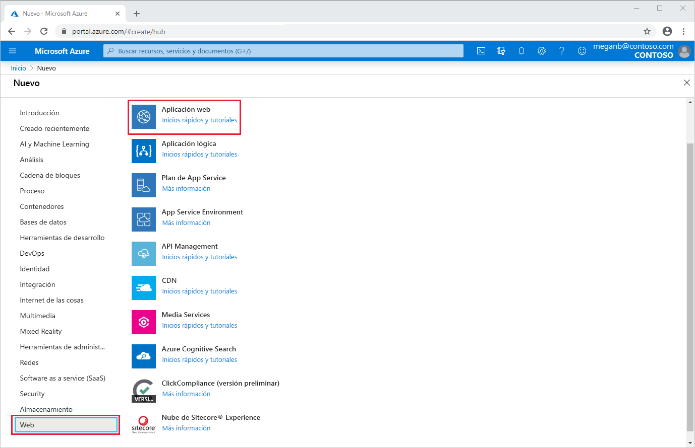
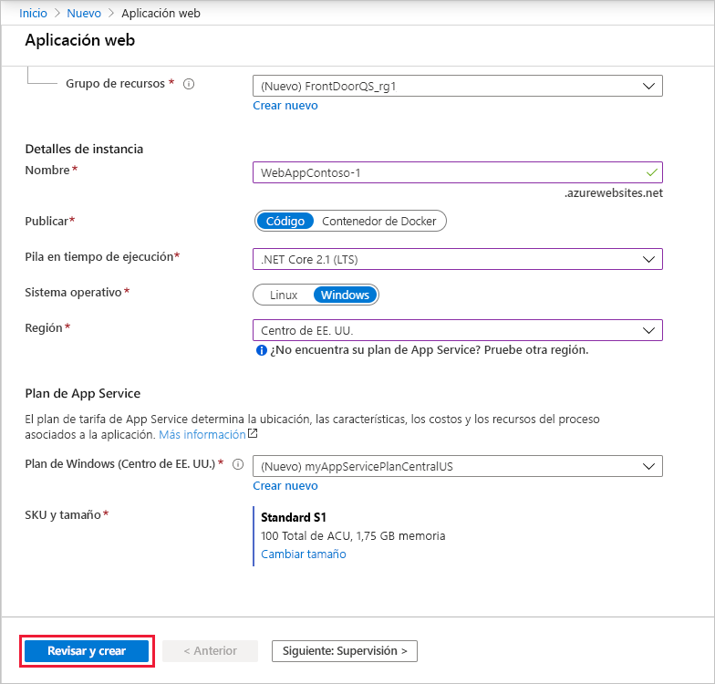
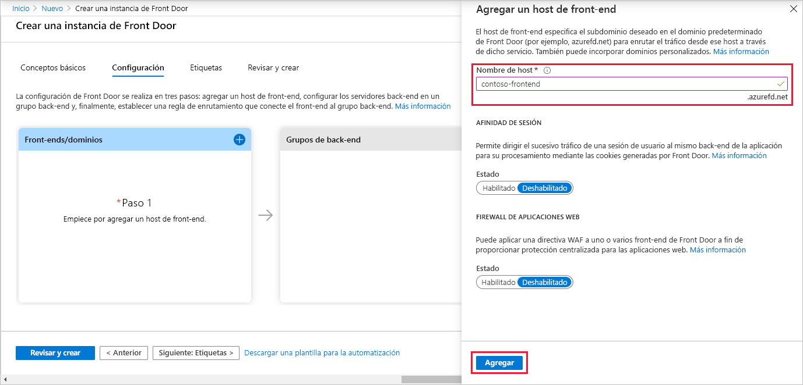
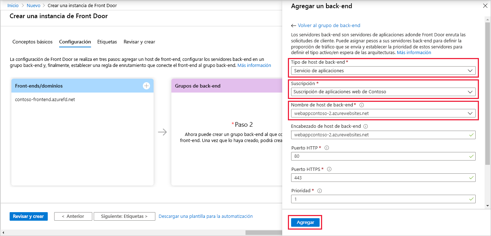
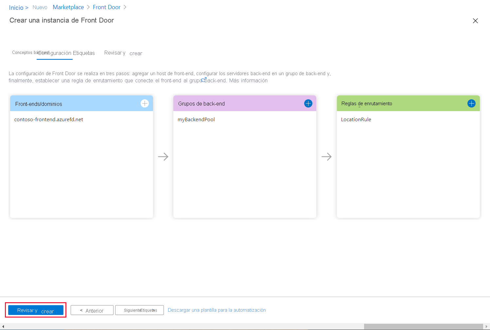
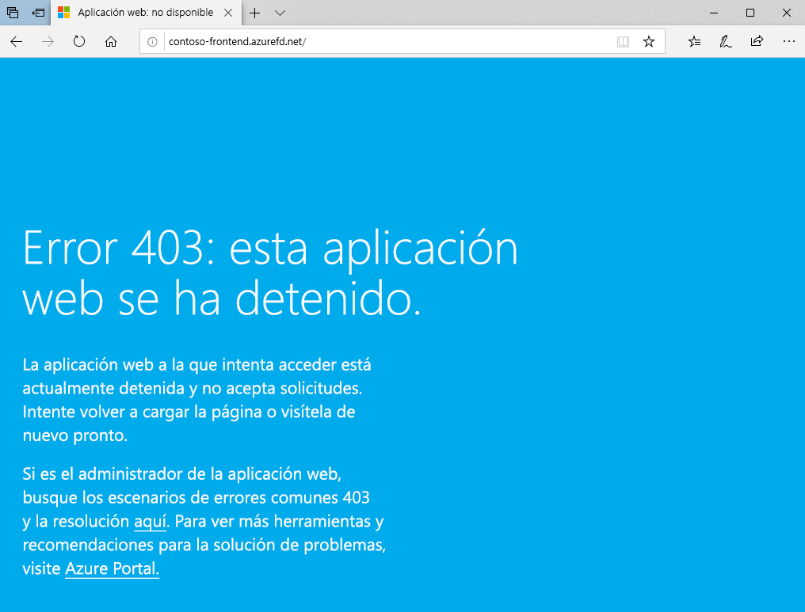

# Inicio rápido: Cree una instancia de Front Door para una aplicación web global de alta disponibilidad.

Empiece a trabajar con Azure Front Door mediante Azure Portal para configurar alta disponibilidad para una aplicación web.

En este inicio rápido, Azure Front Door agrupa dos instancias de una aplicación web que se ejecutan en regiones diferentes de Azure. Cree una configuración de Front Door basada en back-ends con la misma ponderación y prioridad. Esta configuración dirige el tráfico al sitio más cercano que ejecuta la aplicación. Azure Front Door supervisa continuamente la aplicación web. El servicio proporciona conmutación automática por error al siguiente sitio disponible si el sitio más cercano no lo está.

## Prerrequisitos

- Una cuenta de Azure con una suscripción activa. [Cree una cuenta gratuita](https://azure.microsoft.com/free/?WT.mc_id=A261C142F).

## Creación de dos instancias de una aplicación web

Este inicio rápido requiere dos instancias de una aplicación web que se ejecuten en regiones diferentes de Azure. Ambas instancias de la aplicación web se ejecutan en modo *activo/activo*, por lo que cualquiera de ellas puede asumir el tráfico. Esta configuración difiere de una configuración *activa/en espera*, en la que una realiza la conmutación por error.

Si aún no tiene una aplicación web, use los pasos siguientes para configurar aplicaciones web de ejemplo.

1. Inicie sesión en Azure Portal en https://portal.azure.com.

1. En la página principal o en el menú de Azure Portal, seleccione **Crear un recurso**.

1. Seleccione **Web** > **Aplicación web**.

   

1. En **Aplicación web**, seleccione la **suscripción** que se va a usar.

1. En **Grupo de recursos**, seleccione **Crear nuevo**. Escriba *FrontDoorQS_rg1* como **Nombre** y seleccione **Aceptar**.

1. En **Detalles de la instancia**, escriba un **nombre** único para la aplicación web. En este ejemplo se usa *WebAppContoso-1*.

1. Seleccione una **Pila del entorno en tiempo de ejecución**, en este ejemplo *.NET Core 2.1 (LTS)* .

1. Seleccione una región, como *Centro de EE. UU.* .

1. En **Plan de Windows**, seleccione **Crear nuevo**. Escriba *myAppServicePlanCentralUS* como **nombre** y seleccione **Aceptar**.

1. Asegúrese de que **SKU y tamaño** es **Estándar S1 100 ACU total, 1,75 GB de memoria**.

1. Seleccione **Revisar y crear**, revise el **resumen** y, después, seleccione **Crear**. La implementación puede tardar varios minutos en completarse.

   

Una vez finalizada la implementación, cree una segunda aplicación web. Utilice el mismo procedimiento con los mismos valores, excepto los siguientes:

| Configuración          | Value     |
| ---              | ---  |
| **Grupos de recursos**   | Seleccione **Nuevo** y escriba *FrontDoorQS_rg2* |
| **Nombre**             | Escriba un nombre único para la aplicación web, en este ejemplo, *WebAppContoso-2*  |
| **Región**           | Una región distinta, en este ejemplo, *Centro-sur de EE. UU.* |
| **Plan de App Service** > **Plan de Windows**         | Seleccione **Nuevo** y escriba *myAppServicePlanSouthCentralUS* y, a continuación, seleccione **Aceptar**. |

## Creación de una instancia de Front Door para una aplicación

Configure Azure Front Door para dirigir el tráfico del usuario en función de la latencia más baja entre los dos servidores de las aplicaciones web. Para empezar, agregue un host de front-end para Azure Front Door.

1. En la página principal o en el menú de Azure Portal, seleccione **Crear un recurso**. Seleccione **Redes** > **Front Door**.

1. En **Crear una instancia de Front Door**, seleccione una **suscripción**.

1. En **Grupo de recursos**, seleccione **Nuevo**, escriba *FrontDoorQS_rg0* y seleccione **Aceptar**.  Puede usar un grupo de recursos existente.

1. Si ha creado un grupo de recursos, seleccione una **ubicación del grupo de recursos** y, después, seleccione **Siguiente: Configuración**.

1. En **Front-ends/dominios**, seleccione **+** para abrir **Agregar un host de front-end**.

1. En **Nombre de host**, escriba un nombre de host único global. En este ejemplo se usa *contoso-frontend*. Seleccione **Agregar**.

   

A continuación, cree un grupo de back-end que contenga las dos aplicaciones web.

1. Todavía en **Crear una instancia de Front Door**, en **Grupos de back-end**, seleccione **+** para abrir **Agregar un grupo de back-end**.

1. En **Nombre**, escriba *myBackendPool*.

1. Seleccione **Agregar un back-end**. En **Tipo de host de back-end**, seleccione *App Service*.

1. Seleccione la suscripción y, a continuación, elija la primera aplicación web que creó en **Nombre de host de back-end**. En este ejemplo, la aplicación web era *WebAppContoso-1*. Seleccione **Agregar**.

1. Seleccione **Agregar un back-end** de nuevo. En **Tipo de host de back-end**, seleccione *App Service*.

1. Seleccione otra vez la suscripción y elija la segunda aplicación web que creó en **Nombre de host de back-end**. Seleccione **Agregar**.

   

Por último, agregue una regla de enrutamiento. Una regla de enrutamiento asigna el host de front-end al grupo de back-end. La regla reenvía una solicitud para `contoso-frontend.azurefd.net` a **myBackendPool**.

1. Todavía en **Crear una instancia de Front Door**, en **Reglas de enrutamiento**, seleccione **+** para configurar una.

1. En **Agregar una regla**, en **Nombre**, escriba *LocationRule*. Acepte todos los valores predeterminados y, a continuación, seleccione **Agregar** para agregar la regla de enrutamiento.

   >[!WARNING]
   > **Debe** asegurarse de que todos los hosts de front-end de Front Door tienen una regla de enrutamiento con una ruta de acceso predeterminada (`\*`) asociada. Es decir, entre todas las reglas de enrutamiento debe haber al menos una para cada uno de los hosts de front-end que se definen en la ruta de acceso predeterminada (`\*`). Si no la hay, puede darse el caso de que el tráfico del usuario final no se enrute correctamente.

1. Seleccione **Revisar y crear** y, a continuación, **Crear**.

   

## Visualización de Front Door en acción

Una vez que cree una instancia de Front Door, la configuración tardará unos minutos en implementarse globalmente. Cuando lo haya hecho, acceda al host de front-end que ha creado. Vaya a `contoso-frontend.azurefd.net` en un explorador. La solicitud se enrutará automáticamente al servidor más cercano de entre los servidores especificados en el grupo de back-end.

Si ha creado estas aplicaciones en este inicio rápido, verá una página de información.

Para probar la conmutación por error global instantánea, realice estos pasos:

1. Abra un explorador como se indica más arriba y vaya a la dirección de front-end: `contoso-frontend.azurefd.net`.

1. En Azure Portal, busque y seleccione *App Services*. Desplácese hacia abajo hasta encontrar una de sus aplicaciones web, **WebAppContoso-1** en este ejemplo.

1. Seleccione la aplicación web y, a continuación, seleccione **Detener** y **Sí** para confirmar.

1. Actualice el explorador. Debería aparecer la misma página de información.

   >[!TIP]
   >Hay algo de retraso en estas acciones. Puede que tenga que actualizar de nuevo.

1. Busque la otra aplicación web y deténgala también.

1. Actualice el explorador. Esta vez debería aparecer un mensaje de error.

   

## Limpieza de recursos

Una vez que haya terminado, puede eliminar todos los elementos que haya creado. La eliminación de un grupo de recursos también elimina su contenido. Si no tiene pensado utilizar esta instancia de Front Door, debe eliminar los recursos para evitar cargos innecesarios.

1. En Azure Portal, busque y seleccione **Grupos de recursos** o seleccione **Grupos de recursos** desde el menú de Azure Portal.

1. Filtre o desplácese hacia abajo hasta encontrar un grupo de recursos, por ejemplo **FrontDoorQS_rg0**.

1. Seleccione el grupo de recursos y, después, seleccione **Eliminar grupo de recursos**.

   >[!WARNING]
   >Esta acción es irreversible.

1. Escriba el nombre del grupo de recursos para confirmar y, a continuación, seleccione **Eliminar**.

Repita el procedimiento anterior con los otros dos grupos.

## Pasos siguientes

Pase al siguiente artículo para aprender a agregar un dominio personalizado a Front Door.
> [!div class="nextstepaction"]
> [Agregar un dominio personalizado](front-door-custom-domain.md)

Para más información acerca del enrutamiento de tráfico, consulte [Métodos de enrutamiento de Front Door](front-door-routing-methods.md).
