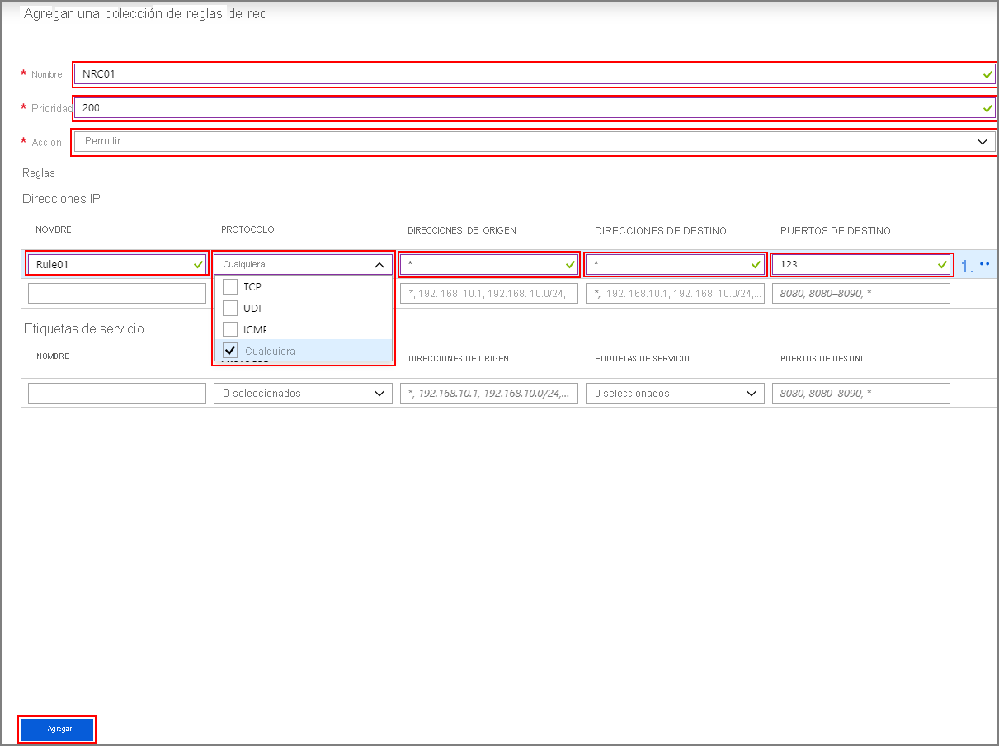

# <a name="configure-outbound-network-traffic-for-azure-hdinsight-clusters-using-firewall"></a>Configuración del tráfico de red saliente para clústeres de Azure HDInsight mediante Firewall

Este artículo proporciona los pasos para proteger el tráfico saliente del clúster de HDInsight con Azure Firewall. En los pasos siguientes se supone que va a configurar Azure Firewall para un clúster existente. Si va a implementar un nuevo clúster detrás de un firewall, cree primero el clúster de HDInsight y una subred. Después, siga los pasos de esta guía.

## <a name="background"></a>Información previa

Los clústeres de HDInsight se implementan normalmente en una red virtual. El clúster tiene dependencias en servicios que están fuera de esa red.

El tráfico entrante de administración no se puede enviar a través de un firewall. Puede usar etiquetas de servicio de NSG para el tráfico entrante, tal y como se documenta [aquí](./hdinsight-service-tags.md). 

Las dependencias del tráfico de salida de HDInsight aislado se definen casi por completo con nombres de dominio completos. Estos no tienen direcciones IP estáticas detrás. La falta de direcciones estáticas significa que los grupos de seguridad de red (NSG) no pueden bloquear el tráfico saliente de un clúster. Las direcciones IP cambian con tal frecuencia que no se pueden configurar reglas en función de la resolución de nombres y del uso actualmente.

Proteja las direcciones salientes mediante un firewall que controle el tráfico saliente en función de los nombres de dominio completo. Azure Firewall restringe el tráfico saliente en función del nombre de dominio completo del destino o las [etiquetas de FQDN](../firewall/fqdn-tags.md).

## <a name="configuring-azure-firewall-with-hdinsight"></a>Configuración de Azure Firewall con HDInsight

A continuación, se proporciona un resumen de los pasos para bloquear la salida del clúster de HDInsight existente con Azure Firewall:

1. Cree una subred.
1. Cree un firewall.
1. Agregue reglas de aplicación al firewall.
1. Agregue reglas de red al firewall.
1. Cree una tabla de enrutamiento.

### <a name="create-new-subnet"></a>Creación de una subred

Cree una subred llamada **AzureFirewallSubnet** en la red virtual donde exista el clúster.

### <a name="create-a-new-firewall-for-your-cluster"></a>Creación de un nuevo firewall para el clúster

Cree un firewall llamado **Test-FW01** mediante los pasos descritos en **Implementación del firewall** del [Tutorial: Implementación y configuración de Azure Firewall mediante Azure Portal](../firewall/tutorial-firewall-deploy-portal.md#deploy-the-firewall).

### <a name="configure-the-firewall-with-application-rules"></a>Configuración del firewall con reglas de aplicación

Cree una colección de reglas de aplicación que permita al clúster enviar y recibir comunicaciones importantes.

1. Seleccione el nuevo firewall **Test-FW01** en Azure Portal.

1. Vaya a **Configuración** > **Reglas** > **Recopilación de reglas de aplicación** >  **+ Agregar una colección de reglas de aplicación** .

    

1. En la pantalla **Agregar una colección de reglas de aplicación** , realice los pasos siguientes:

    **Sección superior**

    | Propiedad|  Value|
    |---|---|
    |Nombre| FwAppRule|
    |Priority|200|
    |Acción|Allow|

    **Sección de etiquetas FQDN**

    | Nombre | Dirección de origen | Etiqueta FQDN | Notas |
    | --- | --- | --- | --- |
    | Rule_1 | * | WindowsUpdate y HDInsight | Necesario para los servicios de HDI |

    **Sección de FQDN de destino**

    | Nombre | Direcciones de origen | Protocolo:Puerto | FQDN de destino | Notas |
    | --- | --- | --- | --- | --- |
    | Rule_2 | * | https:443 | login.windows.net | Permite la actividad de inicio de sesión de Windows |
    | Rule_3 | * | https:443 | login.microsoftonline.com | Permite la actividad de inicio de sesión de Windows |
    | Rule_4 | * | https:443,http:80 | storage_account_name.blob.core.windows.net | Reemplace `storage_account_name` por el nombre de la cuenta de almacenamiento real. Para usar SOLO conexiones https, asegúrese de que la opción ["se requiere transferencia segura"](../storage/common/storage-require-secure-transfer.md) esté habilitada en la cuenta de almacenamiento. Si usa un punto de conexión privado para acceder a cuentas de almacenamiento, este paso no es necesario y el tráfico de almacenamiento no se reenviará al firewall.|

   

1. Seleccione **Agregar** .

### <a name="configure-the-firewall-with-network-rules"></a>Configuración del firewall con reglas de red

Cree las reglas de red para configurar correctamente el clúster de HDInsight.

1. Siguiendo con el paso anterior, vaya a **Recopilación de reglas de red** >  **+ Agregar recopilación de reglas de red** .

1. En la pantalla **Agregar una colección de reglas de red** , proporcione la siguiente información:

    **Sección superior**

    | Propiedad|  Value|
    |---|---|
    |Nombre| FwNetRule|
    |Priority|200|
    |Acción|Allow|

    **Sección de etiquetas de servicio**

    | Nombre | Protocolo | Direcciones de origen | Etiquetas de servicio | Puertos de destino | Notas |
    | --- | --- | --- | --- | --- | --- |
    | Rule_5 | TCP | * | SQL | 1433 | Si usa los servidores SQL Server predeterminados proporcionados por HDInsight, configure una regla de red en la sección de etiquetas de servicio para SQL que le permita registrar y auditar el tráfico de SQL. A menos que haya configurado los puntos de conexión de servicio para SQL Server en la subred de HDInsight, el firewall se omitirá. Si usa un servidor SQL Server personalizado para tiendas de metadatos de Ambari, Oozie, Ranger e Hive, solo tiene que permitir el tráfico para sus propios servidores SQL Server personalizados.|
    | Rule_6 | TCP | * | Azure Monitor | * | (opcional) Los clientes que piensan usar la característica de escalado automático deben agregar esta regla. |
    
   

1. Seleccione **Agregar** .

### <a name="create-and-configure-a-route-table"></a>Creación y configuración de una tabla de rutas

Cree una tabla de rutas con las siguientes entradas:

* Todas las direcciones IP de los [servicios de mantenimiento y administración](../hdinsight/hdinsight-management-ip-addresses.md#health-and-management-services-all-regions) con un tipo de próximo salto para **Internet** . Debe incluir 4 direcciones IP para las regiones genéricas y 2 direcciones IP para la región específica. Esta regla solo es necesaria si ResourceProviderConnection se establece en *Inbound* . Si ResourceProviderConnection se establece en *Outbound* , estas direcciones IP no son necesarias en el UDR. 

* Una ruta de aplicación virtual para la dirección IP 0.0.0.0/0 con el próximo salto establecido en la dirección IP privada de la instancia de Azure Firewall.

Por ejemplo, para configurar la tabla de rutas de un clúster creado en la región de Estados Unidos "Este de EE. UU.", use los pasos siguientes:

1. Seleccione el firewall de Azure **Test-FW01** . Copie la **Dirección IP privada** que aparece en la página **Información general** . En este ejemplo se usará la **dirección de ejemplo 10.0.2.4** .

1. A continuación, vaya a **Todos los servicios** > **Redes** > **Tablas de rutas** y **Crear tabla de rutas** .

1. En la nueva ruta, vaya a **Configuración** > **Rutas** >  **+ Agregar** . Agregue las siguientes rutas:

| Nombre de ruta | Prefijo de dirección | Tipo de próximo salto | Siguiente dirección de salto |
|---|---|---|---|
| 168.61.49.99 | 168.61.49.99/32 | Internet | N/D |
| 23.99.5.239 | 23.99.5.239/32 | Internet | N/D |
| 168.61.48.131 | 168.61.48.131/32 | Internet | N/D |
| 138.91.141.162 | 138.91.141.162/32 | Internet | N/D |
| 13.82.225.233 | 13.82.225.233/32 | Internet | N/D |
| 40.71.175.99 | 40.71.175.99/32 | Internet | N/D |
| 0.0.0.0 | 0.0.0.0/0 | Aplicación virtual | 10.0.2.4 |

Complete la configuración de la tabla de rutas:

1. Asigne la tabla de rutas que ha creado a la subred de HDInsight; para ello, seleccione **Subredes** en **Configuración** .

1. Seleccione **+ Asociar** .

1. En la pantalla **Asociar subred** , seleccione la red virtual en la que se creó el clúster. Además, seleccione la **subred** que usó para el clúster de HDInsight.

1. Seleccione **Aceptar** .

## <a name="edge-node-or-custom-application-traffic"></a>Nodo perimetral o tráfico de aplicación personalizado

Los pasos anteriores permitirán que el clúster funcione sin incidencias. Deberá configurar las dependencias para dar cabida a las aplicaciones personalizadas que se ejecutan en los nodos perimetrales, si procede.

Las dependencias de la aplicación se identificar y agregar a Azure Firewall o a la tabla de rutas.

Se deben crear rutas para el tráfico de la aplicación para evitar incidencias de enrutamiento asimétrico.

Si las aplicaciones tienen otras dependencias, deben agregarse a Azure Firewall. Crear reglas de aplicación para permitir el tráfico HTTP/HTTPS y reglas de red para todo lo demás.

## <a name="logging-and-scale"></a>Registro y escala

Azure Firewall puede enviar registros a algunos sistemas de almacenamiento diferentes. Para obtener instrucciones sobre la configuración del registro para el firewall, siga los pasos de [Tutorial: Supervisión de métricas y registros de Azure Firewall](../firewall/firewall-diagnostics.md).

Cuando haya completado la configuración del registro, si va a usar Log Analytics, puede ver el tráfico bloqueado con una consulta como la siguiente:

```Kusto
AzureDiagnostics | where msg_s contains "Deny" | where TimeGenerated >= ago(1h)
```

La integración de Azure Firewall con los registros de Azure Monitor resulta útil cuando una aplicación funciona por primera vez. En particular, cuando no conoce todas las dependencias de la aplicación. Puede obtener más información acerca de los registros de Azure Monitor en [Análisis de datos de registro en Azure Monitor](../azure-monitor/log-query/log-query-overview.md).

Para información sobre los límites de escala de Azure Firewall y los aumentos de solicitud, consulte [este](../azure-resource-manager/management/azure-subscription-service-limits.md#azure-firewall-limits) documento o las [preguntas más frecuentes](../firewall/firewall-faq.md).

## <a name="access-to-the-cluster"></a>Acceso al clúster

Después de configurar correctamente el firewall, puede usar el punto de conexión interno (`https://CLUSTERNAME-int.azurehdinsight.net`) para acceder a Ambari desde dentro de la red virtual.

Para usar el punto de conexión público (`https://CLUSTERNAME.azurehdinsight.net`) o el punto de conexión de SSH (`CLUSTERNAME-ssh.azurehdinsight.net`), asegúrese de que dispone de las rutas adecuadas en la tabla de rutas y las reglas del grupo de seguridad de red para evitar la incidencia de enrutamiento asimétrico que se explica [aquí](../firewall/integrate-lb.md). En este caso concreto, debe permitir la dirección IP del cliente en las reglas del grupo de seguridad de red de entrada y también agregarla a la tabla de rutas definida por el usuario con el próximo salto establecido como `internet`. Si el enrutamiento no se configura correctamente, verá un error de tiempo de espera.

## <a name="next-steps"></a>Pasos siguientes

* [Arquitectura de red virtual de Azure HDInsight](hdinsight-virtual-network-architecture.md)
* [Configuración de una aplicación virtual de red](./network-virtual-appliance.md)