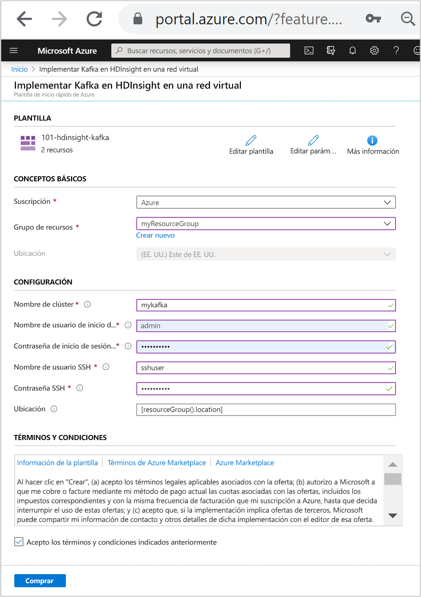
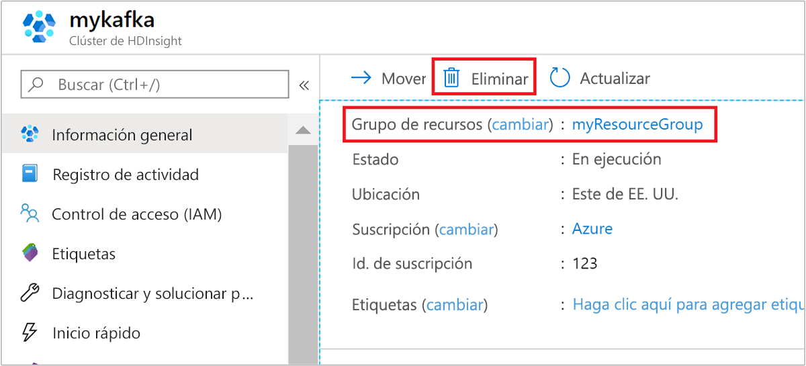

# <a name="quickstart-create-apache-kafka-cluster-in-azure-hdinsight-using-arm-template"></a>Inicio rápido: Creación de un clúster de Apache Kafka en Azure HDInsight mediante una plantilla de ARM

En este inicio rápido, se usa una plantilla de Azure Resource Manager (plantilla de ARM) para crear un clúster de [Apache Kafka](./apache-kafka-introduction.md) en Azure HDInsight. Kafka es una plataforma de streaming distribuida de código abierto. A menudo se usa como agente de mensajes, ya que proporciona una funcionalidad similar a una cola de mensajes de publicación o suscripción.

[!INCLUDE [About Azure Resource Manager](../../../includes/resource-manager-quickstart-introduction.md)]

Solo los recursos dentro de la misma red virtual pueden tener acceso a la API de Kafka. En esta guía de inicio rápido, tendrá acceso al clúster directamente mediante SSH. Para conectar otros servicios, redes o máquinas virtuales con Kafka, primero debe crear una red virtual y, a continuación, crear los recursos dentro de la red. Para más información, consulte el documento [Conexión a Kafka en HDInsight mediante una instancia de Azure Virtual Network](apache-kafka-connect-vpn-gateway.md).

Si su entorno cumple los requisitos previos y está familiarizado con el uso de plantillas de Resource Manager, seleccione el botón **Implementar en Azure**. La plantilla se abrirá en Azure Portal.

[](https://portal.azure.com/#create/Microsoft.Template/uri/https%3A%2F%2Fraw.githubusercontent.com%2FAzure%2Fazure-quickstart-templates%2Fmaster%2F101-hdinsight-kafka%2Fazuredeploy.json)

## <a name="prerequisites"></a>Requisitos previos

Si no tiene una suscripción a Azure, cree una [cuenta gratuita](https://azure.microsoft.com/free/?WT.mc_id=A261C142F) antes de empezar.

## <a name="review-the-template"></a>Revisión de la plantilla

La plantilla usada en este inicio rápido forma parte de las [plantillas de inicio rápido de Azure](https://azure.microsoft.com/resources/templates/101-hdinsight-kafka/).

:::code language="json" source="~/quickstart-templates/101-hdinsight-kafka/azuredeploy.json" range="1-203" highlight="103-135":::

En la plantilla se definen dos recursos de Azure:

* [Microsoft.Storage/storageAccounts](/azure/templates/microsoft.storage/storageaccounts): permite crear una cuenta de Azure Storage.
* [Microsoft.HDInsight/cluster](/azure/templates/microsoft.hdinsight/clusters): permite crear un clúster de HDInsight.

## <a name="deploy-the-template"></a>Implementación de la plantilla

1. Seleccione el botón **Implementar en Azure** siguiente para iniciar sesión en Azure y abrir la plantilla de ARM.

   [](https://portal.azure.com/#create/Microsoft.Template/uri/https%3A%2F%2Fraw.githubusercontent.com%2FAzure%2Fazure-quickstart-templates%2Fmaster%2F101-hdinsight-kafka%2Fazuredeploy.json)

1. Escriba o seleccione los siguientes valores:

    |Propiedad |Descripción |
    |---|---|
    |Suscripción|En la lista desplegable, seleccione la suscripción de Azure que se usa para el clúster.|
    |Resource group|En la lista desplegable, seleccione el grupo de recursos existente o seleccione **Crear**.|
    |Location|El valor se rellenará automáticamente con la ubicación usada para el grupo de recursos.|
    |Cluster Name|Escriba un nombre único global. Use solo letras minúsculas y números para esta plantilla.|
    |Cluster Login User Name (Nombre de usuario de inicio de sesión del clúster)|Proporcione el nombre de usuario; el valor predeterminado es **admin**.|
    |Cluster Login Password (Contraseña de inicio de sesión del clúster)|Indique una contraseña. La contraseña debe tener un mínimo de 10 caracteres y contener al menos un dígito, una letra mayúscula y una letra minúscula, y un carácter no alfanumérico (excepto los caracteres ' " y `). |
    |Nombre de usuario de SSH|Proporcione el nombre de usuario; el valor predeterminado es **sshuser**.|
    |Contraseña de SSH|Proporcione la contraseña.|

    

1. Revise los **TÉRMINOS Y CONDICIONES**. A continuación, seleccione **Acepto los términos y condiciones indicados anteriormente** y, después, seleccione **Comprar**. Recibirá una notificación de que la implementación está en curso. Se tarda aproximadamente 20 minutos en crear un clúster.

## <a name="review-deployed-resources"></a>Revisión de los recursos implementados

Una vez que se cree el clúster, recibirá una notificación de **Implementación correcta** con el vínculo **Ir al recurso**. La página Grupo de recursos mostrará el nuevo clúster de HDInsight y el almacenamiento predeterminado asociado con el clúster. Cada clúster depende de una cuenta de [Azure Storage](../hdinsight-hadoop-use-blob-storage.md) o de una [cuenta de Azure Data Lake Storage](../hdinsight-hadoop-use-data-lake-store.md). Se conoce como cuenta de almacenamiento predeterminada. El clúster de HDInsight y su cuenta de almacenamiento predeterminada deben estar en la misma región de Azure. Al eliminar los clústeres no se elimina la cuenta de almacenamiento.

## <a name="get-the-apache-zookeeper-and-broker-host-information"></a>Obtención de la información del host de Apache Zookeeper y del agente

Cuando se trabaja con Kafka, debe conocer los hosts de *Apache Zookeeper* y del *agente*. Estos hosts se usan con la API de Kafka y muchas de las utilidades que se incluyen con Kafka.

En esta sección, obtendrá la información de host de la API de REST de Ambari en el clúster.

1. Use el [comando SSH](../hdinsight-hadoop-linux-use-ssh-unix.md) para conectarse al clúster. Modifique el comando siguiente: reemplace CLUSTERNAME por el nombre del clúster y, luego, escriba el comando:

    ```cmd
    ssh sshuser@CLUSTERNAME-ssh.azurehdinsight.net
    ```

1. Desde la conexión SSH, use el siguiente comando para instalar la utilidad `jq`. Esta utilidad se usa para analizar documentos JSON y es útil para recuperar la información de host:

    ```bash
    sudo apt -y install jq
    ```

1. Para establecer una variable de entorno en el nombre del clúster, use el comando siguiente:

    ```bash
    read -p "Enter the Kafka on HDInsight cluster name: " CLUSTERNAME
    ```

    Cuando se le solicite, escriba el nombre del clúster de Kafka.

1. Para establecer una variable de entorno con la información de host de Zookeeper, use el comando siguiente. El comando recupera todos los hosts de Zookeeper y, a continuación, devuelve solo las dos primeras entradas. Esto se debe a que quiere cierta redundancia en caso de que un host sea inaccesible.

    ```bash
    export KAFKAZKHOSTS=`curl -sS -u admin -G https://$CLUSTERNAME.azurehdinsight.net/api/v1/clusters/$CLUSTERNAME/services/ZOOKEEPER/components/ZOOKEEPER_SERVER | jq -r '["\(.host_components[].HostRoles.host_name):2181"] | join(",")' | cut -d',' -f1,2`
    ```

    Cuando se le solicite, escriba la contraseña de la cuenta de inicio de sesión del clúster (no la cuenta de SSH).

1. Para comprobar que la variable de entorno se ha establecido correctamente, use el comando siguiente:

    ```bash
     echo '$KAFKAZKHOSTS='$KAFKAZKHOSTS
    ```

    Este comando devuelve información similar al texto siguiente:

    `zk0-kafka.eahjefxxp1netdbyklgqj5y1ud.ex.internal.cloudapp.net:2181,zk2-kafka.eahjefxxp1netdbyklgqj5y1ud.ex.internal.cloudapp.net:2181`

1. Para establecer una variable de entorno con la información de host del agente de Kafka, use el comando siguiente:

    ```bash
    export KAFKABROKERS=`curl -sS -u admin -G https://$CLUSTERNAME.azurehdinsight.net/api/v1/clusters/$CLUSTERNAME/services/KAFKA/components/KAFKA_BROKER | jq -r '["\(.host_components[].HostRoles.host_name):9092"] | join(",")' | cut -d',' -f1,2`
    ```

    Cuando se le solicite, escriba la contraseña de la cuenta de inicio de sesión del clúster (no la cuenta de SSH).

1. Para comprobar que la variable de entorno se ha establecido correctamente, use el comando siguiente:

    ```bash
    echo '$KAFKABROKERS='$KAFKABROKERS
    ```

    Este comando devuelve información similar al texto siguiente:

    `wn1-kafka.eahjefxxp1netdbyklgqj5y1ud.cx.internal.cloudapp.net:9092,wn0-kafka.eahjefxxp1netdbyklgqj5y1ud.cx.internal.cloudapp.net:9092`

## <a name="manage-apache-kafka-topics"></a>Administración de temas de Apache Kafka

Kafka almacena flujos de datos en *temas*. Puede usar la utilidad `kafka-topics.sh` para administrar temas.

* **Para crear un tema**, use el comando siguiente en la conexión SSH:

    ```bash
    /usr/hdp/current/kafka-broker/bin/kafka-topics.sh --create --replication-factor 3 --partitions 8 --topic test --zookeeper $KAFKAZKHOSTS
    ```

    Este comando se conecta a Zookeeper mediante la información de host almacenada en `$KAFKAZKHOSTS`. Y, luego, crea un tema de Kafka llamado **test**.

    * Los datos almacenados en este tema se dividen en ocho particiones.

    * Cada partición se replica en tres nodos de trabajo del clúster.

        Si ha creado el clúster en una región de Azure que proporciona tres dominios de error, use un factor de replicación de 3. De lo contrario, use un factor de replicación de 4.
        
        En regiones con tres dominios de error, un factor de replicación de 3 permite que las réplicas se distribuyan entre los dominios de error. En regiones con dos dominios de error, un factor de replicación de cuatro permite que las réplicas se distribuyan equitativamente entre los dominios.
        
        Para información sobre el número de dominios de error de una región, consulte el documento sobre la [disponibilidad de las máquinas virtuales Linux](../../virtual-machines/windows/manage-availability.md#use-managed-disks-for-vms-in-an-availability-set).

        Kafka no es compatible con dominios de error de Azure. Al crear réplicas de la partición de temas, puede que estas no se distribuyan correctamente con alta disponibilidad.

        Para garantizar la alta disponibilidad, use la [herramienta de reequilibrado de particiones de Apache Kafka](https://github.com/hdinsight/hdinsight-kafka-tools). Esta herramienta se debe ejecutar desde una conexión SSH en el nodo principal del clúster de Kafka.

        Para obtener la máxima disponibilidad de los datos de Kafka, debe reequilibrar las réplicas de las particiones del tema cuando:

        * Cree un nuevo tema o una partición

        * Escale verticalmente un clúster

* **Para mostrar temas**, use el comando siguiente:

    ```bash
    /usr/hdp/current/kafka-broker/bin/kafka-topics.sh --list --zookeeper $KAFKAZKHOSTS
    ```

    Este comando muestra los temas disponibles en el clúster de Kafka.

* **Para eliminar un tema**, use el comando siguiente:

    ```bash
    /usr/hdp/current/kafka-broker/bin/kafka-topics.sh --delete --topic topicname --zookeeper $KAFKAZKHOSTS
    ```

    Este comando elimina el tema `topicname`.

    > [!WARNING]  
    > Si elimina el tema `test` que ha creado anteriormente, debe volver a crearlo. Se usa más adelante en este documento.

Para obtener más información acerca de los comandos disponibles con la utilidad `kafka-topics.sh`, use el siguiente comando:

```bash
/usr/hdp/current/kafka-broker/bin/kafka-topics.sh
```

## <a name="produce-and-consume-records"></a>Generación y consumo de registros

Kafka almacena *registros* en temas. Los registros se generan mediante *productores* y se consumen mediante *consumidores*. Los productores y consumidores se comunican con el servicio de *agente de Kafka*. Cada nodo de trabajo del clúster de HDInsight es un host de agente de Kafka.

Use los pasos siguientes para almacenar registros en el tema de prueba que creó anteriormente y luego leerlos mediante un consumidor:

1. Para escribir registros en el tema, use la utilidad `kafka-console-producer.sh` desde la conexión SSH:

    ```bash
    /usr/hdp/current/kafka-broker/bin/kafka-console-producer.sh --broker-list $KAFKABROKERS --topic test
    ```

    Después de este comando, llega a una línea vacía.

1. Escriba un mensaje de texto en la línea vacía y presione ENTRAR. Escriba algunos mensajes de esta forma y, a continuación, use **Ctrl + C** para volver al símbolo del sistema normal. Cada línea se envía como un registro independiente al tema de Kafka.

1. Para leer registros del tema, use la utilidad `kafka-console-consumer.sh` desde la conexión SSH:

    ```bash
    /usr/hdp/current/kafka-broker/bin/kafka-console-consumer.sh --bootstrap-server $KAFKABROKERS --topic test --from-beginning
    ```

    Este comando recupera los registros del tema y los muestra. Con `--from-beginning` se indica al consumidor que comience desde el principio del flujo, de modo que se recuperan todos los registros.

    Si está utilizando una versión anterior de Kafka, reemplace `--bootstrap-server $KAFKABROKERS` por `--zookeeper $KAFKAZKHOSTS`.

1. Use __Ctrl + C__ para detener el consumidor.

También puede crear mediante programación los productores y consumidores. Para obtener un ejemplo del uso de esta API, consulte el documento [Producer y Consumer API de Apache Kafka](apache-kafka-producer-consumer-api.md).

## <a name="clean-up-resources"></a>Limpieza de recursos

Después de completar el inicio rápido, puede ser conveniente eliminar el clúster. Con HDInsight, los datos se almacenan en Azure Storage, por lo que puede eliminar un clúster de forma segura cuando no se esté usando. Los clústeres de HDInsight se cobran aunque no se estén usando. Como en muchas ocasiones los cargos por el clúster son mucho más elevados que los cargos por el almacenamiento, desde el punto de vista económico tiene sentido eliminar clústeres cuando no se usen.

En Azure Portal, vaya al clúster y seleccione **Eliminar**.



También puede seleccionar el nombre del grupo de recursos para abrir la página del grupo de recursos y, a continuación, seleccionar **Eliminar grupo de recursos**. Al eliminar el grupo de recursos, se eliminan tanto el clúster de HDInsight como la cuenta de almacenamiento predeterminada.

## <a name="next-steps"></a>Pasos siguientes

En este inicio rápido, ha aprendido a crear un clúster de Apache Kafka en HDInsight con una plantilla de ARM. En el siguiente artículo, aprenderá a crear una aplicación que use Apache Kafka Streams API y a ejecutarla con Kafka en HDInsight.

> [!div class="nextstepaction"]
> [Uso de Streams API de Apache Kafka en Azure HDInsight](./apache-kafka-streams-api.md)
