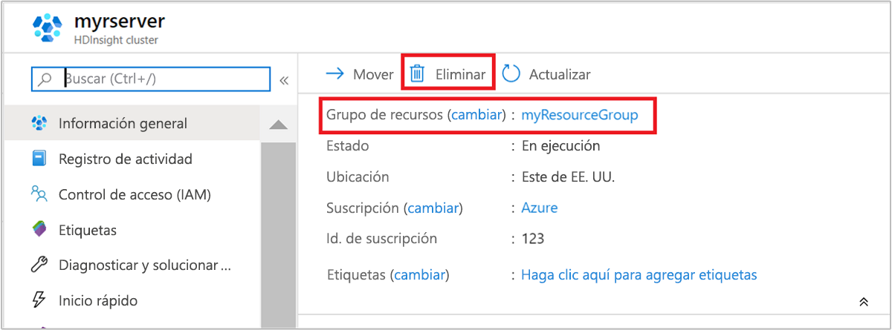

# Inicio rápido: Creación de clústeres de ML Services en Azure HDInsight con plantillas de Resource Manager

En este inicio rápido, se usa una plantilla de Azure Resource Manager para crear un clúster de [ML Services](./r-server-overview.md) en Azure HDInsight. Microsoft Machine Learning Server está disponible como opción de implementación al crear clústeres de HDInsight en Azure. El tipo de clúster que proporciona esta opción se denomina ML Services. Esta funcionalidad proporciona a los científicos de datos, a los estadísticos y a los programadores de R acceso a petición a métodos escalables y distribuidos para realizar análisis en HDInsight.

[!INCLUDE [About Azure Resource Manager](../../../includes/resource-manager-quickstart-introduction.md)]

Si no tiene una suscripción a Azure, cree una [cuenta gratuita](https://azure.microsoft.com/free/?WT.mc_id=A261C142F) antes de empezar.

## Creación de un clúster de ML Services

### Revisión de la plantilla

La plantilla usada en este inicio rápido forma parte de las [plantillas de inicio rápido de Azure](https://github.com/Azure/azure-quickstart-templates/tree/master/101-hdinsight-rserver).

:::code language="json" source="~/quickstart-templates/101-hdinsight-rserver/azuredeploy.json" range="1-171":::

En la plantilla se definen dos recursos de Azure:

* [Microsoft.Storage/storageAccounts](https://docs.microsoft.com/azure/templates/microsoft.storage/storageaccounts): permite crear una cuenta de Azure Storage.
* [Microsoft.HDInsight/cluster](https://docs.microsoft.com/azure/templates/microsoft.hdinsight/clusters): permite crear un clúster de HDInsight.

### Implementación de la plantilla

1. Seleccione el botón **Implementar en Azure** siguiente para iniciar sesión en Azure y abrir la plantilla de Resource Manager.

    

1. Escriba o seleccione los siguientes valores:

    |Propiedad |Descripción |
    |---|---|
    |Subscription|En la lista desplegable, seleccione la suscripción de Azure que se usa para el clúster.|
    |Resource group|En la lista desplegable, seleccione el grupo de recursos existente o seleccione **Crear**.|
    |Location|El valor se rellenará automáticamente con la ubicación usada para el grupo de recursos.|
    |Cluster Name|Escriba un nombre único global. Use solo letras minúsculas y números para esta plantilla.|
    |Cluster Login User Name (Nombre de usuario de inicio de sesión del clúster)|Proporcione el nombre de usuario; el valor predeterminado es **admin**.|
    |Cluster Login Password (Contraseña de inicio de sesión del clúster)|Indique una contraseña. La contraseña debe tener un mínimo de 10 caracteres y contener al menos un dígito, una letra mayúscula y una letra minúscula, y un carácter no alfanumérico (excepto los caracteres ' " y `). |
    |Nombre de usuario de SSH|Proporcione el nombre de usuario; el valor predeterminado es sshuser.|
    |Contraseña de SSH|Proporcione la contraseña.|

    

1. Revise los **TÉRMINOS Y CONDICIONES**. A continuación, seleccione **Acepto los términos y condiciones indicados anteriormente** y, después, seleccione **Comprar**. Recibirá una notificación de que la implementación está en curso. Se tarda aproximadamente 20 minutos en crear un clúster.

## Revisión de los recursos implementados

Una vez que se cree el clúster, recibirá una notificación de **Implementación correcta** con el vínculo **Ir al recurso**. La página Grupo de recursos mostrará el nuevo clúster de HDInsight y el almacenamiento predeterminado asociado con el clúster. Cada clúster depende de una cuenta de [Azure Storage](../hdinsight-hadoop-use-blob-storage.md) o de una [cuenta de Azure Data Lake Storage](../hdinsight-hadoop-use-data-lake-store.md). Se conoce como cuenta de almacenamiento predeterminada. El clúster de HDInsight y su cuenta de almacenamiento predeterminada deben estar en la misma región de Azure. Al eliminar los clústeres no se elimina la cuenta de almacenamiento.

## Limpieza de recursos

Después de completar el inicio rápido, puede ser conveniente eliminar el clúster. Con HDInsight, los datos se almacenan en Azure Storage, por lo que puede eliminar un clúster de forma segura cuando no se esté usando. Los clústeres de HDInsight se cobran aunque no se estén usando. Como en muchas ocasiones los cargos por el clúster son mucho más elevados que los cargos por el almacenamiento, desde el punto de vista económico tiene sentido eliminar clústeres cuando no se usen.

En Azure Portal, vaya al clúster y seleccione **Eliminar**.

También puede seleccionar el nombre del grupo de recursos para abrir la página del grupo de recursos y, a continuación, seleccionar **Eliminar grupo de recursos**. Al eliminar el grupo de recursos, se eliminan tanto el clúster de HDInsight como la cuenta de almacenamiento predeterminada.

## Pasos siguientes

En este inicio rápido, ha aprendido a crear un clúster de ML Services en HDInsight con una plantilla de Resource Manager. En el siguiente artículo, aprenderá a ejecutar un script de R con RStudio Server que muestra el uso de Spark para cálculos de R distribuidos.

> [!div class="nextstepaction"]
> [Ejecución de un script de R en un clúster de Machine Learning Services en Azure HDInsight con RStudio Server](./machine-learning-services-quickstart-job-rstudio.md)
