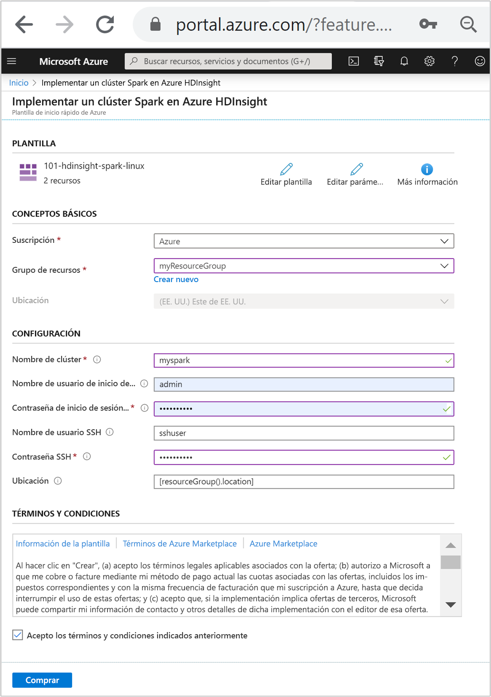

# <a name="quickstart-create-apache-spark-cluster-in-azure-hdinsight-using-arm-template"></a>Inicio rápido: Creación de un clúster de Apache Spark en Azure HDInsight mediante una plantilla de Resource Manager

En este inicio rápido, se usa una plantilla de Azure Resource Manager para crear un clúster de [Apache Spark](./apache-spark-overview.md) en Azure HDInsight. Luego se crea un archivo de Jupyter Notebook y se usa para ejecutar consultas de Spark SQL en tablas de Apache Hive. Azure HDInsight es un servicio administrado, de espectro completo y de análisis de código abierto para empresas. El marco de Apache Spark para HDInsight permite un análisis de datos y un procesamiento de clústeres rápidos mediante el procesamiento en memoria. Jupyter Notebook permite interactuar con los datos, combinar código con texto Markdown y realizar visualizaciones simples.

Si usa varios clústeres juntos, querrá crear una red virtual y, si está usando un clúster de Spark, también querrá usar Hive Warehouse Connector. Para más información, consulte [Planificación de una red virtual para Azure HDInsight](../hdinsight-plan-virtual-network-deployment.md) e [Integración de Apache Spark y Apache Hive con el conector de Hive Warehouse](../interactive-query/apache-hive-warehouse-connector.md).

[!INCLUDE [About Azure Resource Manager](../../../includes/resource-manager-quickstart-introduction.md)]

Si su entorno cumple los requisitos previos y está familiarizado con el uso de plantillas de Resource Manager, seleccione el botón **Implementar en Azure**. La plantilla se abrirá en Azure Portal.

[](https://portal.azure.com/#create/Microsoft.Template/uri/https%3A%2F%2Fraw.githubusercontent.com%2FAzure%2Fazure-quickstart-templates%2Fmaster%2F101-hdinsight-spark-linux%2Fazuredeploy.json)

## <a name="prerequisites"></a>Requisitos previos

Si no tiene una suscripción a Azure, cree una [cuenta gratuita](https://azure.microsoft.com/free/?WT.mc_id=A261C142F) antes de empezar.

## <a name="review-the-template"></a>Revisión de la plantilla

La plantilla usada en este inicio rápido forma parte de las [plantillas de inicio rápido de Azure](https://azure.microsoft.com/resources/templates/101-hdinsight-spark-linux).

:::code language="json" source="~/quickstart-templates/101-hdinsight-spark-linux/azuredeploy.json":::

En la plantilla se definen dos recursos de Azure:

* [Microsoft.Storage/storageAccounts](/azure/templates/microsoft.storage/storageaccounts): permite crear una cuenta de Azure Storage.
* [Microsoft.HDInsight/cluster](/azure/templates/microsoft.hdinsight/clusters): permite crear un clúster de HDInsight.

## <a name="deploy-the-template"></a>Implementación de la plantilla

1. Seleccione el botón **Implementar en Azure** siguiente para iniciar sesión en Azure y abrir la plantilla de Resource Manager.

    [](https://portal.azure.com/#create/Microsoft.Template/uri/https%3A%2F%2Fraw.githubusercontent.com%2FAzure%2Fazure-quickstart-templates%2Fmaster%2F101-hdinsight-spark-linux%2Fazuredeploy.json)

1. Escriba o seleccione los siguientes valores:

    |Propiedad |Descripción |
    |---|---|
    |Suscripción|En la lista desplegable, seleccione la suscripción de Azure que se usa para el clúster.|
    |Resource group|En la lista desplegable, seleccione el grupo de recursos existente o seleccione **Crear**.|
    |Location|El valor se rellenará automáticamente con la ubicación usada para el grupo de recursos.|
    |Cluster Name|Escriba un nombre único global. Use solo letras minúsculas y números para esta plantilla.|
    |Cluster Login User Name (Nombre de usuario de inicio de sesión del clúster)|Proporcione el nombre de usuario; el valor predeterminado es **admin**.|
    |Cluster Login Password (Contraseña de inicio de sesión del clúster)|Indique una contraseña. La contraseña debe tener un mínimo de 10 caracteres y contener al menos un dígito, una letra mayúscula y una letra minúscula, y un carácter no alfanumérico (excepto los caracteres ' " y `). |
    |Nombre de usuario de SSH|Proporcione el nombre de usuario; el valor predeterminado es **sshuser**.|
    |Contraseña de SSH|Proporcione la contraseña.|

    

1. Revise los **TÉRMINOS Y CONDICIONES**. A continuación, seleccione **Acepto los términos y condiciones indicados anteriormente** y, después, seleccione **Comprar**. Recibirá una notificación de que la implementación está en curso. Se tarda aproximadamente 20 minutos en crear un clúster.

Si surge algún problema al crear clústeres de HDInsight, podría deberse a que no tiene los permisos adecuados para hacerlo. Para más información, consulte [Requisitos de control de acceso](../hdinsight-hadoop-customize-cluster-linux.md#access-control).

## <a name="review-deployed-resources"></a>Revisión de los recursos implementados

Una vez que se cree el clúster, recibirá una notificación de **Implementación correcta** con el vínculo **Ir al recurso**. La página Grupo de recursos mostrará el nuevo clúster de HDInsight y el almacenamiento predeterminado asociado con el clúster. Cada clúster depende de una cuenta de [Azure Storage](../hdinsight-hadoop-use-blob-storage.md) o de una [cuenta de Azure Data Lake Storage](../hdinsight-hadoop-use-data-lake-store.md). Se conoce como cuenta de almacenamiento predeterminada. El clúster de HDInsight y su cuenta de almacenamiento predeterminada deben estar en la misma región de Azure. Al eliminar los clústeres no se elimina la cuenta de almacenamiento.

## <a name="create-a-jupyter-notebook-file"></a>Creación de un archivo Jupyter Notebook

[Jupyter Notebook](https://jupyter.org/) es un entorno de cuaderno interactivo que admite varios lenguajes de programación. Puede usar un archivo de Jupyter Notebook para interactuar con los datos, combinar código con texto Markdown y realizar visualizaciones simples.

1. Abra [Azure Portal](https://portal.azure.com).

2. Seleccione **Clústeres de HDInsight** y, a continuación, seleccione el clúster que creó.

    

3. En el portal, en la sección **Paneles de clúster**, seleccione **Jupyter Notebook**. Cuando se le solicite, escriba las credenciales de inicio de sesión del clúster.

   

4. Seleccione **Nuevo** > **PySpark** para crear un cuaderno.

   

   Se crea y se abre un nuevo cuaderno con el nombre Untitled(Untitled.pynb).

## <a name="run-apache-spark-sql-statements"></a>Ejecución de instrucciones de Apache Spark SQL

SQL (Lenguaje de consulta estructurado) es el lenguaje más común y ampliamente usado para la consulta y la transformación de datos. Spark SQL funciona como una extensión de Apache Spark para procesar datos estructurados, mediante la conocida sintaxis de SQL.

1. Compruebe que el kernel esté preparado. El kernel está preparado cuando aparece un círculo vacío junto al nombre del kernel en el cuaderno. Un círculo sólido indica que el kernel está ocupado.

    

    Al iniciar el cuaderno por primera vez, el kernel realiza tareas en segundo plano. Espere a que el kernel esté preparado.

1. Pegue el código siguiente en una celda vacía y presione **MAYÚS + ENTRAR** para ejecutar el código. El comando muestra las tablas Hive del clúster:

    ```sql
    %%sql
    SHOW TABLES
    ```

    Si usa un archivo de Jupyter Notebook con su clúster de HDInsight, obtiene una sesión de `spark` preestablecida que puede usar para ejecutar consultas de Hive mediante Spark SQL. `%%sql` indica a Jupyter Notebook que use la sesión `spark` preestablecida para ejecutar la consulta de Hive. La consulta recupera las 10 primeras filas de una tabla de Hive (**hivesampletable**) que se incluye de forma predeterminada en todos los clústeres de HDInsight. La primera vez que se envíe la consulta, Jupyter creará una aplicación de Spark para el cuaderno. La operación tarda unos 30 segundos en completarse. Cuando la aplicación de Spark está preparada, la consulta se ejecuta aproximadamente en un segundo y genera los resultados. El resultado tendrá una apariencia similar a la siguiente:

    

    Cada vez que se ejecuta una consulta en Jupyter, el título de la ventana del explorador web muestra el estado **(Busy)** (Ocupado) junto con el título del cuaderno. También verá un círculo sólido junto al texto **PySpark** en la esquina superior derecha.

1. Ejecute otra consulta para ver los datos en `hivesampletable`.

    ```sql
    %%sql
    SELECT * FROM hivesampletable LIMIT 10
    ```

    Debe actualizar la pantalla para mostrar la salida de la consulta.

    

1. En el menú **File** (Archivo) del cuaderno, seleccione **Close and Halt** (Cerrar y detener). Al cerrar el cuaderno se liberan los recursos del clúster, lo que incluye la aplicación de Spark.

## <a name="clean-up-resources"></a>Limpieza de recursos

Después de completar el inicio rápido, puede ser conveniente eliminar el clúster. Con HDInsight, los datos se almacenan en Azure Storage, por lo que puede eliminar un clúster de forma segura cuando no se esté usando. Los clústeres de HDInsight se cobran aunque no se estén usando. Como en muchas ocasiones los cargos por el clúster son mucho más elevados que los cargos por el almacenamiento, desde el punto de vista económico tiene sentido eliminar clústeres cuando no se usen.

En Azure Portal, vaya al clúster y seleccione **Eliminar**.


También puede seleccionar el nombre del grupo de recursos para abrir la página del grupo de recursos y, a continuación, seleccionar **Eliminar grupo de recursos**. Al eliminar el grupo de recursos, se eliminan tanto el clúster de HDInsight como la cuenta de almacenamiento predeterminada.

## <a name="next-steps"></a>Pasos siguientes

En este inicio rápido, ha aprendido a crear un clúster de Apache Spark en HDInsight y a ejecutar una consulta básica de Spark SQL. Pase al siguiente tutorial, donde aprenderá a usar un clúster de HDInsight para ejecutar consultas interactivas en datos de ejemplo.

> [!div class="nextstepaction"]
> [Ejecución de consultas interactivas en Apache Spark](./apache-spark-load-data-run-query.md)
