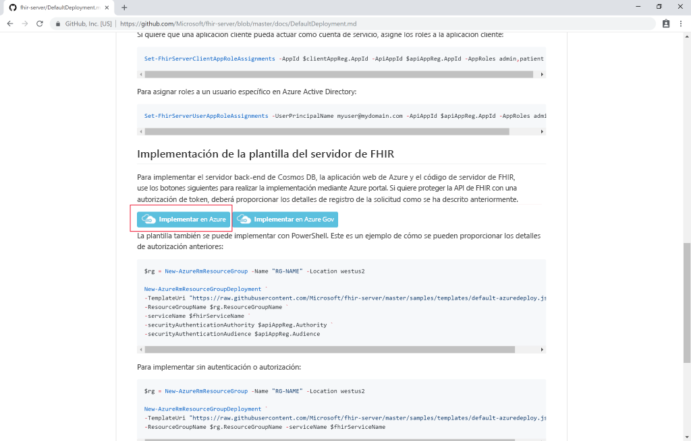
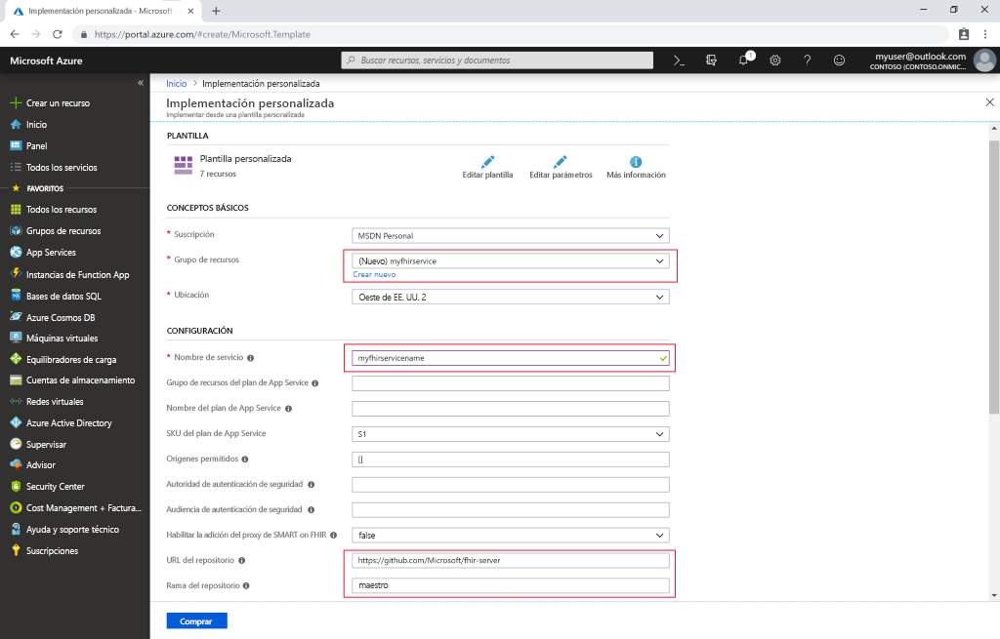

# Inicio rápido: Implementación del servidor de FHIR de código abierto mediante Azure Portal

En este inicio rápido va a aprender a implementar un servidor de FHIR de código abierto en Azure mediante Azure Portal. Usaremos vínculos de implementación sencillos del [repositorio de código abierto](https://github.com/Microsoft/fhir-server).

Si no tiene una suscripción a Azure, cree una [cuenta gratuita](https://azure.microsoft.com/free/?WT.mc_id=A261C142F) antes de empezar.

## Repositorio de código abierto de GitHub

Vaya a la [página de implementación de GitHub](https://github.com/Microsoft/fhir-server/blob/master/docs/DefaultDeployment.md) y busque los botones "Implementar en Azure":

>[!div class="mx-imgBorder"]
>

Haga clic en el botón de implementación y se abrirá Azure Portal.

## Rellenar los parámetros de implementación

Cree un grupo de recursos y asígnele un nombre. Solo otros parámetros obligatorios constituyen un nombre para el servicio y la contraseña de administrador de SQL.

>[!div class="mx-imgBorder"]
>

Después de rellenar los detalles, puede iniciar la implementación.

## Comprobación de que el servidor de FHIR está en ejecución

Una vez finalizada la implementación, puede ir mediante el explorador a `https://SERVICENAME.azurewebsites.net/metadata` para obtener una instrucción de funcionalidad. El servidor tardará un minuto aproximadamente en responder la primera vez.

## Limpieza de recursos

Cuando ya no los necesite, puede eliminar el grupo de recursos y todos los recursos relacionados. Para hacerlo, seleccione el grupo de recursos que contiene los recursos aprovisionados, seleccione **Eliminar grupo de recursos** y confirme el nombre del grupo de recursos que se va a eliminar.

## Pasos siguientes

En este tutorial, ha implementado el servidor de FHIR de código abierto de Microsoft para Azure en su suscripción. Para obtener información sobre cómo acceder a la API de FHIR con Postman, continúe con el tutorial de Postman.
 
>[!div class="nextstepaction"]
>[Acceso a la API de FHIR con Postman](access-fhir-postman-tutorial.md)