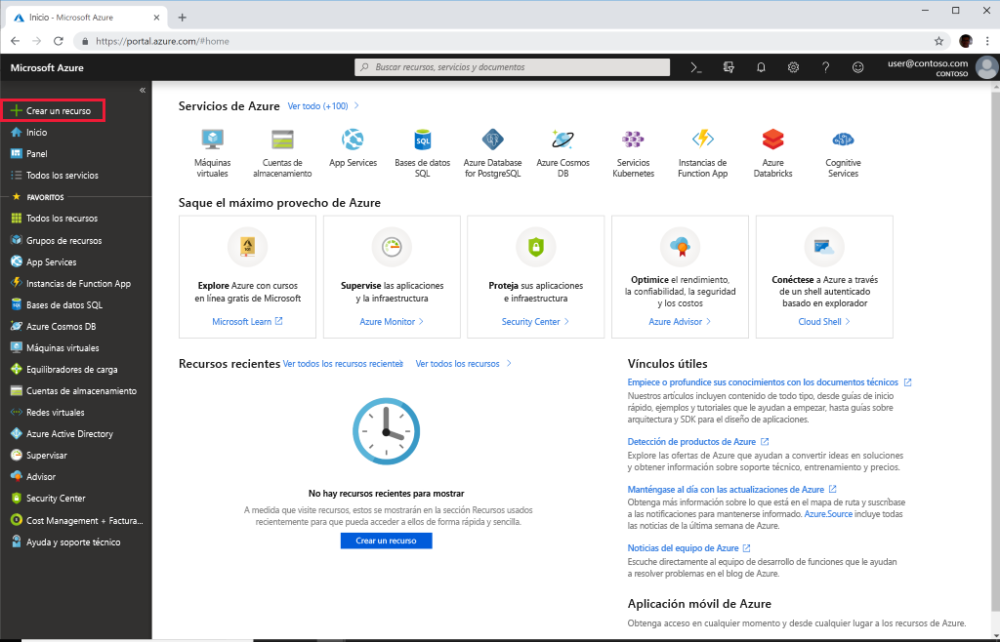
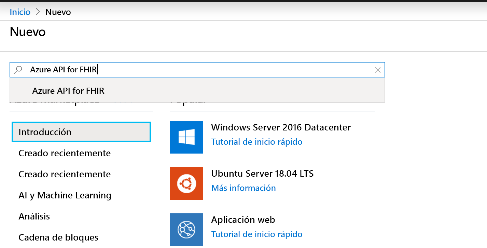
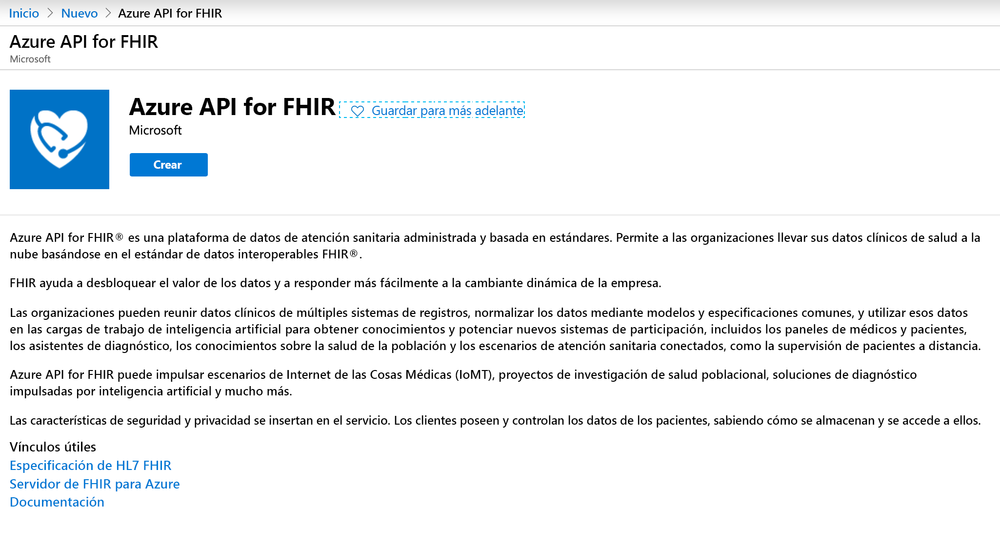
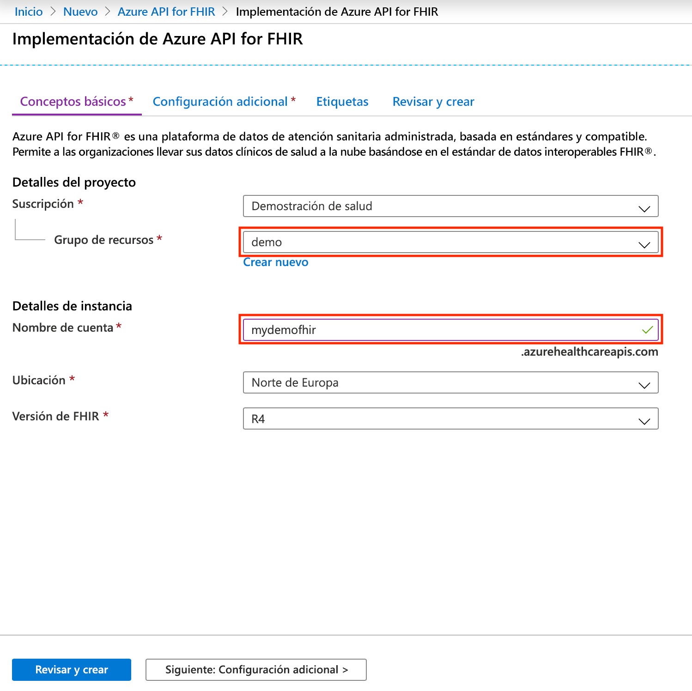

# Inicio rápido: Implementación de Azure API for FHIR mediante Azure Portal

En este inicio rápido va a aprender a implementar Azure API for FHIR mediante Azure Portal.

Si no tiene una suscripción a Azure, cree una [cuenta gratuita](https://azure.microsoft.com/free/?WT.mc_id=A261C142F) antes de empezar.

## Crear recurso

Abra [Azure Portal](https://portal.azure.com) y haga clic en **Crear un recurso**.

## Búsqueda de Azure API for FHIR

Puede encontrar Azure API for FHIR escribiendo "FHIR" en el cuadro de búsqueda:

## Creación de una cuenta de Azure API for FHIR

Seleccione **Crear** para crear una nueva cuenta de Azure API for FHIR:

## Especificación de los detalles de la cuenta

Seleccione un grupo de recursos existente o cree uno nuevo, elija un nombre para la cuenta y, por último, haga clic en  **Revisar y crear**:

Confirme la creación y espere la implementación de la API de FHIR.

## Configuración adicional

Haga clic en **Siguiente: Configuración adicional** para configurar la entidad, la audiencia y los identificadores de objetos de identidad a los que se debe permitir el acceso a esta instancia de Azure API for FHIR, y habilite SMART on FHIR si es necesario y configure el rendimiento de la base de datos:

- **Entidad:** Puede especificar un inquilino de Azure AD diferente de aquel en el que ha iniciado sesión como entidad de autenticación del servicio.
- **Audiencia:** El procedimiento recomendado, y configuración predeterminada, es que la audiencia esté establecida en la dirección URL del servidor de FHIR. Puede cambiarlo aquí. La audiencia identifica el destinatario para el que está pensado el token. En este contexto, debe establecerse en algo que represente la API de FHIR.
- **Identificadores de objeto permitidos:** Puede especificar los identificadores de objetos de identidad a los que se debe permitir el acceso a la instancia de Azure API for FHIR. Puede obtener más información sobre cómo buscar el identificador de objeto para usuarios y entidades de servicio en la guía paso a paso [Búsqueda de identificadores de objetos de identidad](find-identity-object-ids.md).  
- **Proxy de SMART on FHIR:** Puede habilitar el proxy de SMART on FHIR. Para más información sobre cómo configurar el proxy de SMART on FHIR, consulte el tutorial [Proxy de SMART on FHIR para Azure API for FHIR](https://docs.microsoft.com/azure/healthcare-apis/use-smart-on-fhir-proxy).  
- **Rendimiento aprovisionado (RU/s):** Aquí puede especificar la configuración de rendimiento para la base de datos subyacente de Azure API for FHIR. Puede cambiar esta configuración más adelante en la hoja Base de datos. Para más información, consulte la página [Configuración de las opciones de la base de datos](configure-database.md).

## Captura de la instrucción de funcionalidad de la API de FHIR

Para validar que se ha aprovisionado la nueva cuenta de la API de FHIR, capture una instrucción de funcionalidad haciendo que el explorador apunte a `https://<ACCOUNT-NAME>.azurehealthcareapis.com/metadata`.

## Limpieza de recursos

Cuando ya no los necesite, puede eliminar el grupo de recursos, la instancia de Azure API for FHIR y todos los recursos relacionados. Para hacerlo, seleccione el grupo de recursos que contiene la cuenta de Azure API for FHIR, seleccione **Eliminar grupo de recursos** y confirme el nombre del grupo de recursos que se va a eliminar.

## Pasos siguientes

En este inicio rápido, ha implementado Azure API for FHIR en su suscripción. Para establecer opciones de configuración adicionales en Azure API for FHIR, continúe con la guía paso a paso de configuración adicional.

>[!div class="nextstepaction"]
>[Configuración adicional en Azure API for FHIR](azure-api-for-fhir-additional-settings.md)
