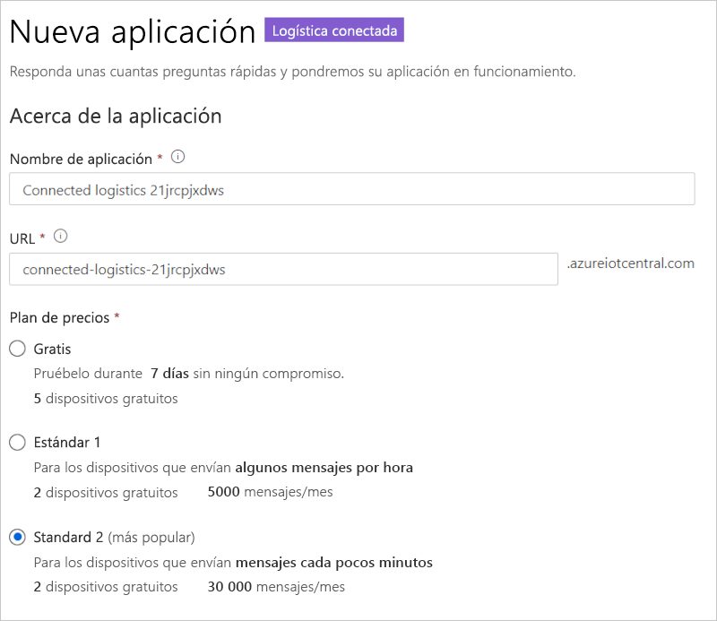
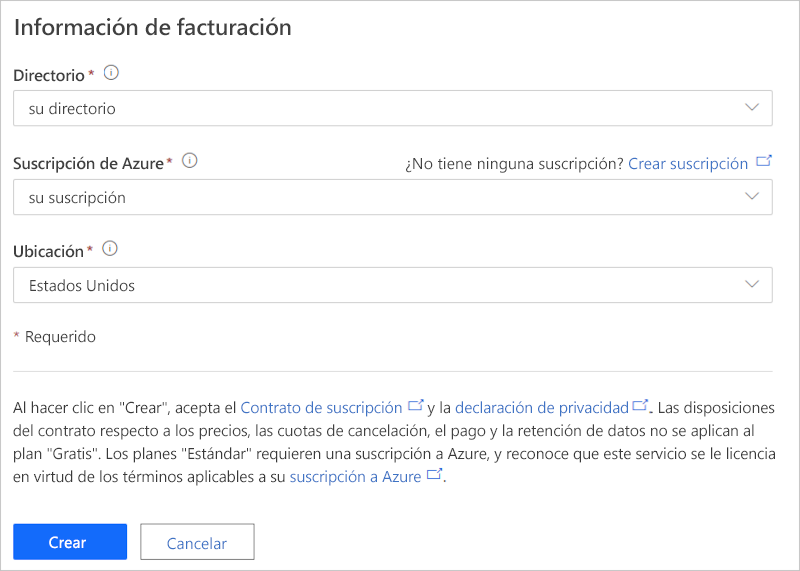

# Tutorial: implementación y recorrido por la plantilla de aplicación de logística conectada

En este tutorial se muestra una introducción a la plantilla de aplicación *Logística conectada* de IoT Central. Aprenderá a implementar y usar la plantilla.

En este tutorial, aprenderá a:

> [!div class="checklist"]
> * Crear una aplicación de logística conectada.
> * Usar las características clave de la aplicación.
> * Usar el panel para mostrar la actividad crítica de las operaciones de dispositivo de logística.
> * Usar la plantilla de dispositivo.
> * Seguir reglas.
> * Usar trabajos.

## Requisitos previos

* No se necesitan requisitos previos específicos para implementar esta aplicación.
* Puede usar el plan gratuito o una suscripción de Azure.

## Creación de una aplicación de logística conectada

Cree la aplicación mediante los pasos siguientes:

1. Navegue al sitio de [Compilación Azure IoT Central](https://aka.ms/iotcentral). Después, inicie sesión con una cuenta Microsoft personal, profesional o educativa. Seleccione **Compilar** en la barra de navegación de la izquierda y la pestaña **Venta al por menor**:

    :::image type="content" source="media/tutorial-iot-central-connected-logistics/iotc-retail-homepage.png" alt-text="Plantilla de logística conectada":::

2. Seleccione **Crear aplicación** en **Logística conectada**.

3. Con la opción **Crear aplicación** se abre el formulario **Nueva aplicación**. Escriba la siguiente información:

    * **Nombre de la aplicación**: puede usar el nombre sugerido predeterminado o escribir el nombre descriptivo de la aplicación.
    * **URL**: puede usar la dirección URL predeterminada sugerida o escribir una dirección URL única, descriptiva y fácil de recordar. Después, se recomienda la configuración predeterminada si ya tiene una suscripción a Azure. Puede empezar con un plan de precios de evaluación gratuita de siete días y elegir convertirlo a un plan de precios estándar en cualquier momento antes de que expire la evaluación gratuita.
    * **Información de facturación**: Los detalles del directorio, la suscripción de Azure y la región son necesarios para aprovisionar los recursos.
    * **Crear**: Seleccione Crear en la parte inferior de la página para implementar la aplicación.

    :::image type="content" source="media/tutorial-iot-central-connected-logistics/connected-logistics-app-create.png" alt-text="Plantilla de logística conectada":::

    :::image type="content" source="media/tutorial-iot-central-connected-logistics/connected-logistics-app-create-billinginfo.png" alt-text="Plantilla de logística conectada":::

## Recorrido por la aplicación.

La captura de pantalla siguiente muestra cómo seleccionar la plantilla de aplicación de logística conectada.

> [!div class="mx-imgBorder"]
> 

Las secciones siguientes le guiarán por las características clave de la aplicación.

### Panel

Después de implementar la plantilla de aplicación, el panel predeterminado es un portal centrado en el operador de logística conectada. Northwind Traders es un proveedor de logística ficticio que administra una flota de carga por mar y por tierra. En este panel se muestran dos puertas de enlace diferentes que proporcionan datos de telemetría de los envíos junto con comandos, trabajos y acciones asociadas.

> [!div class="mx-imgBorder"]
> 

> [!div class="mx-imgBorder"]
> 

Este panel está preconfigurado para mostrar la actividad crítica de las operaciones de dispositivo de logística.

El panel habilita dos operaciones diferentes de administración de dispositivos de la puerta de enlace:

* Visualización de las rutas de logística para los envíos por carretera y los detalles de ubicación de los envíos por mar.
* Visualización del estado de la puerta de enlace y otros datos pertinentes.

:::image type="content" source="media/tutorial-iot-central-connected-logistics/connected-logistics-dashboard1.png" alt-text="Plantilla de logística conectada":::

* Puede supervisar el número total de puertas de enlace, así como las etiquetas activas y desconocidas.
* Puede realizar operaciones de administración de dispositivos, como actualizar el firmware, deshabilitar y habilitar sensores, actualizar el umbral de los sensores, actualizar los intervalos de telemetría y actualizar los contratos de servicio de los dispositivos.
* Visualización del consumo de batería del dispositivo.

:::image type="content" source="media/tutorial-iot-central-connected-logistics/connected-logistics-dashboard2.png" alt-text="Plantilla de logística conectada":::

#### Plantilla de dispositivo

Seleccione **Device templates** (Plantillas de dispositivo) para ver el modelo de funcionalidad de las puertas de enlace. Se estructura un modelo de funcionalidad en torno a dos interfaces diferentes **Gateway Telemetry & Property** (Telemetría y propiedades de la puerta de enlace) y **Gateway Commands** (Comandos de la puerta de enlace).

**Gateway Telemetry & Property** (Telemetría y propiedades de la puerta de enlace): en esta interfaz se definen todos los datos de telemetría relacionados con los sensores, la ubicación y la información del dispositivo. La interfaz también define las funcionalidades de las propiedades del dispositivo gemelo, como los umbrales de los sensores y los intervalos de actualización.

:::image type="content" source="media/tutorial-iot-central-connected-logistics/connected-logistics-devicetemplate1.png" alt-text="Plantilla de logística conectada":::

**Gateway commands** (Comandos de la puerta de enlace): en esta interfaz se organizan todas las funcionalidades de los comandos de la puerta de enlace:

:::image type="content" source="media/tutorial-iot-central-connected-logistics/connected-logistics-devicetemplate2.png" alt-text="Plantilla de logística conectada":::

### Reglas

Seleccione la pestaña **Reglas** para ir a las reglas de esta plantilla de aplicación. Estas reglas se configuran para enviar notificaciones por correo electrónico a los operadores para realizar más investigaciones:

**Alerta de robo de puerta de enlace**: esta regla se desencadena cuando los sensores detectan luz de forma inesperada durante el recorrido. Los operadores deben recibir una notificación inmediatamente para investigar posibles robos.

**Puerta de enlace sin respuesta**: esta regla se desencadena si la puerta de enlace no se comunica con la nube durante un período prolongado. La puerta de enlace podría no responder por batería baja, pérdida de conectividad o daños en el dispositivo.

:::image type="content" source="media/tutorial-iot-central-connected-logistics/connected-logistics-rules.png" alt-text="Plantilla de logística conectada":::

### Trabajos

Seleccione la pestaña **Trabajos** para ver los trabajos de esta aplicación:

:::image type="content" source="media/tutorial-iot-central-connected-logistics/connected-logistics-jobs.png" alt-text="Plantilla de logística conectada":::

Puede usar trabajos para realizar operaciones en toda la aplicación. Los trabajos de esta aplicación usan los comandos de dispositivo y la funcionalidad de gemelos para realizar tareas como la deshabilitación de sensores específicos en todas las puertas de enlace o la modificación del umbral de los sensores según el modo y la ruta de envío:

* Se trata de una operación estándar para deshabilitar los sensores de impacto durante los envíos por mar a fin de ahorrar batería o reducir el umbral de temperatura durante el transporte de la cadena de frío.

* Los trabajos le permiten realizar operaciones en todo el sistema, como actualizar el firmware en las puertas de enlace o actualizar el contrato de servicio para mantenerse al día en las actividades de mantenimiento.

## Limpieza de recursos

Si no va a seguir usando esta aplicación, elimine la plantilla de aplicación. Para ello, vaya a **Administración** > **Configuración de la aplicación** y seleccione **Eliminar**.

:::image type="content" source="media/tutorial-iot-central-connected-logistics/connected-logistics-cleanup.png" alt-text="Plantilla de logística conectada":::

## Pasos siguientes
* Más información acerca de 
> [!div class="nextstepaction"]
> [Concepto de logística conectada](./architecture-connected-logistics.md)
* Más información sobre otras [plantillas de venta minorista de IoT Central](./overview-iot-central-retail.md).
* Más información acerca de la [introducción a IoT Central](../core/overview-iot-central.md).
