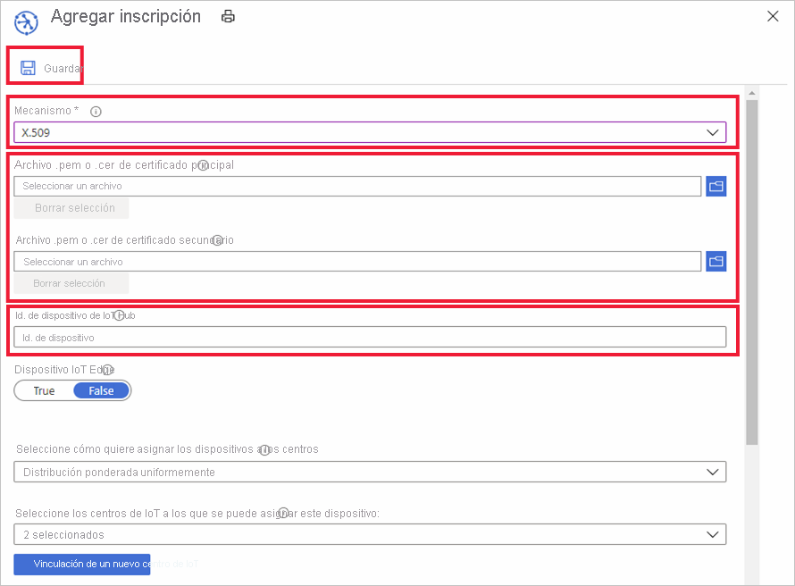

# Administración de las inscripciones de dispositivos con Azure Portal

Una *inscripción de dispositivos* crea un registro de un único dispositivo o grupo de dispositivos que, en algún momento, se registrará en el servicio Azure IoT Hub Device Provisioning. El registro de la inscripción contiene la configuración inicial para los dispositivos como parte de la inscripción. En la configuración se incluye el centro de IoT al que se asignará un dispositivo o una directiva de asignación que configura el centro a partir de un conjunto de centros. En este artículo se muestra cómo administrar las inscripciones de dispositivos para el servicio de aprovisionamiento.

## Creación de una inscripción de dispositivos

Hay dos maneras de inscribir los dispositivos con el servicio de aprovisionamiento:

* Un **grupo de inscripción** es una entrada para un grupo de dispositivos que comparten un mecanismo de atestación común. Se recomienda usar un grupo de inscripción para un gran número de dispositivos que compartan una configuración inicial o para dispositivos que vayan todos al mismo inquilino. Se admiten los dispositivos que usan [clave simétrica](concepts-symmetric-key-attestation.md) o [certificados X.509](concepts-x509-attestation.md). 

    Para obtener instrucciones paso a paso sobre la creación y el uso de grupos de inscripción con claves simétricas, consulte el tutorial [Aprovisionamiento de dispositivos con claves simétricas](how-to-legacy-device-symm-key.md).

    Siga estos pasos para crear un grupo de inscripción en el portal para un grupo de dispositivos:

    1. Inicie sesión en Azure Portal y haga clic en **Todos los recursos** en el menú a la izquierda.  
    1. Haga clic en el servicio de aprovisionamiento de dispositivos donde desee inscribir su dispositivo en la lista de recursos.  
    1. En el servicio de aprovisionamiento, haga clic en **Administrar inscripciones** y, después, en el botón **Agregar grupo de inscripciones**.  
     
        
        
    1. Cuando aparezca el panel "Agregar grupo de inscripciones", escriba la información de su inscripción y haga clic en **Guardar**.  
     
        
        
        | Campo | Descripción |
        | :--- | :--- |
        | **Nombre de grupo** | Nombre requerido para su grupo de dispositivos. |
        | **Tipo de atestación** | Haga clic en **Certificado** o **Clave simétrica** para el tipo de atestación según el método de atestación que vayan a usar los dispositivos. |
        | **Tipo de certificado** | Está disponible si se usa la atestación de certificados. Seleccione **Certificado de entidad de certificación** o **Intermedio** en función de qué certificado firmó los certificados de dispositivo. |
        | **Certificado principal** | Si va a firmar los certificados de dispositivo con un certificado de entidad de certificación raíz, este debe tener la [prueba de posesión](how-to-verify-certificates.md) completada. Después, puede seleccionarlo como **certificado principal** para el grupo de dispositivos.  Si va a firmar los certificados de dispositivo con un certificado intermedio, estará disponible un botón de carga para permitirle cargar un certificado intermedio. El certificado que firmó el intermedio también debe tener una [prueba de posesión](how-to-verify-certificates.md) completada de ello. |

        
    

* Una **inscripción individual** es una entrada para un único dispositivo que se puede asignar a un centro de IoT. Se admiten los dispositivos que usan [clave simétrica](concepts-symmetric-key-attestation.md), [certificados X.509](concepts-x509-attestation.md) y la [atestación de TPM](concepts-tpm-attestation.md). 

    Para crear una inscripción individual en el portal, siga estos pasos:

    1. Inicie sesión en Azure Portal y haga clic en **Todos los recursos** en el menú a la izquierda.
    1. Haga clic en el servicio de aprovisionamiento de dispositivos donde desee inscribir su dispositivo en la lista de recursos.
    1. En el servicio de aprovisionamiento, haga clic en **Administrar inscripciones** y, después, haga clic en el botón **Agregar inscripción individual** de la parte superior.   

       

    1. Cuando aparezca el panel "Agregar inscripción", escriba la información de la inscripción de un dispositivo individual y haga clic en **Guardar**. 
     
        
    
        | Campo | Descripción |
        | :--- | :--- |
        | **Mecanismo** | Seleccione **X.509**, **TPM** o **Clave simétrica** para el mecanismo de atestación que se va a usar, en función del método de atestación que van a emplear los dispositivos. |
        | Configuración de la atestación | Para obtener instrucciones paso a paso sobre cómo crear y usar inscripciones individuales con claves simétricas o certificados X.509, consulte uno de los siguientes inicios rápidos: [Aprovisionamiento de un dispositivo simétrico](quick-create-simulated-device-symmetric-key-java.md#create-a-device-enrollment) o [Aprovisionamiento de un dispositivo de certificado X.509](quick-create-simulated-device-x509-java.md#create-a-self-signed-x509-device-certificate-and-individual-enrollment-entry).  Para obtener instrucciones paso a paso sobre cómo crear y usar inscripciones individuales mediante la atestación de TPM, consulte uno de los ejemplos de [Aprovisionamiento de un dispositivo TPM simulado](quick-create-simulated-device-tpm-java.md#create-a-device-enrollment-entry).|
        | **Identificador de dispositivo IoT Hub** |  Este identificador representará el dispositivo. Debe seguir las reglas de un identificador de dispositivo. Para más información, consulte [Propiedades de la id. de dispositivo](../iot-hub/iot-hub-devguide-identity-registry.md#device-identity-properties).  Cuando se usan certificados X.509, este texto debe ser el nombre del firmante en el certificado de dispositivo que cargue para la inscripción. Dicho nombre de firmante debe cumplir las reglas de los identificadores de dispositivo.|
            

## Actualización de una entrada de inscripción
Para actualizar una entrada de inscripción existente, siga estos pasos:

1. Abra el servicio de aprovisionamiento de dispositivos en Azure Portal y haga clic en **Manage Enrollments** (Administrar inscripciones). 
1. Navegue a la entrada de inscripción que desee modificar. Haga clic en la entrada para abrir un resumen de la información sobre la inscripción del dispositivo. 
1. En esta página se pueden modificar elementos que no son el tipo de seguridad y las credenciales, como el centro de IoT al que debería estar vinculado el dispositivo y el identificador de dispositivo. También podrá modificar el estado inicial del dispositivo gemelo. 
1. Al terminar, haga clic en **Guardar** para actualizar la inscripción del dispositivo. 

    

## Eliminación de una inscripción de dispositivo
Cuando no sea necesario aprovisionar dispositivos en ninguna instancia de IoT Hub, para eliminar la entrada de inscripción asociada en el portal siga estos pasos:

1. Abra el servicio de aprovisionamiento de dispositivos en Azure Portal y haga clic en **Manage Enrollments** (Administrar inscripciones). 
1. Navegue a la entrada de inscripción que desee eliminar y selecciónela. 
1. Haga clic en el botón **Eliminar** de la parte superior y seleccione **Sí** cuando se le pida confirmación. 
1. Una vez que la acción se haya completado, verá que la entrada se ha eliminado de la lista de inscripciones de dispositivos. 
 
    