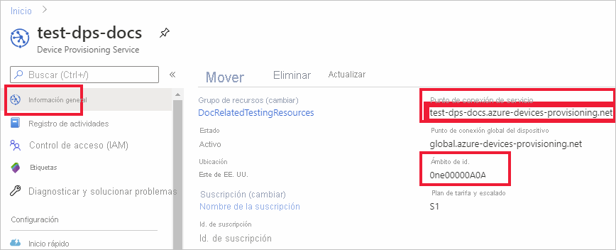

# <a name="quickstart-provision-a-symmetric-key-device-using-nodejs"></a>Inicio rápido: Aprovisionamiento de un dispositivo con claves simétricas mediante Node.js

En este inicio rápido, aprenderá a aprovisionar una máquina de desarrollo Windows como un dispositivo en un centro de IoT mediante Node.js. Este dispositivo utilizará una clave simétrica y una inscripción individual para autenticarse con una instancia del servicio Device Provisioning (DPS) para ser asignado a un centro de IoT. Se usará código de ejemplo del [SDK de Azure IoT para Node.js](https://github.com/Azure/azure-iot-sdk-node.git) para aprovisionar el dispositivo. 

Aunque en este artículo se muestra el aprovisionamiento con una inscripción individual, también puede usar grupos de inscripción. Hay algunas diferencias al usar los grupos de inscripción. Por ejemplo, debe usar una clave de dispositivo derivada con un identificador de registro único para el dispositivo. En [Aprovisionamiento de dispositivos con claves simétrica](how-to-legacy-device-symm-key.md) encontrará un ejemplo de grupo de inscripción. Para más información sobre los grupos de inscripción, consulte la sección sobre las [inscripciones de grupo para la atestación de clave simétrica](concepts-symmetric-key-attestation.md#group-enrollments).

Si no está familiarizado con el proceso de aprovisionamiento automático, revise la información general sobre el [aprovisionamiento](about-iot-dps.md#provisioning-process). 

Además, asegúrese de completar los pasos descritos en [Configuración del servicio Azure IoT Hub Device Provisioning con Azure Portal](./quick-setup-auto-provision.md) antes de continuar con este inicio rápido. Para seguir esta guía de inicio rápido, ya debe haber creado la instancia del Device Provisioning Service.

Este artículo está orientado a una estación de trabajo basada en Windows. No obstante, también puede realizar los procedimientos en Linux. Para ver un ejemplo en Linux, consulte [Aprovisionamiento para varios inquilinos](how-to-provision-multitenant.md).


[!INCLUDE [quickstarts-free-trial-note](../../includes/quickstarts-free-trial-note.md)]


## <a name="prerequisites"></a>Prerrequisitos

- Estar familiarizado con los conceptos de [aprovisionamiento](about-iot-dps.md#provisioning-process).
- Finalización de [Configuración de Azure IoT Hub Device Provisioning Service con Azure Portal](./quick-setup-auto-provision.md).
- Una cuenta de Azure con una suscripción activa. [cree una de forma gratuita](https://azure.microsoft.com/free/?ref=microsoft.com&utm_source=microsoft.com&utm_medium=docs&utm_campaign=visualstudio).
- [Node.js v4.0+](https://nodejs.org).
- [Git](https://git-scm.com/download/).


## <a name="create-a-device-enrollment"></a>Creación de una inscripción de dispositivos

1. Inicie sesión en [Azure Portal](https://portal.azure.com), seleccione el botón **Todos los recursos** situado en el menú izquierdo y abra la instancia de Device Provisioning Service (DPS).

2. Seleccione la pestaña **Administrar inscripciones** y, después, seleccione el botón **Agregar inscripción individual** de la parte superior. 

3. En el panel **Agregar inscripción** , escriba la siguiente información y presione el botón **Guardar**.

   - **Mecanismo:** seleccione **Clave simétrica** como *mecanismo* de atestación de identidad.

   - **Generar claves automáticamente** : marque esta casilla.

   - **Identificador de registro** : escriba un identificador de registro para identificar la inscripción. Use únicamente caracteres alfanuméricos en minúsculas y guiones (“-”). Por ejemplo, **symm-key-nodejs-device-01**.

   - **Id. de dispositivo de IoT Hub:** escriba un identificador de dispositivo. Por ejemplo, **nodejs-nodejs-device-01**.

     

4. Cuando haya guardado la inscripción, se generarán la **clave principal** y la **clave secundaria** , y se agregarán a la entrada de la inscripción. La inscripción del dispositivo con clave simétrica se muestra como **symm-key-nodejs-device-01** en la columna *Id. de registro* de la pestaña *Inscripciones individuales*. 

5. Abra la inscripción y copie el valor de su **clave principal** generada. Usará estos valores de clave e **Id. de registro** más adelante cuando agregue variables de entorno para usarlas con el código de ejemplo de aprovisionamiento de dispositivos.


## <a name="prepare-the-nodejs-environment"></a>Preparación del entorno de Node.js 

1. Abra un entorno de línea de comandos de Git CMD o Git Bash. Utilice el siguiente comando para clonar el repositorio de GitHub del [SDK de Azure IoT para Node.js](https://github.com/Azure/azure-iot-sdk-node.git):

    ```cmd
    git clone https://github.com/Azure/azure-iot-sdk-node.git --recursive
    ```


<a id="firstbootsequence"></a>

## <a name="prepare-the-device-provisioning-code"></a>Preparación del código de aprovisionamiento de dispositivos

En esta sección, agregará las cuatro variables de entorno siguientes, que se usarán como parámetros en el código de ejemplo de aprovisionamiento de dispositivos para aprovisionar un dispositivo de clave simétrica. 

* `PROVISIONING_HOST`
* `PROVISIONING_IDSCOPE`
* `PROVISIONING_REGISTRATION_ID`
* `PROVISIONING_SYMMETRIC_KEY`

El código de aprovisionamiento se pondrá en contacto con la instancia de DPS en función de estas variables para autenticar el dispositivo. Después, el dispositivo se asignará a un centro de IoT que ya está vinculado a la instancia de DPS en función de la configuración de inscripción individual. Una vez aprovisionado, el código de ejemplo enviará algún dato de telemetría de prueba al centro de IoT.

1. En [Azure Portal](https://portal.azure.com), en el menú Servicios Device Provisioning, seleccione **Información general** y copie los valores de _Punto de conexión del servicio_ y _Ámbito de id_. Usará estos valores en las variables de entorno `PROVISIONING_HOST` y `PROVISIONING_IDSCOPE`.

    

2. Abra un símbolo del sistema para ejecutar comandos de Node.js y vaya al directorio *provisioning/device/samples*.

    ```cmd
    cd azure-iot-sdk-node/provisioning/device/samples
    ```

3. En la carpeta *provisioning/device/samples* , abra *register_symkey.js* y examine el código. 

    Observe que el código de ejemplo establece una carga personalizada...

    ```nodejs
    provisioningClient.setProvisioningPayload({a: 'b'});
    ```

    Este código no es necesario con este inicio rápido. El código es un ejemplo de configuración de una carga personalizada si se desea utilizar una función de asignación personalizada para asignar el dispositivo a IoT Hub. Para más información, consulte el [Tutorial: Uso de directivas de asignación personalizadas](tutorial-custom-allocation-policies.md).

    El método `provisioningClient.register()` intenta registrar el dispositivo.

    No será necesario realizar ningún cambio en el código de ejemplo para registrar el dispositivo.

4. En el símbolo del sistema, agregue las variables de entorno del host de aprovisionamiento, el ámbito del identificador, el identificador de registro y la clave simétrica principal que copió de la inscripción individual en la sección anterior.  

    Los comandos siguientes son ejemplos para mostrar su sintaxis. Asegúrese de usar los valores correctos.

    ```console
    set PROVISIONING_HOST=test-dps-docs.azure-devices-provisioning.net
    ```

    ```console
    set PROVISIONING_IDSCOPE=0ne00000A0A
    ```

    ```console
    set PROVISIONING_REGISTRATION_ID=symm-key-nodejs-device-01
    ```

    ```console
    set PROVISIONING_SYMMETRIC_KEY=sbDDeEzRuEuGKag+kQKV+T1QGakRtHpsERLP0yPjwR93TrpEgEh/Y07CXstfha6dhIPWvdD1nRxK5T0KGKA+nQ==
    ```


4. Compile y ejecute el código de ejemplo con los siguientes comandos.

    ```console
    npm install
    ```

    ```console
    node register_symkey.js
    ```

5. La salida esperada debe parecerse a la siguiente, que muestra el centro de IoT vinculado al que se asignó el dispositivo en función de la configuración de inscripción individual. Se envía una cadena "Hola mundo" al centro como mensaje de prueba:

    ```output
    D:\Docs\test\azure-iot-sdk-node\provisioning\device\samples>node register_symkey.js
    registration succeeded
    assigned hub=docs-test-iot-hub.azure-devices.net
    deviceId=nodejs-device-01
    payload=undefined
    Client connected
    send status: MessageEnqueued    
    ```
    
6. En Azure Portal, vaya al centro de IoT vinculado a su servicio de aprovisionamiento y abra la hoja **Dispositivos de IoT**. Después de aprovisionar correctamente el dispositivo de clave simétrica en el centro de conectividad, el identificador del dispositivo se muestra con el valor de *ESTADO* **habilitado**. Es posible que deba presionar el botón **Actualizar** en la parte superior si tenía abierta la hoja antes de ejecutar el código de ejemplo del dispositivo. 

     

> [!NOTE]
> Si ha cambiado el valor predeterminado de *Estado inicial del dispositivo gemelo* en la entrada de inscripción para el dispositivo, el dispositivo puede extraer el estado gemelo deseado desde el centro y actuar en consecuencia. Para más información, consulte [Información y uso de dispositivos gemelos en IoT Hub](../iot-hub/iot-hub-devguide-device-twins.md).
>


## <a name="clean-up-resources"></a>Limpieza de recursos

Si planea seguir trabajando con el ejemplo de cliente de dispositivo y explorándolo, no limpie los recursos que se crean en este inicio rápido. Si no va a continuar, use el siguiente comando para eliminar todos los recursos que se han creado en este inicio rápido.

1. En el menú de la izquierda de Azure Portal, seleccione **Todos los recursos** y seleccione Device Provisioning Service. Abra **Administrar inscripciones** en servicio y, después, seleccione la pestaña **Inscripciones individuales**. Active la casilla situada junto al campo *ID. DE REGISTRO* del dispositivo que ha inscrito en este inicio rápido y presione el botón **Eliminar** situado en la parte superior del panel. 
1. En el menú de la izquierda de Azure Portal, seleccione **Todos los recursos** y después su centro de IoT. Abra **Dispositivos IoT** en su centro, active la casilla que hay junto al campo *ID DE DISPOSITIVO* del dispositivo que registró en este inicio rápido y, luego, presione el botón **Eliminar** situado en la parte superior del panel.

## <a name="next-steps"></a>Pasos siguientes

En este inicio rápido, ha aprovisionado un dispositivo de clave simétrica basado en Windows en el centro de IoT mediante IoT Hub Device Provisioning Service. Para aprender a aprovisionar dispositivos con certificado X.509 mediante Node.js, vaya al inicio rápido siguiente para dispositivos X.509. 

> [!div class="nextstepaction"]
> [Inicio rápido de Azure: Aprovisionamiento de dispositivos X.509 mediante DPS y Node.js](quick-create-simulated-device-x509-node.md)
