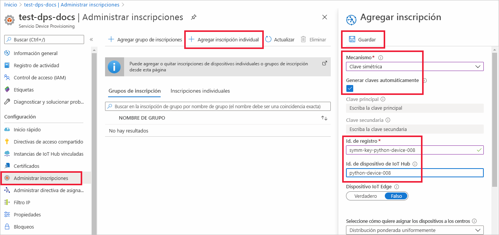
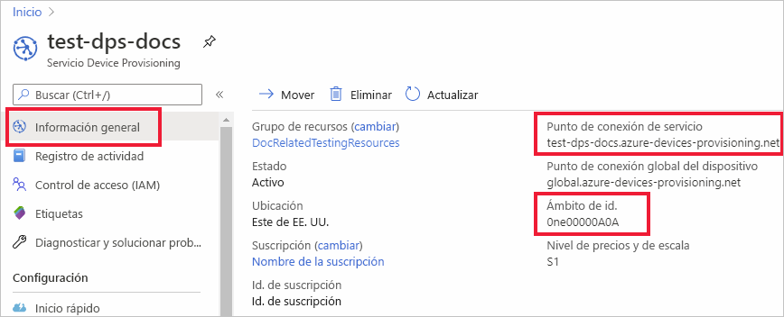
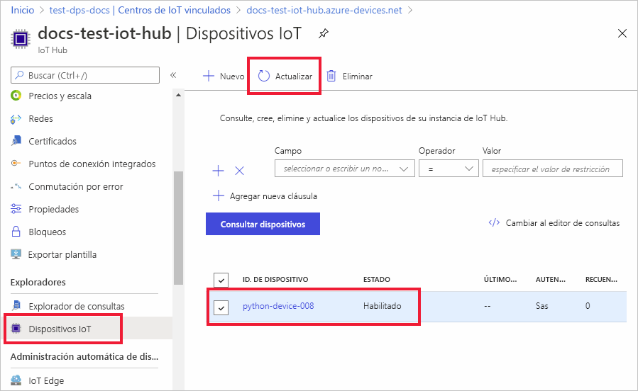

# <a name="quickstart-provision-a-python-device-with-symmetric-keys"></a>Aprovisionamiento de un dispositivo de Python con claves simétricas

En este inicio rápido, aprenderá a aprovisionar una máquina de desarrollo Windows como un dispositivo en un centro de IoT mediante Python. Este dispositivo utilizará una clave simétrica y una inscripción individual para autenticarse con una instancia del servicio Device Provisioning (DPS) para ser asignado a un centro de IoT. Se usará código de ejemplo del [SDK de Python de Azure IoT](https://github.com/Azure/azure-iot-sdk-python) para aprovisionar el dispositivo. 

Aunque en este artículo se muestra el aprovisionamiento con una inscripción individual, también puede usar grupos de inscripción. Hay algunas diferencias al usar los grupos de inscripción. Por ejemplo, debe usar una clave de dispositivo derivada con un identificador de registro único para el dispositivo. Aunque los grupos de inscripción de clave simétrica no se limitan a los dispositivos heredados, en [Cómo aprovisionar dispositivos heredados con la atestación de clave simétrica](how-to-legacy-device-symm-key.md) se proporciona un ejemplo de grupo de inscripción. Para obtener más información, consulte [Inscripciones de grupo para la atestación de clave simétrica](concepts-symmetric-key-attestation.md#group-enrollments).

Si no está familiarizado con el proceso de aprovisionamiento automático, revise la información general sobre el [aprovisionamiento](about-iot-dps.md#provisioning-process). 

Además, asegúrese de completar los pasos descritos en [Configuración del servicio Azure IoT Hub Device Provisioning con Azure Portal](./quick-setup-auto-provision.md) antes de continuar con este inicio rápido. Para seguir esta guía de inicio rápido, ya debe haber creado la instancia del Device Provisioning Service.

Este artículo está orientado a una estación de trabajo basada en Windows. No obstante, también puede realizar los procedimientos en Linux. Para obtener un ejemplo de Linux, consulte [Cómo aprovisionar para varios inquilinos](how-to-provision-multitenant.md).


[!INCLUDE [quickstarts-free-trial-note](../../includes/quickstarts-free-trial-note.md)]


## <a name="prerequisites"></a>Prerrequisitos

* Asegúrese de que tiene [Python 3.7](https://www.python.org/downloads/) o una versión posterior instalada en la máquina basada en Windows. Puede comprobar la versión de Python ejecutando `python --version`.

* Tener instalada la versión más reciente de [Git](https://git-scm.com/download/).

<a id="setupdevbox"></a>

## <a name="prepare-the-python-sdk-environment"></a>Preparación del entorno del SDK de Python 

1. Asegúrese de que Git está instalado en la máquina y se ha agregado a las variables de entorno accesibles desde la ventana de comandos. Consulte las [herramientas de cliente de Git de Software Freedom Conservancy](https://git-scm.com/download/) para instalar la versión más reciente de las herramientas `git`, lo que incluye **Git Bash** , la aplicación de línea de comandos que puede usar para interactuar con su repositorio de Git local. 

2. Abra un símbolo del sistema. Clone el repositorio de GitHub para el SDK de Python de Azure IoT:
    
    ```console
    git clone https://github.com/Azure/azure-iot-sdk-python.git --recursive
    ```
3. Vaya al directorio `azure-iot-sdk-python\azure-iot-device\samples\async-hub-scenarios` donde se encuentra el archivo de ejemplo _provision_symmetric_key.py_.
   
   ```console
   cd azure-iot-sdk-python\azure-iot-device\samples\async-hub-scenarios
   ```
4. Instale la biblioteca _azure-iot-device_ ejecutando el siguiente comando.

    ```console
    pip install azure-iot-device
    ```


## <a name="create-a-device-enrollment"></a>Creación de una inscripción de dispositivos

1. Inicie sesión en [Azure Portal](https://portal.azure.com), seleccione el botón **Todos los recursos** situado en el menú izquierdo y abra la instancia de Device Provisioning Service (DPS).

2. Seleccione la pestaña **Administrar inscripciones** y, después, seleccione el botón **Agregar inscripción individual** de la parte superior. 

3. En el panel **Agregar inscripción** , escriba la siguiente información y presione el botón **Guardar**.

   - **Mecanismo:** seleccione **Clave simétrica** como *mecanismo* de atestación de identidad.

   - **Generar claves automáticamente** : marque esta casilla.

   - **Identificador de registro** : escriba un identificador de registro para identificar la inscripción. Use únicamente caracteres alfanuméricos en minúsculas y guiones (“-”). Por ejemplo, **symm-key-python-device-008**.

   - **Id. de dispositivo de IoT Hub:** escriba un identificador de dispositivo. Por ejemplo, **python-device-008**.

     

4. Cuando haya guardado la inscripción, se generarán la **clave principal** y la **clave secundaria** , y se agregarán a la entrada de la inscripción. La inscripción del dispositivo con clave simétrica se muestra como **symm-key-phyton-device-008** en la columna *Id. de registro* de la pestaña *Inscripciones individuales*. 

5. Abra la inscripción y copie el valor de su **clave principal** generada. Usará estos valores de clave e **Id. de registro** más adelante cuando agregue variables de entorno para usarlas con el código de ejemplo de aprovisionamiento de dispositivos.


<a id="firstbootsequence"></a>

## <a name="prepare-the-device-provisioning-code"></a>Preparación del código de aprovisionamiento de dispositivos

En esta sección, agregará las cuatro variables de entorno siguientes, que se usarán como parámetros en el código de ejemplo de aprovisionamiento de dispositivos para el dispositivo de clave simétrica. 

* `PROVISIONING_HOST`
* `PROVISIONING_IDSCOPE`
* `PROVISIONING_REGISTRATION_ID`
* `PROVISIONING_SYMMETRIC_KEY`

El código de aprovisionamiento se pondrá en contacto con la instancia de DPS en función de estas variables para autenticar el dispositivo. Después, el dispositivo se asignará a un centro de IoT que ya está vinculado a la instancia de DPS en función de la configuración de inscripción individual. Una vez aprovisionado, el código de ejemplo enviará algún dato de telemetría de prueba al centro de IoT.

1. En [Azure Portal](https://portal.azure.com), en el menú Servicios Device Provisioning, seleccione **Información general** y copie los valores de _Punto de conexión del servicio_ y _Ámbito de id_. Usará estos valores en las variables de entorno `PROVISIONING_HOST` y `PROVISIONING_IDSCOPE`.

    

2. En el símbolo del sistema de Python, agregue las variables de entorno con los valores que copió. 

    Los comandos siguientes son ejemplos para mostrar su sintaxis. Asegúrese de usar los valores correctos.

    ```console
    set PROVISIONING_HOST=test-dps-docs.azure-devices-provisioning.net
    ```

    ```console
    set PROVISIONING_IDSCOPE=0ne00000A0A
    ```

3. En el símbolo del sistema de Python, agregue las variables de entorno para el identificador de registro y la clave simétrica que copió de la inscripción individual en la sección anterior. 

    Los comandos siguientes son ejemplos para mostrar su sintaxis. Asegúrese de usar los valores correctos.

    ```console
    set PROVISIONING_REGISTRATION_ID=symm-key-python-device-008
    ```

    ```console
    set PROVISIONING_SYMMETRIC_KEY=sbDDeEzRuEuGKag+kQKV+T1QGakRtHpsERLP0yPjwR93TrpEgEh/Y07CXstfha6dhIPWvdD1nRxK5T0KGKA+nQ==
    ```

4. Ejecute el código de ejemplo de Python en _provision_symmetric_key.py_.

    ```console
    D:\azure-iot-sdk-python\azure-iot-device\samples\async-hub-scenarios>python provision_symmetric_key.py
    ```

5. La salida esperada debe ser similar a la siguiente, que muestra el centro de IoT vinculado al que se asignó el dispositivo en función de la configuración de inscripción individual. También se envían al centro algunos ejemplos de mensajes de telemetría de velocidad del viento como prueba:

    ```output
    D:\azure-iot-sdk-python\azure-iot-device\samples\async-hub-scenarios>python provision_symmetric_key.py
    RegistrationStage(RequestAndResponseOperation): Op will transition into polling after interval 2.  Setting timer.
    The complete registration result is
    python-device-008
    docs-test-iot-hub.azure-devices.net
    initialAssignment
    null
    Will send telemetry from the provisioned device
    sending message #8
    sending message #9
    sending message #3
    sending message #10
    sending message #4
    sending message #2
    sending message #6
    sending message #7
    sending message #1
    sending message #5
    done sending message #8
    done sending message #9
    done sending message #3
    done sending message #10
    done sending message #4
    done sending message #2
    done sending message #6
    done sending message #7
    done sending message #1
    done sending message #5
    ```
    
6. En Azure Portal, vaya al centro de IoT vinculado a su servicio de aprovisionamiento y abra la hoja **Dispositivos de IoT**. Después de aprovisionar correctamente el dispositivo de clave simétrica en el centro de conectividad, el identificador del dispositivo se muestra con el valor de *ESTADO* **habilitado**. Es posible que deba presionar el botón **Actualizar** en la parte superior si tenía abierta la hoja antes de ejecutar el código de ejemplo del dispositivo. 

     

> [!NOTE]
> Si ha cambiado el valor predeterminado de *Estado inicial del dispositivo gemelo* en la entrada de inscripción para el dispositivo, el dispositivo puede extraer el estado gemelo deseado desde el centro y actuar en consecuencia. Para más información, consulte [Información y uso de dispositivos gemelos en IoT Hub](../iot-hub/iot-hub-devguide-device-twins.md).
>


## <a name="clean-up-resources"></a>Limpieza de recursos

Si planea seguir trabajando con el ejemplo de cliente de dispositivo y explorándolo, no limpie los recursos que se crean en este inicio rápido. Si no va a continuar, use el siguiente comando para eliminar todos los recursos que se han creado en este inicio rápido.

1. En el menú de la izquierda de Azure Portal, seleccione **Todos los recursos** y seleccione Device Provisioning Service. Abra **Administrar inscripciones** en servicio y, después, seleccione la pestaña **Inscripciones individuales**. Active la casilla situada junto al campo *ID. DE REGISTRO* del dispositivo que ha inscrito en este inicio rápido y presione el botón **Eliminar** situado en la parte superior del panel. 
1. En el menú de la izquierda de Azure Portal, seleccione **Todos los recursos** y después su centro de IoT. Abra **Dispositivos IoT** en su centro, active la casilla que hay junto al campo *ID DE DISPOSITIVO* del dispositivo que registró en este inicio rápido y, luego, presione el botón **Eliminar** situado en la parte superior del panel.

## <a name="next-steps"></a>Pasos siguientes

En este inicio rápido, ha aprovisionado un dispositivo de clave simétrica basado en Windows en el centro de IoT mediante IoT Hub Device Provisioning Service. Para aprender a aprovisionar dispositivos con certificado X.509 mediante Python, continúe con el inicio rápido siguiente para dispositivos X.509. 

> [!div class="nextstepaction"]
> [Plantillas de inicio rápido de Azure: Aprovisionamiento de dispositivos X.509 mediante DPS y Python](quick-create-simulated-device-x509-python.md)
