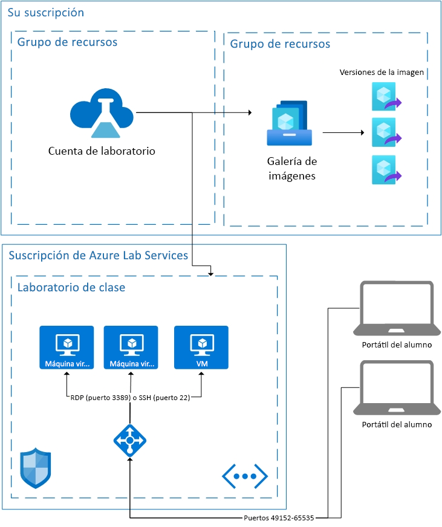

# Aspectos básicos de la arquitectura en Azure Lab Services

Azure Lab Services es una solución SaaS (software como servicio), lo que significa que es el usuario quien controla los recursos que necesita. En este artículo se tratarán los recursos fundamentales que usa Lab Services y la arquitectura básica de un laboratorio.  

Azure Lab Services proporciona un par de áreas que le permiten usar sus propios recursos junto con Lab Services.  Para más información sobre el uso de máquinas virtuales en su propia red, consulte cómo [emparejar una red virtual](how-to-connect-peer-virtual-network.md).  Para volver a usar imágenes de Shared Image Gallery, consulte cómo [asociar Shared Image Gallery](how-to-attach-detach-shared-image-gallery.md).

A continuación encontrará la arquitectura básica de un laboratorio educativo.  La cuenta del laboratorio se hospeda en su suscripción. Las máquinas virtuales de los alumnos, junto con los recursos necesarios para dar soporte a dichas máquinas, se hospedan en una suscripción propiedad de Lab Services. Expliquemos con mayor detalle lo que hay en las suscripciones de Lab Services.

## Recursos hospedados

Los recursos necesarios para ejecutar un laboratorio de clase se hospedan en una de las suscripciones de Azure administradas por Microsoft.  Los recursos incluyen una plantilla de máquina virtual para el instructor, una máquina virtual para cada alumno y los elementos relacionados con la red, como un equilibrador de carga, una red virtual y un grupo de seguridad de red.  Se supervisa si hay una actividad sospechosa en estas suscripciones.  Es importante tener en cuenta que esta supervisión se realiza externamente a las máquinas virtuales a través de la extensión de máquina virtual o la supervisión del patrón de red.  Si la característica [apagar al desconectar](how-to-enable-shutdown-disconnect.md) está habilitada, se habilita una extensión de diagnóstico en la máquina virtual. La extensión permite que Lab Services esté informado del evento de desconexión de la sesión del Protocolo de escritorio remoto (RDP).

## Virtual Network

Cada laboratorio está aislado por su propia red virtual.  Si el laboratorio tiene una [red virtual emparejada](how-to-connect-peer-virtual-network.md), cada laboratorio está aislado por su propia subred.  Los alumnos se conectan a su máquina virtual a través de un equilibrador de carga.  Ninguna máquina virtual de los alumnos tiene una dirección IP pública; solo tienen una dirección IP privada.  La cadena de conexión del alumno será la dirección IP pública del equilibrador de carga y un puerto aleatorio entre el 49152 y el 65535.  Las reglas de entrada del equilibrador de carga reenvían la conexión, en función del sistema operativo, al puerto 22 (SSH) o al puerto 3389 (RDP) de la máquina virtual adecuada. Un grupo de seguridad de red impide el tráfico de salida en los restantes puertos.

## Control de acceso a las máquinas virtuales

Lab Services controla la capacidad del alumno para realizar acciones como iniciar y detener en sus máquinas virtuales.  También controla el acceso a la información de conexión de la máquina virtual.

Lab Services también controla el registro de alumnos en el servicio. Actualmente hay dos configuraciones de acceso diferentes: restringido y no restringido. Para más información, consulte el artículo sobre la [administración de usuarios de laboratorio](how-to-configure-student-usage.md#send-invitations-to-users). Acceso restringido significa que Lab Services comprueba que los alumnos se agregan como usuario antes de permitir el acceso. No restringido significa que cualquier usuario se puede registrar, siempre y cuando tenga el vínculo de registro y haya capacidad en el laboratorio. No restringido puede ser útil para eventos hackathon.

Las máquinas virtuales de los alumnos que se hospedan en el laboratorio educativo tienen un nombre de usuario y una contraseña establecidos por el creador del laboratorio.  Como alternativa, el creador del laboratorio puede permitir a los alumnos registrados elegir su propia contraseña en el primer inicio de sesión.  

## Pasos siguientes

Para más información sobre las características disponibles en Lab Services, consulte [Conceptos de Azure Lab Services](classroom-labs-concepts.md) e [Introducción a Azure Lab Services](classroom-labs-overview.md).
