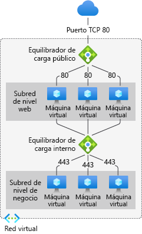
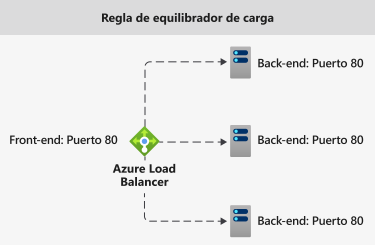
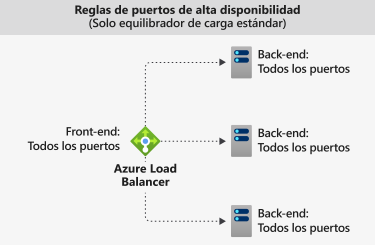

# Componentes de Azure Load Balancer

Azure Load Balancer incluye algunos componentes clave. Puede configurar esos componentes en su suscripción mediante:

* Azure portal
* CLI de Azure
* Azure PowerShell
* Plantillas de Resource Manager

## Configuración de direcciones IP de front-end 

La dirección IP de Azure Load Balancer. Es el punto de contacto de los clientes. Estas direcciones IP pueden ser:

- **Dirección IP pública**
- **Dirección IP privada**

La naturaleza de la dirección IP determina el **tipo** de equilibrador de carga creado. Si se selecciona una dirección IP privada, se crea un equilibrador de carga interno. Si se selecciona una dirección IP pública, se crea un equilibrador de carga público.

|  | Equilibrador de carga público  | Equilibrador de carga interno |
| ---------- | ---------- | ---------- |
| **Configuración de direcciones IP de front-end**| Dirección IP pública | Dirección IP privada|
| **Descripción** | Los equilibradores de carga públicos asignan la IP pública y el puerto de tráfico entrante a la IP privada y al puerto de la máquina virtual. El equilibrador de carga asigna el tráfico de la otra manera en torno al tráfico de respuesta de la máquina virtual. Puede distribuir determinados tipos de tráfico entre varias máquinas virtuales o servicios aplicando reglas de equilibrio de carga. Por ejemplo, puede distribuir la carga del tráfico de solicitudes web entre varios servidores web.| Un equilibrador de carga interno distribuye el tráfico a los recursos que se encuentran en una red virtual. Azure restringe el acceso a las direcciones IP de front-end de una red virtual que tienen equilibrio de carga. Las direcciones IP de front-end y las redes virtuales no se exponen nunca directamente a un punto de conexión de Internet. Las aplicaciones de línea de negocio internas se ejecutan en Azure y se accede a ellas desde Azure o desde recursos locales. |
| **SKU compatibles** | Básico y Estándar | Básico y Estándar |

Load Balancer puede tener varias direcciones IP de front-end. Obtenga más información acerca del uso de [varios front-end](load-balancer-multivip-overview.md).

## Grupo back-end

El grupo de máquinas virtuales o instancias de un conjunto de escalado de máquinas virtuales que van a atender la solicitud entrante. Para escalar de forma rentable, con el fin de satisfacer grandes volúmenes de instrucciones para el procesamiento de tráfico entrante, generalmente se recomienda agregar más instancias al grupo de back-end.

El equilibrador de carga se reconfigura al instante de forma automática mediante el escalado o la reducción vertical de instancias. Si se agregan o quitan máquinas virtuales del grupo de servidores back-end, el equilibrador de carga se vuelve a configurar sin operaciones adicionales. El ámbito del grupo de back-end es cualquier máquina virtual de la red virtual.

A la hora de considerar cómo diseñar el grupo de back-end, diseñe el menor número de recursos individuales del grupo de back-end para optimizar la duración de las operaciones de administración. No hay ninguna diferencia en el rendimiento o la escala del plano de los datos.

## Sondeos de estado

Los sondeos de estado se usan para determinar el estado de mantenimiento de las instancias del grupo de back-end. Durante la creación del equilibrador de carga, configure un sondeo de estado para que lo use el equilibrador de carga.  Este sondeo de estado determinará si una instancia está en buen estado y puede recibir tráfico.

Puede definir el umbral incorrecto de los sondeos de estado. Si un sondeo no responde, Azure Load Balancer deja de enviar nuevas conexiones a las instancias incorrectas. Un error de sondeo no afecta a las conexiones existentes. La conexión continúa hasta que la aplicación:

- Finaliza el flujo.
- Se produce el tiempo de espera de inactividad.
- La máquina virtual se apaga.

Load Balancer proporciona diferentes tipos de sondeo de estado para los puntos de conexión: TCP, HTTP y HTTPS. [Obtenga más información sobre los sondeos de estado de Load Balancer](load-balancer-custom-probe-overview.md).

La versión Básico de Load Balancer no admite sondeos HTTPS. Además, cierra todas las conexiones TCP (incluidas las conexiones establecidas).

## Reglas de equilibrio de carga

Las reglas de Load Balancer se usan para definir cómo se distribuye el tráfico entrante a **todas** las instancias del grupo de back-end. Las reglas de equilibrio de carga asignan una configuración de dirección IP de front-end y un puerto dados a varios puertos y direcciones IP de back-end.

Por ejemplo, use una regla de equilibrio de carga para el puerto 80, a fin de enrutar el tráfico de la dirección IP de front-end al puerto 80 de las instancias de back-end.

  

*Ilustración: Reglas de equilibrio de carga*

## Puertos de alta disponibilidad

Regla de equilibrador de carga configurada con **"protocol - all and port - 0"** . 

Permite proporcionar una única regla para equilibrar la carga de todos los flujos TCP y UDP que llegan a todos los puertos de una instancia interna de Standard Load Balancer. 

La decisión de equilibrio de carga se toma por cada flujo. Esta acción se basa en la siguiente conexión de tupla de cinco elementos: 

1. dirección IP de origen
2. puerto de origen
3. dirección IP de destino
4. puerto de destino
5. protocol

Las reglas de equilibrio de carga de puertos de alta disponibilidad le ayudan a la hora de usar escenarios críticos como aquellos con alta disponibilidad y escalabilidad para dispositivos virtuales de red (NVA) que estén en redes virtuales. La característica puede ayudar cuando hay que equilibrar la carga de un gran número de puertos.

  

*Ilustración: Reglas de puertos de alta disponibilidad*

Más información sobre los [puertos de alta disponibilidad](load-balancer-ha-ports-overview.md)

## Reglas NAT de entrada

Una regla NAT de entrada reenvía el tráfico entrante enviado a la combinación de dirección IP y puerto de front-end. El tráfico se envía a una máquina virtual o instancia **específica** en el grupo de back-end. El reenvío de puertos se realiza mediante la misma distribución basada en hash que el equilibrio de carga.

Por ejemplo, so desea que las sesiones de Secure Shell (SSH) o del Protocolo de escritorio remoto (RDP) separan las instancias de máquina virtual en un grupo de back-end. Se pueden asignar varios puntos de conexión internos a puertos de la misma dirección IP de front-end. Las direcciones IP de front-end se pueden usar para administrar de forma remota máquinas virtuales sin un jumpbox adicional.

  

*Ilustración: Reglas NAT de entrada*

Las reglas NAT de entrada en el contexto de Virtual Machine Scale Sets son grupos de NAT de entrada. Más información sobre los [componentes de Load Balancer y el conjunto de escalado de máquinas virtuales](../virtual-machine-scale-sets/virtual-machine-scale-sets-networking.md#azure-virtual-machine-scale-sets-with-azure-load-balancer)

## Reglas de salida

Una regla de salida configura una traducción de direcciones de red (NAT) de salida para todas las máquinas virtuales o instancias identificadas por el grupo de back-end. Esta regla permite que las instancias del back-end se comuniquen (saliente) con Internet u otros puntos de conexión.

Obtenga más información sobre las [conexiones y reglas de salida](load-balancer-outbound-connections.md).

Load Balancer Básico no admite reglas de salida.

## Limitaciones

- Más información sobre los [límites](../azure-resource-manager/management/azure-subscription-service-limits.md) de Load Balancer 
- Load Balancer proporciona equilibrio de carga y reenvío de puertos para protocolos TCP o UDP concretos. Las reglas de equilibrio de carga y las reglas NAT de entrada admiten TCP y UDP, pero no otros protocolos IP, incluido ICMP.
- No se generará el flujo saliente de una máquina virtual del back-end a un front-end de un equilibrador de carga interno.
- Una regla de equilibrador de carga no puede abarcar dos redes virtuales.  Los front-end y sus instancias de back-end deben estar ubicados en la misma red virtual.  
- No se admite el reenvío de fragmentos IP en reglas de equilibrio de carga. No se admite la fragmentación IP de paquetes UDP y TCP en reglas de equilibrio de carga. Las reglas de equilibrio de carga de los puertos de alta disponibilidad se pueden usar para reenviar fragmentos de IP existentes. Para más información, consulte [Información general sobre los puertos de alta disponibilidad](load-balancer-ha-ports-overview.md).

## Pasos siguientes

- Consulte el artículo sobre cómo [crear una instancia de Standard Load Balancer pública](quickstart-load-balancer-standard-public-portal.md) para empezar a usar un equilibrador de carga.
- Más información sobre [Azure Load Balancer](load-balancer-overview.md).
- Información sobre las [direcciones IP públicas](../virtual-network/virtual-network-public-ip-address.md)
- Información sobre las [direcciones IP privadas](../virtual-network/private-ip-addresses.md)
- Más información en [Standard Load Balancer y Availability Zones](load-balancer-standard-availability-zones.md).
- Más información acerca de los [diagnósticos de Load Balancer Estándar](load-balancer-standard-diagnostics.md).
- Obtenga información sobre el [restablecimiento de TCP en estado inactivo](load-balancer-tcp-reset.md).
- Más información acerca de [Standard Load Balancer con reglas de equilibrio de carga para puertos HA](load-balancer-ha-ports-overview.md).
- Más información sobre los [grupos de seguridad de red](../virtual-network/network-security-groups-overview.md).
- Más información sobre los [límites de Load Balancer](../azure-resource-manager/management/azure-subscription-service-limits.md#load-balancer).
- Información sobre el uso del [reenvío de puertos](./tutorial-load-balancer-port-forwarding-portal.md).