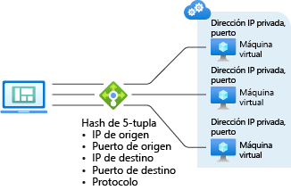

# Algoritmo de Azure Load Balancer

Load Balancer proporciona varias funcionalidades para las aplicaciones UDP y TCP.

## Algoritmo de equilibrio de carga

Se puede crear una regla de equilibrio de carga para distribuir el tráfico del front-end a un grupo del back-end. Azure Load Balancer usa un algoritmo hash para la distribución de los flujos (no bytes) entrantes. Load Balancer reescribe los encabezados de los flujos en las instancias del grupo del back-end. Un servidor está disponible para recibir nuevos flujos cuando el sondeo de estado indica un punto de conexión de back-end correcto.

De forma predeterminada, Load Balancer usa un hash de tupla de cinco elementos.

El hash incluye:

- **Dirección IP de origen**
- **Puerto de origen**
- **Dirección IP de destino**
- **Puerto de destino**
- **Número de protocolo IP para asignar flujos a servidores disponibles**

La afinidad con una dirección IP de origen se crea mediante un hash de tuplas de dos o tres elementos. Todos los paquetes del mismo flujo de paquetes llegan a la misma instancia detrás del front-end con equilibrio de carga.

El puerto de origen cambia cuando un cliente inicia un nuevo flujo desde Cuando el cliente inicia un nuevo flujo desde la misma dirección IP de origen. En consecuencia, el hash de tupla de cinco elementos puede hacer que el tráfico vaya a otro punto de conexión de back-end.
Para más información, consulte [Configurar el modo de distribución para Azure Load Balancer](./load-balancer-distribution-mode.md).

En la siguiente imagen se muestra la distribución basada en hash:

*Ilustración: distribución basada en hash*

## Independencia y transparencia de aplicaciones

Load Balancer no interactúa directamente con TCP ni UDP ni con la capa de aplicación. Se puede admitir cualquier escenario de aplicación TCP o UDP. Load Balancer no cierra ni origina flujos, ni interactúa con la carga del flujo. Load Balancer no proporciona la funcionalidad de puerta de enlace de la capa de aplicación. Los protocolos de enlace de protocolo siempre se producen directamente entre el cliente y la instancia del grupo de back-end. Una respuesta a un flujo de entrada siempre es una respuesta de una máquina virtual. Cuando llega el flujo a la máquina virtual, también se conserva la dirección IP de origen original.

- A cada punto de conexión le responde una máquina virtual. Por ejemplo, un protocolo de enlace TCP se realiza entre el cliente y la máquina virtual de back-end seleccionada. Una respuesta a una solicitud a un front-end es una respuesta generada por una máquina virtual de back-end. Cuando se valida correctamente la conectividad con un front-end, se valida la conectividad de un extremo a otro con al menos una máquina virtual de back-end.
- Las cargas útiles de las aplicaciones son transparentes para Load Balancer. Se puede admitir cualquier aplicación UDP o TCP.
- Como Load Balancer no interactúa con la carga de TCP y proporciona descarga de TLS, puede crear escenarios cifrados completos. Con Load Balancer se obtiene una mayor escalabilidad horizontal de las aplicaciones TLS, ya que la conexión TLS finaliza en la propia máquina virtual. Por ejemplo, la capacidad para claves de sesión TLS solo está limitada por el tipo y número de máquinas virtuales que se agregan al grupo de servidores back-end.

## Pasos siguientes

- Obtenga información acerca de los [componentes](components.md) que conforman Azure Load Balancer.
- Consulte [Creación de una instancia de Standard Load Balancer](quickstart-load-balancer-standard-public-portal.md) para empezar a usar una instancia de Load Balancer: crear una, crear máquinas virtuales con una extensión de IIS personalizada instalada y equilibrar la carga de la aplicación web entre las máquinas virtuales.
- Información sobre [Conexiones salientes de Azure Load Balancer](load-balancer-outbound-connections.md).
- Más información sobre [Azure Load Balancer](load-balancer-overview.md).
- Más información sobre [sondeos de mantenimiento](load-balancer-custom-probe-overview.md).
- Más información acerca de los [diagnósticos de Load Balancer Estándar](load-balancer-standard-diagnostics.md).
- Más información sobre los [grupos de seguridad de red](../virtual-network/network-security-groups-overview.md).