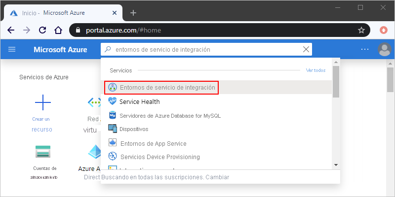
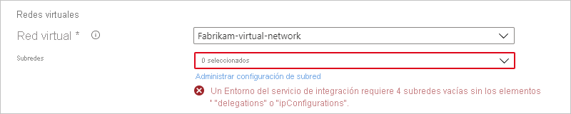
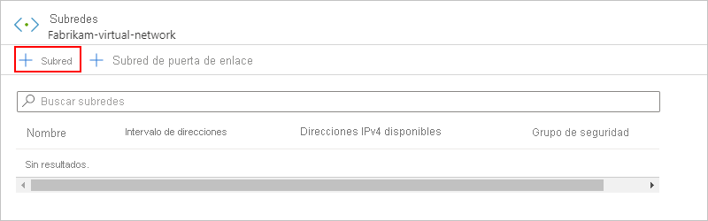
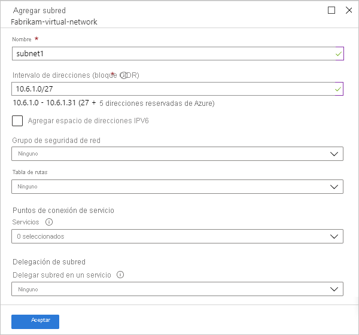
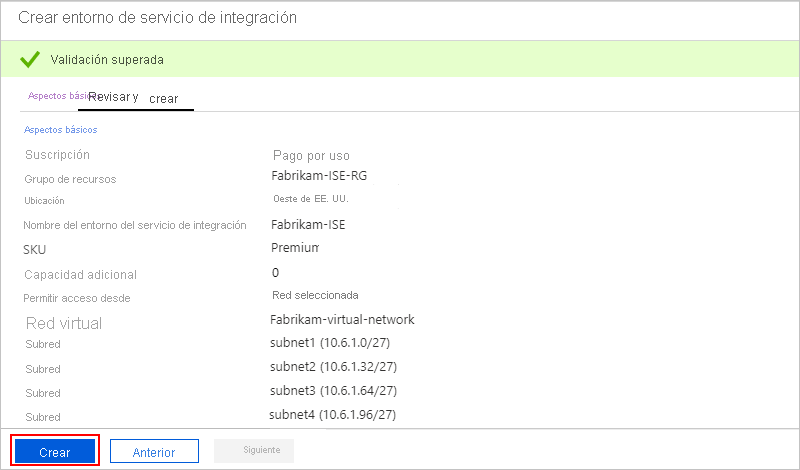
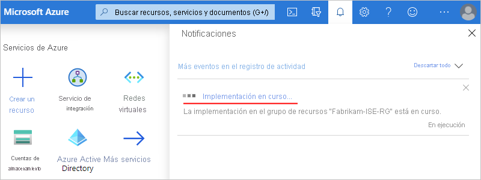
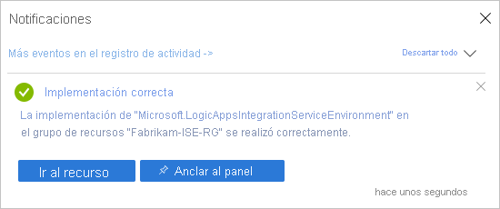

# <a name="connect-to-azure-virtual-networks-from-azure-logic-apps-by-using-an-integration-service-environment-ise"></a>Conectarse a redes virtuales de Azure desde Azure Logic Apps mediante un entorno del servicio de integración (ISE)

Para escenarios donde sus cuentas de integración y las aplicaciones lógicas necesitan tener acceso a una [red virtual de Azure](../virtual-network/virtual-networks-overview.md), cree un [*entorno de servicio de integración* (ISE)](../logic-apps/connect-virtual-network-vnet-isolated-environment-overview.md). Un ISE es un entorno dedicado que usa almacenamiento dedicado y otros recursos que existen de forma independiente del servicio Logic Apps multiinquilino "global". Esta separación también reduce los posibles efectos que podrían tener otros inquilinos de Azure en el rendimiento de la aplicación. Un ISE también le proporciona sus propias direcciones IP estáticas. Estas direcciones IP son independientes de las direcciones IP estáticas que comparten las aplicaciones lógicas en el servicio multiinquilino público.

Cuando crea un ISE, Azure *inserta* ese ISE en la red virtual de Azure que, luego, implementa el servicio Logic Apps en la red virtual. Al crear aplicaciones lógicas o cuentas de integración, seleccionará el ISE como ubicación. Así, las aplicaciones lógicas y las cuentas de integración tienen acceso directo a recursos tales como las máquinas virtuales, los servidores, los sistemas y los servicios de la red virtual.


> [!IMPORTANT]
> Para que las aplicaciones lógicas y las cuentas de integración funcionen juntas en un ISE, ambas deben usar *el mismo ISE* como ubicación.

Un ISE ha aumentado los límites de duración de ejecución, retención de almacenamiento, rendimiento, solicitud HTTP y tiempos de espera de respuesta, tamaños de mensaje y solicitudes del conector personalizado. Para más información, consulte el artículo de [límites y configuración para Azure Logic Apps](../logic-apps/logic-apps-limits-and-config.md). Para más información sobre los ISE, consulte [Acceso a recursos de Azure Virtual Network desde Azure Logic Apps](../logic-apps/connect-virtual-network-vnet-isolated-environment-overview.md).

En este artículo se muestra cómo realizar estas tareas mediante Azure Portal:

* Habilite el acceso para el ISE.
* Cree el ISE.
* Agregue capacidad adicional al ISE.

También puede crear un ISE mediante el [ejemplo de plantilla de inicio rápido de Azure Resource Manager](https://github.com/Azure/azure-quickstart-templates/tree/master/201-integration-service-environment) o la API REST de Logic Apps, incluida la configuración de claves administradas por el cliente:

* [Creación de un entorno del servicio de integración (ISE) mediante la API REST de Logic Apps](../logic-apps/create-integration-service-environment-rest-api.md)
* [Configuración de claves administradas por el cliente para cifrar datos en reposo en los ISE](../logic-apps/customer-managed-keys-integration-service-environment.md)

## <a name="prerequisites"></a>Requisitos previos

* Una cuenta y una suscripción de Azure. Si no tiene una suscripción de Azure, [regístrese para obtener una cuenta gratuita de Azure](https://azure.microsoft.com/free/).

  > [!IMPORTANT]
  > Las aplicaciones lógicas, los desencadenadores integrados, las acciones integradas y los conectores que se ejecutan en el ISE usan un plan de tarifa diferente al plan de tarifa basado en el consumo. Para saber cómo funcionan los precios y la facturación para los ISE, consulte [Modelo de precios de Logic Apps](../logic-apps/logic-apps-pricing.md#fixed-pricing). Para ver las tarifas de precios, consulte los [precios de Logic Apps](../logic-apps/logic-apps-pricing.md).

* Una instancia de [Azure Virtual Network](../virtual-network/virtual-networks-overview.md). La red virtual debe tener cuatro subredes *vacías*, que son necesarias para crear e implementar recursos en el ISE y que estos componentes internos y ocultos usan:

  * Proceso de Logic Apps
  * App Service Environment interno (conectores)
  * API Management interno (conectores)
  * Redis interno para el almacenamiento en caché y el rendimiento
  
  Puede crear las subredes por adelantado o esperar a que se cree el ISE para crearlas al mismo tiempo. Sin embargo, antes de crear las subredes, revise los [requisitos de subred](#create-subnet).

  > [!IMPORTANT]
  >
  > No use los siguientes espacios de direcciones IP para la red virtual o las subredes, ya que Azure Logic Apps no pueden resolverlos:<p>
  > 
  > * 0.0.0.0/8
  > * 100.64.0.0/10
  > * 127.0.0.0/8
  > * 168.63.129.16/32
  > * 169.254.169.254/32

  * Asegúrese de que la red virtual [habilita el acceso para el ISE](#enable-access) para que su ISE funcione correctamente y permanezca accesible.

  * Si usa o desea usar [ExpressRoute](../expressroute/expressroute-introduction.md) junto con [tunelización forzada](../firewall/forced-tunneling.md), debe [crear una tabla de rutas](../virtual-network/manage-route-table.md) con la siguiente ruta específica y vincular dicha tabla a cada subred que el entorno de servicio de integración usa:

    **Nombre**: <*nombre de ruta*><br>
    **Prefijo de dirección**: 0.0.0.0/0<br>
    **Próximo salto**: Internet
    
    Esta tabla de rutas es necesaria para que los componentes de Logic Apps se comuniquen con otros servicios dependientes de Azure, como Azure Storage y Azure SQL DB. Para más información sobre esta ruta, consulte [Prefijo de dirección 0.0.0.0/0](../virtual-network/virtual-networks-udr-overview.md#default-route). Si no usa la tunelización forzada con ExpressRoute, no necesita esta tabla de rutas específica.
    
    ExpressRoute permite extender las redes locales a la nube de Microsoft y conectarse a servicios de esta a través de una conexión privada que facilita el proveedor de conectividad. En concreto, ExpressRoute es una red privada virtual que enruta el tráfico a través de una red privada y no a través de la red pública Internet. Las aplicaciones lógicas pueden conectarse a recursos locales que están en la misma red virtual cuando se conectan a través de ExpressRoute o una red privada virtual.
   
  * Si usa una [aplicación virtual de red (NVA)](../virtual-network/virtual-networks-udr-overview.md#user-defined), asegúrese de no habilitar la terminación TLS/SSL ni cambiar el tráfico TLS/SSL saliente. Además, asegúrese de no habilitar la inspección del tráfico que se origina en la subred de la ISE. Para más información, consulte [Enrutamiento del tráfico de redes virtuales](../virtual-network/virtual-networks-udr-overview.md).

  * Si quiere usar servidores DNS personalizados para su red virtual de Azure, [configure esos servidores siguiendo estos pasos](../virtual-network/virtual-networks-name-resolution-for-vms-and-role-instances.md) antes de implementar el ISE en su red virtual. Para más información acerca de la administración de la configuración del servidor DNS, consulte [Crear, cambiar o eliminar una red virtual](../virtual-network/manage-virtual-network.md#change-dns-servers).

    > [!NOTE]
    > Si cambia el servidor DNS o la configuración de este, debe reiniciar el ISE para que pueda recoger dichos cambios. Para obtener más información, consulte [Restablecimiento del ISE](../logic-apps/ise-manage-integration-service-environment.md#restart-ISE).

<a name="enable-access"></a>

## <a name="enable-access-for-ise"></a>Habilitar el acceso para el ISE

Cuando se usa un ISE con una red virtual de Azure, un problema de configuración habitual es tener uno o varios puertos bloqueados. Los conectores que usa para crear conexiones entre su ISE y los sistemas de destino también pueden tener sus propios requisitos de puerto. Por ejemplo, si se comunica con un sistema FTP mediante el conector FTP, el puerto que usa en el sistema FTP debe estar disponible, por ejemplo, el puerto 21 para enviar comandos.

Para asegurarse de que el ISE sea accesible y de que las aplicaciones lógicas del ISE puedan comunicarse a través de cada subred de la red virtual, [abra los puertos descritos en esta tabla para cada subred](#network-ports-for-ise). Si alguno de los puertos necesarios no está disponible, el ISE no funcionará correctamente.

* Si tiene varias instancias de ISE que necesitan acceso a otros puntos de conexión con restricciones de IP, implemente [Azure Firewall](../firewall/overview.md) o una [aplicación virtual de red](../virtual-network/virtual-networks-overview.md#filter-network-traffic) en la red virtual y enrute el tráfico saliente a través de ese firewall o aplicación virtual de red. Después, puede [configurar una dirección IP única, de salida, pública, estática y predecible](connect-virtual-network-vnet-set-up-single-ip-address.md) que todas las instancias de ISE de la red virtual puedan usar para comunicarse con los sistemas de destino. De ese modo, no es necesario configurar aperturas adicionales del firewall en los sistemas de destino para cada ISE.

   > [!NOTE]
   > También puede usar este enfoque para un solo ISE si el escenario requiere limitar el número de direcciones IP que necesitan acceso. Considere si los costos adicionales del firewall o el dispositivo de red virtual tienen sentido para su escenario. Obtenga más información sobre los [precios de Azure Firewall](https://azure.microsoft.com/pricing/details/azure-firewall/).

* Si ha creado una nueva red virtual de Azure y subredes sin ninguna restricción, no es necesario configurar [grupos de seguridad de red (NSG)](../virtual-network/network-security-groups-overview.md#network-security-groups) en la red virtual para controlar el tráfico entre las subredes.

* En el caso de una red virtual existente, puede, *de forma opcional*, configurar [grupos de seguridad de red (NSG)](../virtual-network/network-security-groups-overview.md#network-security-groups) para [filtrar el tráfico de red entre subredes](../virtual-network/tutorial-filter-network-traffic.md). Si quiere usar esta ruta, o si ya usa NSG, [abra los puertos descritos en esta tabla](#network-ports-for-ise) para esos NSG.

  Al configurar las [reglas de seguridad de NSG](../virtual-network/network-security-groups-overview.md#security-rules), debe usar *ambos* protocolos, **TCP** y **UDP**, o bien seleccionar **Cualquiera** en su lugar para no tener que crear reglas independientes para cada protocolo. Las reglas de seguridad de NSG describen los puertos que debe abrir para las direcciones IP que necesitan acceder a esos puertos. Asegúrese de que todo firewall, enrutador u otro elemento que exista entre estos puntos de conexión también mantengan esos puertos accesibles para esas direcciones IP.

* Si configura la tunelización forzada a través del firewall para redirigir el tráfico enlazado a Internet, revise los [requisitos adicionales de la tunelización forzada](#forced-tunneling).

<a name="network-ports-for-ise"></a>

### <a name="network-ports-used-by-your-ise"></a>Puertos de red usados por el ISE

En esta tabla se describen los puertos que necesita el ISE para ser accesible y el propósito de esos puertos. Para ayudar a reducir la complejidad que conlleva la configuración de reglas de seguridad, la tabla usa [etiquetas de servicio](../virtual-network/service-tags-overview.md) que representan grupos de prefijos de direcciones IP de un servicio de Azure concreto. Cuando así se indica, *ISE interno* e *ISE externo* hacen referencia al [punto de conexión de acceso seleccionado durante la creación del ISE](connect-virtual-network-vnet-isolated-environment.md#create-environment). Para más información, consulte [Acceso al punto de conexión](../logic-apps/connect-virtual-network-vnet-isolated-environment-overview.md#endpoint-access).

> [!IMPORTANT]
> En todas las reglas, establezca los puertos de origen en `*`, ya que estos son efímeros.

#### <a name="inbound-security-rules"></a>Reglas de seguridad de entrada

| Propósito | Etiqueta de servicio de origen o direcciones IP | Puertos de origen | Etiqueta de servicio de destino o direcciones IP | Puertos de destino | Notas |
|---------|------------------------------------|--------------|-----------------------------------------|-------------------|-------|
| Comunicación entre subredes en una red virtual | Espacio de direcciones de la red virtual con subredes del ISE | * | Espacio de direcciones de la red virtual con subredes del ISE | * | Necesario para que el tráfico fluya *entre* las subredes de la red virtual. <p><p>**Importante**: Para que el tráfico fluya entre los *componentes* de cada subred, asegúrese de abrir todos los puertos de cada subred. |
| Ambos: <p>Comunicación con la aplicación lógica <p><p>Historial de ejecución de aplicación lógica| ISE interno: <br>**VirtualNetwork** <p><p>ISE externo: **Internet** o consulte **Notas** | * | **VirtualNetwork** | 443 | En lugar de usar la etiqueta de servicio **Internet**, puede especificar la dirección IP de origen de estos elementos: <p><p>- Equipo o servicio que llama a cualquier desencadenador de solicitud o webhook de la aplicación lógica <p>- Equipo o servicio desde el que se quiere acceder al historial de ejecución de la aplicación lógica <p><p>**Importante**: El cierre o bloqueo de este puerto evita las llamadas a aplicaciones lógicas con desencadenadores de solicitud o webhooks. También se evita que acceda a las entradas y salidas de cada paso del historial de ejecución. Pero no se evita que acceda al historial de ejecución de la aplicación lógica.|
| Diseñador de Logic Apps: propiedades dinámicas | **LogicAppsManagement** | * | **VirtualNetwork** | 454 | Las solicitudes proceden de las [direcciones IP entrantes](../logic-apps/logic-apps-limits-and-config.md#inbound) del punto de conexión de acceso de Logic Apps de esa región. |
| Implementación del conector | **AzureConnectors** | * | **VirtualNetwork** | 454 | Necesario para implementar y actualizar conectores. El cierre o bloqueo de este puerto da lugar a errores de las implementaciones de ISE y evita las actualizaciones y correcciones del conector. |
| Comprobación del estado de la red | **LogicApps** | * | **VirtualNetwork** | 454 | Las solicitudes proceden de las [direcciones IP entrantes](../logic-apps/logic-apps-limits-and-config.md#inbound) del punto de conexión de acceso de Logic Apps y las [direcciones IP salientes](../logic-apps/logic-apps-limits-and-config.md#outbound) de esa región. |
| Dependencia de administración de App Service | **AppServiceManagement** | * | **VirtualNetwork** | 454, 455 ||
| Comunicación de Azure Traffic Manager | **AzureTrafficManager** | * | **VirtualNetwork** | ISE interno: 454 <p><p>ISE externo: 443 ||
| Ambos: <p>Implementación de la directiva de conectores <p>API Management: punto de conexión de administración | **APIManagement** | * | **VirtualNetwork** | 3443 | Para la implementación de la directiva de conectores, es necesario el acceso a los puertos para implementar y actualizar conectores. El cierre o bloqueo de este puerto da lugar a errores de las implementaciones de ISE y evita las actualizaciones y correcciones del conector. |
| Acceso a instancias de Azure Cache for Redis entre instancias de rol | **VirtualNetwork** | * | **VirtualNetwork** | 6379 - 6383, además consulte **Notas**| Para que ISE funcione con Azure Cache for Redis, debe abrir estos [puertos de entrada y salida descritos en las Preguntas frecuentes sobre Azure Cache for Redis](../azure-cache-for-redis/cache-how-to-premium-vnet.md#outbound-port-requirements). |
|||||||

#### <a name="outbound-security-rules"></a>Reglas de seguridad de entrada

| Propósito | Etiqueta de servicio de origen o direcciones IP | Puertos de origen | Etiqueta de servicio de destino o direcciones IP | Puertos de destino | Notas |
|---------|------------------------------------|--------------|-----------------------------------------|-------------------|-------|
| Comunicación entre subredes en una red virtual | Espacio de direcciones de la red virtual con subredes del ISE | * | Espacio de direcciones de la red virtual con subredes del ISE | * | Necesario para que el tráfico fluya *entre* las subredes de la red virtual. <p><p>**Importante**: Para que el tráfico fluya entre los *componentes* de cada subred, asegúrese de abrir todos los puertos de cada subred. |
| Comunicación con la aplicación lógica | **VirtualNetwork** | * | Varía según el destino | 80, 443 | El destino varía en función de los puntos de conexión del servicio externo con el que la aplicación lógica necesita comunicarse. |
| Azure Active Directory | **VirtualNetwork** | * | **AzureActiveDirectory** | 80, 443 ||
| Dependencia de Azure Storage | **VirtualNetwork** | * | **Storage** | 80, 443, 445 ||
| Administración de conexiones | **VirtualNetwork** | * | **AppService** | 443 ||
| Publicación de métricas y registros de diagnóstico | **VirtualNetwork** | * | **AzureMonitor** | 443 ||
| Dependencia de Azure SQL | **VirtualNetwork** | * | **SQL** | 1433 ||
| Azure Resource Health | **VirtualNetwork** | * | **AzureMonitor** | 1886 | Necesario para publicar el estado de mantenimiento en Resource Health. |
| Dependencia de la directiva de registro en el centro de eventos y agente de supervisión | **VirtualNetwork** | * | **EventHub** | 5672 ||
| Acceso a instancias de Azure Cache for Redis entre instancias de rol | **VirtualNetwork** | * | **VirtualNetwork** | 6379 - 6383, además consulte **Notas**| Para que ISE funcione con Azure Cache for Redis, debe abrir estos [puertos de entrada y salida descritos en las Preguntas frecuentes sobre Azure Cache for Redis](../azure-cache-for-redis/cache-how-to-premium-vnet.md#outbound-port-requirements). |
| Resolución de nombres DNS | **VirtualNetwork** | * | Direcciones IP de los servidores de Sistema de nombres de dominio (DNS) personalizados de la red virtual. | 53 | Solo es necesario cuando se usan servidores DNS personalizados en la red virtual. |
|||||||

Además, debe agregar reglas de salida para [App Service Environment (ASE)](../app-service/environment/intro.md):

* Si usa Azure Firewall, debe configurar el firewall con la [etiqueta de nombre de dominio completo (FQDN)](../firewall/fqdn-tags.md#current-fqdn-tags) de App Service Environment (ASE), que permite el acceso de salida al tráfico de la plataforma de ASE.

* Si usa un dispositivo de firewall distinto de Azure Firewall, debe configurar el firewall con *todas* las reglas enumeradas en las [dependencias de integración del firewall](../app-service/environment/firewall-integration.md#dependencies) que son necesarias para App Service Environment.

<a name="forced-tunneling"></a>

#### <a name="forced-tunneling-requirements"></a>Requisitos de tunelización forzada

Si configura o usa la [tunelización forzada](../firewall/forced-tunneling.md) a través del firewall, debe permitir dependencias externas adicionales para su ISE. La tunelización forzada permite redirigir el tráfico enlazado a Internet a un próximo salto designado, como la red privada virtual (VPN), o a un dispositivo virtual, en lugar de a Internet, para que pueda inspeccionar y auditar el tráfico de red saliente.

Normalmente, todo el tráfico de dependencias de salida del ISE atraviesa la dirección IP virtual (VIP) que se aprovisiona con el ISE. Sin embargo, si cambia el enrutamiento del tráfico hacia o desde el ISE, debe permitir las siguientes dependencias de salida en el firewall estableciendo su próximo salto en `Internet`. Si usa Azure Firewall, siga las [instrucciones para configurar el firewall con App Service Environment](../app-service/environment/firewall-integration.md#configuring-azure-firewall-with-your-ase).

Si no permite el acceso a estas dependencias, se produce un error en la implementación de ISE, y el ISE implementado deja de funcionar:

* [Direcciones de administración de App Service Environment](../app-service/environment/management-addresses.md)

* [Direcciones de Azure API Management](../api-management/api-management-using-with-vnet.md#control-plane-ips)

* [Direcciones de administración de Azure Traffic Manager](https://azuretrafficmanagerdata.blob.core.windows.net/probes/azure/probe-ip-ranges.json)

* [Direcciones de entrada y salida de Logic Apps para la región del ISE](../logic-apps/logic-apps-limits-and-config.md#firewall-configuration-ip-addresses-and-service-tags)

* [Direcciones IP de Azure para conectores de la región ISE que se encuentran en este archivo de descarga](https://www.microsoft.com/download/details.aspx?id=56519)

* Debe habilitar los puntos de conexión de servicio para Azure SQL, Storage, Service Bus y Event Hubs porque no puede enviar tráfico a través de un firewall a estos servicios.

<a name="create-environment"></a>

## <a name="create-your-ise"></a>Crear el ISE

1. En [Azure Portal](https://portal.azure.com), en el cuadro de búsqueda principal de Azure, escriba `integration service environments` como filtro y seleccione **Entornos del servicio de integración**.

   

1. En el panel **Entornos del servicio de integración**, seleccione **Agregar**.

   

1. Proporcione estos detalles para su entorno y, después, seleccione **Revisar y crear**, por ejemplo:

   

   | Propiedad | Obligatorio | Value | Descripción |
   |----------|----------|-------|-------------|
   | **Suscripción** | Sí | <*Azure-subscription-name*> | La suscripción de Azure que se usará para el entorno. |
   | **Grupos de recursos** | Sí | <*nombre del grupo de recursos de Azure*> | Un grupo de recursos de Azure nuevo o existente donde quiera crear el entorno. |
   | **Nombre del entorno del servicio de integración** | Sí | <*nombre del entorno*> | El nombre de ISE, que solo puede contener letras, números, guiones (`-`), caracteres de subrayado (`_`) y puntos (`.`). |
   | **Ubicación** | Sí | <*región del centro de datos de Azure*> | La región del centro de datos de Azure donde se implementará el entorno. |
   | **SKU** | Sí | **Premium** o **Desarrollador (sin SLA)** | La SKU de ISE que se va a crear y a usar. Si quiere conocer las diferencias entre estas SKU, consulte las [SKU de ISE](../logic-apps/connect-virtual-network-vnet-isolated-environment-overview.md#ise-level). <p><p>**Importante**: Esta opción solo está disponible durante la creación del ISE y no se puede cambiar más adelante. |
   | **Capacidad adicional** | Premium: <br>Sí <p><p>Desarrollador: <br>No aplicable | Premium: <br>De 0 a 10 <p><p>Desarrollador: <br>No aplicable | Número de unidades de procesamiento adicionales que se usarán para este recurso ISE. Para agregar capacidad después de crearla, consulte [Add ISE capacity](../logic-apps/ise-manage-integration-service-environment.md#add-capacity) (Agregar capacidad ISE). |
   | **Punto de conexión de acceso** | Sí | **Interno** o **externo** | Tipo de puntos de conexión de acceso que se usan para el ISE. Estos puntos de conexión determinan si los desencadenadores de solicitudes o de webhooks de las aplicaciones lógicas del ISE pueden recibir llamadas desde fuera de la red virtual o no. <p><p>La selección también afecta a la manera en que puede ver y acceder a las entradas y salidas en el historial de ejecuciones de la aplicación lógica. Para obtener más información, consulte [Acceso al punto de conexión del ISE](../logic-apps/connect-virtual-network-vnet-isolated-environment-overview.md#endpoint-access). <p><p>**Importante**: Puede seleccionar el punto de conexión de acceso solo durante la creación del ISE y no puede cambiar esta opción más adelante. |
   | **Red virtual** | Sí | <*Azure-virtual-network-name*> | La red virtual de Azure donde quiere insertar su entorno para que las aplicaciones lógicas de ese entorno puedan acceder a la red virtual. Si no tiene una red, [cree primero una red virtual de Azure](../virtual-network/quick-create-portal.md). <p><p>**Importante**: *Solo* puede realizar esta inserción cuando se crea el ISE. |
   | **Subredes** | Sí | <*subnet-resource-list*> | Un ISE necesita cuatro subredes *vacías*, que son necesarias para crear e implementar recursos en el ISE y que usan los componentes internos de Logic Apps, como los conectores y el almacenamiento en caché, para mejorar el rendimiento. <p>**Importante**: Asegúrese de [revisar los requisitos de las subredes antes de continuar con estos pasos para crearlas](#create-subnet). |
   |||||

   <a name="create-subnet"></a>

   **Creación de las subredes**

   El ISE necesita cuatro subredes *vacías*, que son necesarias para crear e implementar recursos en el ISE y que usan los componentes internos de Logic Apps, como los conectores y el almacenamiento en caché, para mejorar el rendimiento. *No se pueden cambiar* estas direcciones de subred una vez creado el entorno. Si crea e implementa el ISE mediante Azure Portal, asegúrese de no delegar estas subredes en ningún servicio de Azure. Sin embargo, si crea e implementa el ISE mediante la API REST, Azure PowerShell o una plantilla de Azure Resource Manager, debe [delegar](../virtual-network/manage-subnet-delegation.md) una subred vacía en `Microsoft.integrationServiceEnvironment`. Para más información, consulte el artículo [Adición de una delegación de subred](../virtual-network/manage-subnet-delegation.md).

   Cada subred tiene que cumplir estos requisitos:

   * Usa un nombre que comienza con un carácter alfabético o un guion bajo (sin números), y no tiene estos caracteres: `<`, `>`, `%`, `&`, `\\`, `?`, `/`.

   * \- Usa el [formato de Enrutamiento de interdominios sin clases (CIDR)](https://en.wikipedia.org/wiki/Classless_Inter-Domain_Routing) y un espacio de direcciones de clase B.
   
     > [!IMPORTANT]
     >
     > No use los siguientes espacios de direcciones IP para la red virtual o las subredes, ya que Azure Logic Apps no pueden resolverlos:<p>
     > 
     > * 0.0.0.0/8
     > * 100.64.0.0/10
     > * 127.0.0.0/8
     > * 168.63.129.16/32
     > * 169.254.169.254/32

   * Usa al menos `/27` en el espacio de direcciones, porque cada subred requiere 32 direcciones. Por ejemplo, `10.0.0.0/27` tiene 32 direcciones porque 2<sup>(32-27)</sup> es 2<sup>5</sup> o 32. Más direcciones no proporcionarán ventajas adicionales. Para obtener más información sobre cómo calcular las direcciones, consulte [bloques de CIDR IPv4](https://en.wikipedia.org/wiki/Classless_Inter-Domain_Routing#IPv4_CIDR_blocks).

   * Si usa [ExpressRoute](../expressroute/expressroute-introduction.md), tiene que [crear una tabla de rutas](../virtual-network/manage-route-table.md) que tenga la siguiente ruta y vincular esa tabla con cada subred que utilice el ISE:

     **Nombre**: <*nombre de ruta*><br>
     **Prefijo de dirección**: 0.0.0.0/0<br>
     **Próximo salto**: Internet

   1. En la lista **Subredes**, seleccione **Administrar configuración de subred**.

      

   1. En el panel **Subredes**, seleccione **Subred**.

      

   1. En el panel **Agregar subred**, proporcione esta información.

      * **Name**: nombre de la subred.
      * **Intervalo de direcciones (bloque CIDR)** : intervalo de la subred la red virtual y en formato CIDR.

      

   1. Cuando finalice, seleccione **Aceptar**.

   1. Repita estos pasos para tres subredes más.

      > [!NOTE]
      > Si las subredes que intenta crear no son válidas, Azure Portal muestra un mensaje, pero no bloquea el progreso.

   Para obtener más información sobre la creación de subredes, consulte [Add a virtual network subnet](../virtual-network/virtual-network-manage-subnet.md) (Agregar una subred de red virtual).

1. Una vez que Azure valide correctamente la información del ISE, seleccione **Crear**, por ejemplo:

   

   Azure comienza a implementar el entorno, que normalmente tarda menos de dos horas en completarse. En ocasiones, la implementación puede tardar hasta cuatro horas. Para comprobar el estado de implementación, en la barra de herramientas de Azure, seleccione el icono de notificaciones, que abre el panel de notificaciones.

   

   Si la implementación finaliza correctamente, Azure muestra esta notificación:

   

   De lo contrario, siga las instrucciones de Azure Portal para solucionar problemas de implementación.

   > [!NOTE]
   > Si se produce un error en la implementación o se elimina el ISE, Azure podría tardar hasta una hora, o posiblemente más en raras ocasiones, antes de liberar las subredes. Por lo tanto, es posible que tenga que esperar antes de poder volver a usar esas subredes en otro ISE.
   >
   > Si elimina su red virtual, Azure generalmente tarda hasta dos horas antes de liberar las subredes, pero esta operación puede llevar más tiempo. 
   > Cuando elimine redes virtuales, asegúrese de que no haya recursos conectados. 
   > Consulte [Eliminar red virtual](../virtual-network/manage-virtual-network.md#delete-a-virtual-network).

1. Para ver el entorno, seleccione **Ir al recurso** si Azure no va automáticamente al entorno una vez finalizada la implementación.

1. Para comprobar el estado de la red del ISE, consulte [Administración del entorno del servicio de integración](../logic-apps/ise-manage-integration-service-environment.md#check-network-health).

1. Para empezar a crear aplicaciones lógicas y otros artefactos en el ISE, consulte [Incorporación de recursos a entornos del servicio de integración](../logic-apps/add-artifacts-integration-service-environment-ise.md).

   > [!IMPORTANT]
   > Los conectores ISE administrados que están disponibles después de crear el ISE no aparecen automáticamente en el selector de conectores en el Diseñador de aplicación lógica. Para poder usar estos conectores ISE, tiene que [agregarlos manualmente a su ISE](../logic-apps/add-artifacts-integration-service-environment-ise.md#add-ise-connectors-environment) para que aparezcan en el Diseñador de aplicación lógica.

   > [!IMPORTANT]
   > Los conectores ISE administrados no admiten [etiquetas](../azure-resource-manager/management/tag-support.md) actualmente. Si configura una directiva que exige etiquetado, al intentar agregar conectores ISE  
   > se podría generar un error similar al ejemplo siguiente: 
   > 
   > ```json
   > {
   >    "error": { 
   >       "code": "IntergrationServiceEnvironmentManagedApiDefinitionTagsNotSupported", 
   >       "message": "The tags are not supported in the managed API 'azureblob'."
   >    }
   > }
   > ```
   > Para agregar conectores ISE, tiene que deshabilitar o quitar la directiva.
   > 

## <a name="next-steps"></a>Pasos siguientes

* [Incorporación de recursos a entornos del servicio de integración](../logic-apps/add-artifacts-integration-service-environment-ise.md)
* [Administración de entornos del servicio de integración](../logic-apps/ise-manage-integration-service-environment.md#check-network-health)
* Consulte más información sobre [Azure Virtual Network](../virtual-network/virtual-networks-overview.md).
* Obtenga información sobre la [integración de redes virtuales para los servicios de Azure](../virtual-network/virtual-network-for-azure-services.md).