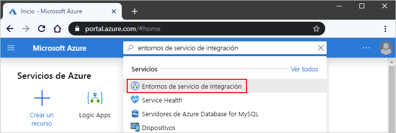
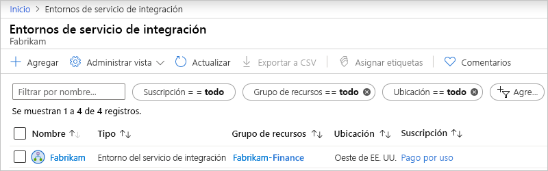
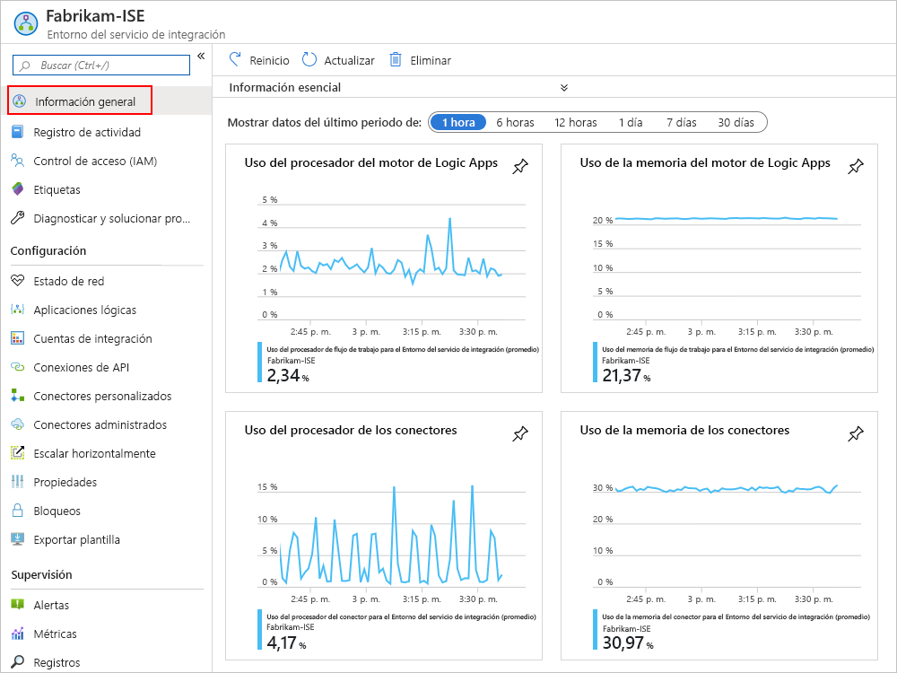
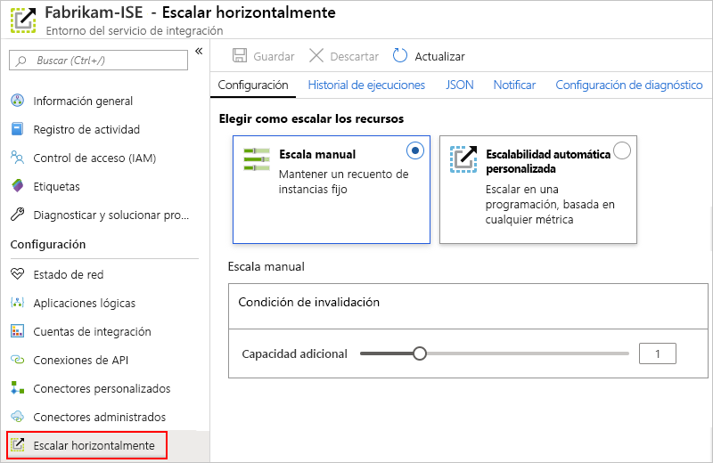
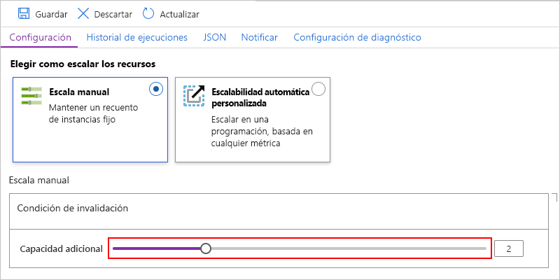
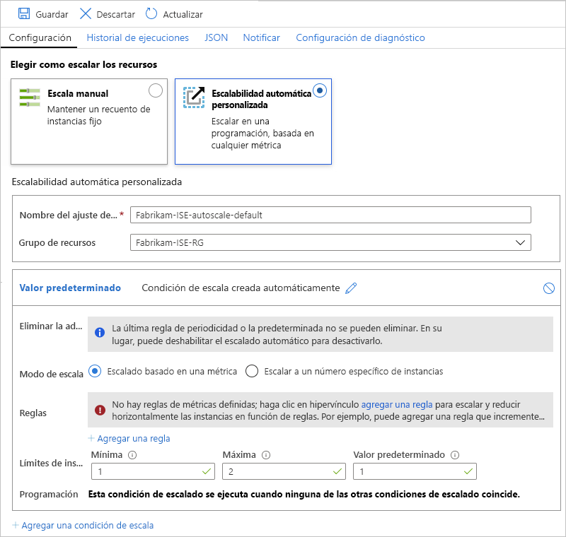

# Administración del entorno del servicio de integración (ISE) en Azure Logic Apps

En este artículo se muestra cómo realizar tareas de administración para el [entorno del servicio de integración (ISE)](../logic-apps/connect-virtual-network-vnet-isolated-environment-overview.md), por ejemplo:

* Administrar los recursos como aplicaciones lógicas, conexiones, cuentas de integración y conectores en el ISE.
* Comprobar el estado de la red del ISE.
* Agregar capacidad, reiniciar el ISE o eliminar el ISE. Siga los pasos descritos en este tema. Para agregar estos artefactos al ISE, consulte [Adición de artefactos al entorno del servicio de integración](../logic-apps/add-artifacts-integration-service-environment-ise.md).

## Ver su ISE

1. Inicie sesión en [Azure Portal](https://portal.azure.com).

1. En el cuadro de búsqueda del portal, escriba "entornos de servicio de integración" y, después, seleccione **Entornos de servicio de integración**.

   

1. En la lista de resultados, seleccione su entorno del servicio de integración.

   

1. Continúe con las secciones siguientes para buscar aplicaciones lógicas, conexiones, conectores o cuentas de integración en el ISE.

## Comprobación del estado de la red

En el menú de ISE, en **Configuración**, seleccione **Estado de la red**. Este panel muestra el estado de mantenimiento de las subredes y las dependencias de salida en otros servicios.

## Administración de las aplicaciones lógicas

Puede ver y administrar las aplicaciones lógicas que se encuentran en el ISE.

1. En el menú de ISE, en **Configuración**, seleccione **Aplicaciones lógicas**.

   

1. Para eliminar aplicaciones lógicas del ISE cuando ya no las necesite, selecciónelas y, a continuación, seleccione **Eliminar**. Seleccione **Sí** para confirmar que desea eliminarlas.

> [!NOTE]
> Si elimina una aplicación lógica secundaria y vuelve a crearla, debe guardar de nuevo la aplicación lógica principal. La aplicación secundaria que ha vuelto a crear tendrá metadatos diferentes.
> Si no se reguarda la aplicación lógica principal después de volver a crear su elemento secundario, las llamadas a la aplicación lógica secundaria producirán un error de que no hay autorización. Este comportamiento se aplica a las aplicaciones lógicas de elementos primarios y secundarios, por ejemplo, las que usan artefactos en las cuentas de integración o llaman a funciones de Azure.

## Administración de las conexiones de API

Puede ver y administrar las conexiones creadas por las aplicaciones lógicas que se ejecutan en el ISE.

1. En el menú de ISE, en **Configuración**, seleccione **Conexiones de API**.

   

1. Para eliminar las conexiones del ISE cuando ya no las necesite, seleccione esas conexiones y, a continuación, seleccione **Eliminar**. Seleccione **Sí** para confirmar que desea eliminarlas.

## Administración de los conectores de ISE

Puede ver y administrar los conectores de API que se han implementado en el ISE.

1. En el menú de ISE, en **Configuración**, seleccione **Conectores administrados**.

   

1. Para eliminar los conectores del ISE cuando ya no los necesite, seleccione esos conectores y, a continuación, seleccione **Eliminar**. Seleccione **Sí** para confirmar que desea eliminarlas.

## Administración de conectores personalizados

Puede ver y administrar los conectores personalizados que implementó en el ISE.

1. En el menú de ISE, en **Configuración**, seleccione **Conectores personalizados**.

   

1. Para eliminar los conectores personalizados del ISE cuando ya no los necesite, seleccione esos conectores y, a continuación, seleccione **Eliminar**. Seleccione **Sí** para confirmar que desea eliminarlas.

## Administración de cuentas de integración

1. En el menú de ISE, en **Configuración**, seleccione **Cuentas de integración**.

   

1. Para quitar las cuentas de integración del ISE cuando ya no las necesite, selecciónelas y, después, seleccione **Eliminar**.

## Agregar capacidad ISE

La unidad base del ISE Premium tiene una capacidad fija, por lo que si necesita más rendimiento, puede agregar más unidades de escalado, ya sea durante el proceso de creación o posteriormente. La SKU de Desarrollador no incluye la funcionalidad para agregar unidades de escalado.

1. En [Azure Portal](https://portal.azure.com), vaya a su ISE.

1. Para revisar las métricas de uso y rendimiento del ISE, seleccione **Información general**.

   

1. En **Configuración**, seleccione **Escalar horizontalmente**. En el panel **Configurar**, seleccione una de estas opciones:

   * [**Escala manual**](#manual-scale): el escalado se hace según el número de unidades de procesamiento que desee usar.
   * [**Custom autoscale**](#custom-autoscale) (Escalabilidad automática personalizada): el escalado se hace según las métricas de rendimiento, seleccionando entre varios criterios y especificando las condiciones del umbral para cumplir con esos criterios.

   

### Escala manual

1. Después de seleccionar **Escala manual**, en **Additional capacity** (Capacidad adicional), seleccione el número de unidades de escalado que desea usar.

   

1. Cuando finalice, seleccione **Guardar**.

### Escalabilidad automática personalizada

1. Después de seleccionar **Custom autoscale** (Escalabilidad automática personalizada) en **Autoscale setting name** (Nombre de la configuración de escalabilidad automática), proporcione un nombre para el valor seleccionado y, si lo desea, seleccione el grupo de recursos de Azure al que pertenece dicho valor.

   

1. En cuanto a la condición **Predeterminada**, seleccione **Scale based on a metric** (Escalado según una métrica) o **Scale to a specific instance count** (Escalado a un recuento de instancias específico).

   * Si elige el basado en instancias, escriba el número de unidades de procesamiento, entre 0 y 10.

   * Si elige en función de las métricas, siga estos pasos:

     1. En la sección **Reglas**, seleccione **Agregar una regla**.

     1. En el panel **Scale rule** (Regla de escalado), configure los criterios y la acción que se realizará cuando se active la regla.

     1. En **Instance limits** (Límites de instancias), especifique estos valores:

        * **Mínimos**: el número mínimo de unidades de procesamiento que se va a usar.
        * **Maximum**: el número máximo de unidades de procesamiento que se va a usar.
        * **Valor predeterminado**: si ocurre algún problema al leer las métricas de los recursos y la capacidad actual es inferior a la predeterminada, el escalado automático realiza el escalado horizontal hasta el número de unidades de procesamiento predeterminado. Sin embargo, si la capacidad actual es superior a la predeterminada, el escalado automático no realiza la reducción horizontal.

1. Para agregar otra condición, seleccione **Add scale condition** (Agregar condición de escalado).

1. Cuando haya terminado la configuración de escalado automático, guarde los cambios.

## Reinicio del ISE

Si cambia el servidor DNS o su configuración, debe reiniciar el ISE para que pueda recoger dichos cambios. El reinicio de un ISE de SKU Premium no da como resultado un tiempo de inactividad debido a la redundancia y los componentes que se reinician uno por uno durante el reciclaje. Sin embargo, un ISE de SKU de desarrollador experimenta tiempos de inactividad porque no existe redundancia. Para obtener más información, consulte los [SKU de ISE](../logic-apps/connect-virtual-network-vnet-isolated-environment-overview.md#ise-level).

1. En [Azure Portal](https://portal.azure.com), vaya a su ISE.

1. En el menú de ISE, seleccione **Información general**. En la barra de herramientas Información general, seleccione **Reiniciar**.

   

## Eliminación del ISE

Antes de eliminar un ISE que ya no necesita o un grupo de recursos de Azure que contiene un ISE, compruebe que no tiene directivas ni bloqueos en el grupo de recursos de Azure que contiene estos recursos o en la red virtual de Azure porque estos elementos pueden bloquear la eliminación.

Después de eliminar el ISE, es posible que tenga que esperar hasta 9 horas antes de intentar eliminar la red virtual o las subredes de Azure.

## Pasos siguientes

* [Incorporación de recursos a entornos del servicio de integración](../logic-apps/add-artifacts-integration-service-environment-ise.md)