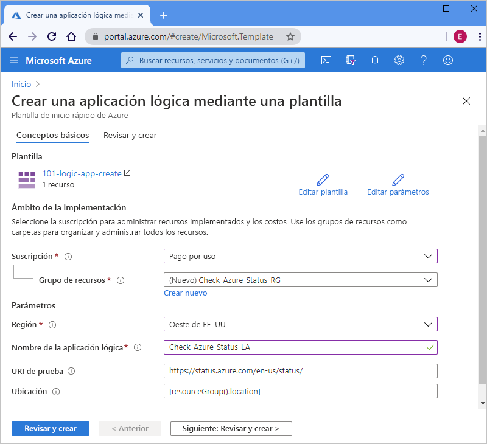

# <a name="quickstart-create-and-deploy-a-logic-app-workflow-by-using-an-arm-template"></a>Inicio rápido: Creación e implementación de un flujo de trabajo de aplicaciones lógicas mediante una plantilla de ARM

[Azure Logic Apps](../logic-apps/logic-apps-overview.md) es un servicio en la nube que le ayuda a crear y ejecutar flujos de trabajo automatizados que integran datos, aplicaciones, servicios basados en la nube y sistemas locales mediante la selección de [cientos de conectores](/connectors/connector-reference/connector-reference-logicapps-connectors). Esta guía de inicio rápido se centra en el proceso de implementación de una plantilla de Azure Resource Manager (plantilla de ARM) para crear una aplicación lógica básica que compruebe el estado de Azure según una programación por hora. 

[!INCLUDE [About Azure Resource Manager](../../includes/resource-manager-quickstart-introduction.md)]

Si su entorno cumple los requisitos previos y está familiarizado con el uso de plantillas de Resource Manager, seleccione el botón **Implementar en Azure**. La plantilla se abrirá en Azure Portal.

[](https://portal.azure.com/#create/Microsoft.Template/uri/https%3a%2f%2fraw.githubusercontent.com%2fAzure%2fazure-quickstart-templates%2fmaster%2f101-logic-app-create%2fazuredeploy.json)

## <a name="prerequisites"></a>Requisitos previos

Si no tiene una suscripción a Azure, cree una [cuenta de Azure gratuita](https://azure.microsoft.com/free/?WT.mc_id=A261C142F) antes de empezar.

## <a name="review-the-template"></a>Revisión de la plantilla

En esta guía de inicio rápido se usa la plantilla [**Crear una aplicación lógica**](https://azure.microsoft.com/resources/templates/101-logic-app-create/), que puede encontrar en la [galería de plantillas de inicio rápido de Azure](https://azure.microsoft.com/resources/templates), pero es demasiado larga para mostrarla aquí. En su lugar, puede revisar el ["archivo azuredeploy.json"](https://github.com/Azure/azure-quickstart-templates/blob/master/101-logic-app-create/azuredeploy.json) de plantillas de inicio rápido en la galería de plantillas.

La plantilla de inicio rápido crea un flujo de trabajo de aplicación lógica que usa el desencadenador de periodicidad, que se establece para ejecutarse cada hora, y una [acción HTTP *integrada*](../connectors/apis-list.md#connector-types), que llama a una dirección URL que devuelve el estado de Azure. Una acción integrada es nativa para la plataforma Azure Logic Apps.

Esta plantilla crea el siguiente recurso de Azure:

* [**Microsoft.Logic/workflows**](/azure/templates/microsoft.logic/workflows), que crea el flujo de trabajo para una aplicación lógica.

Para encontrar más plantillas de inicio rápido para Azure Logic Apps, revise las plantillas de [Microsoft.Logic](https://azure.microsoft.com/resources/templates/?resourceType=Microsoft.Logic) en la galería.

<a name="deploy-template"></a>

## <a name="deploy-the-template"></a>Implementación de la plantilla

Siga la opción que desea usar para implementar la plantilla de inicio rápido:

| Opción | Descripción |
|--------|-------------|
| [Azure Portal](../logic-apps/quickstart-create-deploy-azure-resource-manager-template.md?tabs=azure-portal#deploy-template) | Si su entorno de Azure cumple los requisitos previos y está familiarizado con el uso de plantillas de ARM, estos pasos le ayudarán a iniciar sesión directamente en Azure y a abrir la plantilla de inicio rápido en Azure Portal. Para más información, consulte [Implementación de recursos con plantillas de ARM y Azure Portal](../azure-resource-manager/templates/deploy-portal.md). |
| [CLI de Azure](../logic-apps/quickstart-create-deploy-azure-resource-manager-template.md?tabs=azure-cli#deploy-template) | La interfaz de la línea de comandos de Azure (CLI de Azure) es un conjunto de comandos que se usa para crear y administrar recursos de Azure. Para ejecutar estos comandos, necesita la CLI de Azure, versión 2.6 o posterior. Para comprobar la versión de la CLI, escriba `az --version`. Para más información, consulte los temas siguientes: <p><p>- [Qué es la CLI de Azure](/cli/azure/what-is-azure-cli?view=azure-cli-latest) <br>- [Introducción a la CLI de Azure](/cli/azure/get-started-with-azure-cli?view=azure-cli-latest) |
| [Azure PowerShell](../logic-apps/quickstart-create-deploy-azure-resource-manager-template.md?tabs=azure-powershell#deploy-template) | Azure PowerShell ofrece un conjunto de cmdlets que usan el modelo Azure Resource Manager para administrar los recursos de Azure. Para más información, consulte los temas siguientes: <p><p>- [Introducción a Azure PowerShell](/powershell/azure/azurerm/overview) <br>- [Presentación del módulo Az de Azure PowerShell](/powershell/azure/new-azureps-module-az) <br>- [Introducción a Azure PowerShell](/powershell/azure/get-started-azureps) |
| [API de REST de Azure Resource Manager](../logic-apps/quickstart-create-deploy-azure-resource-manager-template.md?tabs=rest-api#deploy-template) | Azure proporciona las API de transferencia de estado representacional (REST), que son puntos de conexión de servicio que admiten las operaciones HTTP (métodos) que usa para la creación, recuperación, actualización o eliminación del acceso a los recursos del servicio. Para más información, consulte [Introducción a la API de REST de Azure](/rest/api/azure/). |
|||

<a name="deploy-azure-portal"></a>

#### <a name="portal"></a>[Portal](#tab/azure-portal)

1. Seleccione la imagen siguiente para iniciar sesión con su cuenta de Azure y abrir la plantilla de inicio rápido en Azure Portal:

   [](https://portal.azure.com/#create/Microsoft.Template/uri/https%3a%2f%2fraw.githubusercontent.com%2fAzure%2fazure-quickstart-templates%2fmaster%2f101-logic-app-create%2fazuredeploy.json)

1. En el portal, en la página **Creación de una aplicación lógica mediante una plantilla**, escriba o seleccione estos valores:

   | Propiedad | Value | Descripción |
   |----------|-------|-------------|
   | **Suscripción** | <*Azure-subscription-name*> | Nombre de la suscripción a Azure que se va a usar |
   | **Grupos de recursos** | <*nombre del grupo de recursos de Azure*> | Nombre de un grupo de recursos de Azure nuevo o existente. En este ejemplo se usa `Check-Azure-Status-RG`. |
   | **Región** | <*Azure-region*> | Región del centro de datos de Azure para usar la aplicación lógica. En este ejemplo se usa `West US`. |
   | **Nombre de la aplicación lógica** | <*nombre-de-la-aplicación-lógica*> | Nombre que se va a usar para la aplicación lógica. En este ejemplo se usa `Check-Azure-Status-LA`. |
   | **URI de prueba** | <*test-URI*> | URI del servicio al que se va a llamar en función de una programación específica. En este ejemplo se usa `https://status.azure.com/en-us/status/`, que es la página de estado de Azure. |
   | **Ubicación** |  <*Azure-region-for-all-resources*> | Región de Azure que se va a usar para todos los recursos, si es diferente del valor predeterminado. En este ejemplo se usa el valor predeterminado, `[resourceGroup().location]`, que es la ubicación del grupo de recursos. |
   ||||

   Este es el aspecto de la página con los valores utilizados en este ejemplo:

   

1. Seleccione **Revisar y crear** cuando haya terminado.

1. Continúe con los pasos descritos en [Revisión de los recursos implementados](#review-deployed-resources).

#### <a name="cli"></a>[CLI](#tab/azure-cli)

```azurecli-interactive
read -p "Enter a project name name to use for generating resource names:" projectName &&
read -p "Enter the location, such as 'westus':" location &&
templateUri="https://raw.githubusercontent.com/Azure/azure-quickstart-templates/master/101-logic-app-create/azuredeploy.json" &&
resourceGroupName="${projectName}rg" &&
az group create --name $resourceGroupName --location "$location" &&
az deployment group create --resource-group $resourceGroupName --template-uri  $templateUri &&
echo "Press [ENTER] to continue ..." &&
read
```

Para más información, consulte los temas siguientes:

* [CLI de Azure: az deployment group](/cli/azure/deployment/group)
* [Implementación de recursos con plantillas de ARM y la CLI de Azure](../azure-resource-manager/templates/deploy-cli.md)

#### <a name="powershell"></a>[PowerShell](#tab/azure-powershell)

```azurepowershell-interactive
$projectName = Read-Host -Prompt "Enter a project name to use for generating resource names"
$location = Read-Host -Prompt "Enter the location, such as 'westus'"
$templateUri = "https://raw.githubusercontent.com/Azure/azure-quickstart-templates/master/101-logic-app-create/azuredeploy.json"

$resourceGroupName = "${projectName}rg"

New-AzResourceGroup -Name $resourceGroupName -Location "$location"
New-AzResourceGroupDeployment -ResourceGroupName $resourceGroupName -TemplateUri $templateUri

Read-Host -Prompt "Press [ENTER] to continue ..."
```

Para más información, consulte los temas siguientes:

* [Azure PowerShell: New-AzResourceGroup](/powershell/module/az.resources/new-azresourcegroup)
* [Azure PowerShell: New-AzResourceGroupDeployment](/powershell/module/az.resources/new-azresourcegroupdeployment)
* [Implementación de recursos con las plantillas de ARM y Azure PowerShell](../azure-resource-manager/templates/deploy-powershell.md)

#### <a name="rest-api"></a>[REST API](#tab/rest-api)

1. Si no quiere usar un grupo de recursos de Azure existente, cree uno nuevo siguiendo esta sintaxis para la solicitud que envía a la API de REST de Resource Manager:

   ```http
   PUT https://management.azure.com/subscriptions/{subscriptionId}/resourcegroups/{resourceGroupName}?api-version=2019-10-01
   ```

   | Value | Descripción |
   |-------|-------------|
   | `subscriptionId`| GUID de la suscripción a Azure que quiere usar |
   | `resourceGroupName` | Nombre del grupo de recursos de Azure que se va a crear. En este ejemplo se usa `Check-Azure-Status-RG`. |
   |||

   Por ejemplo:

   ```http
   PUT https://management.azure.com/subscriptions/xxxxXXXXxxxxXXXXX/resourcegroups/Check-Azure-Status-RG?api-version=2019-10-01
   ```

   Para más información, consulte los temas siguientes:

   * [Referencia de la API de REST de Azure: cómo llamar a las API de REST de Azure](/rest/api/azure/)
   * [API de REST de Resource Manager: creación o actualización de grupos de recursos](/rest/api/resources/resourcegroups/createorupdate).

1. Para implementar la plantilla de inicio rápido en su grupo de recursos, siga esta sintaxis para la solicitud que envía a la API de REST de Resource Manager:

   ```http
   PUT https://management.azure.com/subscriptions/{subscriptionId}/resourcegroups/{resourceGroupName}/providers/Microsoft.Resources/deployments/{deploymentName}?api-version=2019-10-01
   ```

   | Value | Descripción |
   |-------|-------------|
   | `subscriptionId`| GUID de la suscripción a Azure que quiere usar |
   | `resourceGroupName` | Nombre del grupo de recursos de Azure que se va a usar. En este ejemplo se usa `Check-Azure-Status-RG`. |
   | `deploymentName` | Nombre que se usará para su implementación. En este ejemplo se usa `Check-Azure-Status-LA`. |
   |||

   Por ejemplo:

   ```http
   PUT https://management.azure.com/subscriptions/xxxxXXXXxxxxXXXXX/resourcegroups/Check-Azure-Status-RG/providers/Microsoft.Resources/deployments/Check-Azure-Status-LA?api-version=2019-10-01
   ```

   Para más información, consulte [API de REST de Resource Manager: creación o actualización de implementaciones](/rest/api/resources/deployments/createorupdate).

1. Para proporcionar los valores que se van a usar para la implementación, como la región de Azure y los vínculos a la plantilla de inicio rápido y al [archivo de parámetros](../azure-resource-manager/templates/template-parameters.md), que contiene los valores de la plantilla de inicio rápido que se va a usar en la implementación, siga esta sintaxis para el cuerpo de la solicitud que envía a la API de REST de Resource Manager:

   ```json
   {
      "location": "{Azure-region}",
      "properties": {
         "templateLink": {
            "uri": "{quickstart-template-URL}",
            "contentVersion": "1.0.0.0"
         },
         "parametersLink": {
            "uri": "{quickstart-template-parameter-file-URL}",
            "contentVersion": "1.0.0.0"
         },
         "mode": "Incremental"
      }
   }
   ```

   | Propiedad | Value | Descripción |
   |----------|-------|-------------|
   | `location`| <*Azure-region*> | Región de Azure que se usará para la implementación. En este ejemplo se usa `West US`. |
   | `templateLink`: `uri` | <*quickstart-template-URL*> | Ubicación URL de la plantilla de inicio rápido que se va a usar para la implementación: <p><p>`https://raw.githubusercontent.com/Azure/azure-quickstart-templates/master/101-logic-app-create/azuredeploy.json`. |
   | `parametersLink`: `uri` | <*quickstart-template-parameter-file-URL*> | Ubicación URL del archivo de parámetros de la plantilla de inicio rápido que se va a usar para la implementación: <p><p>`https://raw.githubusercontent.com/Azure/azure-quickstart-templates/master/101-logic-app-create/azuredeploy.parameters.json` <p><p>Para más información sobre el archivo de parámetros de Resource Manager, consulte estos temas: <p><p>- [Creación de un archivo de parámetros de Resource Manager](../azure-resource-manager/templates/parameter-files.md) <br>- [Tutorial: Uso de archivos de parámetros para implementar la plantilla de ARM](../azure-resource-manager/templates/template-tutorial-use-parameter-file.md) |
   | `mode` | <*deployment-mode*> | Ejecute una actualización incremental o una actualización completa. En este ejemplo se usa `Incremental`, que es el valor predeterminado. Para más información, consulte [Modos de implementación de Azure Resource Manager](../azure-resource-manager/templates/deployment-modes.md). |
   |||

   Por ejemplo:

   ```json
   {
      "location": "West US",
      "properties": {
         "templateLink": {
            "uri": "https://raw.githubusercontent.com/Azure/azure-quickstart-templates/master/101-logic-app-create/azuredeploy.json",
            "contentVersion": "1.0.0.0"
         },
         "parametersLink": {
            "uri": "https://raw.githubusercontent.com/Azure/azure-quickstart-templates/master/101-logic-app-create/azuredeploy.parameters.json",
            "contentVersion": "1.0.0.0"
         },
         "mode": "Incremental"
      }
   }
   ```

Para más información, consulte los temas siguientes:

* [API de REST de Resource Manager](/rest/api/resources/)
* [Implementación de recursos con las plantillas de ARM y la API REST de Resource Manager](../azure-resource-manager/templates/deploy-rest.md)

---

<a name="review-deployed-resources"></a>

## <a name="review-deployed-resources"></a>Revisión de los recursos implementados

Para ver la aplicación lógica, puede usar Azure Portal, ejecutar un script que cree con la CLI de Azure o Azure PowerShell, o bien usar la API de REST de Logic Apps.

### <a name="portal"></a>[Portal](#tab/azure-portal)

1. En el cuadro de búsqueda de Azure Portal, escriba el nombre de la aplicación lógica, que es `Check-Azure-Status-LA` en este ejemplo. En la lista de resultados, seleccione la aplicación lógica.

1. En Azure Portal, busque y seleccione la aplicación lógica, que es `Check-Azure-Status-RG` en este ejemplo.

1. Cuando se abra el diseñador de aplicaciones lógicas, revise la aplicación lógica creada con la plantilla de inicio rápido.

1. Para probar la aplicación lógica, en la barra de herramientas del diseñador, seleccione **Ejecutar**.

### <a name="cli"></a>[CLI](#tab/azure-cli)

```azurecli-interactive
echo "Enter your logic app name:" &&
read logicAppName &&
az logic workflow show --name $logicAppName &&
echo "Press [ENTER] to continue ..."
```

Para más información, consulte [CLI de Azure: az logic workflow show](/cli/azure/ext/logic/logic/workflow?view=azure-cli-latest#ext-logic-az-logic-workflow-show).

### <a name="powershell"></a>[PowerShell](#tab/azure-powershell)

```azurepowershell-interactive
$logicAppName = Read-Host -Prompt "Enter your logic app name"
Get-AzLogicApp -Name $logicAppName
Write-Host "Press [ENTER] to continue..."
```

Para obtener más información, consulte [Azure PowerShell: Get-AzLogicApp](/powershell/module/az.logicapp/get-azlogicapp).

### <a name="rest-api"></a>[REST API](#tab/rest-api)

```http
GET https://management.azure.com/subscriptions/{subscriptionId}/resourceGroups/{resourceGroupName}/providers/Microsoft.Logic/workflows/{workflowName}?api-version=2016-06-01
```

| Value | Descripción |
|-------|-------------|
| `subscriptionId`| GUID de la suscripción a Azure en la que implementó la plantilla de inicio rápido. |
| `resourceGroupName` | Nombre del grupo de recursos de Azure en el que implementó la plantilla de inicio rápido. En este ejemplo se usa `Check-Azure-Status-RG`. |
| `workflowName` | Nombre de la aplicación lógica que implementó. En este ejemplo se usa `Check-Azure-Status-LA`. |
|||

Por ejemplo:

```http
GET https://management.azure.com/subscriptions/xxxxXXXXxxxxXXXXX/resourceGroups/Check-Azure-Status-RG/providers/Microsoft.Logic/workflows/Check-Azure-Status-LA?api-version=2016-06-01
```

Para obtener más información, consulte [API de REST de Logic Apps: Obtener flujos de trabajo](/rest/api/logic/workflows/get).

---

## <a name="clean-up-resources"></a>Limpieza de recursos

Si planea seguir trabajando en otros inicios rápidos y tutoriales, considere la posibilidad de mantener estos recursos. Cuando ya no necesite la aplicación lógica, elimine el grupo de recursos mediante Azure Portal, la CLI de Azure, Azure PowerShell o la API de REST de Resource Manager.

### <a name="portal"></a>[Portal](#tab/azure-portal)

1. En Azure Portal, busque y seleccione el grupo de recursos que quiere eliminar, que es `Check-Azure-Status-RG` en este ejemplo.

1. En el menú del grupo de recursos, elija **Introducción**, si aún no está seleccionado. En la página de información general, elija **Eliminar grupo de recursos**.

1. Para confirmar la operación, escriba el nombre del grupo de recursos.

Para más información, consulte [Eliminar grupo de recursos](../azure-resource-manager/management/delete-resource-group.md?tabs=azure-portal#delete-resource-group).

### <a name="cli"></a>[CLI](#tab/azure-cli)

```azurecli-interactive
echo "Enter your resource group name:" &&
read resourceGroupName &&
az group delete --name $resourceGroupName &&
echo "Press [ENTER] to continue ..."
```

Para más información, consulte [CLI de Azure: az group delete](/cli/azure/group?view=azure-cli-latest#az-group-delete).

### <a name="powershell"></a>[PowerShell](#tab/azure-powershell)

```azurepowershell-interactive
$resourceGroupName = Read-Host -Prompt "Enter the resource group name"
Remove-AzResourceGroup -Name $resourceGroupName
Write-Host "Press [ENTER] to continue..."
```

Para obtener más información, consulte [Azure PowerShell: Remove-AzResourceGroup](/powershell/module/azurerm.resources/remove-azurermresourcegroup).

### <a name="rest-api"></a>[REST API](#tab/rest-api)

```http
DELETE https://management.azure.com/subscriptions/{subscriptionId}/resourcegroups/{resourceGroupName}?api-version=2019-10-01
```

| Value | Descripción |
|-------|-------------|
| `subscriptionId`| GUID de la suscripción a Azure en la que implementó la plantilla de inicio rápido. |
| `resourceGroupName` | Nombre del grupo de recursos de Azure en el que implementó la plantilla de inicio rápido. En este ejemplo se usa `Check-Azure-Status-RG`. |
|||

Por ejemplo:

```http
GET https://management.azure.com/subscriptions/xxxxXXXXxxxxXXXXX/resourceGroups/Check-Azure-Status-RG?api-version=2019-10-01
```

Para más información, consulte el artículo sobre la [API de REST de Resource Manager: Eliminación de grupos de recursos](/rest/api/resources/resourcegroups/delete).

---

## <a name="next-steps"></a>Pasos siguientes

> [!div class="nextstepaction"]
> [Tutorial: Creación e implementación de la primera plantilla de ARM](../azure-resource-manager/templates/template-tutorial-create-first-template.md)
