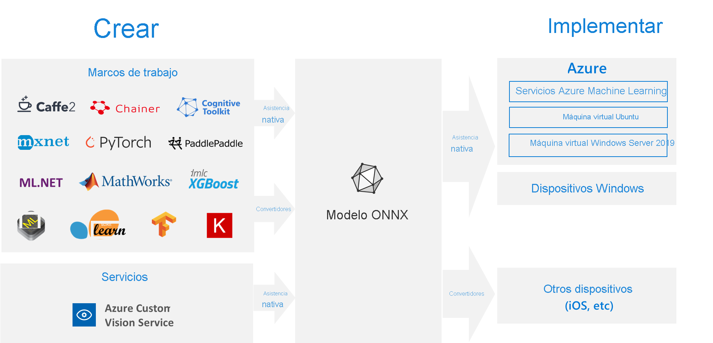

# <a name="onnx-and-azure-machine-learning-create-and-accelerate-ml-models"></a>ONNX y Azure Machine Learning: Crear y acelerar modelos de ML

Aprenda a usar [Open Neural Network Exchange](https://onnx.ai) (ONNX) y optimice la inferencia de su modelo de Machine Learning. Inferencia o modelo de puntuación, es la fase donde se usa el modelo implementado para la predicción, frecuentemente en datos de producción. 

La optimización de los modelos de Machine Learning para la inferencia (o puntuación del modelo) es difícil, ya que necesita ajustar el modelo y la biblioteca de inferencia para aprovechar al máximo las capacidades del hardware. El problema se vuelve extremadamente difícil si quiere obtener un rendimiento óptimo en diferentes tipos de plataformas (nube/edge, CPU/GPU, etc.), ya que cada una tiene diferentes capacidades y características. La complejidad aumenta si tiene modelos de una variedad de marcos que necesitan ejecutarse en ciertas plataformas. Se necesita mucho tiempo para optimizar todas las combinaciones diferentes de marcos y hardware. Igualmente, se necesita una solución para entrenar una vez en su marco preferido y ejecutarlo en cualquier lugar de la nube o Edge. Aquí es donde ONNX entra en juego.

Microsoft y una comunidad de asociados crearon ONNX como un estándar abierto para representar modelos de Machine Learning. Los modelos de [varios marcos](https://onnx.ai/supported-tools), incluidos TensorFlow, PyTorch, SciKit-Learn, Keras, Chainer, MXNet, MATLAB y SparkML se pueden exportar o convertir al formato ONNX estándar. Una vez que los modelos están en el formato ONNX, se pueden ejecutar en varias plataformas y dispositivos.

[ONNX Runtime](https://onnxruntime.ai) es un motor de inferencia de alto rendimiento que sirve para implementar modelos ONNX en la producción. Está optimizado tanto para la nube como para Edge y funciona en Linux, Windows y Mac. Se escribió en C++, también tiene las API de C, Python, C#, Java y JavaScript (Node.js) para usarse en varios entornos. ONNX Runtime admite los modelos de DNN y Machine Learning tradicionales y se integra con los aceleradores en entornos de hardware diferentes, como TensorRT en GPU de NVidia, OpenVINO en procesadores de Intel, DirectML en Windows, etc. Al utilizar ONNX Runtime, puede beneficiarse de las amplias optimizaciones, pruebas y mejoras de producción.

ONNX Runtime se usa en servicios de Microsoft a gran escala, como Bing, Office y Azure Cognitive Services. Las mejoras en el rendimiento dependen de una serie de factores, pero estos servicios de Microsoft han __mejorado el doble el rendimiento de la CPU__. Además de Azure Machine Learning Services, ONNX Runtime también se ejecuta en otros productos que admiten cargas de trabajo de aprendizaje automático, como:
+ Windows: El entorno de ejecución está integrado en Windows como parte de [Windows Machine Learning](https://docs.microsoft.com/windows/ai/windows-ml/) y se ejecuta en cientos de millones de dispositivos. 
+ Familia de productos de Azure SQL: Ejecute una puntuación nativa en los datos de [Azure SQL Edge](https://docs.microsoft.com/azure/azure-sql-edge/onnx-overview) y [Azure SQL Managed Instance](https://docs.microsoft.com/azure/azure-sql/managed-instance/machine-learning-services-overview).
+ ML.NET: [Ejecute los modelos ONNX en ML.NET](https://docs.microsoft.com/dotnet/machine-learning/tutorials/object-detection-onnx).


[](././media/concept-onnx/onnx.png#lightbox)

## <a name="get-onnx-models"></a>Obtención de modelos de ONNX

Puede obtener modelos de ONNX de varias maneras:
+ Entrene un nuevo modelo ONNX en Azure Machine Learning (consulte el ejemplo al final de este artículo) o mediante las [funcionalidades de aprendizaje automático automatizado](concept-automated-ml.md#automl--onnx).
+ Convierta el modelo existente de otro formato a ONNX (consulte los [tutoriales](https://github.com/onnx/tutorials)). 
+ Obtenga un modelo de ONNX entrenado previamente desde [ONNX Model Zoo](https://github.com/onnx/models).
+ Genere un modelo de ONNX personalizado desde [Azure Custom Vision Service](https://docs.microsoft.com/azure/cognitive-services/Custom-Vision-Service/). 

Muchos modelos, incluidos la clasificación de imágenes, la detección de objetos y el procesamiento de texto, se pueden representar como modelos de ONNX. Si experimenta algún problema con un modelo que no se puede convertir de forma correcta, registre un problema en el repositorio de GitHub del convertidor correspondiente que usó. Puede continuar usando su modelo de formato existente hasta que se resuelva el problema.

## <a name="deploy-onnx-models-in-azure"></a>Implementación de modelos de ONNX en Azure

Con Azure Machine Learning, puede implementar, administrar y supervisar sus modelos de ONNX. Mediante el [flujo de trabajo de implementación](concept-model-management-and-deployment.md) estándar y ONNX Runtime, puede crear un punto de conexión REST hospedado en la nube. Vea un ejemplo de un cuaderno de Jupyter Notebook al final de este artículo para probarlo usted mismo. 

### <a name="install-and-use-onnx-runtime-with-python"></a>Instalar y usar ONNX Runtime con Python

Los paquetes de Python para ONNX Runtime están disponibles en [PyPi.org](https://pypi.org) ([CPU](https://pypi.org/project/onnxruntime), [GPU](https://pypi.org/project/onnxruntime-gpu)). Lea los [requisitos del sistema](https://github.com/Microsoft/onnxruntime#system-requirements) antes de la instalación. 

 Para instalar ONNX Runtime para Python, use uno de los siguientes comandos: 
```python   
pip install onnxruntime       # CPU build
pip install onnxruntime-gpu   # GPU build
```

Para llamar a ONNX Runtime en el script de Python, use lo siguiente:    
```python
import onnxruntime
session = onnxruntime.InferenceSession("path to model")
```

La documentación que acompaña al modelo suele indicar las entradas y salidas para usar el modelo. También puede usar una herramienta de visualización como [Netron](https://github.com/lutzroeder/Netron) para ver el modelo. El entorno de ejecución de ONNX también le permite consultar los metadatos, las entradas y las salidas del modelo:    
```python
session.get_modelmeta()
first_input_name = session.get_inputs()[0].name
first_output_name = session.get_outputs()[0].name
```

Para realizar la inferencia de su modelo, use `run` y pase la lista de salidas que quiera que se devuelvan (déjelo vacío si quiere todas) y un mapa de los valores de entrada. El resultado es una lista de las salidas.  
```python
results = session.run(["output1", "output2"], {
                      "input1": indata1, "input2": indata2})
results = session.run([], {"input1": indata1, "input2": indata2})
```

Para obtener la referencia completa de API de Python, vea la [documentación de referencia de ONNX Runtime](https://aka.ms/onnxruntime-python).    

## <a name="examples"></a>Ejemplos
Consulte [how-to-use-azureml/deployment/onnx](https://github.com/Azure/MachineLearningNotebooks/blob/master/how-to-use-azureml/deployment/onnx) para obtener cuadernos de Python de ejemplo en los que se crean e implementan modelos de ONNX.

[!INCLUDE [aml-clone-in-azure-notebook](../../includes/aml-clone-for-examples.md)]

Puede encontrar ejemplos de uso en otros lenguajes en el [GitHub de ONNX Runtime](https://github.com/microsoft/onnxruntime/tree/master/samples).

## <a name="more-info"></a>Más información

Obtenga más información sobre **ONNX** o contribuya al proyecto:
+ [Sitio web del proyecto de ONNX](https://onnx.ai)
+ [Código de ONNX en GitHub](https://github.com/onnx/onnx)

Obtenga más información sobre **ONNX Runtime** o contribuya al proyecto:
+ [Sitio web del proyecto de ONNX Runtime](https://onnxruntime.ai)
+ [Repositorio de ONNX Runtime en GitHub](https://github.com/Microsoft/onnxruntime)


