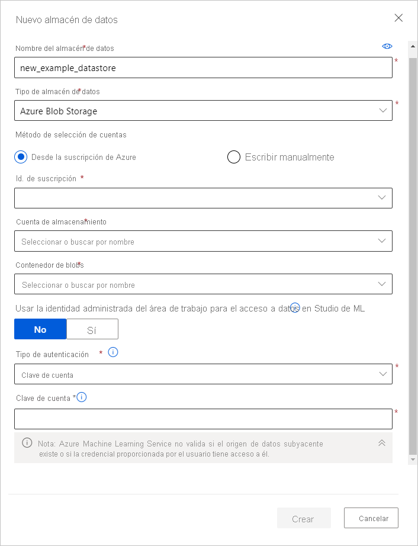

# <a name="connect-to-azure-storage-services"></a>Conexión con los servicios de Azure Storage
[!INCLUDE [aml-applies-to-basic-enterprise-sku](../../includes/aml-applies-to-basic-enterprise-sku.md)]

En este artículo, aprenderá a **conectarse a los servicios de Azure Storage a través de almacenes de datos de Azure Machine Learning**. Los almacenes de datos almacenan información de conexión, como el identificador de suscripción y la autorización de token de su instancia de [Key Vault](https://azure.microsoft.com/services/key-vault/) asociada con el área de trabajo, para que pueda acceder al almacenamiento sin tener que codificarlos de forma rígida en los scripts. 

**En el caso de las soluciones de almacenamiento no compatibles** y para ahorrar el costo de salida durante los experimentos de ML, [mueva los datos](#move) a una solución de almacenamiento de Azure compatible.  Puede crear almacenes de datos a partir de [estas soluciones de Azure Storage](#matrix). 

Para comprender el lugar de los almacenes de datos en el flujo de trabajo global de acceso a datos de Azure Machine Learning, consulte el artículo [Acceso seguro a los datos](concept-data.md#data-workflow).

## <a name="prerequisites"></a>Requisitos previos

Necesitará:
- Suscripción a Azure. Si no tiene una suscripción de Azure, cree una cuenta gratuita antes de empezar. Pruebe la [versión gratuita o de pago de Azure Machine Learning](https://aka.ms/AMLFree).

- Una cuenta de Azure Storage con un [contenedor de blobs de Azure](https://docs.microsoft.com/azure/storage/blobs/storage-blobs-overview) o un [recurso compartido de archivos de Azure](https://docs.microsoft.com/azure/storage/files/storage-files-introduction).

- [SDK de Azure Machine Learning para Python](https://docs.microsoft.com/python/api/overview/azure/ml/intro?view=azure-ml-py) o acceso a [Azure Machine Learning Studio](https://ml.azure.com/).

- Un área de trabajo de Azure Machine Learning.
  
  [Cree un área de trabajo de Azure Machine Learning](how-to-manage-workspace.md) o use una existente mediante el SDK de Python. Importe las clases `Workspace` y `Datastore`, y cargue la información de la suscripción desde el archivo `config.json` con la función `from_config()`. De forma predeterminada, busca el archivo JSON en el directorio actual, pero también puede especificar un parámetro de ruta de acceso para que apunte al archivo mediante `from_config(path="your/file/path")`.

   ```Python
   import azureml.core
   from azureml.core import Workspace, Datastore
        
   ws = Workspace.from_config()
   ```
<a name="matrix"></a>

## <a name="supported-data-storage-service-types"></a>Tipos de servicio de almacenamiento de datos admitidos

Los almacenes de datos admiten actualmente el almacenamiento de la información de conexión a los servicios de almacenamiento que se enumeran en la siguiente matriz.

| Tipo de&nbsp;almacenamiento | Tipo de&nbsp;autenticación | [Azure&nbsp;Machine&nbsp;Learning Studio](https://ml.azure.com/) | SDL de Python de [Azure&nbsp;Machine&nbsp;Learning Studio&nbsp;](https://docs.microsoft.com/python/api/overview/azure/ml/intro?view=azure-ml-py) |  Cli de [Azure&nbsp;Machine&nbsp;Learning CLI](reference-azure-machine-learning-cli.md) | API Rest de [Azure&nbsp;Machine&nbsp;Learning&nbsp;](https://docs.microsoft.com/rest/api/azureml/) | Código de VS
---|---|---|---|---|---|---
[Azure&nbsp;Blob&nbsp;Storage](https://docs.microsoft.com/azure/storage/blobs/storage-blobs-overview)| Clave de cuenta <br> Token de SAS | ✓ | ✓ | ✓ |✓ |✓
[Recurso compartido de &nbsp;archivos de&nbsp;Azure](https://docs.microsoft.com/azure/storage/files/storage-files-introduction)| Clave de cuenta <br> Token de SAS | ✓ | ✓ | ✓ |✓|✓
[Azure&nbsp;Data Lake&nbsp;Storage Gen&nbsp;1](https://docs.microsoft.com/azure/data-lake-store/)| Entidad de servicio| ✓ | ✓ | ✓ |✓|
[Azure&nbsp;Data Lake&nbsp;Storage Gen&nbsp;2](https://docs.microsoft.com/azure/storage/blobs/data-lake-storage-introduction)| Entidad de servicio| ✓ | ✓ | ✓ |✓|
[Azure&nbsp;SQL&nbsp;Database](https://docs.microsoft.com/azure/sql-database/sql-database-technical-overview)| Autenticación SQL <br>Entidad de servicio| ✓ | ✓ | ✓ |✓|
[Azure&nbsp;PostgreSQL](https://docs.microsoft.com/azure/postgresql/overview) | Autenticación SQL| ✓ | ✓ | ✓ |✓|
[Azure&nbsp;Database&nbsp;for&nbsp;MySQL](https://docs.microsoft.com/azure/mysql/overview) | Autenticación SQL|  | ✓* | ✓* |✓*|
[Sistema&nbsp; de archivos de &nbsp;Databricks](https://docs.microsoft.com/azure/databricks/data/databricks-file-system)| Sin autenticación | | ✓** | ✓ ** |✓** |

*MySQL solo se admite para la canalización [DataTransferStep](https://docs.microsoft.com/python/api/azureml-pipeline-steps/azureml.pipeline.steps.datatransferstep?view=azure-ml-py). <br>
**Databricks solo se admite para la canalización [DatabricksStep](https://docs.microsoft.com/python/api/azureml-pipeline-steps/azureml.pipeline.steps.databricks_step.databricksstep?view=azure-ml-py).

### <a name="storage-guidance"></a>Orientación sobre el almacenamiento

Le recomendamos que cree un almacén de datos para un [contenedor de blobs de Azure](https://docs.microsoft.com/azure/storage/blobs/storage-blobs-introduction). El almacenamiento Estándar y Premium están disponibles para blobs. Aunque el almacenamiento premium sea más costoso, su mayor velocidad de rendimiento puede mejorar la velocidad de las ejecuciones de entrenamiento, sobre todo si usa un gran conjunto de datos. Para obtener información sobre el costo de las cuentas de almacenamiento, vea la [Calculadora de precios de Azure](https://azure.microsoft.com/pricing/calculator/?service=machine-learning-service).

[Azure Data Lake Storage Gen2](https://docs.microsoft.com/azure/storage/blobs/data-lake-storage-introduction?toc=/azure/storage/blobs/toc.json) se basa en Azure Blob Storage y se ha diseñado para el análisis de macrodatos empresarial. Parte fundamental de Data Lake Storage Gen2 es la incorporación de un [espacio de nombres jerárquico](https://docs.microsoft.com/azure/storage/blobs/data-lake-storage-namespace) en Blob Storage. El espacio de nombres jerárquico organiza los objetos o archivos en una jerarquía de directorios para un acceso eficaz a los datos.

Al crear un área de trabajo, se registra automáticamente un contenedor de blobs de Azure y un recurso compartido de archivos de Azure en el área de trabajo. Se denominan `workspaceblobstore` y `workspacefilestore`, respectivamente. `workspaceblobstore` se usa para almacenar los artefactos del área de trabajo y los registros del experimento de aprendizaje automático. `workspacefilestore` se usa para almacenar cuadernos y scripts de R autorizados a través de la [instancia de proceso](https://docs.microsoft.com/azure/machine-learning/concept-compute-instance#accessing-files). El contenedor `workspaceblobstore` se establece como el almacén de datos predeterminado y no se puede eliminar del área de trabajo.

> [!IMPORTANT]
> El diseñador de Azure Machine Learning (versión preliminar) creará automáticamente un almacén de datos denominado **azureml_globaldatasets** al abrir un ejemplo en la página principal del diseñador. Este almacén de datos solo contiene conjuntos de datos de ejemplo. **No** use este almacén de datos para el acceso a datos confidenciales.
> 

<a name="access"></a>

## <a name="create-and-register-datastores"></a>Creación y registro de almacenes de datos

Cuando se registra una solución de Azure Storage como almacén de datos, se crea y registra automáticamente ese almacén de datos en un área de trabajo específica. Puede crear y registrar almacenes de datos en un área de trabajo mediante el [SDK de Python](#python-sdk) o [Azure Machine Learning Studio](#azure-machine-learning-studio).

>[!IMPORTANT]
> Como parte del proceso de creación y registro del almacén de datos inicial, Azure Machine Learning valida que el servicio de almacenamiento subyacente exista y que la entidad de seguridad proporcionada por el usuario (nombre de usuario, entidad de servicio o token de SAS) tenga acceso a ese almacenamiento. Sin embargo, en los almacenes de datos de Azure Data Lake Storage Gen 1 y 2, esta validación se produce más adelante cuando se llama a métodos de acceso a datos como [`from_files()`](https://docs.microsoft.com/python/api/azureml-core/azureml.data.dataset_factory.filedatasetfactory?view=azure-ml-py) o [`from_delimited_files()`](https://docs.microsoft.com/python/api/azureml-core/azureml.data.dataset_factory.tabulardatasetfactory?view=azure-ml-py#from-parquet-files-path--validate-true--include-path-false--set-column-types-none--partition-format-none-). 
<br><br>
Una vez creado el almacén de datos, esta validación solo se realiza para los métodos que requieren acceso al contenedor de almacenamiento subyacente, y **no** cada vez que se recuperan objetos del almacén de datos. Por ejemplo, la validación se produce si quiere descargar archivos del almacén de archivos. Sin embargo, no se produce si solo quiere cambiar el almacén de datos predeterminado.

### <a name="python-sdk"></a>SDK de Python

Todos los métodos de registro están en la clase [`Datastore`](https://docs.microsoft.com/python/api/azureml-core/azureml.core.datastore(class)?view=azure-ml-py) y tienen la forma `register_azure_*`.

> [!IMPORTANT]
> Si tiene previsto crear un almacén de datos para las cuentas de almacenamiento que se encuentran en una red virtual, consulte la sección [Acceso a los datos de una red virtual](#access-data-in-a-virtual-network).

Puede encontrar la información necesaria para rellenar el método `register_azure_*()` en [Azure Portal](https://portal.azure.com).

* El nombre del almacén de datos solo puede contener letras minúsculas, dígitos y caracteres de subrayado. 

* Si tiene previsto usar una clave de cuenta o un token de SAS para la autenticación, seleccione **Cuentas de almacenamiento** en el panel izquierdo y elija la cuenta de almacenamiento que quiere registrar. 
  * La página **Información general** proporciona información como el nombre de la cuenta, el contenedor y el nombre del recurso compartido de archivos. 
      1. En el caso de las claves de cuenta, vaya a **Claves de acceso** en el panel **Configuración**. 
      1. En el caso de los tokens de SAS, vaya a **Firmas de acceso compartido** en el panel **Configuración**.

* Si tiene previsto usar una entidad de servicio para la autenticación, vaya a **Registros de aplicaciones** y seleccione la aplicación que quiere usar. 
    * Su página de **información general** correspondiente contendrá la información necesaria, como el id. de inquilino y de cliente.

> [!IMPORTANT]
> Por motivos de seguridad, puede que necesite cambiar las claves de acceso de una cuenta de Azure Storage (clave de cuenta o token de SAS). Al hacerlo, asegúrese de sincronizar las credenciales nuevas con el área de trabajo y los almacenes de datos conectados a ella. Obtenga información sobre cómo sincronizar las credenciales actualizadas con [estos pasos](how-to-change-storage-access-key.md). 

Los ejemplos siguientes muestran cómo registrar un contenedor de blobs de Azure, un recurso compartido de archivos de Azure y Azure Data Lake Storage Generation 2 como almacén de datos. Los parámetros proporcionados en estos ejemplos son los **parámetros obligatorios** para crear y registrar un almacén de datos. 

Para crear almacenes de datos para otros servicios de almacenamiento y ver los parámetros opcionales para estos métodos, consulte la [documentación de referencia para los métodos `register_azure_*` aplicables](https://docs.microsoft.com/python/api/azureml-core/azureml.core.datastore.datastore?view=azure-ml-py#methods).

#### <a name="blob-container"></a>Contenedor de blobs

Para registrar un almacén de datos de un contenedor de blobs de Azure, use [`register_azure_blob_container()`](https://docs.microsoft.com/python/api/azureml-core/azureml.core.datastore(class)?view=azure-ml-py#register-azure-blob-container-workspace--datastore-name--container-name--account-name--sas-token-none--account-key-none--protocol-none--endpoint-none--overwrite-false--create-if-not-exists-false--skip-validation-false--blob-cache-timeout-none--grant-workspace-access-false--subscription-id-none--resource-group-none-).

En el código siguiente se crea y registra el almacén de datos `blob_datastore_name` en el área de trabajo `ws`. Este almacén de datos tiene acceso al contenedor de blobs `my-container-name` en la cuenta de almacenamiento `my-account-name` con la clave de acceso a la cuenta proporcionada.

```Python
blob_datastore_name='azblobsdk' # Name of the datastore to workspace
container_name=os.getenv("BLOB_CONTAINER", "<my-container-name>") # Name of Azure blob container
account_name=os.getenv("BLOB_ACCOUNTNAME", "<my-account-name>") # Storage account name
account_key=os.getenv("BLOB_ACCOUNT_KEY", "<my-account-key>") # Storage account access key

blob_datastore = Datastore.register_azure_blob_container(workspace=ws, 
                                                         datastore_name=blob_datastore_name, 
                                                         container_name=container_name, 
                                                         account_name=account_name,
                                                         account_key=account_key)
```
Si el contenedor de blobs está en una red virtual, incluya el parámetro `skip_validation=True` en el método [`register_azure_blob_container()`](https://docs.microsoft.com/python/api/azureml-core/azureml.core.datastore(class)?view=azure-ml-py#register-azure-blob-container-workspace--datastore-name--container-name--account-name--sas-token-none--account-key-none--protocol-none--endpoint-none--overwrite-false--create-if-not-exists-false--skip-validation-false--blob-cache-timeout-none--grant-workspace-access-false--subscription-id-none--resource-group-none-). 

#### <a name="file-share"></a>Recurso compartido de archivos

Para registrar un recurso compartido de archivos de Azure como almacén de datos, use [`register_azure_file_share()`](https://docs.microsoft.com/python/api/azureml-core/azureml.core.datastore(class)?view=azure-ml-py#register-azure-file-share-workspace--datastore-name--file-share-name--account-name--sas-token-none--account-key-none--protocol-none--endpoint-none--overwrite-false--create-if-not-exists-false--skip-validation-false-). 

En el código siguiente se crea y registra el almacén de datos `file_datastore_name` en el área de trabajo `ws`. Este almacén de datos tiene acceso al recurso compartido de archivos `my-fileshare-name` en la cuenta de almacenamiento `my-account-name` con la clave de acceso a la cuenta proporcionada.

```Python
file_datastore_name='azfilesharesdk' # Name of the datastore to workspace
file_share_name=os.getenv("FILE_SHARE_CONTAINER", "<my-fileshare-name>") # Name of Azure file share container
account_name=os.getenv("FILE_SHARE_ACCOUNTNAME", "<my-account-name>") # Storage account name
account_key=os.getenv("FILE_SHARE_ACCOUNT_KEY", "<my-account-key>") # Storage account access key

file_datastore = Datastore.register_azure_file_share(workspace=ws,
                                                     datastore_name=file_datastore_name, 
                                                     file_share_name=file_share_name, 
                                                     account_name=account_name,
                                                     account_key=account_key)
```
Si el recurso compartido está en una red virtual, incluya el parámetro `skip_validation=True` en el método [`register_azure_file_share()`](https://docs.microsoft.com/python/api/azureml-core/azureml.core.datastore(class)?view=azure-ml-py#register-azure-file-share-workspace--datastore-name--file-share-name--account-name--sas-token-none--account-key-none--protocol-none--endpoint-none--overwrite-false--create-if-not-exists-false--skip-validation-false-). 

#### <a name="azure-data-lake-storage-generation-2"></a>Azure Data Lake Storage Generation 2

Para un almacén de datos de Azure Data Lake Storage Generation 2 (ADLS Gen 2), utilice [register_azure_data_lake_gen2()](https://docs.microsoft.com/python/api/azureml-core/azureml.core.datastore.datastore?view=azure-ml-py#register-azure-data-lake-gen2-workspace--datastore-name--filesystem--account-name--tenant-id--client-id--client-secret--resource-url-none--authority-url-none--protocol-none--endpoint-none--overwrite-false-) para registrar un almacén de datos de credenciales conectado a un almacenamiento Azure DataLake Gen 2 con [permisos de entidad de servicio](https://docs.microsoft.com/azure/active-directory/develop/howto-create-service-principal-portal). Para poder usar la entidad de servicio, debe [registrar la aplicación](https://docs.microsoft.com/azure/active-directory/develop/app-objects-and-service-principals) y conceder el acceso *Lector de datos de Storage Blob* adecuado a la entidad de servicio. Aprenda más sobre la [configuración del control de acceso en ADLS Gen 2](https://docs.microsoft.com/azure/storage/blobs/data-lake-storage-access-control). 

En el código siguiente se crea y registra el almacén de datos `adlsgen2_datastore_name` en el área de trabajo `ws`. Este almacén de datos accede al sistema de archivos `test` en la cuenta de almacenamiento `account_name` con las credenciales de la entidad de servicio facilitadas.

```python 
adlsgen2_datastore_name = 'adlsgen2datastore'

subscription_id=os.getenv("ADL_SUBSCRIPTION", "<my_subscription_id>") # subscription id of ADLS account
resource_group=os.getenv("ADL_RESOURCE_GROUP", "<my_resource_group>") # resource group of ADLS account

account_name=os.getenv("ADLSGEN2_ACCOUNTNAME", "<my_account_name>") # ADLS Gen2 account name
tenant_id=os.getenv("ADLSGEN2_TENANT", "<my_tenant_id>") # tenant id of service principal
client_id=os.getenv("ADLSGEN2_CLIENTID", "<my_client_id>") # client id of service principal
client_secret=os.getenv("ADLSGEN2_CLIENT_SECRET", "<my_client_secret>") # the secret of service principal

adlsgen2_datastore = Datastore.register_azure_data_lake_gen2(workspace=ws,
                                                             datastore_name=adlsgen2_datastore_name,
                                                             account_name=account_name, # ADLS Gen2 account name
                                                             filesystem='test', # ADLS Gen2 filesystem
                                                             tenant_id=tenant_id, # tenant id of service principal
                                                             client_id=client_id, # client id of service principal
                                                             client_secret=client_secret) # the secret of service principal
```

### <a name="azure-machine-learning-studio"></a>Azure Machine Learning Studio 

Cree un nuevo almacén de datos en unos cuantos pasos en Azure Machine Learning Studio:

> [!IMPORTANT]
> Si la cuenta de almacenamiento de datos se encuentra en una red virtual, se necesitan pasos de configuración adicionales para garantizar que Studio tenga acceso a los datos. Vea [Aislamiento de red y privacidad](how-to-enable-virtual-network.md#machine-learning-studio) para asegurarse de que se aplican los pasos de configuración adecuados. 

1. Inicie sesión en [Azure Machine Learning Studio](https://ml.azure.com/).
1. Seleccione **Almacenes de datos** en el panel izquierdo en **Administrar**.
1. Seleccione **+ Nuevo almacén de datos**.
1. Complete el formulario para un nuevo almacén de datos. El formulario se actualiza de forma inteligente según las selecciones de tipo de Azure Storage y de autenticación.
  
Puede encontrar la información necesaria para rellenar el formulario en [Azure Portal](https://portal.azure.com). Seleccione **Cuentas de almacenamiento** en el panel izquierdo y elija la cuenta de almacenamiento que quiere registrar. La página **Información general** proporciona información como el nombre de la cuenta, el contenedor y el nombre del recurso compartido de archivos. 

* Para obtener elementos de autenticación, como la clave de cuenta o el token de SAS, vaya a **Claves de acceso** en el panel de **Configuración**. 

* En caso de elementos de entidad de servicio como, un identificador de inquilino y un identificador de cliente, vaya a **Registros de aplicaciones** y seleccione la aplicación que desea usar. Su correspondiente página de **información general** contendrá estos elementos. 

> [!IMPORTANT]
> Por motivos de seguridad, puede que necesite cambiar las claves de acceso de una cuenta de Azure Storage (clave de cuenta o token de SAS). Al hacerlo, asegúrese de sincronizar las credenciales nuevas con el área de trabajo y los almacenes de datos conectados a ella. Obtenga información sobre cómo sincronizar las credenciales actualizadas con [estos pasos](how-to-change-storage-access-key.md). 

En el ejemplo siguiente se muestra el aspecto que tendría el formulario al crear un **almacén de Azure Blob**: 
    


### <a name="vs-code"></a>Código de VS

Puede crear y administrar almacenes de datos con la extensión Azure Machine Learning para VS Code. Visite la [guía paso a paso sobre la administración de recursos de VS Code](how-to-manage-resources-vscode.md#datastores) para más información.

<a name="get"></a>

## <a name="get-datastores-from-your-workspace"></a>Obtención de almacenes de almacenamiento del área de trabajo

Para obtener un almacén de datos específico registrado en el área de trabajo actual, utilice el método estático [`get()`](https://docs.microsoft.com/python/api/azureml-core/azureml.core.datastore(class)?view=azure-ml-py#get-workspace--datastore-name-) en la clase `Datastore`:

```Python
# Get a named datastore from the current workspace
datastore = Datastore.get(ws, datastore_name='your datastore name')
```
Para obtener la lista de almacenes de datos registrados con un área de trabajo determinada, puede utilizar la propiedad [`datastores`](https://docs.microsoft.com/python/api/azureml-core/azureml.core.workspace%28class%29?view=azure-ml-py#datastores) en un objeto del área de trabajo:

```Python
# List all datastores registered in the current workspace
datastores = ws.datastores
for name, datastore in datastores.items():
    print(name, datastore.datastore_type)
```

Para obtener el almacén de datos predeterminado del área de trabajo, use esta línea:

```Python
datastore = ws.get_default_datastore()
```
También puede cambiar el almacén de datos predeterminado con el código siguiente. Esta capacidad solo se admite a través del SDK. 

```Python
 ws.set_default_datastore(new_default_datastore)
```

<a name="up-and-down"></a>
## <a name="upload-and-download-data"></a>Carga y descarga de datos

Los métodos [`upload()`](https://docs.microsoft.com/python/api/azureml-core/azureml.data.azure_storage_datastore.azureblobdatastore?view=azure-ml-py#upload-src-dir--target-path-none--overwrite-false--show-progress-true-) y [`download()`](https://docs.microsoft.com/python/api/azureml-core/azureml.data.azure_storage_datastore.azureblobdatastore?view=azure-ml-py#download-target-path--prefix-none--overwrite-false--show-progress-true-) descritos en los ejemplos siguientes son específicos para las clases [AzureBlobDatastore](https://docs.microsoft.com/python/api/azureml-core/azureml.data.azure_storage_datastore.azureblobdatastore?view=azure-ml-py) y [AzureFileDatastore](https://docs.microsoft.com/python/api/azureml-core/azureml.data.azure_storage_datastore.azurefiledatastore?view=azure-ml-py), y funcionan de forma idéntica para ambas.

> [!NOTE]
> En este momento no se admite la carga en almacenes de datos de AzureDataLakeGen2.

### <a name="upload"></a>Cargar

Cargue un directorio o archivos individuales en el almacén de datos mediante el SDK de Python:

```Python
datastore.upload(src_dir='your source directory',
                 target_path='your target path',
                 overwrite=True,
                 show_progress=True)
```

El parámetro `target_path` especifica la ubicación en el recurso compartido de archivos (o el contenedor de blobs) en que se realiza la carga. El valor predeterminado es `None`, por lo que los datos se cargan en la raíz. Si `overwrite=True`, cualquier dato existente en `target_path` se sobrescribe.

También puede cargar una lista de archivos individuales en el almacén de datos mediante el método `upload_files()`.

### <a name="download"></a>Descargar

Descargue los datos desde un almacén de datos en el sistema de archivos local:

```Python
datastore.download(target_path='your target path',
                   prefix='your prefix',
                   show_progress=True)
```

El parámetro `target_path` es la ubicación del directorio local en la que se descargan los datos. Para especificar una ruta de acceso a la carpeta en el recurso compartido de archivos (o el contenedor de blobs) para realizar la descarga, especifique la ruta de acceso a `prefix`. Si `prefix` es `None`, se descargará todo el contenido del recurso compartido de archivos (o contenedor de blobs).

<a name="train"></a>

## <a name="access-your-data-during-training"></a>Acceso a los datos durante el aprendizaje

Para interactuar con los datos de los almacenes de datos o empaquetar los datos en un objeto consumible para tareas de aprendizaje automático, como el entrenamiento, [cree un conjunto de datos de Azure Machine Learning](how-to-create-register-datasets.md). Los conjuntos de datos proporcionan funciones que cargan datos tabulares en un DataFrame de Pandas o Spark. Los conjuntos de datos también proporcionan la capacidad de descargar o montar archivos de cualquier formato desde Azure Blob Storage, Azure Files, Azure Data Lake Storage Gen1, Azure Data Lake Storage Gen2, Azure SQL Database y Azure Database for PostgreSQL. [Obtenga más información sobre cómo entrenar con conjuntos de datos](how-to-train-with-datasets.md).

### <a name="accessing-source-code-during-training"></a>Acceso al código fuente durante el entrenamiento

Azure Blob Storage presenta mayores velocidades de rendimiento que un recurso compartido de archivos de Azure y se escala a un gran número de trabajos iniciados en paralelo. Por esta razón, se recomienda configurar las ejecuciones de manera que usen Blob Storage para transferir archivos de código fuente.

En el ejemplo de código siguiente se especifica en la configuración de ejecución el almacén de datos de blobs que se usará para las transferencias de código fuente.

```python 
# workspaceblobstore is the default blob storage
run_config.source_directory_data_store = "workspaceblobstore" 
```

## <a name="access-data-during-scoring"></a>Acceso a los datos durante la puntuación

Azure Machine Learning dispone de varios métodos para usar los modelos para puntuación. Algunos de estos métodos no proporcionan acceso a los almacenes de datos. Use la tabla siguiente para saber qué métodos le permiten acceder a los almacenes de datos durante la puntuación:

| Método | Acceso a almacén de datos | Descripción |
| ----- | :-----: | ----- |
| [Predicción por lotes](how-to-use-parallel-run-step.md) | ✔ | Realice predicciones sobre grandes cantidades de datos asincrónicamente. |
| [Servicio web](how-to-deploy-and-where.md) | &nbsp; | Implemente modelos como servicios web. |
| [Módulo de Azure IoT Edge](how-to-deploy-and-where.md) | &nbsp; | Implemente modelos en dispositivos IoT Edge. |

En situaciones en las que el SDK no proporciona acceso a los almacenes de datos, es posible que pueda crear código personalizado mediante el SDK de Azure correspondiente para obtener acceso a los datos. Por ejemplo, el [SDK de Azure Storage para Python](https://github.com/Azure/azure-storage-python) es una biblioteca cliente que puede usar para acceder a los datos almacenados en blobs o archivos.


## <a name="access-data-in-a-virtual-network"></a>Acceso a los datos de una red virtual

Si el almacenamiento está detrás de una red virtual, debe realizar pasos de configuración adicionales para que el área de trabajo y el almacén de datos tengan acceso a los datos. Para más información sobre cómo usar los almacenes de datos y los conjuntos de datos en una red virtual, consulte [Aislamiento de red durante el entrenamiento e inferencia con redes virtuales privadas](how-to-enable-virtual-network.md#use-datastores-and-datasets).

<a name="move"></a>

## <a name="move-data-to-supported-azure-storage-solutions"></a>Movimiento de datos a soluciones de Azure Storage compatibles

Azure Machine Learning admite el acceso a datos desde Azure Blob Storage, Azure Files, Azure Data Lake Storage Gen1, Azure Data Lake Storage Gen2, Azure SQL Database y Azure Database for PostgreSQL. Si usa un almacenamiento que no es compatible, le recomendamos que mueva los datos a soluciones de Azure Storage compatibles mediante [Azure Data Factory y estos pasos](https://docs.microsoft.com/azure/data-factory/quickstart-create-data-factory-copy-data-tool). El movimiento de datos a un almacenamiento compatible puede ayudarle a ahorrar costos de salida de datos durante los experimentos de aprendizaje automático. 

Azure Data Factory proporciona una transferencia de datos eficaz y resistente con más de 80 conectores pregenerados sin costo adicional. Estos conectores incluyen servicios de datos de Azure, orígenes de datos locales, Amazon S3 y Redshift, y Google BigQuery.

## <a name="next-steps"></a>Pasos siguientes

* [Creación de un conjunto de datos de Azure Machine Learning](how-to-create-register-datasets.md)
* [Entrenamiento de un modelo](how-to-train-ml-models.md)
* [Implementar un modelo](how-to-deploy-and-where.md)
