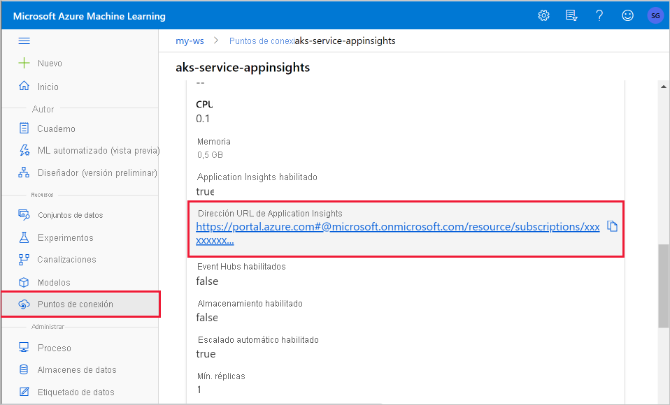
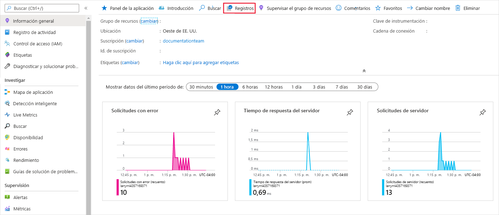
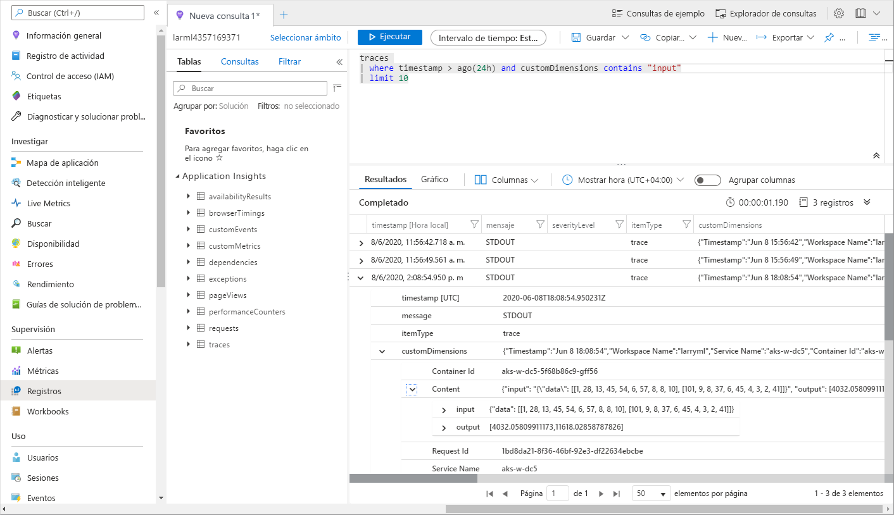

# <a name="monitor-and-collect-data-from-ml-web-service-endpoints"></a>Supervisión y recopilación de datos de los puntos de conexión del servicio web ML


En este artículo, aprenderá a recopilar datos de modelos implementados en los puntos de conexión de servicio en Azure Kubernetes Service (AKS) o Azure Container Instances (ACI). Use [Azure Application Insights](../azure-monitor/app/app-insights-overview.md) para recopilar los datos siguientes de un punto de conexión:
* Datos de salida
* Respuestas
* Tasas de solicitudes, tiempos de respuesta y tasas de error
* Tasas de dependencias, tiempos de respuesta y tasas de error
* Excepciones

El cuaderno [enable-app-insights-in-production-service.ipynb](https://github.com/Azure/MachineLearningNotebooks/blob/master/how-to-use-azureml/deployment/enable-app-insights-in-production-service/enable-app-insights-in-production-service.ipynb) muestra los conceptos de este artículo.
 
[!INCLUDE [aml-clone-in-azure-notebook](../../includes/aml-clone-for-examples.md)]
 
## <a name="prerequisites"></a>Requisitos previos

* Una suscripción de Azure. Pruebe la [versión gratuita o de pago de Azure Machine Learning](https://aka.ms/AMLFree).

* Un área de trabajo de Azure Machine Learning, un directorio local que contenga los scripts y el SDK de Azure Machine Learning para Python instalado. Para obtener más información, consulte [Configurar un entorno de desarrollo](how-to-configure-environment.md).

* Un modelo de aprendizaje automático entrenado. Para obtener más información, consulte el tutorial sobre [Entrenamiento de un modelo de clasificación de imágenes](tutorial-train-models-with-aml.md).

<a name="python"></a>

## <a name="configure-logging-with-the-python-sdk"></a>Configuración del registro con el SDK de Python

En esta sección, aprenderá a habilitar el registro de Application Insights mediante el SDK de Python. 

### <a name="update-a-deployed-service"></a>Actualización de un servicio implementado

Para actualizar un servicio web existente, siga estos pasos:

1. Identifique el servicio en el área de trabajo. El valor de `ws` es el nombre del área de trabajo.

    ```python
    from azureml.core.webservice import Webservice
    aks_service= Webservice(ws, "my-service-name")
    ```
2. Actualice el servicio y habilite Azure Application Insights.

    ```python
    aks_service.update(enable_app_insights=True)
    ```

### <a name="log-custom-traces-in-your-service"></a>Registro de seguimientos personalizados del servicio

> [!IMPORTANT]
> Azure Application Insights solo registra cargas de hasta 64 kb. Si se alcanza este límite, puede que vea errores como memoria insuficiente o que no se registre ninguna información. Si los datos que desea registrar tienen más de 64 kB, debe almacenarlos en el almacenamiento de blobs usando la información de [Recopilar datos de modelos en producción](how-to-enable-data-collection.md).
>
> En situaciones más complejas, como el seguimiento de modelos en una implementación de AKS, se recomienda usar una biblioteca de terceros, como [OpenCensus](https://opencensus.io).

Para registrar seguimientos personalizados, siga el proceso de implementación estándar de AKS o ACI en el documento sobre [Cómo realizar la implementación y dónde](how-to-deploy-and-where.md). Después, siga estos pasos:

1. Para enviar datos a Application Insights durante la inferencia, actualice el archivo de puntuación agregando las instrucciones PRINT. Para información más compleja, como los datos de la solicitud y la respuesta, use una estructura JSON. 

    En el siguiente ejemplo de archivo `score.py` se registra la hora en que se inicializa el modelo, la entrada y la salida durante la inferencia, y la hora en que se produjeron los errores.

    
    ```python
    import pickle
    import json
    import numpy 
    from sklearn.externals import joblib
    from sklearn.linear_model import Ridge
    from azureml.core.model import Model
    import time

    def init():
        global model
        #Print statement for appinsights custom traces:
        print ("model initialized" + time.strftime("%H:%M:%S"))
        
        # note here "sklearn_regression_model.pkl" is the name of the model registered under the workspace
        # this call should return the path to the model.pkl file on the local disk.
        model_path = Model.get_model_path(model_name = 'sklearn_regression_model.pkl')
        
        # deserialize the model file back into a sklearn model
        model = joblib.load(model_path)
    

    # note you can pass in multiple rows for scoring
    def run(raw_data):
        try:
            data = json.loads(raw_data)['data']
            data = numpy.array(data)
            result = model.predict(data)
            # Log the input and output data to appinsights:
            info = {
                "input": raw_data,
                "output": result.tolist()
                }
            print(json.dumps(info))
            # you can return any datatype as long as it is JSON-serializable
            return result.tolist()
        except Exception as e:
            error = str(e)
            print (error + time.strftime("%H:%M:%S"))
            return error
    ```

2. Actualice la configuración del servicio y asegúrese de habilitar Application Insights.
    
    ```python
    config = Webservice.deploy_configuration(enable_app_insights=True)
    ```

3. Cree una imagen e impleméntela en AKS o ACI. Para obtener más información, consulte [cómo y dónde realizar la implementación](how-to-deploy-and-where.md).


### <a name="disable-tracking-in-python"></a>Deshabilitación del seguimiento en Python

Para deshabilitar Azure Application Insights, use el siguiente código:

```python 
## replace <service_name> with the name of the web service
<service_name>.update(enable_app_insights=False)
```

<a name="studio"></a>

## <a name="configure-logging-with-azure-machine-learning-studio"></a>Configuración del registro con Azure Machine Learning Studio

También puede habilitar Azure Application Insights desde Azure Machine Learning Studio. Cuando esté listo para implementar el modelo como un servicio web, siga estos pasos para habilitar Application Insights:

1. Inicie sesión en Studio en https://ml.azure.com.
1. Vaya a **Modelos** y seleccione el modelo que quiere implementar.
1. Seleccione **+Implementar**.
1. Rellene el formulario **Implementar modelo**.
1. Expanda el menú **Opciones avanzadas**.

    
1. Seleccione **Habilitar la recopilación de datos y el diagnóstico de Application Insights**.

    

## <a name="view-metrics-and-logs"></a>Visualización de métricas y registros

### <a name="query-logs-for-deployed-models"></a>Consulta de registros para modelos implementados

Para recuperar los registros de un servicio web implementado anteriormente, puede usar la función `get_logs()`. Los registros pueden contener información detallada sobre los errores que se produjeron durante la implementación.

```python
from azureml.core.webservice import Webservice

# load existing web service
service = Webservice(name="service-name", workspace=ws)
logs = service.get_logs()
```

### <a name="view-logs-in-the-studio"></a>Ver registros en Studio

Azure Application Insights almacena los registros del servicio en el mismo grupo de recursos del área de trabajo de Azure Machine Learning. Use los siguientes pasos para ver los datos con Studio:

1. Vaya al área de trabajo de Azure Machine Learning en [Studio](https://ml.azure.com/).
1. Seleccione **Puntos de conexión**.
1. Seleccione el servicio implementado.
1. Seleccione el vínculo de **dirección URL de Application Insights**.

    [](././media/how-to-enable-app-insights/appinsightsloc.png#lightbox)

1. En Application Insights, en la pestaña **Información general** o en la sección __Supervisión__, seleccione __Registros__.

    [](./media/how-to-enable-app-insights/overview.png#lightbox)

1. Para ver la información registrada en el archivo score.py, examine la tabla de __seguimientos__. La siguiente consulta busca registros en los que se registró el valor de __entrada__:

    ```kusto
    traces
    | where customDimensions contains "input"
    | limit 10
    ```

   [](././media/how-to-enable-app-insights/model-data-trace.png#lightbox)

Para más información sobre el uso de Azure Application Insights, consulte [¿Qué es Application Insights?](../azure-monitor/app/app-insights-overview.md).

## <a name="web-service-metadata-and-response-data"></a>Metadatos de servicio web y datos de respuesta

> [!IMPORTANT]
> Azure Application Insights solo registra cargas de hasta 64 kb. Si se alcanza este límite, puede que vea errores como memoria insuficiente o que no se registre ninguna información.

Para registrar la información de una solicitud de servicio web, agregue instrucciones `print` al archivo score.py. Cada instrucción `print` genera una entrada en la tabla de seguimientos de Application Insights, en el mensaje `STDOUT`. Application Insights almacena las salidas de la instrucción `print` en `customDimensions` y en la tabla de seguimiento de `Contents`. Si imprime cadenas JSON, se genera una estructura de datos jerárquica en el resultado de seguimientos, en `Contents`.

## <a name="export-data-for-retention-and-processing"></a>Exportación de datos para su retención y procesamiento

>[!Important]
> Azure Application Insights solo admite exportaciones a Blob Storage. Para más información sobre los límites de esta implementación, consulte [Exportación de datos de telemetría desde App Insights](https://docs.microsoft.com/azure/azure-monitor/app/export-telemetry#continuous-export-advanced-storage-configuration).

Use la opción de [exportación continua](https://docs.microsoft.com/azure/azure-monitor/app/export-telemetry) de Application Insights para exportar datos a una cuenta de almacenamiento de blobs donde pueda definir la configuración de retención. Application Insights exporta los datos en formato JSON. 

:::image type="content" source="media/how-to-enable-app-insights/continuous-export-setup.png" alt-text="Exportación continua":::

## <a name="next-steps"></a>Pasos siguientes

En este artículo, aprendió a habilitar el registro y ver los registros de los puntos de conexión del servicio web. Pruebe estos artículos para conocer los pasos siguientes:


* [Implementación de un modelo en un clúster de AKS](https://docs.microsoft.com/azure/machine-learning/how-to-deploy-azure-kubernetes-service)

* [Implementación de un modelo en Azure Container Instances](https://docs.microsoft.com/azure/machine-learning/how-to-deploy-azure-container-instance)

* [MLOps: Administración, implementación y supervisión de modelos con Azure Machine Learning](https://docs.microsoft.com/azure/machine-learning/concept-model-management-and-deployment) para más información sobre cómo aprovechar los datos recopilados de los modelos en producción. Estos datos pueden ayudar a mejorar continuamente el proceso de aprendizaje automático.
