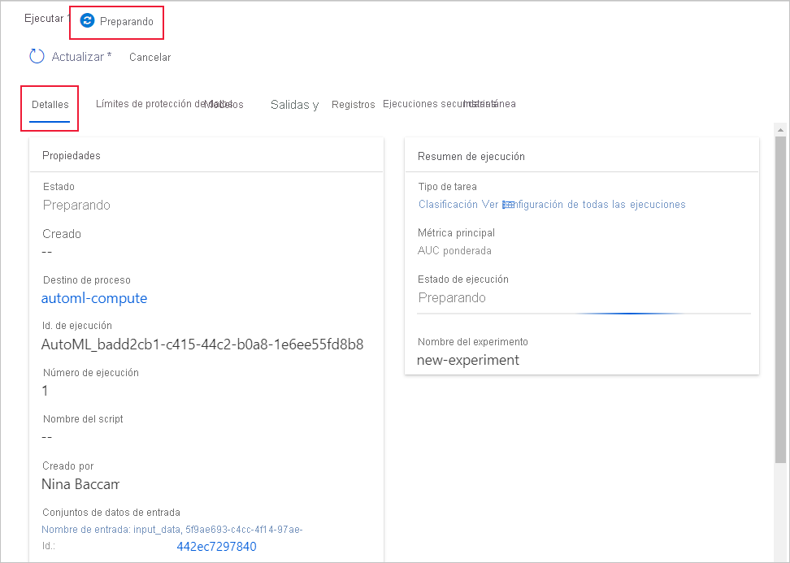
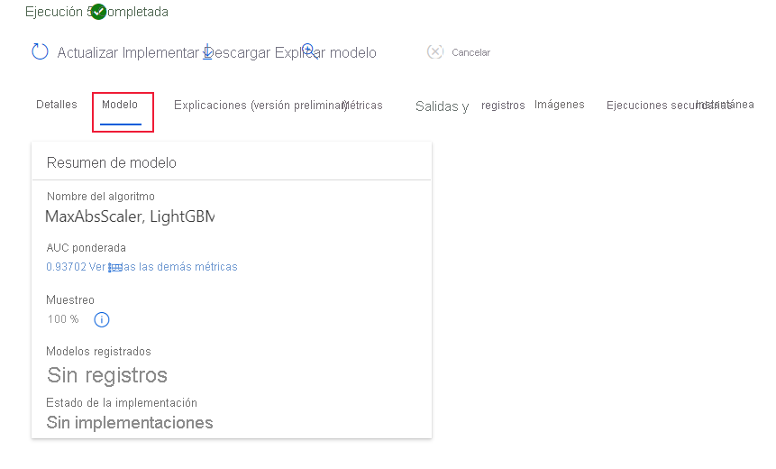

# Creación, revisión e implementación de modelos de aprendizaje automático automatizado con Azure Machine Learning
[!INCLUDE [applies-to-skus](../../includes/aml-applies-to-enterprise-sku.md)]

En este artículo, aprenderá a crear, explorar e implementar modeles de aprendizaje automático automatizado sin una sola línea de código en la interfaz de Azure Machine Learning Studio. El aprendizaje automático automatizado es un proceso en el que se selecciona automáticamente el mejor algoritmo de aprendizaje automático para sus datos específicos. Este proceso le permite generar modelos de aprendizaje automático rápidamente. [Más información sobre el aprendizaje automático automatizado](concept-automated-ml.md).
 
Para obtener un ejemplo completo, pruebe el [tutorial para crear un modelo de clasificación con la interfaz de ML automatizado de Azure Machine Learning](tutorial-first-experiment-automated-ml.md). 

Si prefiere una experiencia basada en código de Python, [configure sus experimentos de aprendizaje automático automatizado](how-to-configure-auto-train.md) con el SDK de Azure Machine Learning.

## Requisitos previos

* Suscripción a Azure. Si no tiene una suscripción de Azure, cree una cuenta gratuita antes de empezar. Pruebe hoy mismo la [versión gratuita o de pago de Azure Machine Learning](https://aka.ms/AMLFree).

* Un área de trabajo de Azure Machine Learning con un tipo de **Enterprise Edition**. Consulte [Creación de un área de trabajo de Azure Machine Learning](how-to-manage-workspace.md).  Para actualizar un área de trabajo existente a Enterprise Edition, consulte [Actualización a Enterprise Edition](how-to-manage-workspace.md#upgrade).

## Introducción

1. Inicie sesión en Azure Machine Learning en https://ml.azure.com. 

1. Seleccione su suscripción y área de trabajo. 

1. Navegue al panel izquierdo. Seleccione **Automated ML** (ML automatizado) en la sección **Creación**.

 Si es la primera vez que realiza algún experimento, verá una lista vacía y vínculos a la documentación. 

De lo contrario, verá una lista de los experimentos de aprendizaje automático automatizado recientes, incluidos los creados con el SDK. 

## Creación y ejecución de un experimento

1. Seleccione **+ New automated ML run** (+ Nueva ejecución de ML automatizada) y rellene el formulario.

1. Seleccione un conjunto de datos del contenedor de almacenamiento o cree un nuevo conjunto de datos. Los conjuntos de datos se pueden crear a partir de archivos locales, direcciones URL web, almacenes de datos o Azure Open Datasets. 

    >[!Important]
    > Requisitos para los datos de entrenamiento:
    >* Los datos deben estar en formato tabular.
    >* El valor que quiere predecir (columna de destino) debe estar presente en los datos.

    1. Para crear un nuevo conjunto de datos a partir de un archivo del equipo local, seleccione **Examinar** y seleccione el archivo. 

    1. Asigne un nombre único al conjunto de datos y proporcione una descripción opcional. 

    1. Seleccione **Siguiente** para abrir el formulario **Datastore and file selection** (Almacén de datos y selección de archivos). En este formulario, seleccione dónde quiere cargar el conjunto de datos: el contenedor de almacenamiento predeterminado que se crea automáticamente con el área de trabajo, o bien elija un contenedor de almacenamiento que quiera usar para el experimento. 

    1. Revise el formulario **Settings and preview** (Configuración y vista previa) para ver que todo está correcto. El formulario se rellena de forma inteligente según el tipo de archivo. 

        Campo| Descripción
        ----|----
        Formato de archivo| Define el diseño y el tipo de datos almacenados en un archivo.
        Delimitador| Uno o más caracteres para especificar el límite entre regiones independientes en texto sin formato u otros flujos de datos.
        Encoding| Identifica qué tabla de esquema de bit a carácter se va a usar para leer el conjunto de elementos.
        Encabezados de columna| Indica cómo se tratarán los encabezados del conjunto de datos, si existen.
        Omitir filas | Indica el número de filas, si hay alguna, que se omiten en el conjunto de datos.
    
        Seleccione **Next** (Siguiente).

    1. El formulario **Esquema** se rellena de forma inteligente en función de las selecciones realizadas en el formulario **Settings and preview** (Configuración y vista previa). Aquí se configura el tipo de datos para cada columna, se revisan los nombres de columna y se seleccionan las columnas que **no se van a incluir** en el experimento. 
            
        Seleccione **Siguiente**.

    1. En el formulario **Confirmar detalles** se muestra un resumen de la información que se ha rellenado anteriormente en los formularios **Información básica** y **Settings and preview** (Configuración y vista previa). También tiene la opción de crear un perfil de datos para el conjunto de datos mediante un proceso habilitado para la generación de perfiles. Más información acerca de la [generación de perfiles de datos](#profile).

        Seleccione **Next** (Siguiente).
1. Seleccione el conjunto de datos recién creado cuando aparezca. También puede ver una vista previa del conjunto de datos y las estadísticas de ejemplo. 

1. En el formulario **Ejecutar la configuración**, escriba un nombre único para el experimento.

1. Seleccione una columna de destino; esta es la columna en la que realizará las predicciones.

1. Seleccione un proceso para la generación de perfiles de los datos y el trabajo de entrenamiento. Hay una lista de los procesos existentes disponible en la lista desplegable. Para crear un nuevo proceso, siga las instrucciones del paso 7.

1. Seleccione **Create a new compute** (Crear un proceso) para configurar el contexto del proceso de este experimento.

    Campo|Descripción
    ---|---
    Nombre del proceso| Escriba un nombre único que identifique el contexto del proceso.
    Tamaño de la máquina virtual| Seleccione el tamaño de la máquina virtual para el proceso.
    Número máximo y mínimo de nodos (en Configuración avanzada)| Para generar perfiles de datos, debe especificar uno o más nodos. escriba el número máximo de nodos para el proceso. El valor predeterminado es seis nodos para un proceso de AML.
    
    Seleccione **Crear**. La creación de un nuevo proceso puede tardar unos minutos.

    >[!NOTE]
    > Su nombre de proceso indicará si el proceso que selecciona o crea *admite la generación de perfiles* . (Consulte la sección sobre la [generación de perfiles de los datos](#profile) para más detalles ).

    Seleccione **Next** (Siguiente).

1. En el formulario **Task type and settings** (Tipo de tarea y configuración), seleccione el tipo de tarea: clasificación, regresión o previsión. Para más información, consulte el artículo en el que se explica [cómo definir tipos de tareas](how-to-define-task-type.md).

    1. Para la clasificación, también puede habilitar el aprendizaje profundo, que se usa para las características de texto.

    1. Para la previsión:
        1. Seleccione la columna de tiempo: esta columna contiene los datos de tiempo que desea usar.

        1. Seleccione el horizonte de previsión: Indique cuántas unidades de tiempo (minutos, horas, días, semanas, meses o años) será capaz predecir el modelo en el futuro. Cuanto más se exija al modelo que prediga en el futuro, menos preciso será. [Más información sobre la previsión y el horizonte de previsión](how-to-auto-train-forecast.md).

1. (Opcional) Ver el apartado sobre la adición de configuraciones: opciones de configuración adicionales que puede usar para controlar mejor el trabajo de entrenamiento. De lo contrario, los valores predeterminados se aplican en función de la selección y los datos del experimento. 

    Configuraciones adicionales|Descripción
    ------|------
    Métrica principal| Métrica principal usada para puntuar el modelo. [Más información sobre las métricas del modelo](how-to-configure-auto-train.md#explore-model-metrics).
    Características automáticas| Seleccione esta opción para habilitar o deshabilitar la caracterización que el aprendizaje automático automatizado realiza. La caracterización automática incluye la limpieza, preparación y transformación automáticas de los datos para generar características sintéticas. No se admite para el tipo de tarea de predicción de series temporales. [Obtenga más información sobre la caracterización](how-to-configure-auto-features.md#featurization). 
    Explicación del mejor modelo | Seleccione esta opción para habilitar o deshabilitar la visualización de la explicación del mejor modelo recomendado.
    Blocked algorithms (Algoritmos bloqueados)| Seleccione los algoritmos que desea excluir del trabajo de entrenamiento.
    Criterios de exclusión| Cuando se cumple alguno de estos criterios, se detiene el trabajo de entrenamiento.   *Tiempo de trabajo de entrenamiento (horas)* : cantidad de tiempo para permitir que el trabajo de entrenamiento se ejecute.   *Metric score threshold* (Umbral de puntuación de métrica):  puntuación mínima de métrica para todas las canalizaciones. Esto garantiza que si tiene una métrica objetivo definida que desee alcanzar, no dedicará más tiempo en el trabajo de entrenamiento que el necesario.
    Validación| Seleccione una de las opciones de validación cruzada en el trabajo de entrenamiento. [Más información sobre la validación cruzada](how-to-configure-auto-train.md).
    Simultaneidad| *Número máximo de iteraciones simultáneas*: número máximo de canalizaciones (iteraciones) para probar en el trabajo de entrenamiento. El trabajo no ejecutará más iteraciones que el número especificado de ellas.

1. (Opcional) Consulte la configuración de caracterización: Si decide habilitar **Caracterización automática** en el formulario **Ver configuración de caracterización**, se aplican las técnicas de caracterización predeterminadas. En **Ver configuración de caracterización** puede cambiar estos valores predeterminados y personalizarlos según corresponda. Obtenga información sobre cómo [personalizar las caracterizaciones](#customize-featurization). 

    

## Perfiles de datos y estadísticas de resumen

Puede obtener una gran variedad de estadísticas de resumen en el conjunto de datos para comprobar si dicho conjunto está listo para ML. Para las columnas no numéricas, solo incluyen estadísticas básicas, como mínimo, máximo y recuento de errores. Para las columnas numéricas, también puede revisar sus momentos estadísticos y los cuantiles estimados. En concreto, nuestro perfil de datos incluye:

>[!NOTE]
> Aparecen entradas en blanco para las características con tipos irrelevantes.

Estadísticas|Descripción
------|------
Característica| Nombre de la columna que se está resumiendo.
Perfil| Visualización en línea según el tipo inferido. Por ejemplo, las cadenas, los tipos booleanos y las fechas tendrán recuentos de valores, mientras que los tipos decimales (valores numéricos) tendrán histogramas aproximados. Esto le permite obtener una descripción rápida de la distribución de los datos.
Distribución de tipo| Recuento de valor en línea de los tipos dentro de una columna. Los valores Null son su propio tipo, por lo que esta visualizaicón es útil para detectar los valores impares o que faltan.
Tipo|Tipo inferido de la columna. Los valores posibles incluyen: cadenas, valores booleanos, fechas y decimales.
Min| Valor mínimo de la columna. Aparecen entradas en blanco para características cuyo tipo no tiene una ordenación inherente (por ejemplo, valores booleanos).
Max| Valor máximo de la columna. 
Count| Número total de entradas que faltan y que no faltan en la columna.
No falta el recuento| Número de entradas de la columna que no faltan. Las cadenas vacías y los errores se tratan como valores, por lo que no contribuirán a la lista "No falta el recuento".
Cuantiles| Valores aproximados en cada cuantil para proporcionar una idea de la distribución de los datos.
Media| Media aritmética o promedio de la columna.
Desviación estándar| Medida de la cantidad de dispersión o variación de los datos de esta columna.
Variance| Medida de la diferencia de los datos de esta columna con respecto a su valor medio. 
Asimetría| Medida de la diferencia entre los datos de esta columna y la distribución normal.
Curtosis| La medida de la cantidad de datos en cola de esta columna se compara con una distribución normal.

## Personalización de la caracterización

En el formulario **Caracterización**, puede habilitar o deshabilitar la caracterización automática y personalizar la configuración de caracterización automática para su experimento. Para abrir este formulario, consulte el paso 10 de la sección [Creación y ejecución de un experimento](#create-and-run-experiment). 

En la tabla siguiente se resumen las personalizaciones disponibles actualmente a través de Studio. 

Columna| Personalización
---|---
Se incluye | Especifica las columnas que se van a incluir para el entrenamiento.
Tipo de característica| Cambia el tipo de valor de la columna seleccionada.
Imputar con| Selecciona el valor con los cuales imputar los valores que faltan en los datos.

## Ejecución del experimento y visualización de los resultados

Para ejecutar el experimento, seleccione **Finalizar**. El proceso de preparación del experimento puede tardar hasta 10 minutos. Los trabajos de entrenamiento pueden tardar de 2 a 3 minutos más para que cada canalización termine de ejecutarse.

### Visualización de los detalles del experimento

Se abre la pantalla **Detalles de ejecución** en la pestaña **Detalles**. En esta pantalla se muestra un resumen de la ejecución del experimento, incluida una barra de estado en la parte superior, junto al número de ejecución. 

La pestaña **Modelos** contiene una lista de los modelos creados ordenados por la puntuación de la métrica. De forma predeterminada, el modelo que puntúa más alto en función de las métricas seleccionadas aparece en la parte superior de la lista. A medida que el trabajo de entrenamiento prueba más modelos, se agregan a la lista. Utilice esto para obtener una comparación rápida de las métricas para los modelos generados hasta ahora.

### Ver detalles de ejecución del entrenamiento

Explore en profundidad los modelos completados para ver los detalles de la ejecución de entrenamiento, como las métricas de ejecución en la pestaña **Detalles del modelo** o gráficos de rendimiento en la pestaña **Visualizaciones**. [Más información sobre los gráficos](how-to-understand-automated-ml.md).

## Implementación del modelo

Una vez que tenga a mano el mejor modelo, es el momento de implementarlo como un servicio web para predecir los datos nuevos.

ML automatizado le ayuda a implementar el modelo sin escribir código:

1. Tiene unas par de opciones de implementación. 

    + Opción 1: Para implementar el mejor modelo (según los criterios de métrica que definió), seleccione el botón **Deploy best model** (Implementar el mejor modelo) en la pestaña **Detalles**.

    + Opción 2: Si quiere implementar una iteración de modelo específica de este experimento, explore en profundidad el modelo para abrir su pestaña **Detalles del modelo** y seleccione **Implementar modelo**.

1. Rellene el panel **Implementar modelo**.

    Campo| Value
    ----|----
    Nombre| Escriba un nombre único para la implementación.
    Descripción| Escriba una descripción para saber mejor para qué sirve esta implementación.
    Compute type (Tipo de proceso)| Seleccione el tipo de punto de conexión que desea implementar: *Azure Kubernetes Service (AKS)* o *Azure Container Instance (ACI)* .
    Nombre del proceso| *Solo se aplica a AKS:* Seleccione el nombre del clúster de AKS en que desea realizar la implementación.
    Enable authentication (Habilitar autenticación) | Seleccione esta opción para permitir la autenticación basada en token o basada en clave.
    Use custom deployment assets (Usar recursos de implementación personalizados)| Habilite esta característica si desea cargar su propio archivo de entorno y script de puntuación. [Más información sobre los scripts de puntuación](how-to-deploy-and-where.md#script).

    >[!Important]
    > Los nombres de archivo deben tener menos de 32 caracteres y deben comenzar y terminar con caracteres alfanuméricos. Puede incluir guiones, caracteres de subrayado, puntos y caracteres alfanuméricos. No se permiten espacios.

    El menú *Avanzado* ofrece características de implementación predeterminadas como la [recopilación de datos](how-to-enable-app-insights.md) y la configuración del uso de recursos. Si desea reemplazar estos valores predeterminados, hágalo en este menú.

1. Seleccione **Implementar**. La implementación puede tardar unos 20 minutos en completarse.
    Una vez iniciada la implementación, aparece la pestaña **Detalles del modelo**. Consulte el progreso de la implementación en la sección **Estado de implementación** del panel **Propiedades**. 

Ya tiene un servicio web operativo para generar predicciones. Puede probar las predicciones consultando el servicio de [soporte técnico de Azure Machine Learning de Power BI](how-to-consume-web-service.md#consume-the-service-from-power-bi).

## Pasos siguientes

* [Obtenga información sobre cómo consumir un servicio web](https://docs.microsoft.com/azure/machine-learning/how-to-consume-web-service).
* [Descripción de los resultados de aprendizaje automático automatizado](how-to-understand-automated-ml.md).
* [Más información sobre el aprendizaje automático automatizado](concept-automated-ml.md) y Azure Machine Learning.
