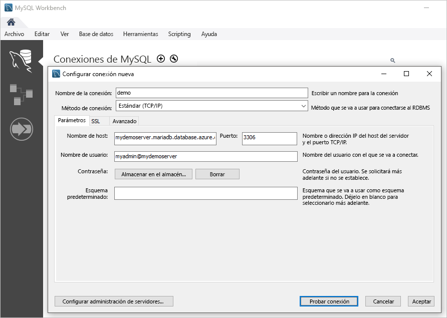

# <a name="quickstart-create-an-azure-database-for-mariadb-server-using-powershell"></a>Inicio rápido: Creación de un servidor de Azure Database for MariaDB mediante PowerShell

En este inicio rápido se describe cómo usar PowerShell para crear un servidor de Azure Database for MariaDB en un grupo de recursos de Azure. Puede usar PowerShell para crear y administrar recursos de Azure de forma interactiva o en scripts.

## <a name="prerequisites"></a>Requisitos previos

Si no tiene una suscripción a Azure, cree una cuenta [gratuita](https://azure.microsoft.com/free/) antes de empezar.

Si decide usar PowerShell de forma local, para este artículo es preciso que instale el módulo Az PowerShell y que se conecte a su cuenta de Azure con el cmdlet [Connect-AzAccount](/powershell/module/az.accounts/connect-azaccount). Para más información sobre cómo instalar el módulo Az PowerShell, consulte [Instalación de Azure PowerShell](/powershell/azure/install-az-ps).

> [!IMPORTANT]
> Mientras el módulo de PowerShell Az.MariaDb se encuentre en versión preliminar, debe instalarlo por separado desde el módulo Az de PowerShell con el siguiente comando: `Install-Module -Name Az.MariaDb -AllowPrerelease`.
> Una vez que el módulo Az.MariaDb de PowerShell esté disponible con carácter general, formará parte de las futuras versiones del módulo Az de PowerShell y estará disponible de forma nativa en Azure Cloud Shell.

Si esta es la primera vez que usa el servicio Azure Database for MariaDB, debe registrar el proveedor de recursos **Microsoft.DBforMariaDB**.

```azurepowershell-interactive
Register-AzResourceProvider -ProviderNamespace Microsoft.DBforMariaDB
```

[!INCLUDE [cloud-shell-try-it](../../includes/cloud-shell-try-it.md)]

Si tiene varias suscripciones a Azure, elija la suscripción adecuada en la que se debe facturar el recurso. Seleccione un identificador de suscripción específico con el cmdlet [Set-AzContext](/powershell/module/az.accounts/set-azcontext).

```azurepowershell-interactive
Set-AzContext -SubscriptionId 00000000-0000-0000-0000-000000000000
```

## <a name="create-a-resource-group"></a>Crear un grupo de recursos

Cree un [grupo de recursos de Azure](../azure-resource-manager/management/overview.md) con el cmdlet [New-AzResourceGroup](/powershell/module/az.resources/new-azresourcegroup). Un grupo de recursos es un contenedor lógico en el que se implementan y se administran recursos de Azure como un grupo.

En el ejemplo siguiente, se crea un grupo de recursos denominado **myResourceGroup** en la región **Oeste de EE. UU.**

```azurepowershell-interactive
New-AzResourceGroup -Name myresourcegroup -Location westus
```

## <a name="create-an-azure-database-for-mariadb-server"></a>Creación de un servidor de Azure Database for MariaDB

Cree un servidor de Azure Database for MariaDB con el cmdlet `New-AzMariaDbServer`. Un servidor puede administrar varias bases de datos. Normalmente se usa una base de datos independiente para cada proyecto o para cada usuario.

La tabla siguiente contiene una lista de parámetros y valores de ejemplo usados comúnmente para el cmdlet `New-AzMariaDbServer`.

|        **Configuración**         | **Valor de ejemplo** |                                                                                                                                                             **Descripción**                                                                                                                                                              |
| -------------------------- | ---------------- | ---------------------------------------------------------------------------------------------------------------------------------------------------------------------------------------------------------------------------------------------------------------------------------------------------------------------------------------- |
| Nombre                       | mydemoserver     | Elija un nombre único que identifique al servidor de Azure Database for MariaDB. El nombre del servidor solo puede contener letras, números y el carácter de guion (-). Los caracteres en mayúsculas que se especifiquen se convertirán automáticamente a minúsculas durante el proceso de creación. Debe contener entre 3 y 63 caracteres. |
| ResourceGroupName          | myresourcegroup  | Especifique el nombre del grupo de recursos de Azure.                                                                                                                                                                                                                                                                                            |
| SKU                        | GP_Gen5_2        | El nombre de la SKU. Sigue la convención **plan de tarifa\_generación de procesos\_núcleos virtuales** en forma abreviada. Para más información sobre el parámetro Sku, consulte la información de esta tabla.                                                                                                                                           |
| BackupRetentionDay         | 7                | Cuánto tiempo deben conservarse las copias de seguridad. La unidad es días. El intervalo es 7-35.                                                                                                                                                                                                                                                                       |
| GeoRedundantBackup         | habilitado          | Si se deben habilitar las copias de seguridad con redundancia geográfica en este servidor o no. Este valor no se puede habilitar para los servidores en el plan de tarifa Básico y no se puede cambiar después de crear el servidor. Valores permitidos: Enabled (Habilitada), Disabled (Deshabilitada).                                                                                                      |
| Location                   | westus           | Región de Azure para el servidor.                                                                                                                                                                                                                                                                                                         |
| SslEnforcement             | habilitado          | Si SSL debe habilitarse o no en este servidor. Valores permitidos: Enabled (Habilitada), Disabled (Deshabilitada).                                                                                                                                                                                                                                                 |
| StorageInMb                | 51200            | La capacidad de almacenamiento del servidor (la unidad es megabytes). Un valor de StorageInMb válido es un mínimo de 5120 MB y aumenta en incrementos de 1024 MB. Para más información sobre los límites del tamaño de almacenamiento, consulte [Planes de tarifa de Azure Database for MariaDB](./concepts-pricing-tiers.md).                                                                               |
| Versión                    | 5.7              | La versión principal de MariaDB.                                                                                                                                                                                                                                                                                                                 |
| AdministratorUserName      | myadmin          | El nombre del usuario del inicio de sesión del administrador. No puede ser **azure_superuser**, **admin**, **administrator**, **root**, **guest** o **public**.                                                                                                                                                                                            |
| AdministratorLoginPassword | `<securestring>` | Contraseña del usuario administrador en forma de cadena segura. Debe tener entre 8 y 128 caracteres. La contraseña debe contener caracteres de tres de las siguientes categorías: Letras del alfabeto inglés mayúsculas y minúsculas, números y caracteres no alfanuméricos.                                       |

El valor del parámetro **Sku** sigue la convención **plan de tarifa\_generación de proceso\_núcleos virtuales** como en los ejemplos siguientes:

- `-Sku B_Gen5_1` se asigna a Básico, Gen 5 y 1 núcleo virtual. Esta opción es la SKU más pequeña disponible.
- `-Sku GP_Gen5_32` se asigna a De uso general, Gen 5 y 32 núcleos virtuales.
- `-Sku MO_Gen5_2` se asigna a Optimizado para memoria, Gen 5 y 2 núcleos virtuales.

Para más información sobre los valores válidos de **Sku** por región y sobre los planes, consulte [Planes de tarifa de Azure Database for MariaDB](./concepts-pricing-tiers.md).

En el ejemplo siguiente se crea un servidor de MariaDB en la región **Oeste de EE. UU.** llamado **mydemoserver** en el grupo de recursos **myresourcegroup** con el inicio de sesión del administrador del servidor de **myadmin**. Es un servidor de generación 5 en el plan de tarifa de uso general con dos núcleos virtuales y con copias de seguridad con redundancia geográfica habilitadas. Documente la contraseña usada en la primera línea del ejemplo, ya que se trata de la contraseña de la cuenta de administrador del servidor de MariaDB.

> [!TIP]
> Un nombre de servidor se asigna a un nombre DNS y debe ser único en todo el mundo en Azure.

```azurepowershell-interactive
$Password = Read-Host -Prompt 'Please enter your password' -AsSecureString
New-AzMariaDbServer -Name mydemoserver -ResourceGroupName myresourcegroup -Sku GP_Gen5_2 -GeoRedundantBackup Enabled -Location westus -AdministratorUsername myadmin -AdministratorLoginPassword $Password
```

Considere la posibilidad de usar el plan de tarifa Básico si menos proceso y E/S resultan adecuados para su carga de trabajo.

> [!IMPORTANT]
> Los servidores que creó en el plan de tarifa Básico no se podrán escalar más adelante a servidores de uso general u optimizados para memoria y no se pueden replicar geográficamente.

## <a name="configure-a-firewall-rule"></a>Configuración de una regla de firewall

Cree una regla de firewall de nivel de servidor de Azure Database for MariaDB con el cmdlet `New-AzMariaDbFirewallRule`. Una regla de firewall de nivel de servidor permite que una aplicación externa, como la herramienta de la línea de comandos `mysql` o MariaDB Workbench, se conecte al servidor mediante el firewall del servicio Azure Database for MariaDB.

En el ejemplo siguiente se crea una regla de firewall denominada **AllowMyIP** que permite las conexiones desde una dirección IP específica, 192.168.0.1. Sustituya por una dirección IP o intervalo de direcciones IP que se corresponda a la ubicación desde la que se conecta.

```azurepowershell-interactive
New-AzMariaDbFirewallRule -Name AllowMyIP -ResourceGroupName myresourcegroup -ServerName mydemoserver -StartIPAddress 192.168.0.1 -EndIPAddress 192.168.0.1
```

> [!NOTE]
> Las conexiones a Azure Database for MariaDB se comunican mediante puerto 3306. Si intenta conectarse desde una red corporativa, es posible que no se permita el tráfico saliente a través del puerto 3306. En este escenario, solo podrá conectarse al servidor si el departamento de TI abre el puerto 3306.

## <a name="configure-ssl-settings"></a>Configuración de SSL

De manera predeterminada, se exigen conexiones SSL entre su servidor y las aplicaciones cliente. Así se garantiza de forma predeterminada la seguridad de los datos _en movimiento_ al cifrar el flujo de datos que circula por Internet. Para esta guía de inicio rápido, deshabilite las conexiones SSL del servidor. Para más información, consulte [Configuración de la conectividad SSL en la aplicación para conectarse de forma segura a Azure Database for MariaDB](./howto-configure-ssl.md).

> [!WARNING]
> Esto no se recomienda en servidores de producción.

En el ejemplo siguiente se deshabilita SSL en el servidor de Azure Database for MariaDB.

```azurepowershell-interactive
Update-AzMariaDbServer -Name mydemoserver -ResourceGroupName myresourcegroup -SslEnforcement Disabled
```

## <a name="get-the-connection-information"></a>Obtención de la información de conexión

Para conectarse al servidor, debe proporcionar las credenciales de acceso y la información del host. Use el ejemplo siguiente para determinar la información de conexión. Tome nota de los valores de **FullyQualifiedDomainName** y **AdministratorLogin**.

```azurepowershell-interactive
Get-AzMariaDbServer -Name mydemoserver -ResourceGroupName myresourcegroup |
  Select-Object -Property FullyQualifiedDomainName, AdministratorLogin
```

```Output
FullyQualifiedDomainName                    AdministratorLogin
------------------------                    ------------------
mydemoserver.mariadb.database.azure.com       myadmin
```

## <a name="connect-to-the-server-using-the-mysql-command-line-tool"></a>Conexión al servidor mediante la herramienta de línea de comandos mysql

Conéctese al servidor mediante la herramienta de línea de comandos `mysql`. Para descargar e instalar la herramienta de línea de comandos, consulte [Descargas de la comunidad de MySQL](https://dev.mysql.com/downloads/shell/). También puede acceder a una versión preinstalada de la herramienta de línea de comandos `mysql` en Azure Cloud Shell si selección el botón **Pruébelo** en un código de ejemplo de este artículo. Otras maneras de acceder a Azure Cloud Shell consiste en seleccionar el botón **>_** en la barra de herramientas superior derecha de Azure Portal o visitar [shell.azure.com](https://shell.azure.com/).

1. Conéctese al servidor mediante la herramienta de línea de comandos `mysql`.

   ```azurepowershell-interactive
   mysql -h <servername>.mariadb.database.azure.com -u myadmin@<servername> -p
   ```

1. Vea el estado del servidor.

   ```sql
   mysql> status
   ```

   ```Output
   C:\Users\>mysql -h mydemoserver.mariadb.database.azure.com -u myadmin@mydemoserver -p
   Enter password: *************
   Welcome to the MySQL monitor.  Commands end with ; or \g.
   Your MySQL connection id is 64793
   Server version: 5.6.42.0 MariaDB Server

   Copyright (c) 2000, 2020, Oracle and/or its affiliates. All rights reserved.

   Oracle is a registered trademark of Oracle Corporation and/or its
   affiliates. Other names may be trademarks of their respective
   owners.

   Type 'help;' or '\h' for help. Type '\c' to clear the current input statement.

   mysql> status
   --------------
   /usr/bin/mysql  Ver 14.14 Distrib 5.7.29, for Linux (x86_64) using  EditLine wrapper

   Connection id:          64793
   Current database:
   Current user:           myadmin@myipaddress
   SSL:                    Cipher in use is ECDHE-RSA-AES256-GCM-SHA384
   Current pager:          stdout
   Using outfile:          ''
   Using delimiter:        ;
   Server version:         5.6.42.0 MariaDB Server
   Protocol version:       10
   Connection:             mydemoserver.mariadb.database.azure.com via TCP/IP
   Server characterset:    latin1
   Db     characterset:    latin1
   Client characterset:    utf8
   Conn.  characterset:    utf8
   TCP port:               3306
   Uptime:                 17 min 4 sec

   Threads: 19  Questions: 482  Slow queries: 0  Opens: 50  Flush tables: 3  Open tables: 12  Queries per second avg: 0.470
   --------------

   mysql>
   ```

Para otros comandos, consulte el [capítulo 4.5.1 del Manual de referencia de MySQL 5.7](https://dev.mysql.com/doc/refman/5.7/en/mysql.html).

## <a name="connect-to-the-server-using-mariadb-workbench"></a>Conexión al servidor con MariaDB Workbench

1. Inicie la aplicación MySQL Workbench en el equipo cliente. Para descargar e instalar MySQL Workbench, consulte [Descarga de MySQL Workbench](https://dev.mysql.com/downloads/workbench/).

1. En el cuadro de diálogo **Setup New Connection** (Configurar nueva conexión), escriba la siguiente información en la pestaña **Parameters** (Parámetros):

   

    |    **Configuración**    |            **Valor sugerido**            |                      **Descripción**                       |
    | ----------------- | ----------------------------------------- | ---------------------------------------------------------- |
    | Nombre de la conexión   | Mi conexión                             | Especificación de una etiqueta para esta conexión                        |
    | Método de conexión | Estándar (TCP/IP)                         | Use el protocolo TCP/IP para conectarse a Azure Database for MariaDB |
    | Hostname          | `mydemoserver.mariadb.database.azure.com` | Nombre del servidor que anotó anteriormente                           |
    | Port              | 3306                                      | Puerto predeterminado para MariaDB                                 |
    | Nombre de usuario          | myadmin@mydemoserver                      | Inicio de sesión de administrador del servidor que se anotó anteriormente                |
    | Contraseña          | *************                             | Uso de la contraseña de la cuenta de administrador configurada anteriormente      |

1. Para probar si todos los parámetros están correctamente configurados, haga clic en el botón **Probar conexión**.

1. Seleccionar la conexión para conectarse al servidor.

## <a name="clean-up-resources"></a>Limpieza de recursos

Si no se necesitan los recursos que se han creado en este inicio rápido para otro inicio rápido o tutorial, puede eliminarlos con el siguiente comando.

> [!CAUTION]
> En el ejemplo siguiente se elimina el grupo de recursos especificado y todos los recursos que contiene.
> Si los recursos que están fuera del ámbito de este inicio rápido existen en el grupo de recursos especificado, también se eliminarán.

```azurepowershell-interactive
Remove-AzResourceGroup -Name myresourcegroup
```

Para eliminar solo el servidor creado en este inicio rápido sin eliminar el grupo de recursos, use el cmdlet `Remove-AzMariaDbServer`.

```azurepowershell-interactive
Remove-AzMariaDbServer -Name mydemoserver -ResourceGroupName myresourcegroup
```

## <a name="next-steps"></a>Pasos siguientes

> [!div class="nextstepaction"]
> [Diseño de una instancia de Azure Database for MariaDB mediante PowerShell](tutorial-design-database-using-powershell.md)