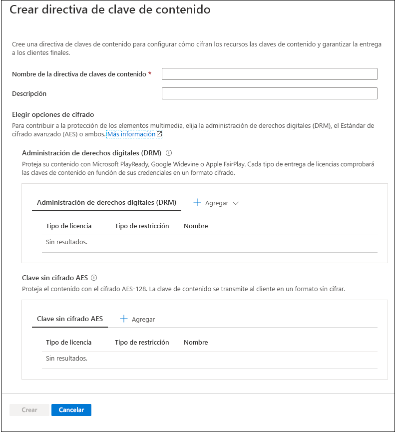
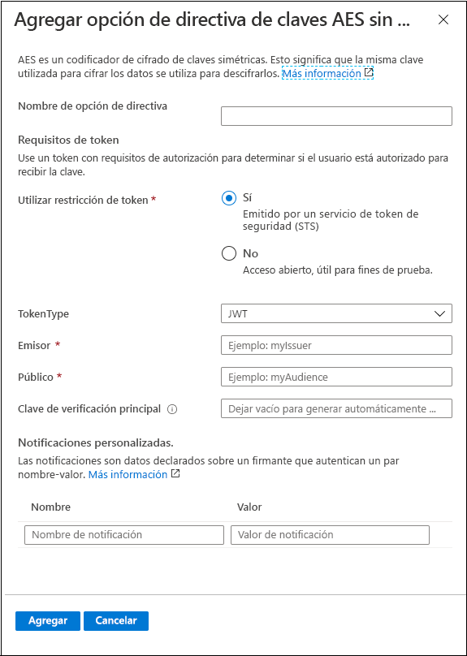
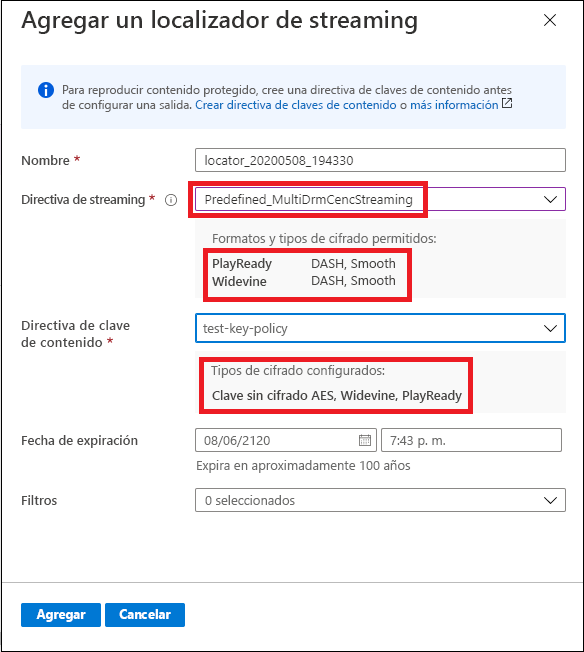

# Inicio rápido: Uso del portal para cifrar contenido

Use Azure Media Services para proteger su contenido multimedia desde el momento en que este deja el equipo hasta el almacenamiento, el procesamiento y la entrega. Con Media Services puede entregar el contenido cifrado de forma dinámica en vivo y a petición con el Estándar de cifrado avanzado (AES-128) o cualquiera de los tres sistemas de administración de derechos digitales (DRM) principales: Microsoft PlayReady, Google Widevine y Apple FairPlay. Media Services también proporciona un servicio para entregar claves AES y licencias de DMR (PlayReady, Widevine y FairPlay) a los clientes autorizados. 
 
Para especificar opciones de cifrado (si las hay) en la secuencia, debe usar una **directiva de streaming** y asociarla con su localizador de streaming. La **directiva de clave de contenido** se crea para configurar el modo en que la clave de contenido (que proporciona acceso seguro a sus **recursos**) se entrega a los clientes finales. Debe establecer los requisitos (restricciones) en la directiva de clave de contenido que se deben cumplir para que las claves con la configuración especificada se entreguen a los clientes. 

> [!NOTE]
> La directiva de clave de contenido no es necesaria para el streaming ni la descarga sin cifrar.

Cuando un reproductor solicita una transmisión, Media Services usa la clave especificada para cifrar de forma dinámica el contenido mediante la clave sin cifrado de AES o el cifrado DRM. Para descifrar la secuencia, el reproductor solicitará la clave del servicio de entrega de claves de Media Services o la del servicio que especifique. Para determinar si el usuario tiene autorización para obtener la clave, el servicio evalúa la **directiva de clave de contenido** que especificó para la clave.

En este inicio rápido se muestra cómo crear una directiva de clave de contenido donde se especifica el cifrado que se debe aplicar al recurso cuando este se transmite. En este inicio rápido también se muestra cómo establecer el cifrado configurado en el recurso.

### Sugerencias antes de la lectura

* [Cifrado dinámico y entrega de claves](content-protection-overview.md)
* [Localizadores de streaming](streaming-locators-concept.md)
* [Directivas de streaming](streaming-policy-concept.md)
* [Directivas de claves de contenido](content-key-policy-concept.md)

## Requisitos previos

Cargue y procese el contenido tal y como se describe en [Administración de recursos en Azure Portal](manage-assets-quickstart.md)

## Creación de una directiva de clave de contenido

Cree la **directiva de clave de contenido** para configurar el modo en que la clave de contenido (que proporciona acceso seguro a sus **recursos**) se entrega a los clientes finales.

1. Inicie sesión en [Azure Portal](https://portal.azure.com/).
1. Busque y haga clic en su cuenta de Media Services.
1. Seleccione **Directivas clave de contenido (nuevas)** .
1. Presione **+ Add content key policy** (Agregar directiva clave de contenido) en la parte superior de la ventana. 

Aparece la ventana **Crear una directiva de clave de contenido**. En esta ventana se eligen las opciones de cifrado. Para proteger los elementos multimedia, elija la administración de derechos digitales (DRM), el Estándar de cifrado avanzado (AES) o ambos.  

Tanto si elige una de las opciones de DRM como una opción de clave sin cifrado AES-128, se recomienda especificar cómo desea configurar las restricciones. Puede elegir tener una restricción de apertura o de token. Para obtener una explicación detallada, consulte [Control del acceso al contenido](content-protection-overview.md#controlling-content-access).

### Adición de una clave de contenido de DRM

Puede optar por proteger su contenido con Microsoft PlayReady o Google Widevine o Apple FairPlay. Cada tipo de entrega de licencias comprobará las claves de contenido en función de sus credenciales en un formato cifrado.

#### Plantillas de licencia

Para más información acerca de las plantillas de licencia, consulte:

* [Plantilla de licencia de Google Widevine](widevine-license-template-overview.md)

    > [!NOTE]
    > Puede crear una plantilla de licencia vacía y sin valores usando simplemente "{}". A continuación, se crea una plantilla de licencia con los valores predeterminados. La configuración predeterminada funciona para la mayoría de los casos.
* [Configuración y requisitos de licencia de FairPlay de Apple](fairplay-license-overview.md)
* [Plantilla de licencia de PlayReady](playready-license-template-overview.md)

### Adición de clave sin cifrado AES

También puede agregar un cifrado de clave sin cifrado AES-128 al contenido. La clave de contenido se transmite al cliente en un formato sin cifrar.

## Creación de un localizador de streaming para el recurso

1. Busque y haga clic en su cuenta de Media Services.
1. Seleccione **Recursos (nuevo)** .
1. En la lista de recursos, seleccione el que desea cifrar.  
1. En la sección **Localizador de streaming** del recurso seleccionado, presione **+ Agregar un localizador de streaming**. 
1. Seleccione una **directiva de streaming** que sea adecuada para la **directiva de clave de contenido** que ha configurado.

    En el tema [Directivas de streaming](streaming-policy-concept.md) se proporcionan detalles sobre qué directiva de streaming coincide con qué directiva de clave de contenido.
1. Una vez que seleccione la directiva de streaming adecuada, puede seleccionar la directiva de clave de contenido en la lista desplegable.
1. Presione **Agregar** para agregar el localizador de streaming al recurso.

    Esto permite publicar el recurso y generar las direcciones URL de streaming.

## Limpieza de recursos

Si su intención es probar los demás inicios rápidos, debería conservar los recursos creados. En caso contrario, vaya a Azure Portal, vaya a los grupos de recursos, seleccione el grupo de recursos en el que ejecutó este inicio rápido y elimine todos los recursos.

## Pasos siguientes

[Administración de recursos](manage-assets-quickstart.md)
